# 可视化（Visualization）
+ 通过表格，我们可以实现数据的简单可视化，不过其无法展示数据的内部关系，同时也难以展示大规模数据。所以我们需要数据可视化以丰富数据的呈现。
+ 数据可视化的目的主要有两个：
    1. 向他人展示我们从数据中得到的发现；
    2. 使我们更了解数据，发现数据间的关系与规律。
+ 在进行可视化介绍之前，我们先重新明确数据的类型：
## 数据属性（Attributes of data）
+ 之前对数据类型（type）的分类的标准是计算机的处理方式，如整型int、浮点型float、字符型str等；
+ 现在我们重新按照属性对数据进行分类，具体如下：
    1. **类别型（Categorical data）**：数据可分为可数个类别，但不能对数据进行数值计算。
        + 其中如果数据类别可以排序，那么就称为有序型（Ordinal data），否则就称为定类型（Nominal data）。
        + 注意类别型数据也可以用数字表示，比如邮政编码。
    2. **数值型（Numerical data）**：数据以数值表示，且可以进行大小比较和数值计算（加减乘除等），也称为定量型（quantitative）；
        + 其中如果计数零点有意义（如长度，质量），那么就称为比例型（Ratio data），否则就称为间隔型（Interval data）。
+ 对于表格，我们默认同一列的数据属性均相同。之后我们都使用 **变量（Variables）** 表示数据属性（特征），以强调其具体值的可变性。
+ 在明确了不同数据的类型之后，我们就可以开始绘制图表：
## 数值型变量可视化
### 折线图（Line Graphs）
+ 这里我们以中国2010年与2020年人口普查数据为例（数据来源：[2020](https://www.stats.gov.cn/sj/pcsj/rkpc/7rp/zk/indexch.htm)，[2010](https://www.stats.gov.cn/sj/pcsj/rkpc/6rp/indexch.htm)）
+ 将原始数据以表格输出：
    ```python
    import pandas as pd
    data = pd.read_csv("./census_population.csv",encoding='utf-8')
    print(data.head())
    ```
    | sex | age | 2020population | 2010population |
    |:---:|:---:|:--------------:|:--------------:|
    | 0   | 0   | 11988057       | 13786434       |
    | 0   | 1   | 14383791       | 15657955       |
    | 0   | 2   | 15266778       | 15617375       |
    | 0   | 3   | 18418078       | 15250805       |
    | 0   | 4   | 17827184       | 15220041       |
+ 简单解释：`sex`列中`0`表示总计，`1`表示男性，`2`表示女性，`age`列中`100`表示100岁及以上，`999`表示总计。
+ 在进行可视化之前，首先需要对数据进行处理，删去`age`为`999`的数据：
    ```python
    data = data[data['age']!=999]
    ```
+ 然后我们就可以先将总计分年龄人口数据进行可视化：
    ```python
    import matplotlib.pyplot as plt
    plt.style.use('fivethirtyeight') # 使用指定的风格（可选）
    data_total = data[data['sex']==2] # 筛选数据
    plt.plot(data_total['age'],data_total['2020population']) # plot代表折线图
    plt.show() # 运行时展示
    ```
    得到结果如下：
    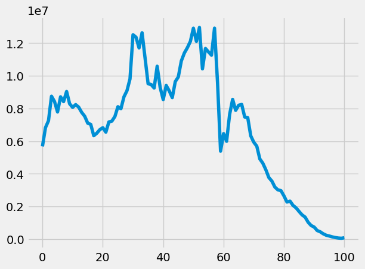
    看起来还不错！下面我们再把2010年的数据拿来一起比较：
    ```python
    plt.plot(data_total['age'],data_total['2020population'],label="2020") # 设置标签
    plt.plot(data_total['age'],data_total['2010population'],label="2010")
    plt.legend() # 增加图例（源于标签）
    plt.show()
    ```
    结果如下：
    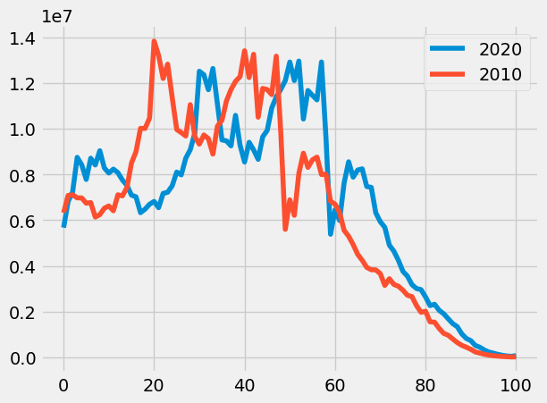
+ 可以看出，2010年25\~60岁的人口与2020年35\~70岁的人口数量基本对等，而2020年10岁以下及70岁以上的人口均高于2010年。
+ 这说明我国的“二胎”政策（2016年施行）有所效果，而人口老龄化逐渐明显。
+ 下面我们还可以再考查2020年男女人口数据：
    ```python
    male = data[data['sex']==1]
    female = data[data['sex']==2]
    plt.plot(male['age'],male['2020population'],label='male',color='blue')
    plt.plot(female['age'],female['2020population'],label='female',color='pink')
    plt.legend()
    plt.show()
    ```
    结果如下：
    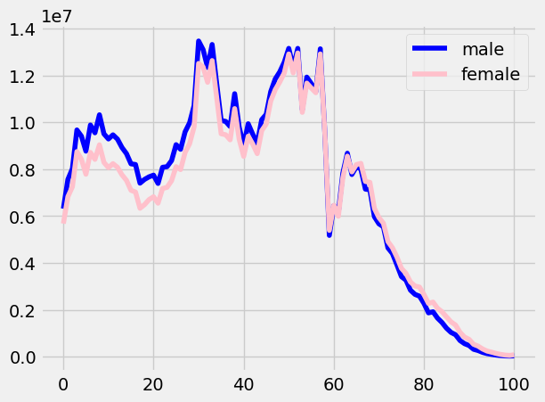
    这样的可视化似乎不太清晰，那么我们就计算男女比例并可视化：
    ```python
    male = data[data['sex']==1]
    female = data[data['sex']==2]
    ratio = male['2020population'].values/female['2020population'].values # 使用.values保证数据index对应
    fig = plt.figure(figsize=(18, 6),dpi=300) # 设置画布长宽比与分辨率
    plt.plot(male['age'],ratio,label='ratio(M:F)',color='green',marker = 'o',alpha = 0.6) # 使用marker标注数据点，alpha调节不透明度
    plt.legend()
    plt.show()
    ```
    结果如下：
    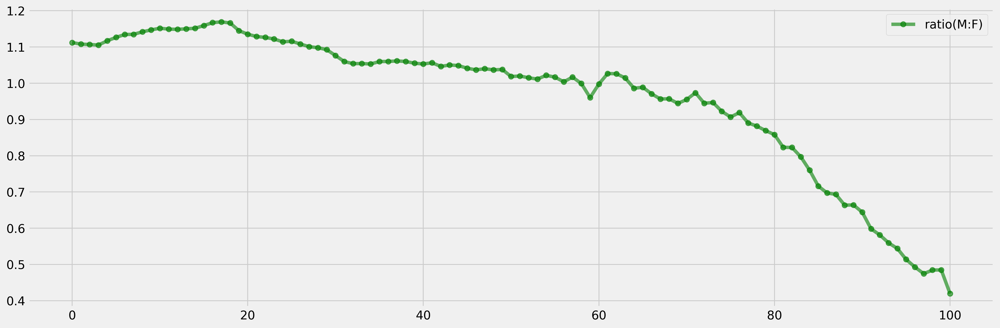
+ 这样就很明显了：以60岁左右为分界线，60岁以下人口中男性占比更高，而60岁以上则女性占比更高。
### 散点图（Scatter Plots）
+ 我们就以课程使用的`actors`作为例子。`actors`收集了一些好莱坞演员的电影票房相关数据，具体如下：
    ```python
    import pandas as pd
    actors = pd.read_csv('actors.csv')
    actors.head()
    ```
    | Actor              | Total Gross | Number of Movies | Average per Movie | #1 Movie                     | Gross  |
    |--------------------|-------------|------------------|-------------------|------------------------------|--------|
    | Harrison Ford      | 4871.70     | 41               | 118.80            | Star Wars: The Force Awakens | 936.70 |
    | Samuel L. Jackson  | 4772.80     | 69               | 69.20             | The Avengers                 | 623.40 |
    | Morgan Freeman     | 4468.30     | 61               | 73.30             | The Dark Knight              | 534.90 |
    | Tom Hanks          | 4340.80     | 44               | 98.70             | Toy Story 3                  | 415.00 |
    | Robert Downey, Jr. | 3947.30     | 53               | 74.50             | The Avengers                 | 623.40 |
+ 我们首先探索演员出演电影数量与每部电影平均票房的关系：
    ```python
    import matplotlib.pyplot as plt
    plt.style.use('fivethirtyeight')
    plt.scatter(actors['Number of Movies'],actors['Average per Movie'])
    plt.show()
    ```
    结果如下：
    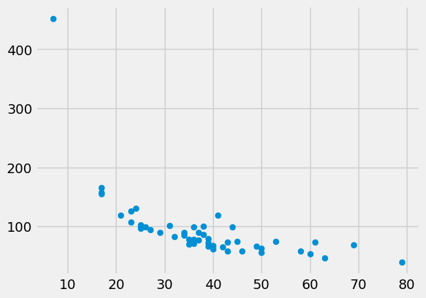
+ 可以看出，二者总体呈现负相关关系（也很容易理解，出演的电影越多，平摊到每部电影的收益就少了）。
+ 另外，我们注意到图中左上角有一个离群点，我们尝试找出这个点对应的演员：
    ```python
    actors[actors['Average per Movie'] > 200]
    ```
    结果：  
    | Anthony Daniels | 3162.90 | 7 | 451.80 | Star Wars: The Force Awakens | 936.70 |
    |:---------------:|:-------:|:---:|:------:|:----------------------------:|:------:|

    安东尼·丹尼尔斯（Anthony Daniels）出演了什么电影？他只出演了《星球大战》系列电影，饰演机器人C-3PO。
    > btw我也顺便去查了国内有没有类似的演员，结果出乎我的意料——在票房排行榜中，出演电影最少，平均收益最高的居然是《哪吒2》的几位配音演员！当然，如果不算配音演员的话，平均最高的是沈腾（25部，413.55亿票房）。

下面我们总结一下折线图与散点图各自的使用场景：
+ 折线图适用于：
    + x轴为序列数据（如时间、长度）
    + y轴的差异有意义
    + 一个x至多只能与一个y对应
+ 对于无序数据，则使用散点图，另外散点图也可以用于观察两个变量之间的关系。
## 类别型变量可视化
### 条状图（Bar Charts）
+ 我们首先给出条形图的基本用法（一个简单示例）：
    ```python
    import matplotlib.pyplot as plt
    import pandas as pd
    icecream = pd.DataFrame({
        'Flavor' : ['Chocolate', 'Strawberry', 'Vanilla'],
        'Number of Cartons' : [16, 5, 9]
        }) 
    plt.barh(icecream['Flavor'], icecream['Number of Cartons']) # barh对应横向条状图，bar对应竖向
    plt.xlabel("Flavor") # 设置坐标轴标签（在图表中显示）
    plt.ylabel("Number of Cartons")
    plt.show()
    ```
    结果：
    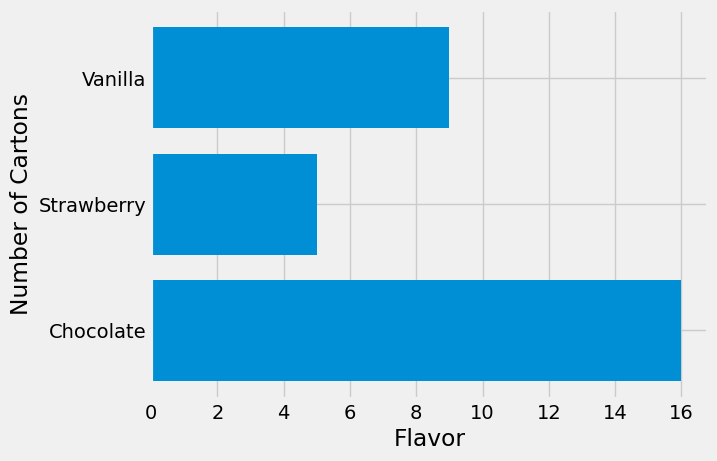
+ 条状图与上面的两种图的主要区别在于，折线图与散点图的两对数据都是数值型，而条状图的一个数据类型是类别型，另一个数据类型是数值型。
+ 另外，类别数据没有大小比较的概念，因此我们可以根据数值数据的大小进行排序：
    ```python
    icecream_sorted = icecream.sort_values('Number of Cartons')
    plt.barh(icecream_sorted['Flavor'], icecream_sorted['Number of Cartons'],color = 'Purple')
    plt.xlabel("Flavor")
    plt.ylabel("Number of Cartons")
    plt.show()
    ```
    结果：
    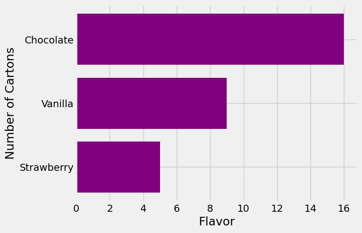
+ 这对于类别较多的数据而言可以显著提升图表可读性。
___
+ 当然，实际情况中我们往往无法直接得到每个类别的频数频率。因此，我们首先需要将同一类别的所有个体进行汇总。
+ 以课程中使用的工作室电影票房数据为例：
    ```python
    top = pd.read_csv("./top_movies_2017.csv")
    top.head()
    ```
    | Title                       | Studio    | Gross     | Gross (Adjusted) | Year |
    |:---------------------------:|:---------:|:---------:|:----------------:|:----:|
    | Gone with the Wind          | MGM       | 198676459 | 1796176700       | 1939 |
    | Star Wars                   | Fox       | 460998007 | 1583483200       | 1977 |
    | The Sound of Music          | Fox       | 158671368 | 1266072700       | 1965 |
    | E.T.: The Extra-Terrestrial | Universal | 435110554 | 1261085000       | 1982 |
    | Titanic                     | Paramount | 658672302 | 1204368000       | 1997 |

    我们想得到不同工作室制作的电影数量。于是我们可以使用`groupby`函数：
    ```python
    movies_and_studios = top[['Title','Studio']]
    studio_distribution = movies_and_studios.groupby('Studio')['Title'].count()
    # sum(studio_distribution) # 200
    studio_distribution.head()
    ```
    结果：
    | Studio      |  |
    |-------------|-------|
    | AVCO        | 1     |
    | Buena Vista | 35    |
    | Columbia    | 9     |
    | Disney      | 11    |
    | Dreamworks  | 3     |
+ 有了分组数据，我们就可以用条状图可视化了：
    ```python
    studio_distribution = studio_distribution.sort_values(ascending=True) # 排序
    fig = plt.figure(figsize=(10, 18), dpi=300)
    plt.barh(studio_distribution.index,studio_distribution.values,color = 'Black')
    plt.xlabel("Number of Movies")
    plt.ylabel("Studio")
    plt.show()
    ```
    结果如下：
    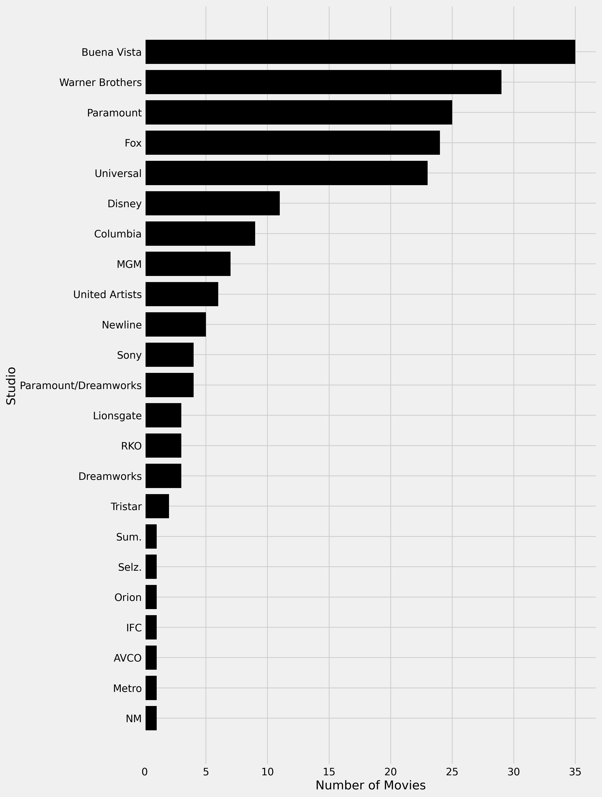
    可以看到，电影数量最高的工作室包括博伟、华纳兄弟、派拉蒙、福克斯、环球影业等。
### 直方图（Histogram）
> 注：本部分可能涉及到一些数理统计的概念。
+ 上面使用条状图的例子中，分类变量是无序的（即属于定类数据），而如果分类变量是有序的，那么条状图就无法反映分类变量的相对大小与间隔。
+ 于是我们就需要考虑新的可视化方法。在此之前，我们先介绍**数据分箱**（binning）的概念：
    + 对于有序数据，有时我们不一定需要精确的值，而只要了解一定范围内的样本数量（或者说总体的分布），此时我们就可以将数据分为若干个间隔相同的组，这就是分箱。
    + 具体代码示例如下（同样使用`top_movies_2017.csv`的数据）：
    ```python
    adjusted_gross = (top['Gross (Adjusted)']/1e6).round(2) # 减小数据规模
    bin_counts = pd.cut(adjusted_gross,bins=range(300, 2001, 100)).value_counts().sort_index() 
    # cut负责分箱（其中bins也可以是int），value_counts负责计数，sort_index负责根据bin排序
    bin_counts.head(5)
    ```
    结果：
    |Gross (Adjusted)||
    |:----------:|:---:|
    |(300, 400]     | 68|
    |(400, 500]    |  60|
    |(500, 600]   |   32|
    |(600, 700]  |    15|
    |(700, 800] |      7|
    |(800, 900]|       7|

    注意这里所有箱的数值范围均为左开右闭。
    > yysy这个表示感觉比UCB datascience库的bin清晰……
+ 下面我们就使用“直方图”将数据可视化：
    ```python
    plt.style.use('fivethirtyeight')
    plt.hist(adjusted_gross,color = 'red')
    plt.xlabel('Adjusted Gross (Million Dollars)')
    plt.show()
    ```
    得到的结果如下：
    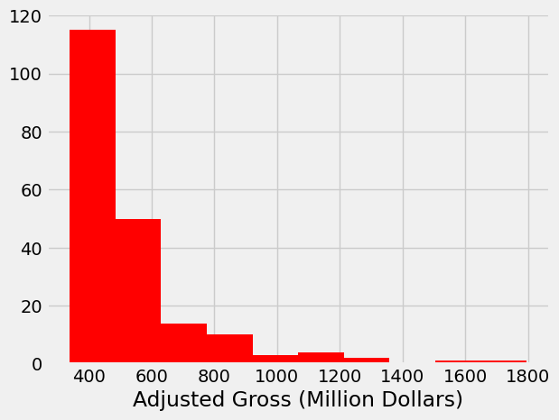
    因为我们没有设置`bins`参数，所以图中默认分为10箱。
    当然，现在的图表示不够清晰，我们可以通过修改一些参数优化：
    ```python
    plt.hist(adjusted_gross,bins = range(300,2001,100),rwidth=0.9,color = 'green')
    # bins控制分箱范围，rwidth控制柱子宽度
    plt.xlabel('Adjusted Gross (Million Dollars)')
    plt.show()
    ```
    结果如下：
    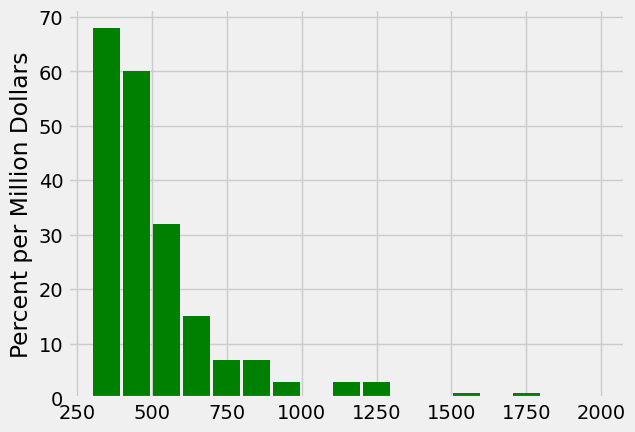
    ~~可以看到这个数据近似服从指数分布doge~~
### 面积原则
+ 由于直方图的两个轴均为数值变量，所以可以进行乘积计算（对应图中柱体的面积）。
+ 为了使柱体的面积有意义，我们规定：每个柱体的面积与其对应箱的内容数量成正比。
进而纵轴的值就等于柱体的频数除以箱的区间长度，而直方图柱体的总面积为1。或者说，纵轴可以理解为一种密度的刻画。
+ 在代码中，我们可以通过`plt.hist()`里设置`density=True`改变纵轴的值，得到以下直方图：
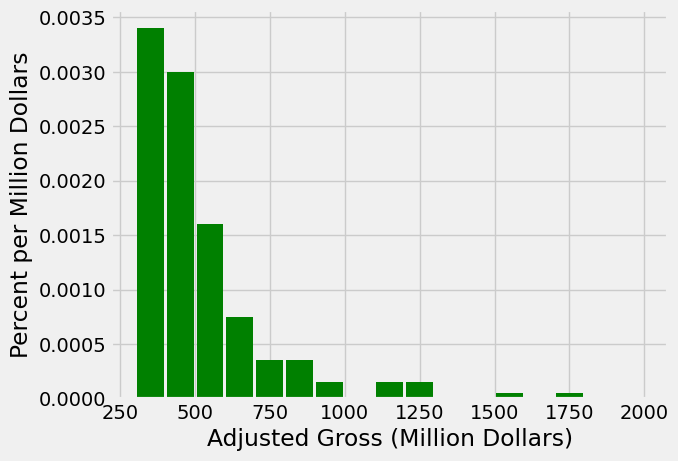
+ 直方图使用面积原则至少有以下好处：
    1. 我们也可以直接对不同直方图对应的变量分布进行比较，而不必担心比例的问题；
    2. 将离散变量推广到连续变量时，其可以作为概率密度函数的一种近似；
    3. 当bins区间的间隔不同时，使用面积表示计数不会导致可视化失真。
+ 当然，使用直方图本身不可避免会导致数据呈现的模糊（因为使用了分组数据而非数据本身），所以柱体的平顶在实际情况中可能也有起伏，需要加以注意。

最后我们总结一下条形图与直方图之间的区别：
+ 条形图展现定类变量的分布；直方图展现有序变量的分布。
+ 条形图中所有柱体间距相等，且可以任意排列；直方图中的横轴是连续的，柱体间距由bins决定。
+ 条形图中的纵轴表示类别的计数；直方图中柱体的面积表示该区间内的计数。
> 注：在展示不同组别所占比例时，饼图（Pie Charts）往往也是一个可视化选项。然而，相对直方图而言，其相对比例大小的比较不太直观，所以不建议使用。  
拓展：人类对数据可视化的感知比较（源自*Data Points: Visualization That Means Something*）
## 叠加图（Overlaid Plots）
由于与`datascience`库高度相关，故略。
> 如果想用matplotlib实现多个图的堆叠，对于散点与折线图，可以写多个plt；对于条状图，可以在`plt.bar`里的`bottom`参数写公共变量。