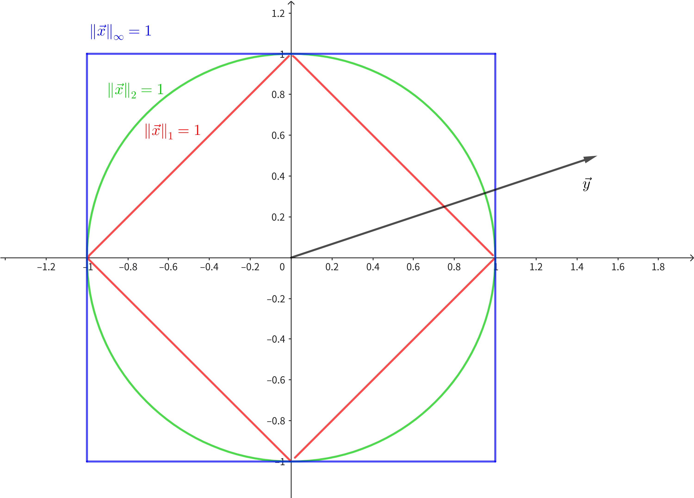

# 线性代数回顾
## 范数（Norms）
+ 向量的范数定义如下：设$\mathcal{V}$为$\R$上的向量空间，$f$为$\mathcal{V}$到$\R$上的映射，若$f$满足：
  + 非负性：$\forall \vec{x}\in\mathcal{V},f(\vec{x})\geq 0$，且等号成立当且仅当$\vec{x}=\vec{0}$；
  + 正齐性：$\forall\alpha\in\R,\forall\vec{x}\in\mathcal{V},f(\alpha\vec{x})=|\alpha|f(\vec{x})$；
  + 三角不等式：$\forall \vec{x},\vec{y}\in\mathcal{V},f(\vec{x}+\vec{y})\leq f(\vec{x})+f(\vec{y})$.  

  则称$f$为范数。
+ 在空间中满足条件的范数不止一个，最常见的如$L1$范数，$L2$范数（也称欧几里得范数）等。这里我们主要讨论一类重要的范数：$l^p$范数。其定义如下：
  + 设$1\leq p<\infty$，则$\R^n$上的$l^p$范数表示为
    $$
    \|\vec{x}\|_p\doteq\left(\sum_{i=1}^n|x_i|^p\right)^{\frac{1}{p}}
    $$
  + 当$p=\infty$，定义无穷范数
    $$
    \|\vec{x}\|_\infty\doteq\max_{i=\{1,2,\cdots,n\}}|x_i|=\lim_{p\to\infty}\|\vec{x}\|_p
    $$
    + 对第二个等号的简单证明：设$M=\max_i|x_i|$，则若$M=0$，结论显然成立；若$M>0$，则
      $$
      \|\vec{x}\|_{p}=\left(\sum_{i=1}^{n}\left|x_{i}\right|^{p}\right)^{1/p}=\left(M^{p}\sum_{i=1}^{n}\left(\frac{\left|x_{i}\right|}{M}\right)^{p}\right)^{1/p}=M\left(\sum_{i=1}^{n}\left(\frac{\left|x_{i}\right|}{M}\right)^{p}\right)^{1/p}
      $$
      可以利用夹逼得到
      $$
      \lim_{p\to\infty}\left(\sum_{i=1}^{n}\left(\frac{\left|x_{i}\right|}{M}\right)^{p}\right)^{1/p}=1
      $$
      故等号成立。
### 不等式
+ 关于向量的范数，有一些重要的不等式（这些不等式可以确定一些变量的上下界，因而有助于求解优化问题）：
1. 柯西-施瓦茨不等式（Cauchy-Schwarz Inequality）  
   设向量$\vec{x},\vec{y}\in\R^n$，则有
   $$
   |\vec{x}^\top\vec{y}|\leq\|\vec{x}\|_2\|\vec{y}\|_2.
   $$
   这个不等式只涉及$l^2$空间上的范数，可以用二维向量内积的极坐标表示证明。（向量$\vec{x}$在向量$\vec{y}$上的投影可以用$\frac{\vec{x}^\top\vec{y}}{\|\vec{y}\|_2^2}$表示，这对应[最小二乘法](/posts/computer-science/cs127/cs127-chapter-1/#最小二乘法least-squares)在$m=2,n=1$的情形）  
   实际上我们可以将其推广到任意$l^p$空间上（之后会详细讨论）。
2. 赫尔德不等式（Hölder’s Inequality）
   设$1\leq p,q\leq \infty$且$\frac{1}{p}+\frac{1}{q}=1$（这里$(p,q)$也称为赫尔德共轭对）.那么对任意$\vec{x},\vec{y}\in\R^n$，有
    $$
    |\vec{x}^\top\vec{y}|\leq\sum_{i=1}^n|x_iy_i|\leq\|\vec{x}\|_p\|\vec{y}\|_q.
    $$
   证明涉及卷积的知识，所以这里先不证明。
+ 下面给出一个应用的例子：
### 范数球（Norm-balls）
+ 我们考虑以下优化问题：
  $$
  \max_{\vec{x}\in\R^n,\|\vec{x}\|_p\leq 1}\vec{x}^\top\vec{y}
  $$
  其中$\vec{y}\in\R^n$为给定向量。
+ 直接求解这个问题比较复杂。我们可以先从简单情形入手：取$p=1,2,\infty$三种情况，此时$\|\vec{x}\|_p$的范围可以用下图表示（实际为高维“范数球”）：

1. $p=2$（绿线内区域）：则目标函数可表示为
   $$
   \vec{x}^\top\vec{y}=\|\vec{x}\|_2\|\vec{y}\|_2\cos\theta\leq\|\vec{y}\|_2\cos\theta
   $$
   又因为$\vec{y}$是固定的，所以当$\cos\theta=1$，即$\theta=0$时得到最大值$\|\vec{y}\|_2$，取到最大值的条件为$\vec{x}=\dfrac{\vec{y}}{\|\vec{y}\|_2}$（即与$\vec{y}$同向的单位向量）。
2. $p=\infty$（蓝线内区域）：则目标函数可表示为
   $$
    \vec{x}^\top\vec{y}=\sum_{i=1}^nx_iy_i=x_1y_1+\cdots+x_ny_n
   $$
   而$-1\leq x_i\leq 1(1\leq i \leq n)$，即$\vec{x}$的每个分量取值范围相互独立。那么我们就可以这么取值：若$y_i>0$，则令$x^*_i=1$，若$y_i<0$，则令$x^*_i=-1$（$y_i=0$则$x^* _i$任意取）此时
   $$
   \vec{x}^\top\vec{y}=x_1y_1+\cdots+x_ny_n=\sum_{i=1}^n|y_i|=\|\vec{y}\|_1
   $$
   显然这是最大值（相当于$n$个独立的优化问题）
3. $p=1$（红线内区域）：这个情况推导会略复杂一些。我们首先推出上界：
   $$
   \begin{aligned}
   \vec{x}^\top\vec{y}\leq|\vec{x}^\top\vec{y}|&=\left|\sum_{i=1}^nx_iy_i\right|\\
    & \leq\sum_{i=1}^n|x_iy_i|=\sum_{i=1}^n\left|x_i\right|\left|y_i\right| \\
    & \leq\sum_{i=1}^n|x_i|\left(\max_{i\in\{1,\ldots,n\}}|y_i|\right) \\
    & =\max_{i\in\{1,\ldots,n\}}|y_i|\sum_{i=1}^n|x_i| \\
    & =\left\|\vec{y}\right\|_\infty\left\|\vec{x}\right\|_1 \leq\left\|\vec{y}\right\|_{\infty}.
   \end{aligned}
   $$
   下面我们就要证明这个上界能够取到。我们根据推导逐步分析：
   + 首先，第一个和第二个不等号要取等需要所有$x_iy_i$均同号且$x_i,y_i$同号或为$0$；
   + 其次，第三个不等号要去等需要$y_i=\max_{i\in\{1,\ldots,n\}}|y_i|$。那么我们可以让不是最大值的$|y_i|$对应的$x_i$为$0$，只留下取到最大值的$|y_i|$对应的$x_i$；
   + 最后，第五个不等号要取到需要$\|\vec{x}\|_1=1$，即上面的$x_i=\mathrm{sgn}(y_i)$。

   上面三个条件都能取到，所以上界就能取到，上界即为最大值。

通过上面这些特殊情况，我们可以归纳出以下规律：当约束为$l^p$范数时，最大值为$\|\vec{y}\|_q$，其中$p,q$满足$\frac{1}{p}+\frac{1}{q}=1$.即：
$$
\begin{aligned}
  \max_{\vec{x}\in\R^n,\|\vec{x}\|_p\leq 1}\vec{x}^\top\vec{y}=\|\vec{y}\|_q\\
  s.t.\quad\frac{1}{p}+\frac{1}{q}=1
\end{aligned}
$$
+ 事实上，$\max_{\vec{x}\in\R^n,\|\vec{x}\|_p\leq 1}\vec{x}^\top\vec{y}\leq\|\vec{y}\|_q$可以由赫尔德不等式推出：
  $$
    \begin{aligned}
  & \max_{\vec{x}\in\mathbb{R}^n,\|\vec{x}\|_p\leq 1}\vec{x}^\top\vec{y}\leq\max_{\vec{x}\in\mathbb{R}^n,\|\vec{x}\|_p\leq 1}\left\|\vec{x}\right\|_p\left\|\vec{y}\right\|_q=\left\|\vec{y}\right\|_q\cdot\max_{\vec{x}\in\mathbb{R}^n,\|\vec{x}\|_p\leq 1}\left\|\vec{x}\right\|_p=\left\|\vec{y}\right\|_q
  \end{aligned}
  $$
  不过反向的不等号的证明比较复杂，这里不讨论。
+ 这里的$p$和$q$也被称为**对偶范数（dual norm）**，这体现了最优化问题的对偶性（之后我们会详细涉及）。
+ 总结一下这里用到的两个解题思想：
  1. 将向量问题转化为标量问题：向量优化问题往往比较复杂，尝试将其转化为各个分量的独立优化问题，会大大降低解决难度；
  2. 证明最优性时，可以先给出其上（下）界，再举例说明上（下）界可以取到。简单而言就是先给出不等式，再化不等式为等式。