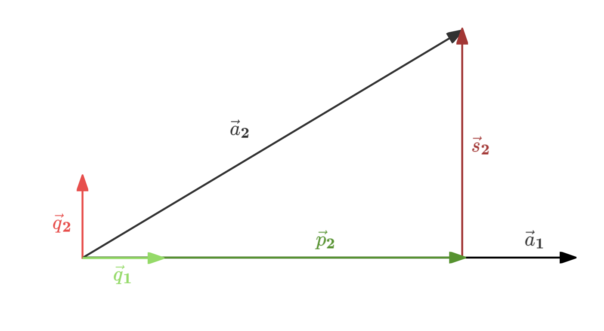

# Gram-Schmidt正交化与QR分解
+ Gram-Schmidt算法可以将线性无关的向量$\{\vec{a}_1,\cdots,\vec{a}_k\}$转换为正交基向量$\{\vec{q}_1 ,\cdots ,\vec{q}_k\}$（范数均为$1$且相互正交），且其张成的空间不变。
+ 下面我们从二维情形开始推导正交基向量的计算方法：
    + 设初始的两个不共线向量为$\vec{a}_1$和$\vec{a}_2$，则第一个正交基向量可直接由$\vec{a}_1$归一化得到：
        $$
        \vec{q}_1\doteq\frac{\vec{a}_1}{\|\vec{a}_1\|_2}.
        $$
    + 为了得到第二个正交基向量，我们需要利用$\vec{a}_2$在$\vec{a}_1$上的投影向量：
        $$
        \vec{p}_2\doteq\vec{q}_1(\vec{q}_1^\top\vec{a}_2),
        $$
        如果$\|\vec{p}_2\|_2=0$，则直接对$\vec{a}_2$归一化得到$\vec{q}_2$；否则，将$\vec{a}_2$与投影向量$\vec{p}_2$相减就得到与$\vec{q}_1$垂直的向量：
        $$
        \vec{s}_2\doteq\vec{a}_2-\vec{p}_2=\vec{a}_2-\vec{q}_1(\vec{q}_1^\top\vec{a}_2),
        $$
        最后对$\vec{s}_2$进行归一化，就得到第二个正交基向量：
        $$
        \vec{q}_2=\frac{\vec{s}_2}{\|\vec{s}_2\|_2}.
        $$
    + 图示如下：
        
+ 更高维的情况类似，核心方法就是先构造当前向量在前面向量组成平面上的投影向量，相减得到垂直向量，最后进行归一化。我们给出$n$维情形的公式：
    $$
    \begin{cases} 
    \displaystyle\vec{q}_1 = \frac{\vec{a}_1}{\|\vec{a}_1\|_2} ,\\
    \displaystyle\vec{s}_2 = \vec{a}_2 - \vec{q}_1 (\vec{q}_1^\top \vec{a}_2)\Longrightarrow\vec{q}_2 = \frac{\vec{s}_2}{\|\vec{s}_2\|_2} ,\\
    \displaystyle\vec{s}_3 = \vec{a}_3 - \vec{q}_1 (\vec{q}_1^\top \vec{a}_3) - \vec{q}_2 (\vec{q}_2^\top \vec{a}_3)\Longrightarrow\vec{q}_3 = \frac{\vec{s}_3}{\|\vec{s}_3\|_2},\\
    \vdots\\
    \displaystyle\vec{s}_n = \vec{a}_n - \vec{q}_1 (\vec{q}_1^\top \vec{a}_n) - \cdots - \vec{q}_{n-1} (\vec{q}_{n-1}^\top \vec{a}_n)\Longrightarrow\vec{q}_n = \frac{\vec{s}_n}{\|\vec{s}_n\|_2}
    \end{cases}
    $$
## QR分解
+ 因为对于每个$i\in\{1,2,\cdots,k\}$，$(\vec{a}_1,\cdots,\vec{a}_i)$张成的空间与$(\vec{q}_1,\cdots,\vec{q}_i)$相同，所以$\vec{a}_i$可以由$(\vec{q}_1,\cdots,\vec{q}_i)$线性表示：
    $$
    \vec{a}_i=r_{1i}\vec{q}_1+\cdots+r_{ii}\vec{q}_i=\sum_{j=1}^i r_{ji}\vec{q}_j
    $$
    那么将所有$\vec{a_i}$的表示排在一起，就组成了矩阵：
    $$
    [\vec{a}_1\quad\cdots\quad\vec{a}_k]=[\vec{q}_1\quad\cdots\quad\vec{q}_k]\begin{bmatrix}
    r_{11} &r_{12} &\cdots &r_{1k}\\
    0 &r_{22} &\cdots &r_{2k}\\
    \cdots &\cdots &\ddots &\cdots\\
    0&0&\cdots&r_{kk}
    \end{bmatrix}.
    $$
    也就是说，我们可以将任意列满秩矩阵分解为一组正交基矩阵$Q$和上三角矩阵$R$的乘积。
+ 定理表述如下：设$A \in \mathbb{R}^{n \times k}$，其中$k \leq n$（即$A$是“高”矩阵，保证列向量线性无关）。假设$A$列满秩，则存在一个具有标准正交列的矩阵$Q \in \mathbb{R}^{n \times k}$，以及一个上三角矩阵$R \in \mathbb{R}^{k \times k}$，使得$A = QR$。
+ 当然，也有针对宽矩阵（$k>n$）以及非列满秩矩阵的QR分解方法，此处不作讨论。（可参考：[URV分解](https://www.cnblogs.com/zhaoke271828/p/16847526.html#urv)）
# 线性代数基本定理（Fundamental Theorem of Linear Algebra）
> 注：要和[代数基本定理](https://baike.baidu.com/item/%E4%BB%A3%E6%95%B0%E5%9F%BA%E6%9C%AC%E5%AE%9A%E7%90%86/18104)作区分。
+ 线性代数基本定理可以帮助我们进一步理解向量及其张成空间在线性变换下发生的变化。事实上，矩阵乘法的本质就是将一个向量空间转换为另一个向量空间（或者理解为转换坐标系），从而将问题进行转化（简化）。
+ 在阐述定理之前，我们首先定义**直和（direct sum）**：
    + 设$U,V$是$\R^n$上的子空间，若：
        1. 任意$\vec{x}\in\R^n$可表示为$\vec{x}=\vec{x}_1+\vec{x}_2$，其中$\vec{x}_1\in U,\vec{x}_2\in V$；
        2. 上述向量分解唯一，即如果存在两个分解$\vec{x}=\vec{x}_1+\vec{x}_2=\vec{y}_1+\vec{y}_2$，那么$\vec{x}_1=\vec{y}_1,\vec{x}_2=\vec{y}_2$，
        
        则称$U,V$的直和为$\R^n$，记为$U\oplus V=\R^n$。
+ 由此我们可以得到**线性代数基本定理**：设$A\in\R^{m\times n}$，则
    $$
    \mathcal{N}(A)\oplus\mathcal{R}(A^\top)=\R^n,
    $$
    其中$\mathcal{N}(A)$表示$A$的零空间（即$A\vec{x}=0$的解空间），而$\mathcal{R}(A^\top)$则表示$A$的行向量组成的空间，与$\mathcal{N}(A)$形成正交。
    + 当然我们也可以得到以下推论：设$A\in\R^{m\times n}$，则
        $$
        \mathcal{N}(A^\top)\oplus\mathcal{R}(A)=\R^m.
        $$
+ 下面我们给出这个定理的证明：
    + 首先我们给出正交补空间的定义：设$S$为$\R^n$上子空间，则$S$的**正交补空间**（orthogonal complement，记作$S^\perp$）定义如下：
        $$
        S^\perp=\{\vec{x}\in\R^n\mid\vec{s}^\top\vec{x}=0,\forall \vec{s}\in S\}.
        $$
    + 由此我们可以得到**正交分解定理**：设$S$为$\R^n$上子空间，则
        $$
        S\oplus S^\perp=\R^n.
        $$
        对这个定理的证明主要利用了直和的性质和$S\cap S^\perp=\{0\}$。（具体过程留给读者）
    + 有了这个定理，我们就只需要证明$\mathcal{N}(A)=\mathcal{R}(A^\top)^\perp$。
        1. $\mathcal{N}(A)\subseteq\mathcal{R}(A^\top)^\perp$：即证任意$\vec{x}\in\mathcal{N}(A)$，对任意$\vec{y}\in\mathcal{R}(A^\top)$，满足$\vec{y}^\top\vec{x}=0$。
            + 因为$\vec{y}\in\mathcal{R}(A^\top)$，所以$\vec{y}=A^\top\vec{w}$（$\vec{w}\in\R^m$），又因为$\vec{x}\in\mathcal{N}(A)$，所以$A\vec{x}=\vec{0}$，故
                $$
                \vec{y}^\top\vec{x}=(A^\top\vec{w})^\top\vec{x}=\vec{w}^\top A\vec{x}=\vec{w}^\top\vec{0}=0.
                $$
        2. $\mathcal{R}(A^\top)^\perp\subseteq\mathcal{N}(A)$：
            + 对任意$\vec{x}\in\mathcal{R}(A^\top)^\perp$，任意$\vec{y}\in\mathcal{R}(A^\top)$，满足$\vec{y}^\top\vec{x}=0$。又$\vec{y}=A^\top\vec{w}$（$\vec{w}\in\R^m$），所以$(A^\top\vec{w})^\top\vec{x}=\vec{w}^\top A\vec{x}=0$对任意$\vec{w}\in\R^m$均成立。
            那么取$\vec{w}=A\vec{x}$，则
                $$
                0=\vec{w}^\top A\vec{x}=(A\vec{x})^\top A\vec{x}=\|A\vec{x}\|_2^2.
                $$
                因此$A\vec{x}=\vec{0}$，即$\vec{x}\in\mathcal{N}(A)$。
    + 综上，定理得证。
+ 下面我们利用这个定理解决一个重要的优化问题（可看作最小二乘问题的对偶问题）：
    + 对于线性方程组$A\vec{x}=\vec{y}$，当$A$为宽矩阵（即行数小于列数）且行满秩，则方程组有无穷个解，此时我们常常选取范数最小的解。于是我们就能得到以下优化问题：
        $$
        \begin{aligned}
        \min \|\vec{x}\|_2^2\\
        s.t.\quad A\vec{x}=\vec{y}.
        \end{aligned}
        $$
        其最优解为
        $$
        \vec{x}^*=A^\top(AA^\top)^{-1}\vec{y}.
        $$
    + 简单证明：
        由线性代数基本定理，设$\vec{x}=\vec{u}+\vec{v}$，其中$\vec{u}\in\mathcal{N}(A),\vec{v}\in\mathcal{R}(A^\top)$。那么存在$\vec{w}\in\R^m$使$\vec{v}=A^\top\vec{w}$。
        于是目标函数
        $$
        \begin{aligned}
        \left\|\vec{x}\right\|_{2}^{2} & =\left\|\vec{u}+\vec{v}\right\|_{2}^{2} \\
        & =\vec{u}^\top\vec{u}+2\vec{u}^\top\vec{v}+\vec{v}^\top\vec{v} \\
        & =\left\|\vec{u}\right\|_2^2+2\vec{v}^\top\vec{u}+\left\|\vec{v}\right\|_2^2 \\
        & =\left\|\vec{u}\right\|_2^2+2(A^\top\vec{w})^\top\vec{u}+\left\|\vec{v}\right\|_2^2 \\
        & =\left\|\vec{u}\right\|_2^2+2\vec{w}^\top A\vec{u}+\left\|\vec{v}\right\|_2^2 \\
        & =\left\|\vec{u}\right\|_2^2+2\vec{w}^\top\vec{0}+\left\|\vec{v}\right\|_2^2 \\
        & =\left\|\vec{u}\right\|_2^2+2\cdot0+\left\|\vec{v}\right\|_2^2 \\
        & =\left\|\vec{u}\right\|_2^2+\left\|\vec{v}\right\|_2^2 \\
        & =\left\|\vec{u}\right\|_2^2+\left\|A^\top\vec{w}\right\|_2^2.
        \end{aligned}
        $$
        （本质就是勾股定理）约束条件变为
        $$
        \begin{aligned}
        \vec{y}&=A\vec{x} \\
        & =A(\vec{u}+\vec{v}) \\
        & =A\vec{u}+A\vec{v} \\
        & =\vec{0}+AA^\top\vec{w} \\
        & =AA^\top\vec{w}. \\
        \end{aligned}
        $$
        又因为$AA^{-1}$可逆，所以$\vec{w}^*=(AA^\top)^{-1}\vec{y}\Longrightarrow\vec{v}^*=A^\top(AA^\top)^{-1}\vec{y}$。而$\|\vec{u}\|_2^2$与约束条件无关，故可直接取$\vec{u}^*=\vec{0}$。
        + 综上，$\vec{x}^*=A^\top(AA^\top)^{-1}\vec{y}$，定理得证。
# 对称矩阵（Symmetric Matrices）
对称矩阵是一类特殊的矩阵，具有一些良好的性质。
+ 定义：设$A\in\R^{n\times n}$是方阵，则如果$A=A^\top$，则称$A$是对称矩阵。对称矩阵的全体记作$\mathbb{S}^n$.
    + 例：协方差矩阵，无向图的邻接矩阵都是对称矩阵。
+ 若$A$为对称矩阵，则其具有以下性质：
    1. $A$的所有特征值$\lambda_i,1\leq i\leq n$均为实数；
    2. $A$的所有特征子空间$\{\Phi_i=\mathcal{N}(\lambda_iI-A),1\leq i\leq n\}$两两正交；
    3. $A$的特征值$\lambda_i$对应的特征子空间维度$\mathrm{dim}(\Phi_i)$等于$\lambda_i$的重数（即$|\lambda I-A|$中$(\lambda-\lambda_i)$的次数）；
    4. $A=U^\top\Lambda U$，其中$U$为正交矩阵（列向量相互正交且范数为$1$），$\Lambda$为对角矩阵。（也称为**谱定理（Spectral Theorem）**）
+ 性质1和2可在线性代数（高等代数）教材中找到证明（可参见[实对称矩阵的标准形](https://zhuanlan.zhihu.com/p/689414559)）。下面只证明性质4（性质3可直接由性质4的矩阵结构推得）：
## 性质4（谱定理）的证明
我们使用归纳法进行证明：
+ **初始条件**：当$n=1$时，矩阵$A$显然可以正交对角化；
+ **归纳假设**：假设对所有$n-1$阶对称矩阵，都存在正交对角化；
+ **归纳步骤**：  
    我们首先证明一个引理：设$A\in\mathbb{S}^n$，$\lambda$为$A$的一个特征值，则存在一个标准正交矩阵$U$使得
    $$
    U^\top AU=\begin{bmatrix}
    \lambda &0^\top\\
    0 & B
    \end{bmatrix}
    $$
    其中$B\in\mathbb{S}^{n-1}$。
    + 证明如下：设$\vec{v}$为特征值$\lambda$对应的一个单位特征向量（列向量，范数为$1$），那么我们可以用施密特正交化方法将其扩充为一组标准正交基，进而得到标准正交矩阵$U=[\vec{v}\quad U_1]\in\R^{n\times n}$，有$U_1^\top\vec{v}=\vec{0},\vec{v}^\top U_1=\vec{0}^\top$。于是
        $$
        \begin{aligned}
        U^\top AU&=\begin{bmatrix}
        \vec{v}^\top\\
        U_1^\top
        \end{bmatrix}A\begin{bmatrix}
        \vec{v}& U_1
        \end{bmatrix}\\
        &=\begin{bmatrix}
        \vec{v}^\top\\
        U_1^\top
        \end{bmatrix}\begin{bmatrix}
        A\vec{v}& AU_1
        \end{bmatrix}=\begin{bmatrix}
        \vec{v}^\top\\
        U_1^\top
        \end{bmatrix}\begin{bmatrix}
        \lambda\vec{v}& AU_1
        \end{bmatrix}\\
        &=\begin{bmatrix}
        \lambda\vec{v}^\top\vec{v}&\vec{v}^\top AU_1\\
        \lambda U_1^\top\vec{v}&U_1^\top AU_1
        \end{bmatrix}\\
        &=\begin{bmatrix}
        \lambda\|\vec{v}\|_2^2&(A^\top\vec{v})^\top U_1\\
        \vec{0}&U_1^\top AU_1
        \end{bmatrix}=
        \begin{bmatrix}
        \lambda&(A\vec{v})^\top U_1\\
        \vec{0}&U_1^\top AU_1
        \end{bmatrix}\\
        &=\begin{bmatrix}
        \lambda&\lambda\vec{v}^\top U_1\\
        \vec{0}&U_1^\top AU_1
        \end{bmatrix}\\
        &=\begin{bmatrix}
        \lambda&\vec{0}^\top\\
        \vec{0}&U_1^\top AU_1
        \end{bmatrix}\\
        &=\begin{bmatrix}
        \lambda&\vec{0}^\top\\
        \vec{0}&B
        \end{bmatrix},
        \end{aligned}
        $$
        其中$B=U_1^\top AU_1$是$n-1$维方阵。我们再证明$B$是对称矩阵：
        $$
        B^\top=(U_1^\top AU_1)^\top=(U_1)^\top A^\top (U_1^\top)^\top=U_1^\top AU_1=B.
        $$
        从而引理得证。
    + 下面我们基于这个引理进行归纳：由归纳假设可知$B=W\Gamma W^\top$，其中$W$为正交矩阵（满足$W^{-1}=W$），$\Gamma$为对角矩阵，于是
        $$
        \Gamma=W^\top BW=W^\top U_1^\top AU_1W=(U_1W)^\top A(U_1W)
        $$
        那么我们就可以令$U=\begin{bmatrix}\vec{v}\quad U_1W\end{bmatrix}$，则
        $$
        \begin{aligned}
        U^\top AU&=\begin{bmatrix}
        \vec{v}^\top\\
        W^\top U_1^\top
        \end{bmatrix}A\begin{bmatrix}
        \vec{v}& U_1W
        \end{bmatrix}\\
        &=\cdots\\
        &=\begin{bmatrix}
        \lambda\vec{v}^\top\vec{v}&\vec{v}^\top AU_1W\\
        \lambda W^\top U_1^\top\vec{v}&W^\top U_1^\top AU_1W
        \end{bmatrix}\\
        &=\cdots\\
        &=\begin{bmatrix}
        \lambda&\vec{0}^\top\\
        \vec{0}&\Gamma
        \end{bmatrix}=\Lambda,
        \end{aligned}
        $$
        因此$A=U^\top\Lambda U$，即$A$可以被对角化，定理得证。$\square$
+ 事实上，这个对角矩阵$\Lambda$对角线上的元素就是$A$的特征值，$U$就是特征值对应的特征向量。
+ 另外，我们也可以通过这种分解得到$\mathcal{N}(A)$与$\mathcal{R}(A^\top)$的基。事实上，只需要在$U$中找到特征值为$0$对应的特征向量，其就能组成$\mathcal{N}(A)$的基（剩下的特征向量则组成$\mathcal{R}(A^\top)$的基）。
+ 对于非对称矩阵或非方阵，我们还有另一种分解方式——奇异值分解（SVD），这会在之后进行阐述。
## Rayleigh商 
+ 对于对称矩阵，我们再介绍一个针对其特征值的优化命题，即下述**特征值的变分刻画**：
    + 设$A\in\mathbb{S}^n$，$\lambda_{\max}\{A\}$与$\lambda_{\max}\{A\}$分别表示$A$的最大与最小特征值，那么
        $$
        \begin{aligned}
        \lambda_{\max}\{A\} = \max_{\vec{x} \in \mathbb{R}^n, \vec{x} \neq \vec{0}} \frac{\vec{x}^\top A \vec{x}}{\vec{x}^\top \vec{x}} = \max_{\begin{subarray}{c}\vec{x} \in \mathbb{R}^n \\ \|\vec{x}\|_2 = 1\end{subarray}} \vec{x}^\top A \vec{x}\\
        \lambda_{\min}\{A\} = \min_{\begin{subarray}{c}\vec{x} \in \mathbb{R}^n, \vec{x} \neq \vec{0}\end{subarray}} \frac{\vec{x}^\top A \vec{x}}{\vec{x}^\top \vec{x}} = \min_{\begin{subarray}{c}\vec{x} \in \mathbb{R}^n \\ \|\vec{x}\|_2 = 1\end{subarray}} \vec{x}^\top A \vec{x}.
        \end{aligned}
        $$
        其中$\dfrac{\vec{x}^\top A \vec{x}}{\vec{x}^\top \vec{x}}$也称为$A$的**Rayleigh商**，是关于$\vec{x}$的函数。
    + 证明如下：
        + 我们首先举例说明Rayleigh商的最大值与最小值能够取到。取$\vec{x}$为$\lambda_{\max}\{A\}$对应的特征向量，则
            $$
            \frac{\vec{x}^\top A \vec{x}}{\vec{x}^\top \vec{x}}=\frac{\vec{x}^\top\lambda_{\max}\{A\}\vec{x}}{\vec{x}^\top \vec{x}}=\lambda_{\max}\{A\}.
            $$
            $\lambda_{\min}\{A\}$同理。
        + 接下来我们证明Rayleigh商的上界为$\lambda_{\max}\{A\}$：由谱定理，
            $$
            \begin{aligned}
            \vec{x}^\top A\vec{x}&=\vec{x}^\top U\Lambda U^\top\vec{x}\\
            &=(U^\top\vec{x})^\top\Lambda(U^\top\vec{x})\\
            &\xlongequal{\vec{y}=U^\top\vec{x}}\vec{y}^\top\Lambda\vec{y}\\
            &=\sum_{i=1}^n\lambda_iy_i^2.
            \end{aligned}
            $$
            又因为
            $$
            \begin{aligned}
            \max_{\vec{x} \in \mathbb{R}^n, \vec{x} \neq \vec{0}} \frac{\vec{x}^\top A \vec{x}}{\vec{x}^\top \vec{x}} &= \max_{\vec{x} \in \mathbb{R}^n, \vec{x} \neq \vec{0}} \frac{\vec{x}^\top A \vec{x}}{\|\vec{x}\|_2^2}\\
            &= \max_{\vec{x} \in \mathbb{R}^n, \vec{x} \neq \vec{0}} \left( \frac{\vec{x}}{\|\vec{x}\|_2} \right)^\top A \left( \frac{\vec{x}}{\|\vec{x}\|_2} \right)\\
            &=\max_{\begin{subarray}{c}\vec{x} \in \mathbb{R}^n \\ \|\vec{x}\|_2 = 1\end{subarray}} \vec{x}^\top A \vec{x}
            \end{aligned}
            $$
            且$\|\vec{y}\|_2^2 = \left\| U^\top \vec{x} \right\|_2^2 = \vec{x}^\top U U^\top \vec{x} = \vec{x}^\top \vec{x} = \|\vec{x}\|_2^2$，所以
            $$
            \begin{aligned}
            \max_{\vec{x} \in \mathbb{R}^n} \vec{x}^\top A \vec{x} &= \max_{\vec{y} \in \mathbb{R}^n} \sum_{i=1}^n \lambda_i y_i^2\\
            &\leq \lambda_{\max} \{A\} \cdot \max_{\vec{y} \in \mathbb{R}^n} \sum_{i=1}^n y_i^2\\
            &= \lambda_{\max} \{A\} \cdot \max_{\vec{y} \in \mathbb{R}^n} \|\vec{y}\|_2^2\\
            &= \lambda_{\max} \{A\} \cdot \max_{\vec{y} \in \mathbb{R}^n} 1\\
            &= \lambda_{\max} \{A\}.
            \end{aligned}
            $$
            $\lambda_{\min}\{A\}$同理，于是命题得证。
### 正定矩阵与半正定矩阵
+ 基于这个命题，我们还可以作以下定义：
    + 设$A\in\mathbb{S}^n$，则如果对任意$\vec{x}$，$\vec{x}^\top A\vec{x}\geq 0$，则称$A$为**半正定矩阵（positive semidefinite，PSD）**，记作$\mathbb{S}^n_+$；
    + 如果任意$\vec{x}\neq\vec{0}$，$\vec{x}^\top A\vec{x}> 0$，则称$A$为**正定矩阵（positive definite，PD）**，记作$\mathbb{S}^n_{++}$。  
    + 类似可定义半负定矩阵、负定矩阵等。
+ 显然，正定矩阵属于半正定矩阵，且半正定矩阵的所有特征值均非负，正定矩阵的所有特征值均为正数。（反之同样成立，但前提是对称矩阵）
+ 半正定矩阵的平方根：设$A\in\mathbb{S}^n_+$，则存在唯一的半正定矩阵$B\in\mathbb{S}^n_+$使得$A=B^2$（此时$B$也记作$A^{1/2}$）。
    + 实际上，若$A=U^\top\Lambda U$，则只需要令$B=U^\top\Lambda^{1/2}U$即可。