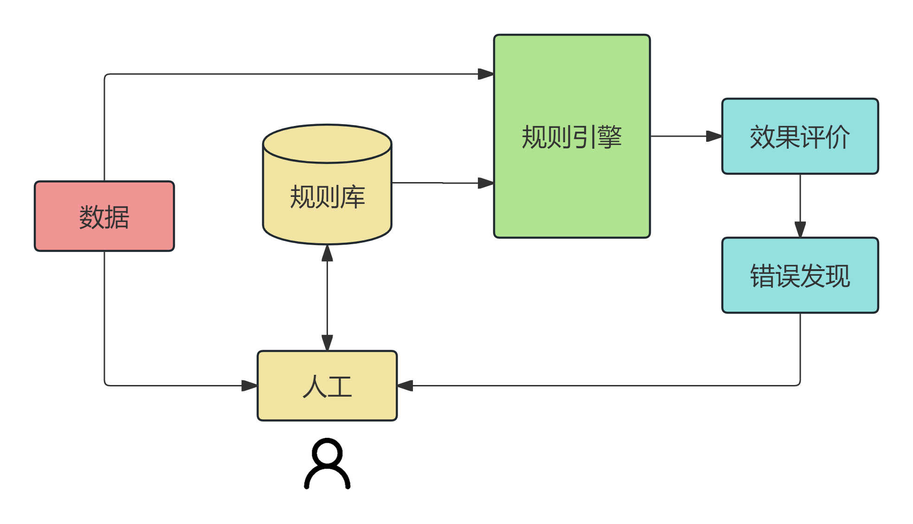
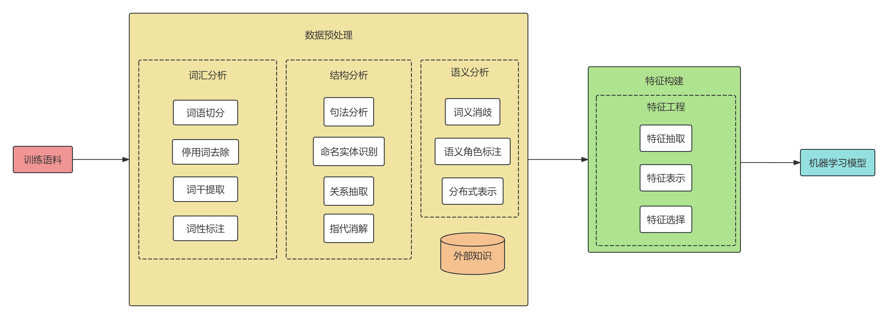
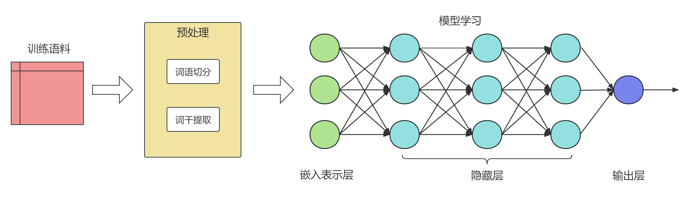
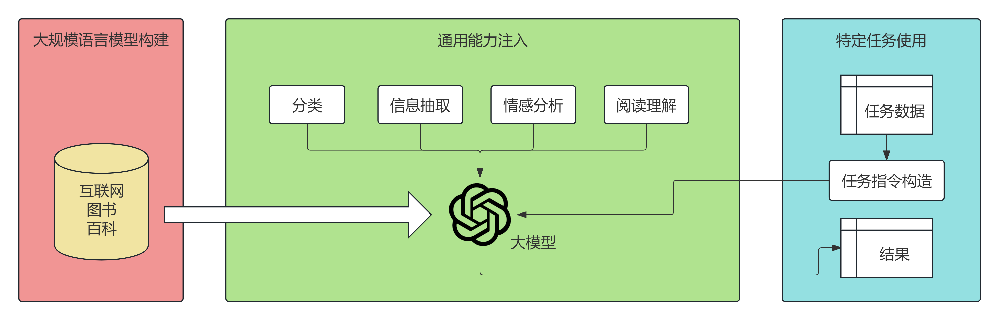

> 本系列笔记基于课内《自然语言处理》课程PPT，参考[speech and language processing](https://web.stanford.edu/~jurafsky/slp3/)编写（2026年1月版）。【同时参考了[slp3翻译版](https://youkre.github.io/slp3/)，特此感谢！】  
> 当然NLP中有部分内容算法是与机器学习/深度学习相重叠的，在本系列中就不再赘述。【因此本系列笔记可看作机器学习方法的DLC】
# 何为NLP
+ 什么是自然语言？顾名思义，这里自然语言是指人类的符号语言，其会随文化发展不断演化，是约定俗成的。【如汉语，英语等】
    + 与之相对的人工语言则是人类自身创造的一套符号和规则系统，用来将一套指令完整精确的传达给计算机。【如编程语言，世界语等】
+ 自然语言处理（NLP）的核心目的就是使得计算机具备人类的分析、**理解**和**生成**自然语言的能力——听、说、读、写、推理、决策等。
    + 何为自然语言理解（NLU）？可以从以下三个角度理解：
        + 连接主义（仿生学派）认为是机器的理解机制与人相同，强调结构的仿真；
        + 符号（功能）主义认为是机器的表现与人相同，强调功能的演绎逻辑；【典型代表就是图灵测试】
        + 行为（进化）主义则认为是机器完成正确的反应或者行为。
    + 何为自然语言生成（NLG）？其主要包括语言的转换（如翻译、摘要）与语言的生成（如写作、对话）。
+ 自然语言处理的子任务具体包括机器翻译、问答系统、信息抽取、文本摘要、对话系统、语义解析、句法分析、语言基础等。
+ NLP的方法论则主要分为理性主义和经验主义两大技术路线：
    + 理性主义曾在上世纪60年代~80年代成为NLP乃至人工智能的主流，其核心为乔姆斯基提出的先天语言能力（转换生成语法），使用基于规则的传统语言处理技术。虽然这种句法规则的确抓住了语言的主要模式，但无法解释语义的变化，且需要大量的人工操作，而人类总结的规则不完备、不一致，也就导致规则多了相互冲突，难以对抗复杂的语言现象。
    + 自上世纪90年代起，经验主义则随着统计学习理论的发展逐渐成为主导。其认为语言是一个随机现象，对没有见过的语言现象进行估计需要复杂的概率模型。具体而言，其设定一个语言模型，通过输入语言数据训练推导出参数值，从而学习到语言的结构。
        > 可以说如今LLM的火热正是极端经验主义的结果。
# 现代NLP的发展历史
    + 起源：1949年Weaver's memorandum（韦弗备忘录），标志着机器翻译的诞生；
    + 早期（20世纪50年代~80年代）：规则模型，转换生成语法，符号化方法
    + 中期（20世纪90年代~2010年）：统计模型、神经网络、Word Embedding、Seq2Seq
    + 后期（2016年至今）：Transformer、BERT、GPT
# 技术架构图
1. 规则模型

2. 统计机器学习模型

3. 深度学习模型

4. 大语言模型

    + 大模型训练路径：情境学习$\Longrightarrow$人类指令理解$\Longrightarrow$思维链$\Longrightarrow$人类反馈价值观对齐
    + 发展方向：行业适配、成本控制、RAG、多智能体系统……
# 发展趋势
+ 模型架构不断改进、规模不断增长（在性能不减的前提下尽量轻量化）
+ 训练方法创新（强化学习、RLHF、自监督学习），多模态训练成为重点
+ 总体能力提升：推理能力和逻辑思维显著增强；上下文理解更加深入，能更好把握对话的语境；代码生成和数学解题等专业领域能力不断提高；多语言理解和生成能力持续改进
+ 模型输出安全性与道德性受到更多关注（偏见与隐私问题成为重点）
+ 应用领域不断扩展，开发生态不断丰富完善
+ 训练和部署成本持续优化，推理速度不断提升，资源利用效率显著改善