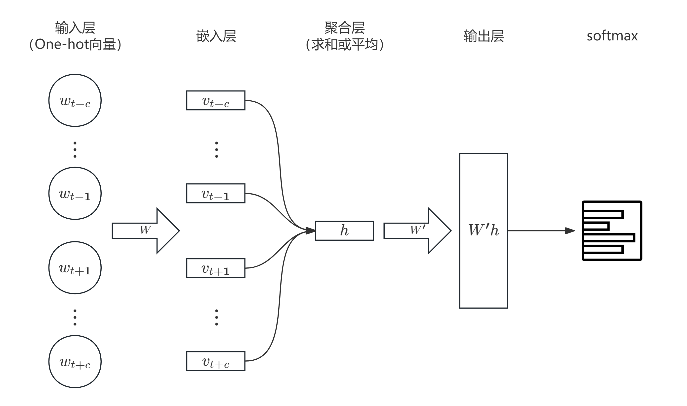
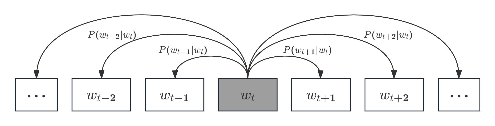

在上一讲中，我们初步介绍了词向量空间的构建。本讲我们将进一步讨论词的语义向量表示，以及更加现代的Word2Vec等方法。
# 词嵌入
+ 在上一讲提到的[词袋模型](/posts/computer-science/nlp/自然语言处理-ch4-文本分类/#词袋模型bag-of-wordsbow)中，每一个单词使用One-Hot向量表示（即一个维度分量为$1$，其他维度分量均为$0$）。不过这也导致得到的矩阵非常稀疏，无法提现单词之间的关系。
+ 在现代的自然语言处理中，词向量是从文本中自动学习得到的。具体而言，系统会通过表征学习（representation learning）自动从原始文本中学习有用的表示，而非依赖人工设计的特征。
## 语义（Semantics）
+ 我们希望语义相似的词语在向量空间中距离也接近。那么，什么是词的语义呢？
    + 在之前的文本预处理中，我们使用了词形还原（lemmatization），由此得到的是最基本的词目（lemma）。【比如sealed，seals的词目都是seal】
    + 对于词目而言，其常常具有多义性（polysemous），即包含多个词义。【如上述seal既表示“密封”，又表示“海豹”】
    + 除了一词多义之外，同样存在多词同义/近义（synonyms）。一种较为严谨的同义词定义是：如果两个词在任何句子中可以互相替换，且不改变句子为真的语境，那么它们就是同义词。【相应地，也可以定义反义词】
    + 另一方面，有些词虽然不是同义词，但是在一些性质上也有相似之处（比如猫和狗）。在进行语义分析时，我们往往会考虑这种相似性，而不仅仅局限于严格的同义。 
+ 两个词的意义除了相似性之外，还可以通过其他方式相关联。
    + 其中一种最典型的联系就是词语联想（association），比如杯子与杯托，学生与学校等。
    + 事实上，我们可以通过词语联想构建语义场（semantic field），这与主题模型/话题分析也存在密切联系【可参见[潜在语义分析](/posts/computer-science/machine-learning/机器学习方法-ch13-潜在语义分析/)】
+ 词语除了存在基本的含义之外，其同样具有情感意义或内涵（connotations）。这常常与作者或读者的情感、情绪、观点或评价相关，可分为正面或负面。
    + 1957年，心理学家Osgood将词语的情感意义分为三个维度：愉悦度（valence）、唤起度（arousal）和支配度（dominance）。每个词可以用一个三维向量来进行描述，这便是向量语义空间的雏形。
## 分布式假设
+ 那么如何具体使用词的语义特征进行建模呢？如果使用人工构建的词义库（比如[WordNet](https://wordnet.princeton.edu/)），就需要大量维护与人力资源。
+ 那么如何避免呢？Joos、Harris和Firth等语言学家在上世纪50年代提出的**分布式假设**（distributional hypothesis）是一个重要的思想：出现在相似分布中的两个词（即其邻近词语或上下文相似），其意义也相似。
+ 根据这一假设，我们可以将单词的上下文信息融入词向量中，这便是词嵌入（Word Embedding）的由来。
    + 实际上，词嵌入模型同样可以应用于文本分类（如情感分析）中。
## 共现矩阵（co-occurrence matrix）
+ 词嵌入模型最简单的呈现形式是共现矩阵（可反映词语共同出现的频率）。在上一讲[词袋模型](/posts/computer-science/nlp/自然语言处理-ch4-文本分类/#词袋模型bag-of-wordsbow)中的词项-文档矩阵就是一种最基本的共现矩阵，它恰恰是分布式假设在文档级别的体现。【同一文档中出现的单词具有相似的表示】
    + 词项-文档矩阵按列看就是文本向量（维度为词数），而按行看就是词向量（维度为文档数量）
+ 另一种常见的共现矩阵是词-上下文矩阵（word-context matrix）。矩阵的每一行对应词汇表中的一个词（目标词），每一列对应词汇表中另一个词作为上下文出现的次数，因此矩阵维度为$|V|\times|V|$。
    + 对于每一个单元格，其代表在某个训练语料中，某一行的目标词与某一列的上下文词在邻近位置共同出现的次数。
    + 这里的邻近位置一般使用以目标词为中心，左右各取若干个词得到的窗口。
    + 实际上，由于绝大多数共现词对频数为零，所以这也被称作稀疏向量表示。
+ 当然，共现矩阵的元素除了使用频数，还可以使用权重，比如：
    1. 词项-文档矩阵：TF-IDF（略，参见[潜在语义分析](/posts/computer-science/machine-learning/机器学习方法-ch13-潜在语义分析/#单词向量空间)）
    2. 词-上下文矩阵：点互信息（PMI），其计算公式为
        $$
        \text{PMI}(w_1,w_2)=\log_2\frac{P(w_1,w_2)}{P(w_1)P(w_2)}
        $$
        当然，为了防止共同出现的概率为$0$导致互信息变为无穷，特别引入正点互信息：
        $$
        \text{PPMI}(w_1,w_2)=\max\{\text{PMI}(w_1,w_2),0\}
        $$
        实际上，点互信息会倾向于不经常发生的事件。为此，我们可以考虑进行加权调节，或者使用加一平滑。
        > 更多关于点互信息的概念可参考[sci-kit learn文档](https://scikit-learn.cn/stable/modules/clustering.html#mutual-info-score)。
+ 那么如何通过词向量衡量两个词之间的相似度？我们可以使用余弦相似度进行度量（具体略）。
+ 能否对稀疏共现矩阵进行数据压缩/降维？可以！使用奇异值分解即可。【参见[CS 127笔记](/posts/computer-science/cs127/cs127-chapter-4/#奇异值分解singular-value-decompositionsvd)】
## Word2Vec
+ 为解决传统词嵌入计算复杂度高的问题，2013年，Google的Mikolov等人提出了Word2Vec模型。它通过引入神经网络架构，可以将稀疏的向量转为稠密向量。
+ Word2Vec的核心理念是：不再统计每个词$w$在某个词附近出现的频率，而是训练一个分类器来执行一个二元预测任务：词$w$是否可能出现在某个词附近？实际上，我们并不关心这个预测任务本身，而是将分类器学习到的权重作为词的嵌入表示。
+ Word2Vec的两种主要训练模式有以下两种：CBOW（连续词袋模型）与Skip-gram（跳字模型）。下面进行详细阐述：
### CBOW
+ CBOW（Continuous Bag of Words）本质是通过上下文预测中心词，具体的架构图如下：
    其中输入向量为$|V|$维，$W\in\R^{|V|\times N}$将one-hot向量映射到词向量，$W'\in\R^{|V|\times N}$将聚合向量映射回词表（得到词表得分向量），最终通过Softmax转换为$w_t$的预测概率。
+ 损失函数采用交叉熵损失：$-\log P(w_t|w_{t-c},\cdots,w_{t-1},w_{t+1},\cdots,w_{t+c})$
+ CBOW模型的优点是速度快，训练效率高，适合高频词。另一方面，CBOW对上下文窗口内的所有词都给予相同权重，且不考虑上下文顺序（词袋假设）。
### Skip-gram
+ Skip-gram的预测顺序则恰好与CBOW相反：根据中心词预测上下文。其示意图如下：
    其中$P(w_{j}|w_i)$表示在给定词$w_i$的条件下，词$w_j$是其上下文的概率。
+ 于是有$\displaystyle\sum_{w_j\in V}P(w_j|w_i)=1$，而目标函数则为似然函数
    $$
    \mathcal{L}(\theta) = \prod_{t=1}^{T} \prod_{-c \leq j \leq c, j \neq 0} P(w_{t+j}|w_t; \theta)
    $$
    其中$T$表示序列长度，$\theta$为待优化参数。将其转为负（平均）对数似然（交叉熵损失）：
    $$
    J(\theta) = -\frac{1}{T} \log \mathcal{L}(\theta) = -\frac{1}{T} \sum_{t=1}^{T} \sum_{-c \leq j \leq c, j \neq 0} \log P(w_{t+j}|w_t; \theta)
    $$
+ 那么如何衡量条件概率$P(w_{t+j}|w_t)$呢？实际上，Skip-gram使用的是向量内积 + Softmax的计算形式：
    $$
    P(w_{t+j}|w_t)=\frac{\exp(\mathbf{u}_{w_t}\cdot\mathbf{v}_{w_{t+j}})}{\displaystyle\sum_{k\in V}\exp(\mathbf{u}_{w_t}\cdot\mathbf{v}_{k})}
    $$
    其中$\mathbf{u}_a$表示词$a$作为中心词时的向量表示，而$\mathbf{v}_b$表示词$b$作为上下文词时的向量表示，二者均为$d$维向量。【这两组向量就是需要训练的参数】
+ 当训练语料库足够大时，用于优化上述交叉熵损失的参数可以为我们提供非常好的词语表征（遵循分布式假设原则）。
    + 最终一般使用$\mathbf{u}_w$作为词$w$的嵌入向量，当然也可以将$\mathbf{u}_w$和$\mathbf{v}_w$进行拼接。
+ 那么损失函数关于模型参数的梯度是如何计算的呢？先考虑下述函数：
    $$
    \begin{aligned}
    y=-\log P(w_{t}|w_c; \theta)&=-\log\left(\frac{\exp(\mathbf{u}_{w_t}\cdot\mathbf{v}_{w_{c}})}{\sum_{k\in V}\exp(\mathbf{u}_{w_t}\cdot\mathbf{v}_{k})}\right)\\
    &=-\mathbf{u}_{w_t}\cdot\mathbf{v}_{w_{c}}+\log\left(\sum_{k\in V}\exp(\mathbf{u}_{w_t}\cdot\mathbf{v}_{k})\right)
    \end{aligned}
    $$
    将其对$\mathbf{u}_{w_t}$和$\mathbf{v}_k$求偏导得
    $$
    \begin{aligned}
    \frac{\partial y}{\partial \mathbf{u}_{w_t}} &= -\mathbf{v}_{w_c} + \frac{\sum_{k \in V} \exp(\mathbf{u}_{w_t} \cdot \mathbf{v}_k) \cdot \mathbf{v}_k}{\sum_{k \in V} \exp(\mathbf{u}_{w_t} \cdot \mathbf{v}_k)} \\
    &= -\mathbf{v}_{w_c} + \sum_{k \in V} \frac{\exp(\mathbf{u}_{w_t} \cdot \mathbf{v}_k)}{\sum_{k' \in V} \exp(\mathbf{u}_{w_t} \cdot \mathbf{v}_{k'})} \mathbf{v}_k\\
    &= -\mathbf{v}_{w_c} + \sum_{k \in V} P(w_k|w_t) \mathbf{v}_k\\
    \frac{\partial y}{\partial \mathbf{v}_k} &= \begin{cases} 
    (P(w_k|w_t) - 1) \mathbf{u}_t ,& k=c \\ 
    P(w_k|w_t)\mathbf{u}_t ,& k\neq c
    \end{cases}
    \end{aligned}
    $$
    由此我们就能得到损失函数梯度下降的流程：
    1. 随机初始化所有中心词向量$\mathbf{u}_t$和上下文词向量$\mathbf{v}_k,k\in V$；
    2. 更新中心词向量与上下文词向量（使用随机梯度下降）：
        $$
        \begin{aligned}
        \mathbf{u}_t&\leftarrow \mathbf{u}_t-\eta\frac{\partial y}{\partial\mathbf{u}_t}\\
        \mathbf{v}_k&\leftarrow\mathbf{v}_k-\eta\frac{\partial y}{\partial\mathbf{u}_k},\quad\forall k\in V\\
        \end{aligned}
        $$
        不断迭代直到参数收敛。
+ 然而，上述参数更新方式需要遍历整个词表，计算复杂度较高。对此，Word2Vec提出了一种优化的方法：**负采样Skip-gram（SGNS）**。
    + 具体而言，SGNS换了一种条件概率$P(w_{t+j}|w_t)$的衡量方法：
        1. 引入Sigmoid函数替代Softmax，将其转为二分类任务（判断两个词同时出现是“真”还是“假”）；
        2. 引入负采样：每次只随机抽取$K$个（通常5~20个）词作为“假样本”来计算梯度。

        最终得到的损失函数变为
        $$
        y = -\log(\sigma(\mathbf{u}_t \cdot \mathbf{v}_c)) - \sum_{i=1}^K \log(\sigma(-\mathbf{u}_t \cdot \mathbf{v}_i))
        $$
        其中$\mathbf{v}_i$为按照$P(w)$概率分布（一般与词频正相关）随机抽取的负样本上下文向量。
    + 这样需要计算梯度的参数量就降至$(K+2)d$【$\mathbf{u}_t,\mathbf{v}_c$和$K$个负样本$\mathbf{v}_j$】，计算效率大大提升。
> 实际上，研究表明，Word2Vec与PPMI之间存在着优雅的数学关系，Word2Vec可以被视为在隐式地优化一个PPMI矩阵的某种函数。
## GloVe
+ GloVe，全称全局向量（Global Vectors），与2014年由Pennington等提出。
+ 与Word2Vec只关注滑动窗口上下文不同，GloVe首先构建了一个全局共现矩阵，然后利用矩阵分解的思想，让两个词的词向量点积尽可能接近它们共现次数的对数。
+ GloVe的损失函数的目标是是让词向量点积（+偏置）尽可能地接近共现次数的对数。具体表达式为
    $$
    J(\theta)=\sum_{i,j\in V}f(X_{i,j})\left(\mathbf{u}_i\cdot\mathbf{v}_j+b_i+\tilde{b}_j-\log X_{i,j}\right)^2
    $$
    其中$f(X_{i,j})$为权重衰减函数，表达式为
    $$
    f(x)=\begin{cases}
    \left(\dfrac{x}{x_{\max}}\right)^{\alpha},&x<x_{\max}\\
    1,&x\geq x_{\max}
    \end{cases}
    $$
    原始论文中取值$x_{\max}=100,\alpha=\dfrac{3}{4}$。
+ 相比Word2Vec，GloVe的训练速度更快，更加适合大规模固定的语料库。
## FastText
+ 2017年，Bojanowski等人在Word2Vec的基础上进一步扩展，构建了FastText词嵌入库。
+ FastText解决了Word2Vec无法很好处理未登录词以及低频词的问题，其核心原理是：使用子词模型，将每个词表示为该词本身加上一组构成它的n-gram集合，并在每个词的首尾添加特殊的边界符号`<`和`>`。
+ 然后，为每个n-gram学习一个skip-gram嵌入向量，而单词则由其所有构成n-gram的嵌入向量之和来表示。未登录词则只由其构成n-gram的嵌入向量之和来表示。
> 更多有关FastText的信息可参见[FastText开源库官网](https://fasttext.cc/)。  
> 另外，在python中使用Word2Vec，GloVe，FastText等模型可使用`gensim.models`，具体可参考[官方文档](https://radimrehurek.com/gensim/models/word2vec.html)。
## 词嵌入评估
+ 与[语言模型的评估](/posts/computer-science/nlp/自然语言处理-ch3-n-gram语言模型/#模型评估)类似，对词嵌入的评估也分为内部评估与外部评估。
+ 外部评估的方法有很多，一个例子如下：对于一段话，先对其每一个词进行嵌入编码，然后求和向量，以此作为输入训练一个分类器（比如情感分析），检验其分类效果。
+ 内部评估则通常使用词语相似度，主要通过计算算法给出的词相似度得分与人类标注的词相似度评分之间的相关性实现。具体方法包括评估词语在句子上下文中的相似度，语义文本相似度，类比任务等。
    + 当然，为了更好地评估词嵌入效果，减少方差，可以考虑对文档进行Bootstrap多次训练嵌入模型，并对结果取平均。