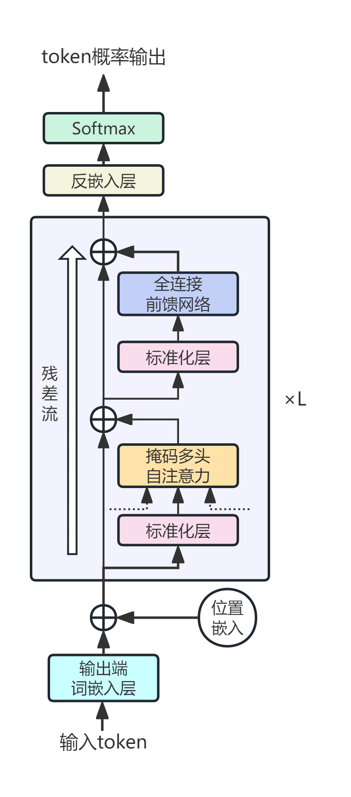
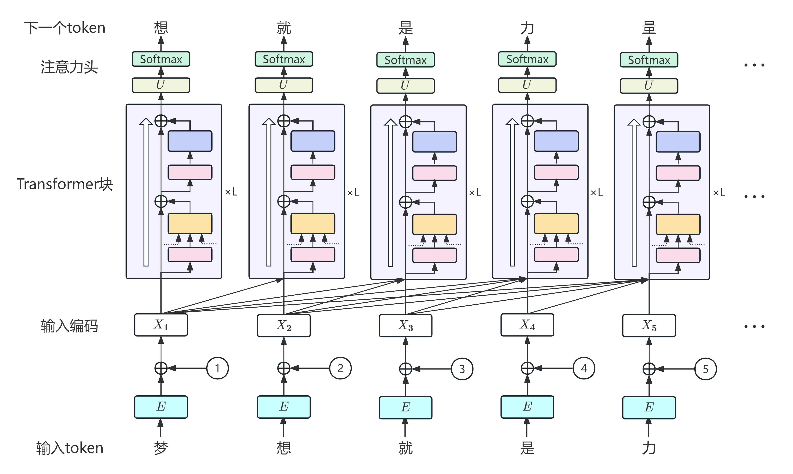

> 注：本讲大致对应[slp3](https://web.stanford.edu/~jurafsky/slp3/)的第1,7,8章。（btw作者刚刚更新了一版pdf，这下等等党大胜利了（不是    
> 另外，由于之前用的翻译版有些过时，因此笔者决定自己用AI翻译一版，已经部署上线。链接：[SLP3 Translation](https://souyerliu.github.io/slp3_translation/)

经过笔者反复考虑，还是决定先把Transformer和LLM写了（下一讲写BERT），然后再介绍NLP的应用。<Spoiler title="……">毕竟现在谈及NLP已经完全绕不开LLM了（笑</Spoiler>
<Note type="warning" title="注意">
  本节内容较长，请酌情观看。~其实相比那些Cheat Sheet还是短一些doge~
</Note>
# 大语言模型（LLM）
+ 在[n-gram语言模型](/posts/computer-science/nlp/自然语言处理-ch3-n-gram语言模型/)中，我们已经初步了解了语言模型的一般形式：接收上下文或前缀作为输入，并输出所有可能的下一个词的概率分布。因此，文本生成的本质就是在概率分布中进行采样。
    + 在语言模型中，最常见的一类是从已有的先前词出发、从左到右预测并生成词语的模型，也被称为**因果语言模型**（causal language model）或自**回归语言模型**（autoregressive language model）。
+ 大语言模型同样属于这一常见类别。它的“大”体现在多个方面：
    1. 其预测条件的上下文长度可以长达百万级（词元）；
    2. 其具有许多层含有大量独立参数的神经网络构成；
    3. 使用极大规模的文本进行训练。

    实际上，大语言模型的性能主要由下述三个因素决定：模型规模（参数数量）、训练数据集规模（以词元计）以及训练所使用的计算量。这些关系也被称为**缩放定律**（scaling laws）。
    + 然而，随着模型性能的提升，其所需要的成本与消耗的资源也会随之上涨。研究表明，当成本固定时，只有当模型规模与数据集规模同步增长时，模型的性能才能得到最大发挥。【这便是为什么如今LLM不再是单纯地堆参数】
+ 那么，为什么大语言模型能够通过预测下一个词学习到海量知识呢？这实际上与我们之前提到的[分布式假设](/posts/computer-science/nlp/自然语言处理-ch5-词嵌入/#分布式假设)有关。根据这一假设，大语言模型在学习知识时可以达到举一反三的效果。
    + LLM通过预测词语来归纳知识的过程也称为**预训练**（pretraining），这也是其在自然语言任务上表现出色的一大原因。下面是一些预训练的例子：
        1. 玫瑰、菊花和牡丹环绕着我，我被___包围着。【花】
        2. 这个房间不只是大（big），它简直是___。【巨大（enormous）】
        3. 4 的平方根是___。【2】  
        4. 《一间自己的房间》的作者是___。【弗吉尼亚·伍尔夫】

        LLM可以从第一个例子学到本体论事实（玫瑰、菊花和牡丹都是花），从第二个例子学到形容词的程度比较（enormous比big更强），从第三个例子中学习数学运算，从第四个例子中学到一些抽象的信息。
## 提示词
在使用大语言模型时，一般都离不开提示词（prompt）。提示词就是用户向语言模型发出的一段文本，用于让模型执行某种任务。
+ 实际上，提示词可以看作大语言模型的初始上下文，LLM会以提示词和随后已生成的词元为条件，逐词继续生成文本，这一过程也被称为条件生成（conditional generation）。
    + 那么为什么条件生成可以得到问题的答案或遵循用户的指令？一种直观的理解是：答案是问题的高概率后续文本，而系统在训练时见过大量跟在问题之后的答案。
    + 另一方面，大语言模型也会通过一种称为**指令微调**（instruction tuning）的方法接受进一步训练，加强它的泛化能力。
    + 条件生成的本质仍然是“预测下一个词”，这一思想可以追溯到上世纪香农创造的“猜字母游戏”。在游戏中，玩家需要根据前文对下一个字母进行猜测，如果猜错就提供正确答案，然后继续往后猜测。【更多相关内容可参见[3Blue1Brown](https://www.bilibili.com/video/BV1yVNU6xERx/?share_source=copy_web&vd_source=61c681438ba5570f0c8520120abe3fea)】
> 关于LLM的训练与提示词的使用，会在下面详细阐述。
## 语言结构与可解释性
那么，如果对大语言模型生成的文本进行可解释性分析呢？这里我们就可以使用传统NLP所依赖的语言结构。
+ 语言结构反映了人类语言及其语言学的属性，主要包括**句法结构**（syntactic structure）和**共指**（coreference）。
    + 句法结构用于描述词语或短语之间的抽象语法关系，对这些句法关系的检测是NLP历史最悠久的任务之一；而共指则表示一段文本中使用多种方式指代同一实体。
+ 可解释性通过揭示模型内部的语言结构或计算过程，帮助我们理解大语言模型如何工作。可解释性研究表明，语言模型的嵌入和网络隐式表示了句法分析树、语义信息及共指信息。
+ 除了用于大语言模型的可解释性之外，语言结构也可用于分析语言模型与用户之间的语言交互。
    + 这里就涉及到第三种语言结构：**共同基础**（common ground）。在人与人之间的交互中，双方会通过落地确认（grounding）表明自己理解或没有理解（一种典型的方式就是通过提问与澄清）。
    + 事实上，目前的大语言模型仍然不擅长落地确认，因此往往会对用户的期望做出错误的假设。
    + 通过交互语言学分析，我们还可以发现大语言模型的其他问题，比如谄媚迎合（sycophancy）和过度自信（overconfidence）。
> 语言结构本身还可以作为连接NLP与其他领域（如政治学，法学，心理学等）的桥梁，甚至可以用于分析语言本身（这一领域被称为计算语言学，与NLP的研究有所区别）。
## 训练过程
大语言模型的训练主要分为以下四个阶段：
1. 预训练   
    前面我们已经简单介绍了预训练的过程。实际上，这一过程也可以看作一种香农游戏，而纠正预测结果体现为更新模型的权重。【使用了交叉熵损失，详细算法会在后续展开】
    + 大语言模型的训练数据主要来自网络获取的、包含数十亿词元的庞大文本语料库（比如[Common Crawl](https://commoncrawl.org/)的网页数据）。当然，由于数据的质量参差不齐，所以在用于训练之前先要进行质量过滤（包括去重、移除模板化内容、删去成人内容等）和安全过滤（使用检测分类器删去有毒内容）。
    + 另一方面，从网络获取数据还会涉及到版权、隐私和偏见等问题，这也是训练过程中需要注意的。
2. 指令微调  
    通过预训练得到的模型可以生成逻辑连贯的文本，但通常无法遵循人类的指令，导致出现答非所问的情况。对此，指令微调（也成为监督式微调）的作用就是让LLM更加遵循指令。
    + 具体而言，指令微调会使用包含数万或数十万条指令与响应的语料库对LLM继续训练。通过预测其中的词元，学会遵循回答问题、编写代码、翻译等指令。
    + 当然，指令数据集还需要包含安全问题的处理，例如加入拒绝执行违法或不道德指令的样例。
3. 偏好对齐   
    只通过指令微调不能保证模型的输出一定满足人类的需求，因此需要进行偏好对齐（preference alignment）。具体而言，偏好对齐使用的训练数据是对同一个问题的两个候选响应，由人类（或LLM）判断二者中哪个更好。
    + 在得到偏好判断训练数据后，我们会使用与强化学习相关的各种算法对模型进行**后训练**（post-training），使其偏向生成人类偏好选择的答案。
4. 用于推理的强化学习  
    近年来，随着DeepSeek-R1为代表的推理模型逐渐兴起，针对推理模型思维链的训练也成为LLM后训练的一个重要部分。一个典型的应用就是求解数学问题，其训练数据除了给出答案之外，还会给出详细的推理过程。
    + 通过这种训练，模型可以在无需人类判断、响应便能被自动判定为明确正确或错误的领域（即可验证领域）中学习。
    + 除了像数学、逻辑问题这种明确的可验证数据外，对输出加以约束的提示也可以作为可验证数据。这对应的强化学习算法也被称为**可验证奖励的强化学习**（RLVR），与上面偏好对齐使用的**人类反馈的强化学习**（RLHF）相对。

> 关于LLM预训练与后训练的更多细节，我们会在下面进行详细展开。
## 推理
在大语言模型训练完成后，我们使用向模型发出提示，让它进行条件文本生成的过程就被称作推理（inference）。
+ 为了让LLM高效的输出结果，通常会为某项任务设计有效提示，这便是提示词工程（prompt engineering）。对于复杂任务，一般会在提示词中加入少量带标签的示例，也被称作**演示**（demonstration）。
    + 研究表明，演示数量不宜过多；增加示例所带来的收益会逐渐递减，而示例过多会使模型过拟合于这些具体示例。实际上，演示的主要作用更多是说明任务及输出格式，而不是展示某道特定问题的正确答案。
+ 除了针对特定任务的提示之外，大语言模型通常还会使用**系统提示**（system prompt）。它作为发送给语言模型的第一条文本指令，用来定义语言模型的任务或角色，并设定整体语气和上下文。
+ 还有一种更加隐蔽的提示蕴含于思维链训练数据的文本中。通过主动在训练数据输出结果中加入思维过程，可以引导大语言模型在回答类似问题时输出推理步骤。
> 注意：提示词工程并不会改变模型的权重，也就是说通过提示词让模型学到的内容不会迁移到新一轮对话中。我们称这种学习为上下文学习（in-context learning）。
## 智能体
智能体（agent）是能够通过调用其他程序在现实环境中自主采取行动的大语言模型。例如，LLM可以调用搜索引擎获取最新信息，调用日历计算空闲时段，调用计算器完成数学运算，调用数据库查找内容等等。
+ 智能体实现这些功能的原理本质仍然是词元预测，只不过这里的词元集加入了现实环境中的动作（如搜索，计算等）。
+ 目前智能体使用的典型架构是**ReAct**，由姚顺雨等于2022年提出。在ReAct框架中，我们提示LLM交替生成动作（Acting）与推理（Reasoning）轨迹，使模型能够推理行动计划，也能根据动作结果推理从外部世界获得的响应。
    + 具体而言，模型首先推理用户的目标，然后通过调用工具采取相关行动，接着观察该行动在外部产生的结果。整个历史记录随后都被视为文本上下文，模型再次开始循环，继续推理、行动和观察，直到完成用户的任务。
## 模型评估
大语言模型有许多大型评估工具集或**基准**（benchmark）。其中很多要求系统回答事实性问题（多项选择题或开放题），题目往往取自教育或职业环境中的人类考试。其问答准确度可以作为模型事实知识或推理能力的有用替代指标。
+ 然而，在使用公开数据对LLM进行评估时，需要考虑数据泄露（即测试数据集进入了训练集）的影响。~~这或许也给了某些LLM“刷分”的空间~~
+ 当然，从概率模型层面也可以对LLM的词预测概率进行评估。【比如之前提到的[困惑度](/posts/computer-science/nlp/自然语言处理-ch3-n-gram语言模型/#模型评估)】
+ 对于一些主观任务（如文本翻译，文章摘要等），无法直接建立客观的评估指标，此时一个比较好的评估方法就是让人类对输出结果进行评价。当然，人工打分成本较高，如今更常见的做法是另外找一个LLM进行评判（在评判之前先进行小规模数据校准，保证其评判结果于人类一致）。
    + 有时，我们也会使用替代指标（proxy metric）对主观任务进行评估。比如，对于机器翻译，可以使用词元重叠作为评估指标。【这种替代指标往往运行效率较高，可以频繁使用】
+ 除了准确度之外，LLM的评估还包括其他因素，比如模型复杂度、训练/推理成本/时间消耗，安全性与偏见等。
___
# Transformer与预训练
在阐述了大语言模型的一般概念后，我们终于可以深入LLM的底层核心——Transformer架构。
> 在笔者的[早期文章](https://souyerin.netlify.app/posts/computer-science/introduction-to-ai/%E4%BA%BA%E5%B7%A5%E6%99%BA%E8%83%BD%E5%AF%BC%E8%AE%BA-ch8-%E5%A4%A7%E8%AF%AD%E8%A8%80%E6%A8%A1%E5%9E%8B/#transformer%E6%A8%A1%E5%9E%8B)里，已经简单提到了这一架构，这里笔者再进行略微扩充，更加详尽的版本可能会在《机器学习方法》笔记-深度学习篇中呈现。

本节我们主要讨论大语言模型主流使用的Transformer架构，即Decoder-only架构（其他架构会在后面涉及）。其示意图如下（未展示完整细节）：
+ 可以看到，每个词元经过解码器时经历了以下流程：
    + 首先与嵌入矩阵$E$相乘得到词嵌入，同时加上位置编码；
    + 然后经过$L$个（几十个甚至更多）Transformer块（包括多头注意力层、前馈网络和层归一化等处理模块），增强嵌入的信息表示；
    + 最终取最后一个Transformer块的输出，与反嵌入矩阵$U$相乘后再经过softmax层，得到下一个词元的概率分布（反嵌入层与softmax层有时合称语言模型头）。
+ 而从词序列的角度看，每一个词元经过解码器后的输出都作为下一个解码器的输入，最终给出完整的预测词序列。其示意图如下：

其中$X_i$表示第$i$个词元的初始嵌入表示，在后续词元解码计算时，会使用前面的所有嵌入信息（以及Transformer块中的表示，图中未标出）作为特征输入。
## 注意力（Attention）机制
在之前提到的静态嵌入方法（如[Word2Vec](/posts/computer-science/nlp/%E8%87%AA%E7%84%B6%E8%AF%AD%E8%A8%80%E5%A4%84%E7%90%86-ch5-%E8%AF%8D%E5%B5%8C%E5%85%A5/#word2vec)）中，无论上下文如何，一个词的含义表示始终用同一个向量表示。然而，对于一些词，它的含义会随着上下文的变化发生改变（最典型的例子就是代词）。
+ 事实上，词语与可能相距很远的其他词语存在丰富的语言关系。因此，我们需要整合这些有帮助的上下文词语的含义，构建词义的**上下文表示**，即**上下文嵌入**（contextual embedding）。而Transformer的注意力机制恰好能实现这一点。
+ 我们先给出注意力机制的一个简化版本：对第$k$层Transformer块上下文中其他适当词元的表示进行加权组合，从而构建第$k+1$层Transformer块的词元表示。这实际上可以刻画我们之前提到的共指关系。
    + 对于使用Decoder-only架构的大语言模型，其处理当前词元$x_i$时只能访问它之前的词元序列$x_1\cdots x_{i-1}$，无法访问之后的词元。
    + 设$x_i$的注意力输出为$\mathbf{a}_i$，那么其（简化）表达式即为
        $$
        \mathbf{a}_i=\sum_{j\leq i}\alpha_{ij}\mathbf{x}_j
        $$
        其中$\mathbf{x}_i$表示词元$x_i$对应的嵌入，$\alpha_{ij}$表示$x_j$对$x_i$的权重。
    + 那么这个权重如何计算？一个直观的想法是使用词元嵌入之间的相似度（可使用点积度量），然后用softmax归一化：
        $$
        \begin{aligned}
        &\text{score}(\mathbf{x}_i,\mathbf{x}_j)=\mathbf{x}_i\cdot \mathbf{x}_j\\
        &\alpha_{ij}=\text{softmax}(\text{score}(\mathbf{x}_i,\mathbf{x}_j)),\quad \forall j\leq i\\
        \end{aligned}
        $$
+ 下面我们将介绍Transformer中实际使用的注意力头（也称为自注意力机制，self-attention）。其使用以下三个概念处理词元间的关系：
    + **查询**（query）：表示当前词元，用于和之前的词元进行比较；
    + **键**（key）：表示先前的词元，与当前词元进行比较，确定相似度权重；
    + **值**（value）：在加权求和中表示先前词元的值。

    这些概念分别使用权重矩阵$W^Q,W^K,W^V$作为表示，每个词元在计算时与矩阵相乘得到对应的特征向量：
    $$
    \mathbf{q}_i=\mathbf{x}_iW^Q,\quad \mathbf{k}_i=\mathbf{x}_iW^k,\quad \mathbf{v}_i=\mathbf{x}_iW^V
    $$
    这样，我们计算$\mathbf{x}_i$与$\mathbf{x}_j$的相似度时，就使用$q_i$与$k_j$的点积。由于点积的结果可能很大或很小，会导致数值溢出与训练梯度损失。对此，我们需要基于嵌入向量的维度大小$d_k$对点积进行缩放。最终我们得到的相似度公式如下：
    $$
    \text{score}(\mathbf{x}_i,\mathbf{x}_j)=\frac{\mathbf{q}_i\mathbf{k}_j}{\sqrt{d_k}}
    $$
    而注意力权重$\alpha_i$的计算公式保持不变，注意力头的计算公式在上述$\mathbf{a}_i$计算公式基础上用$v_j$代替$\mathbf{x}_j$：
    $$
    \text{head}_i=\sum_{j\leq i}\alpha_{ij}\mathbf{v}_j
    $$
    最终得到注意力输出：
    $$
    \mathbf{a}_i=\text{head}_iW^O
    $$
    这里引入一个新的权重矩阵$W^O$，将注意力头的输出的维度转为与输入$\mathbf{x}_i$相同，从而可以作为下一个Transformer块的输入。
    + 下面我们梳理一下上面涉及的所有矩阵与向量的维度：
        |矩阵/向量|维度|
        |:-------:|:--:|
        |$\mathbf{x}_i,\mathbf{a}_i$|$1\times d$|
        |$\mathbf{q}_i,\mathbf{k}_i$|$1\times d_k$|
        |$\mathbf{v}_i$|$1\times d_v$|
        |$W^Q,W^K$|$d\times d_k$|
        |$W^V$|$d\times d_v$|
        |$W^O$|$d_v\times d$|

        在原始的Transformer论文中，$d$取为512，$d_k$与$d_v$均取64。
+ 上述介绍的只是单注意力头，而Transformer实际会使用多注意力头。不同的头可以专门表示上下文元素与当前词元之间不同的语言关系，或者在上下文中寻找特定类型的模式。
    + 在**多头注意力**（multi-head attention）机制中，每个注意力头$c$都对应一组查询、键和值矩阵$W^{Qc},W^{Kc},W^{Vc}$，其维度和单头注意力均保持一致。在Transformer论文中，使用了8个注意力头。
    + 记注意力头总数为$A$，第$i$个注意力头为$\text{head}_i$，那么最终得到的注意力输出为
        $$
        \mathbf{a}_i=(\text{head}_1\oplus\cdots\oplus\text{head}_A)W^O
        $$
        其中$\oplus$表示对注意力头向量进行拼接，最终得到长度为$Ad_v$的向量。相应地，$W^O$的维度改为$Ad_v\times d$。
    + 在多头注意力机制中，$d_v$一般会设为$\dfrac{d}{A}$，因此其参数量相比单头注意力不会显著增加。
## Transformer块
除了自注意力层/多头注意力层之外，Transformer块还包括以下三类层：前馈层、残差连接与（层）归一化。
+ 在前面的示意图中，我们看到原始嵌入$\mathbf{x}_i$的信息通过残差流向上传递，同时先经过归一化层与注意力层，其结果加入残差流；然后再通过归一化层与前馈层，结果再加回残差流，最终得到Transformer块输出。其中注意力层会利用其他残差流中的信息。
    > 注：在原始Transformer论文中，归一化层放在了残差连接与注意力层/前馈层之后，但目前主流的大模型使用的Transformer架构中归一化都放在注意力层/前馈层之前，这可以让训练更稳定。
### 前馈层（Feed-Forward）
> 关于前馈神经网络的概念，可参见[机器学习方法-人工神经网络](/posts/computer-science/machine-learning/机器学习方法-ch3-人工神经网络/#前馈多层神经网络)。

在Transformer块中，前馈层是一个两层全连接的神经网络（包含一个隐藏层）。每个词元在同一层Transformer块中的前馈层参数都相同，但不同层Transformer块的前馈层参数不同。
+ 在前馈层中，隐藏层的神经元数量$d_{\text{ff}}$一般设为$4\times d$，因此前馈层的参数占据了Transformer参数中的大部分。
+ 另一方面，在激活函数的选择中，现在的LLM大多使用SwiGLU作为激活函数，其相比ReLU效果更好。顾名思义，SwiGLU由Swish函数和GLU（门控单元）组成。Swish函数的定义如下：
    $$
    \text{Swish}_\beta(\mathbf{x})=\mathbf{x}\cdot\sigma(\beta\mathbf{x})
    $$
    其中$\sigma(\cdot)$表示Sigmoid函数。而GLU门控函数的形式如下：
    $$
    \text{GLU}(\mathbf{x})=(\mathbf{x}W_1+b_1)\otimes\sigma(\mathbf{x}W_2+b_2)
    $$
    其中$\otimes$表示逐元素乘积。将上式中的Sigmoid函数改为Swish函数，就得到了SwiGLU的函数形式：
    $$
    \text{SwiGLU}(\mathbf{x})=(\mathbf{x}W_1+b_1)\otimes\text{Swish}_\beta(\mathbf{x}W_2+b_2)
    $$
    最终再经过一个输出层，得到最终的前馈输出（此时前馈层也称为门控前馈层）：
    $$
    \text{FFN}_{\text{SwiGLU}}(\mathbf{x}, W_1, W_2, W_3, b_1, b_2, b_3, \beta) 
    = \big( \text{Swish}_{\beta}(\mathbf{x}W_1 + b_1) \otimes (\mathbf{x}W_2 + b_2) \big) W_3 + b_3
    $$
    由于GLU函数含有用于门控的额外参数，$d_{\text{ff}}$通常会设为略小于$4d$。
### 层归一化（Layer Normalization）
Transformer中的层归一化可以类比神经网络中的批量归一化（Batch Normalization）【可参见[人工神经网络](/posts/computer-science/machine-learning/机器学习方法-ch3-人工神经网络/#其他优化方法)】。其目的基本相同：让隐藏层的取值维持在便于用梯度进行训练的范围内，以改善深度神经网络的训练性能。
+ 层归一化的具体实现如下：对于嵌入向量$\mathbf{x}=(x_1,\cdots,x_d)$，对其各分量取均值和标准差
    $$
    \mu=\frac{1}{d}\sum_{j=1}^dx_j,\quad \sigma=\sqrt{\frac{1}{d}\sum_{j=1}^d(x_j-\mu)^2}
    $$
    然后对$\mathbf{x}$进行z-score标准化：
    $$
    \hat{\mathbf{x}}=\frac{\mathbf{x}-\mu}{\sigma}
    $$
    最后我们再引入两个可学习参数$\gamma$和$\beta$，作为权重与偏移：
    $$
    \text{LayerNorm}(\mathbf{x})=\gamma\frac{\mathbf{x}-\mu}{\sigma}+\beta
    $$
+ 当然，实际使用中还有另一种归一化方法：RMSNorm。其与层归一化的区别在于RMSNorm不考虑均值中心化，直接让向量除以分量平方和均值的平方根。在训练中，RMSNorm的参数更少，计算效率更高。
### 组合
最后，我们将上述Transformer块中的所有组件进行组合，得到整个输入到输出的流程如下：
$$
\begin{aligned}
\mathbf{t}_{i}^{1} &= \text{LayerNorm}(\mathbf{x}_{i}) \\
\mathbf{t}_{i}^{2} &= \text{MultiHeadAttention}\left(\mathbf{t}_{i}^{1},\ [\mathbf{t}_{1}^{1}, \ldots, \mathbf{t}_{i-1}^{1}]\right) \\
\mathbf{t}_{i}^{3} &= \mathbf{t}_{i}^{2} + \mathbf{x}_{i} \\
\mathbf{t}_{i}^{4} &= \text{LayerNorm}(\mathbf{t}_{i}^{3}) \\
\mathbf{t}_{i}^{5} &= \text{FFN}(\mathbf{t}_{i}^{4}) \\
\mathbf{h}_{i} &= \mathbf{t}_{i}^{5} + \mathbf{t}_{i}^{3}
\end{aligned}
$$
    其中只有多头注意力层会使用之前词元的归一化输出作为输入之一，这相当于将其他词元的残差流信息汇入当前词元的残差流。
+ 由于Transformer块的输出$\mathbf{h}_i$的维度与$\mathbf{x}_i$一致，因此可以进行堆叠。在GPT-3中，解码器堆叠了96层Transformer块（之后的LLM甚至会堆叠更多！）。
    + 在堆叠的Transformer块的残差流中，输入词元$x_i$的信息逐渐转变为下一个预测词元的概率信息。
+ 在最后一个（最高的）Transformer块末端，需要对词元流最后的输出$\mathbf{h}_N^L$（$N$表示词元序列长度，$L$表示Transformer块层数）再执行一次层归一化，然后再进入语言模型头（会在下面介绍）。
### 并行计算
注意到，上述每个词元$x_i$到注意力输出$\mathbf{a}_i$与Transformer块输出$\mathbf{h}_i$的计算都是相互独立的，因此我们可以利用矩阵乘法将计算并行化（然后就可以用GPU加速）。
+ 在进行并行化之前，我们将所有$N$个词元的输入嵌入组合为一个词元嵌入矩阵$X=(\mathbf{x}_1,\cdots,\mathbf{x}_N)^\top\in\R^{N\times d}$。【这里的$N$可达到数十万甚至百万级别，这也是为什么要并行运算】
+ 接下来我们分别对注意力机制与Transformer块的其他部分进行并行化：
    1. 注意力并行化  
        首先，对于单头注意力，我们直接将词元嵌入矩阵与三个权重矩阵相乘得到特征向量矩阵：
        $$
        Q=\mathbf{x}_iW^Q,\quad K=\mathbf{x}_iW^K,\quad V=\mathbf{x}_iW^V
        $$
        这样我们只需计算$QK^\top$就能一次计算所有查询-键特征向量的点积。从而我们的注意力输出可以转化为以下矩阵计算：
        $$
        \begin{aligned}
        \text{head} &= \text{softmax}\left( \text{mask}\left( \frac{QK^\top}{\sqrt{d_k}} \right) \right) V\\
        \mathbf{A} &= \text{head}\,  W^O
        \end{aligned}
        $$
        注意我们这里在softmax之前增加了一个mask（掩码）函数，这是因为我们之前限制了键词元不能再查询词元之后，而$QK^\top$打破了这一限制。因此，mask函数的目的就是将$QK^\top$的上三角部分变为$-\infty$（这样softmax后就变为$0$）而其余部分不变。【这可以通过加上一个上三角为$-\infty$，其余为$0$的矩阵$M$实现】
        > 实际上，这里注意力矩阵的计算量为$O(N^2)$级别，因此当$N$较大时仍然比较复杂。
        + 有了单头注意力并行化后，多头注意力并行化也就不难理解了：只需要对每个注意力头套用上述权重矩阵，并进行类似矩阵运算即可：
            $$
            \begin{aligned}
            Q ^ {c} = \mathbf {X}W ^ {Qc}; \quad K ^ {c} &= \mathbf {X}W ^ {Kc}; \quad V ^ {c} = \mathbf {X}W ^ {Vc},\quad c=1,\cdots,A\\
            \text{head} _ {c} = \text {SelfAttention} (Q ^ {c}, K ^ {c}, V ^ {c}) &= \text {softmax} \left(\text {mask} \left(\frac {Q ^ {c} (K ^ {c})^\top}{\sqrt {d _ {k}}}\right)\right) V ^ {c}\\
            \text {MultiHeadAttention} (\mathbf {X}) &= \left(\text{head} _ {1} \oplus \text{head} _ {2} \dots \oplus \text{head} _ {A}\right) W ^ {O}
            \end{aligned}
            $$
    2. Transformer块其他部分并行化  
        在得到注意力模块的并行化后，其他模块的并行化只需要将向量转为矩阵即可：
        $$
        \begin{aligned}
        \mathbf {O} &= \mathbf {X} + \text {MultiHeadAttention} (\text {LayerNorm} (\mathbf {X}))\\
        \mathbf {H} &= \mathbf {O} + \operatorname{FFN} (\text {LayerNorm} (\mathbf {O}))
        \end{aligned}
        $$
        实际运算中前馈层与归一化层通过将矩阵拆分为向量并行计算，然后将结果进行堆叠。这里$\mathbf{H}$的维度也是$N\times d$。

## 词元嵌入与位置嵌入
在介绍完Transformer块后，我们回到解码器的开头，探讨最初的输入$X$从何而来。
+ 实际上，与[Word2Vec](/posts/computer-science/nlp/%E8%87%AA%E7%84%B6%E8%AF%AD%E8%A8%80%E5%A4%84%E7%90%86-ch5-%E8%AF%8D%E5%B5%8C%E5%85%A5/#word2vec)类似，这里的初始词嵌入仍然用嵌入矩阵$E$乘以one-hot向量（维度$|V|$）表示。
+ 而Transformer对Word2Vec及传统NLP遵循的词袋假设进行了突破，在词元嵌入的基础上引入了位置编码，这样能进一步理解词元之间的顺序关系。
    + 那么位置嵌入如何获得？其实与词元嵌入类似，将位置嵌入向量设为可学习的训练参数，这样可以组成位置嵌入矩阵$E_{\text{pos}}$。
    + 那位置本身如何度量？最简单的方法就是用词元的绝对位置，但由于词元序列长度不一，这会导致不同位置嵌入训练程度不均匀。一种改进的思路是对绝对位置进行函数变换，比如正弦/余弦位置嵌入（这也是Transformer论文中使用的方法）；另一种思路是直接使用相对位置，比如旋转位置嵌入（RoPE）。

这样，每个词元最终得到的嵌入就是初始嵌入与位置嵌入的叠加。
## 语言模型头
正如前文所述，语言模型头的作用就是将Transformer块的输出转化为概率分布（就像之前n元概率模型的输出结果一样）。其具体转化流程分为以下两步：
+ 首先，使用一个线性层（即反嵌入层）将输出嵌入$\mathbf{h}_{N}^L$（$d$维向量）转化为逻辑值向量（也称为分数向量），其维度为词表大小$|V|$。
    + 实际上，这里的反嵌入层同样使用权重矩阵与输出嵌入相乘，且这个权重矩阵就取为嵌入矩阵$E$的转置。（这样可以减少参数量）
+ 然后再通过softmax层将逻辑值向量转化为词表上的概率分布。综上可得整个流程的符号表示如下：
    $$
    \begin{aligned}
    \mathbf{u}&=\mathbf{h}_{N}^LE^\top\\
    \mathbf{y}&=\text{softmax}(\mathbf{u})
    \end{aligned}
    $$
## 解码
Transformer语言生成的最后一步就是基于上面的概率分布从词表中生成词元序列，即解码。下面给出几种常见的解码方法：
1. 贪心解码（greedy decoding）  
    贪心解码是最简单的词元生成方式，即始终生成在给定上下文下概率最高的词元。其具体表达式如下：
    $$
    \hat {w} _ {t} = \argmax_ {w \in V} P (w | \mathbf {w} _ {<   t})
    $$
    然而，实际上我们一般不会在LLM中采用贪心解码，这是因为这样生成的文本很容易预测，导致结果千篇一律，重复性高。在大多数任务中，我们希望LLM生成更加多样的结果。
2. 随机采样（random sampling）  
    另一种简单的想法是基于概率分布对词表进行随机取样，这样概率高的词元更有可能选出，但概率较低的词元同样有可能被选择。  
    然而，这样的解码方法往往会生成一些奇怪的句子，尽管这种概率很低。
3. 温度采样（temperature sampling）  
    温度采样是对上述两种解码方式的调和。具体而言，其引入一个温度参数$\tau\in(0,1]$，并在解码器最后的softmax之前对逻辑值向量除以温度参数，即
    $$
    \mathbf{y}=\text{softmax}\left(\frac{\mathbf{u}}{\tau}\right)
    $$
    这样就可以提高词表向量中高概率元素的概率，并降低低概率元素的概率。当$\tau$接近$1$时，温度采样接近随机采样，反之接近贪心解码。
    + 当然，也可以考虑让$\tau>1$，此时也称为高温采样，其会让词表的概率趋向均匀分布。
4. top-k与top-p采样  
    这两种采样都是贪心解码的推广：
    + top-k采样通过预先设定词元数量$k$，然后再词表中选取概率最高的$k$个候选词，将它们的概率归一化，最后再进行随机采样。【$k=1$时即为贪心解码】
    + top-p采样（也称为核采样）将词表概率从高到低排序，然后选取累计概率达到$p$的前若干个词，再归一化后随机采样。

    当然，实际使用中往往会将这两个采样方法进行结合：先用top-k硬过滤，再用top-p衡量模型置信度。
## 预训练Transformer LLM
+ 前面我们提到大语言模型的预训练过程中会将大型文本语料库词元化，以作为训练材料；然后在每个词元$t$处要求模型预测下一词元，并通过误差反向传播和梯度下降训练模型的各项参数。因此这种模型也被称为**自监督模型**（self-supervised model），其不需要额外提供数据标签。
+ 损失函数采用交叉熵损失函数，用于衡量预测概率分布与正确分布之间的差异。其具体形式如下：
    $$
    L _ {C E} (\hat {\mathbf {y}} _ {t}, \mathbf {y} _ {t}) = - \sum_ {w \in V} \mathbf {y} _ {t} [ w ] \log \hat {\mathbf {y}} _ {t} [ w ]
    $$
    这里正确分布实际上可看作一个one-hot向量（实际词元对应元素为$1$，其他均为$0$），因此这个损失函数可以简化为模型为正确的下一词元$w _ {t + 1}$分配的概率负对数：
    $$
    L _ {C E} (\hat {\mathbf {y}} _ {t}, \mathbf {y} _ {t}) = - \log \hat {\mathbf {y}} _ {t} [ w _ {t + 1} ]
    $$
    从而整个序列的损失可用每个词元的平均交叉熵损失表示：
    $$
    L _ {C E} (\text {batch of length T}) = \frac {1}{T} \sum_ {t = 1} ^ {T} - \log \hat {\mathbf {y}} _ {t} [ w _ {t + 1} ]
    $$
+ 另一方面，在词元$t$处预测下一个词元时，当前词元序列$w_{1:t}$一定是正确的（非预测）词元序列，这与推理时使用已预测的词元序列不同。【这也被称为**教师强制**（teacher forcing）】
+ 当然，由于每个词元的预测可以并行运算，所以在训练时所有词元（序列）可以独立作为训练语料一次性得到下一个词元预测、损失计算及参数更新。
+ 对于预训练效果的评估，前面我们提到可以使用困惑度。其计算公式如下：
    $$
    \text {Perplexity} (w _ {1: T}) = P (w _ {1: T}) ^ {- \frac {1}{T}}  = \left(\prod_ {t = 1} ^ {T} P (w _ {t} | w _ {<   t}) ^ {- 1}\right) ^ {\frac {1}{T}} 
    $$
    这实际上与上述词元序列的损失函数形式基本相同，只差一个对数变换。
    > 注：困惑度的计算实际上也与Tokenizer的算法有关，因此在比较困惑度时最好先保证使用的Tokenizer相同。
## KV缓存
最后我们再补充一种减少模型使用内存，提高运行效率的技术：KV缓存（KV Cache）。其适用于推理过程，主要思想是：对当前词元之前词元计算过的键与值向量存入缓存中，这样在后续计算中只需从缓存中取出即可。

> 当然，对提高Transformer LLM效率的方法远不止于此（可参考最新文献），这里就不多赘述了。

# 后训练
上面我们提到的LLM训练四个阶段中，后三个阶段都属于后训练。下面我们将对这三个后训练阶段进行详细阐述。
## 指令微调
指令微调是一种监督学习，其训练数据由指令组成。其训练与预训练基本一致：将指令设为条件上下文，再训练模型以该上下文为条件，逐个预测输出回答中的词元。
+ 这里的微调（tuning）是指对已经完成预训练的模型再使用交叉熵损失在一些新数据上执行额外的训练轮次。【可以调整全部参数，也可以只调整其中一部分】
+ 指令微调与预训练的主要区别是：指令微调数据中的每条指令或每个问题都有一个监督目标，即问题的正确答案或对指令的适当回答。因此，指令微调属于监督微调（supervised fine-tuning, SFT）。指令微调训练的体量相比预训练也小很多。
    + 一些典型的指令微调数据集（一般都附带论文）：Aya Datasets, Super
NaturalInstructions、OPT-IML……
    + 上述指令微调数据集中一部分由人类编写，但更多来自于之前NLP任务（如情感分析、自然语言推理和问答等）中使用的监督训练数据。
    + 当然，也可以使用语言模型基于数据集生成指令和回答，再通过人工审核后进入指令微调数据集。
+ 指令微调的通常通过考察经过指令训练的模型在未曾获得明确指令的新任务上的表现进行评估，一般使用交叉验证留一法。
## 参数高效微调
有时，我们希望提升LLM在一些专门领域或语言上的表现。此时我们就考虑冻结一部分参数，只更新某个特定的参数子集，这种方法也被称为参数高效微调（parameter-efficient fine-tuning, PEFT）。
+ 目前最常见的参数高效微调方法是LoRA，即低秩适配（Low-Rank Adaptation）。其适用于Transformer中参与大量计算的权重矩阵（如$W^Q,W^K,W^V$和$W^O$），具体原理如下：
    + 考虑一个权重矩阵$W$，维度为$k\times d$。正常情况下对这个矩阵进行更新需要加上一个维度同样为$k\times d$的矩阵$\Delta W$（通过指令微调训练得到），而LoRA的策略则是先对$W$进行冻结，再使用矩阵$A$（维度$k\times r$）和$B$（维度$r\times d$）作为训练矩阵，其中$r\ll\min\{k,d\}$。这样矩阵的更新公式就变为
        $$
        W\leftarrow W+AB
        $$
        这可以减少微调训练时梯度更新的计算量。  
    + 另一方面，因为LoRA模块只与$AB$绑定，因此可以为不同领域建立不同的LoRA模块，在微调时只需要为预训练矩阵$W$加上对应的$AB$矩阵即可。
## 偏好对齐
关于偏好对齐的含义在上面已经有所涉及，此处不赘述。在偏好对齐中，训练数据一般为成对数据，包含提示词$x$和一组备选输出$o$（由提示词经过LLM输出采样得到）。如果给定输出 $o_i$ 比另一个输出 $o_j$ 更受偏好，就记作 $( o _ { i } \succ o _ { j } | x )$。
+ 这类经过标注的偏好对可以通过多种方式生成，比如：
    + 由经过培训的标注者直接标注成对的采样输出；
    + 由标注者对$N$个输出排序，再将排序提炼成$\displaystyle\binom{N}{2}$个偏好对；
    + 由标注者从$N$个样本中选出一个最优项，从而得到$N-1$个偏好对。
+ 除了利用人类标注这的判断之外，标注数据还可以来源于从在线资源（如Reddit、StackExchange、知乎等平台）中提取的隐式偏好判断，以及使用LLM充当标注者而获得的完全合成偏好集合。
    + 而除了通过比较标注外，还可以考虑让标注者（人类或LLM）在系统输出的不同维度或方面（如帮助性、诚实性、正确性、复杂性和冗长度等）上给出量化评分判断。
+ 有了这些判断标注结果后，我们首先用概率方式对其建模。具体而言，我们一般采用二元逻辑回归方法：假设输出$o_i$与$o_j$对应的分数分别为$z_i$和$z_j$，那么概率$P( o _ { i } \succ o _ { j } | x )$通过以下方式计算：
    $$
    P( o _ { i } \succ o _ { j } | x )=\frac {1}{1 + e ^ {- (z _ {i} - z _ {j})}} =  \sigma (z _ {i} - z _ {j}) 
    $$
    这也被称为Bradley-Terry模型。实际上这里的分数差$\delta=z_i-z_j$可看作逻辑回归中的对数优势比（log odds）。
    + 当然，上述分数$z_i,z_j$往往无法直接获得，此时我们考虑引入一个可学习的提示词-输出奖励函数$r(x,o)$，从偏好数据中学习分数。【可使用梯度下降最小化二元交叉熵损失】
        > 由此可知，目前当前利用偏好数据对齐LLM的方法，都以强化学习框架为基础，具体细节笔者决定不详细展开。~SLP3中这一部分也没写完，可以正大光明地鸽了hh~
        
