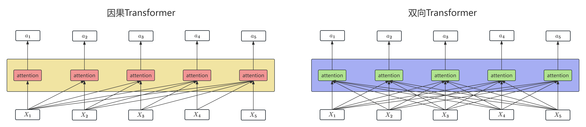

上一讲我们介绍了Transformer架构与因果（从左到右）语言模型。这一讲我们将介绍另一种基于Transformer的架构：双向Transformer编码器，其中使用最广泛的一类就是BERT模型家族。
+ 这一架构的特点是不预测后面的词，而是遮住中间的一个词，要求模型根据两侧的词猜出被遮住的词，因此这也被称为**掩码语言建模**（Masked Language Modeling, MLM）。另外，这种架构的训练与微调也与上一讲提到的内容略有区别，具体请见下述内容。
# 双向Transformer编码器
在介绍双向Transformer编码器之前，我们需要先梳理语言模型的三大架构：仅编码器、仅解码器和编码器-解码器架构。
1. 仅解码器（Decoder-only）架构   
    这是我们上一讲提到的架构，其接收一系列词元作为输入，再以迭代方式逐个生成输出词元（因此属于生成式模型）。解码器中的信息从左向右流动，因此模型只依据先前词语预测下一词。
2. 仅编码器（Encoder-only）架构【本讲重点】  
    这一架构的模型接收词元序列作为输入，并为每个词元输出一个向量表示。其代表就是BERT、RoBERTa等掩码语言模型。仅编码器架构模型不用于生成文本，主要用于创建分类器（如情感分析、主题建模等），这些通过微调编码器实现，也就是使用监督数据训练它们。
    > 当然，掩码语言模型也可作为生成式模型（如扩散模型），但本讲不对此作讨论。
3. 编码器-解码器（Encoder-Decoder）  
    这也是原始Transformer论文中提出的架构，接收词元序列作为输入，并输出一系列词元。其与仅解码器架构的主要区别在于输入词元序列与输出词元序列之间的关系没有那么紧密，可能有很大差异。这一架构目前主要用于机器翻译（会在之后介绍）和语音识别。

在仅编码器（Encoder-only）架构中，双向Transformer编码器模型处于核心地位。其特别适用于处理一个词元需要查看其后续词元的任务，比如序列标注（参见[之前的笔记](/posts/computer-science/nlp/自然语言处理-ch6-序列标注/)）。
+ 双向Transformer编码器的重点是计算输入词元的上下文化表示。具体而言，其得到的输出嵌入在输入词元的基础上加入了上下文信息，可用于各种需要依据上下文中的词元进行分类或决策的应用。
+ 双向Transformer编码器的注意力架构与之前的仅解码器注意力架构的区别可由下图表示：
    因此，双向Transformer的注意力计算（并行化）只需要在上一讲公式的基础上去掉遮蔽函数即可：
    $$
    \operatorname { head } = \operatorname { softmax } \left(\frac {QK^\top}{\sqrt {d _ { k }}}\right) V
    $$
    其余Transformer架构均和上一讲一致。
+ 下面给出典型的双向Transformer编码器模型参数：
    1. BERT（只支持英语）：上下文窗口$N=512$，嵌入维度$d=768$，Transformer块数量$L=12$，注意力头数量$A=12$，总共参数约100M。
    2. XLM-RoBERTa（支持多语言）：上下文窗口$N=512$，嵌入维度$d=1024$，Transformer块数量$L=24$，注意力头数量$A=16$，总共参数约550M。

    从参数量上，掩码语言模型通常比因果语言模型小得多。【后者参数量通常为Billion级别】
## 双向编码器训练
与因果Transformer模型类似，双向Transformer编码器的预训练方法同样是使用完形填空。具体而言，给定一个缺少一个或多个元素的输入序列，双向编码器的学习任务就是预测这些缺失元素（为每个缺失项生成词表上的概率分布）。
+ 在实际操作中，一般会对训练文本进行遮蔽、替换、重排、删除，以及插入无关内容（即噪声），而模型的目标就是去噪。
+ 下面我们介绍双向Transformer编码器专用的掩码语言建模方法（也属于去噪方法）：
    + 在MLM的训练过程中，模型会看到来自训练语料库的一系列句子，其中会采样一定比例的词元（BERT模型中为15%）进行如下处理：
        1. 将词元替换为替换为名为`[MASK]`的特殊词表词元；【80%概率】
        2. 将词元替换为另一个词元（在词表中依词元一元概率随机采样）；【10%概率】
        3. 词元保持不变。【10%概率】

        然后训练模型需要猜出接受处理的词元原本是什么。
        + 为什么不直接将所有选中词元都替换为`[MASK]`？因为使用 MLM 模型执行下游任务时并不会使用`[MASK]`词元。如果只把词元替换成`[MASK]`，模型可能只会在看到`[MASK]`时预测词元，但我们希望模型始终尝试预测输入词元。
    + 另一方面，所有输入词元都参与Transformer的自注意力过程，但只有被采样的词元用于学习（计算交叉熵损失）。因此，BERT及其后继模型的训练效率不如因果语言模型。
+ 除了完形填空之外，BERT家族中的一些模型包含第二个学习目标，被称为**下一句预测**（Next Sentence Prediction, NSP）。在这项任务中，模型会看到成对的句子，并被要求预测每一对句子究竟是训练语料库中真实相邻的一对句子，还是互不相关的一对句子。【这主要应用于释义检测、蕴含判断与语篇连贯性等任务】
    + 在任务中，BERT会在输入表示中引入两个特殊词元（也用于后续微调）：在输入句对前添加词元`[CLS]`，并在两个句子之间以及第二个句子的最后一个词元之后放置词元`[SEP]`。
    + 另外，在词元嵌入与位置嵌入之外，每个词元在输入时还会加上第一/第二分段嵌入，表示这个词元属于第一句还是第二句。
    + 在训练时，使用`[CLS]`词元关联的最终层输出向量$\mathbf{h}_{\text{CLS}}^L$作为下一句预测，经过一个NSP头得到二分类预测概率：
        $$
        \mathbf { y } = \operatorname { softmax } (\mathbf { h } _ { \mathrm { CLS } } ^ { L }W _ { \mathrm { NSP } })
        $$
        其中$W_{\text{NSP}}\in\R^{d\times 2}$。最终得到的$\mathbf { y }$可理解为两个句子的时序与逻辑连贯性评分。
    + 在BERT中，50% 的训练句对是正例；其余50%的句对中，第二个句子从语料库的其他位置随机选择。NSP损失取决于模型区分真实句对与随机句对的能力。另外，在采样语句对时，要保证总长度小于512个输入词元。
+ 在 BERT 中，NSP损失与MLM训练目标结合形成最终损失。最终每个Transformer层的嵌入都将学到有助于根据相邻词语预测词语的表示。
+ RoBERTa等一些模型舍弃了下一句预测目标，因此训练方案会略有不同：输入不再是采样得到的句对，而只是一系列连续句子，开头仍使用特殊的`[CLS]`词元。
    + 如果文档在达到512个词元之前结束，就加入额外的分隔词元，再把下一篇文档中的句子装入，直到总数达到512个词元。通常会使用较大的批次，大小介于8K与32K个词元之间。
## 双向编码器微调
+ 同样与因果Transformer模型类似，双向Transformer编码器预训练模型要用于下游应用，一般也需要进行微调。具体而言，我们会在预训练模型顶端添加应用专用结构（通常称为专用模型头），并以预训练模型的输出作为其输入。微调过程使用与应用有关的有标注数据，训练这些额外的应用专用参数。
+ 下面介绍一些常见文本应用类别所用的微调方法：
    1. 序列分类  
        即使用单个标签对整个文本序列进行分类（实际上，这就是之前提到的[文本分类](/posts/computer-science/nlp/自然语言处理-ch4-文本分类/)）。在BERT中，在预训练和编码期间将`[CLS]`词元放在所有输入序列的开头，然后用模型最终层中对应`[CLS]`输入的输出向量表示整个输入序列，并充当分类器头的输入，接上逻辑回归/神经网络等分类器得到分类结果。
        + 此时，只需要微调分类器头中的维度转换矩阵$W_C\in\R^{d\times k}$（$k$为类别数量）即可。
        + 当然，利用输出与正确答案之间的损失也可以更新预训练语言模型本身的权重。在实践中，通常只需对语言模型参数做很小的改动（更新Transformer的最后几层），就能获得合理的分类性能。
    2. 序列对分类  
        序列对分类的任务在前面的NSP目标中已经有所提及，因此其与NSP训练过程基本一致，此处不再赘述。
    3. 序列标注  
        关于序列标注的任务可参见[序列标注](/posts/computer-science/nlp/自然语言处理-ch6-序列标注/)。在序列标注中，我们把每个输入词元经过BERT得到的最终输出向量传给分类器，由分类器产生所有可能标签上的softmax分布。
        + 微调的权重矩阵$W_k\in\R^{d\times k}$，其中$k$是该任务可能标签的数量。
        + 关于最终标签的选择，可以采用贪心方法，把每个词元的argmax标签作为最可能的答案，从而生成最终输出标签序列；也可以将softmax分布输出送入条件随机场进行训练，得到标签。
        + 另一方面，命名实体识别的监督训练数据通常采用与词级切分文本相关联的BIO标签形式，但词元化得到的词元序列与标注中的BIO标签往往不直接对齐。对此，我们可以用下述方法处理：
            + 在训练阶段，对标注数据中同一个词的所有词元赋予相同BIO标签；
            + 在解码阶段，直接使用一个词的第一个子词词元所对应的argmax BIO标签作为预测输出，或者结合各子词上的标签概率分布，尝试找出最优的词级标签。
