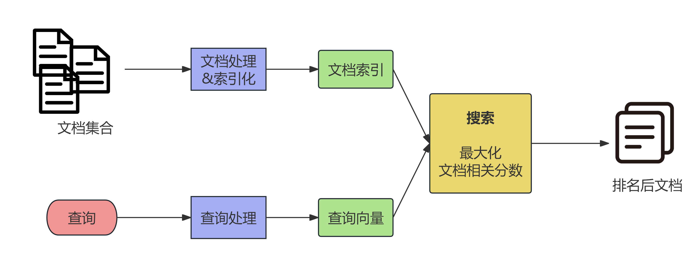
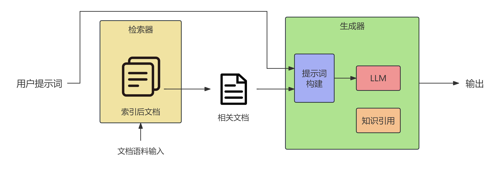

前面我们已经介绍了自然语言处理的基本流程与算法模型，接下来我们将介绍NLP在下游任务中的应用。本讲我们会主要阐述信息检索和检索增强生成。
# 检索增强生成（RAG）
+ 自计算机与互联网诞生以来，人类就一直在让计算机满足人类的信息需求。一个典型的例子就是搜索引擎，人类用户输入问题后，计算机通过信息检索返回相关结果。事实上，现在的大语言模型的基本形式——对话系统同样也来源于此。【当今搜索引擎与LLM之间的界限也在不断模糊】
+ 最简单的信息需求是事实性问题（factoid questions），在LLM中我们可以直接将问题作为提示词输入，LLM将以提示词作为前缀，通过解码器生成回答文本。LLM能否准确回答一些事实性问题的原因在于其在预训练数据中处理过大量事实，它们都被存储在了参数中。
+ 但是，使用简单提示词让LLM回答事实性问题仍然存在以下问题：
    + 首先是**幻觉**（hallucination），即在回答问题时，大语言模型有时会编造听起来似乎合理的答案，但实际上并不与现实一致。
        + 我们也并非总能判断语言模型何时正在产生幻觉，部分原因在于LLM的校准（calibration）并不好。在一个校准较好的系统中，系统对答案正确性的置信度与答案实际正确的概率高度相关，而LLM会经常以十足的把握给出完全错误的答案。
    + 其次，由于LLM基于预训练参数作答，其无法让我们查询专有数据。处于隐私或保密机制，我们需求的信息往往都不在大语言模型预训练所用的大型网络语料库中。
    + 除此之外，由于LLM只在某个特定时间进行过一次预训练，其无法讨论快速变化的信息（如时事新闻）。
+ 为解决上述问题，我们可以为语言模型提供外部知识来源，例如医疗或法律记录、私人电子邮件或公司文档等专有文本，并使用这些文档回答问题。这种方法也被称为**搜索增强生成**（retrieval-augmented generation, RAG）。
    + 在RAG中，我们主要运用**信息检索**（information retrieval，IR）技术检索可能含有有助于回答问题之信息的文档，再让大语言模型依据这些文档生成答案。
## 信息检索（IR）
+ 这里我们讨论的信息检索任务也被称为临时检索（ad hoc retrieval），其具体过程为：用户向检索系统提出一个查询，系统随后从某个集合中返回一组有序的文档。
    + 文档是系统建立索引并检索的任意文本单位，可以是网页、科学论文、新闻报道，甚至是段落等更短的篇章；
    + 集合是用于满足用户请求的一组文档，它可以指整个互联网（即网络搜索），也可以是较小的企业资料库，甚至是某个人使用的一组文档；
    + 用户提出的查询一般会被转换为一组词项（集合中的一个词或短语）。

    上述过程可以用下面的流程图表示：
    又上图可知，查询经过处理后以向量表示，而文档处理后以索引表示。根据向量与索引表示的形式，可以将信息检索系统分为两类：**稀疏搜索**（sparse retrieval）与**稠密搜索**（dense retrieval）。下面我们将详细介绍这两种搜索系统。
### 稀疏检索
+ 在稀疏检索系统中，文档一般用词项加权向量表示，主要采用tf-idf或其变体BM25。关于tf-idf及相关概念已经在之前的[词嵌入](/posts/computer-science/nlp/自然语言处理-ch5-词嵌入/#共现矩阵co-occurrence-matrix)（也可参见[潜在语义分析](/posts/computer-science/machine-learning/机器学习方法-ch13-潜在语义分析/#单词向量空间)）中涉及，这里只作一些补充：
    + 信息检索使用的词频率与词嵌入中使用的词频率有所区别，前者主要采用对数词频，公式如下：
        $$
        \text{tf} _ {t, d} = \begin{cases} 1 + \log_ {10} \operatorname{count} (t, d) & \text { if } \operatorname{count} (t, d) > 0 \\ 
            0 & \text { otherwise } \end{cases}
        $$
        其中$t$表示词项，$d$表示文档。
    + 在用tf-idf表示后，查询向量与文档向量之间的相似度用余弦相似度（内积）表示：
        $$
        \text{score} (q, d) = \sum_ {t \in \mathbf {q}} \frac {\operatorname{tf-idf} (t , q)}{\sqrt {\sum_ {q _ {i} \in q} \operatorname{tf-idf} ^ {2} (q _ {i} , q)}} \cdot \frac {\operatorname{tf-idf} (t , d)}{\sqrt {\sum_ {d _ {i} \in d} \operatorname{tf-idf} ^ {2} (d _ {i} , d)}}
        $$
        <Note type="primary" title="例子">
        上面这个公式可能不太容易理解，我们用一个例子来说明（来自slp3）。设查询与文档内容如下：
        ```txt
        查询：sweet love
        文档1：Sweet sweet nurse! Love?
        文档2：Sweet sorrow
        ```
        那么查询向量可以如下处理：
        | 词 | 计数 | tf | df | idf | tf-idf | 归一化 |
        |---|---:|---:|---:|---:|---:|---:|
        | sweet | 1 | 1 | 3 | 0.125 | 0.125 | 0.383 |
        | nurse | 0 | 0 | 2 | 0.301 | 0 | 0 |
        | love | 1 | 1 | 2 | 0.301 | 0.301 | 0.924 |
        | how | 0 | 0 | 1 | 0.602 | 0 | 0 |
        | sorrow | 0 | 0 | 1 | 0.602 | 0 | 0 |
        | is | 0 | 0 | 1 | 0.602 | 0 | 0 |
            
        而两个文档的向量及与查询向量的相似度计算如下表示：
        + 文档1：
            | 词 | 计数 | tf | tf-idf | 归一化 | $\times q$ |
            |---|---:|---:|---:|---:|---:|
            | sweet | 2 | 1.301 | 0.163 | 0.357 | **0.137** |
            | nurse | 1 | 1.000 | 0.301 | 0.661 | 0 |
            | love | 1 | 1.000 | 0.301 | 0.661 | **0.610** |
            | how | 0 | 0 | 0 | 0 | 0 |
            | sorrow | 0 | 0 | 0 | 0 | 0 |
            | is | 0 | 0 | 0 | 0 | 0 |

            得到最终相似度为0.137+0.610=0.747。
        + 文档2：
            | 词 | 计数 | tf | tf-idf | 归一化 | $\times q$ |
            |---|---:|---:|---:|---:|---:|
            | sweet | 1 | 1.000 | 0.125 | 0.203 | **0.0779** |
            | nurse | 0 | 0 | 0 | 0 | 0 |
            | love | 0 | 0 | 0 | 0 | 0 |
            | how | 0 | 0 | 0 | 0 | 0 |
            | sorrow | 1 | 1.000 | 0.602 | 0.979 | 0 |
            | is | 0 | 0 | 0 | 0 | 0 |

            得到最终相似度为0.0779。
        </Note>
    + 当然，上述相似度公式中第二项$\operatorname{tf-idf} (t , d)$里的idf可以去掉（因为这已经在查询向量中计算过）。
    + 下面再介绍tf-idf的变体BM25（Best Matching 25）。其由Stephen Robertson等人在1994年提出，在tf-idf的基础上增加了两个参数$k$和$b$，前者用于调节词频与IDF之间的平衡，后者则用于控制文档长度归一化的权重。其主要公式为：
        $$
        \text{score}_{\text{BM25}}(q, d)=\sum_ {t \in q} \overbrace {\log \left(\frac {N}{\mathrm{df} _ {t}}\right)} ^ {\text { IDF }} \overbrace {\frac {\operatorname{tf} _ {t , d}}{k \left(1 - b + b \left(\frac {| d |}{| d _ {\text {avg}} |}\right)\right) + \operatorname{tf} _ {t , d}}} ^ {\text { weighted   tf }}
        $$
        其中$|d_{\mathrm{avg}}|$表示平均文档长度。通常$k$取值在$[1.2,2]$范围内，$b$一般取值$0.75$。
+ 在以前的信息检索系统中，还需要去掉（高频）停用词以提高搜索效率，不过现代IR系统已经很少使用停用词表，一方面是效率的提高，另一方面IDF本身已经具备降低高频词权重的功能。
+ 另一方面，在进行文档处理之前，我们还可以通过构建**倒排索引**（inverted index）提高文档检索的效率。具体而言，倒排索引由关键词典与倒排记录表构成，词典中的每个词项对应的倒排记录表包含与该词项关联的文档ID，也可以包含词频、文档频率乃至词项在文档中的确切位置等信息。一个简单的倒排索引示例如下：
    $$
    \begin{array}{l l} 
    \text {how \texttt{\{1\}}} & \to 3 \texttt{[1]} \\
    \text {is \texttt{\{1\}}} & \to 3 \texttt{[1]} \\ 
    \text {love \texttt{\{2\}}} & \to 1 \texttt{[1]} \to 3 \texttt{[1]} \\ 
    \text {nurse \texttt{\{2\}}} & \to 1 \texttt{[1]} \to 4 \texttt{[1]} \\ 
    \text {sorrow \texttt{\{1\}}} & \to 2 \texttt{[1]} \\ 
    \text {sweet \texttt{\{3\}}} & \to 1 \texttt{[2]} \to 2 \texttt{[1]} \to 3 \texttt{[1]} \end{array}
    $$
    其中$\texttt{\{\}}$里表示总词频，而箭头右边表示文档ID和其对应文档词频。
+ 在构建倒排索引后，给定用户查询，检索系统就能找出所有包含查询关键词的候选文档。最终文档按照相关性分数从高到低排序，再将整个列表（或其中前N篇文档）返回给用户。这便是完整的排序检索过程。
### 信息检索系统评估
在介绍稠密检索之前，我们先了解一下如何对信息检索系统进行评估。一个直接的想法是以返回的文档是否相关作为二分类标准，计算其准确率与召回率，具体公式如下：
$$
\text{Precision} = \frac {| R |}{| T |} \quad \text{Recall}= \frac {| R |}{| U |}
$$
其中$|T|$表示返回文档总数，$|R|$表示返回文档中相关文档数，$|U|$表示整个文档集合中的相关文档数。然而这不适用于排序检索系统，我们需要考虑偏好“把相关文档排得更靠前”的系统指标。
+ 对此，我们考虑基于文档排序分别计算前$k$篇返回文档的准确率与召回率：
    $$
    \text{Precision}_k = \frac {\text{前}k\text{篇返回文档中相关文档数量}}{k} \qquad \text{Recall}_k= \frac {\text{前}k\text{篇返回文档中相关文档数量}}{|R|}
    $$
    这样就得到了$|T|$组准确率-召回率数据对，将其绘制为准确率（纵轴）-召回率（横轴）曲线（准确说是折线），那么这条曲线随着召回率的增大，准确率会上下波动。
    + 当我们需要比较两个排序检索系统时，可以考虑在若干个固定召回率水平（从 0 到 100，固定步长）上绘制平均准确率。若某个召回率没有对应的准确率，需要计算插值准确率：
        $$
        \operatorname{IntPrecision} (r) = \max _ {i > = r} \operatorname{Precision} (i)
        $$
        即在不低于此召回率的数据点中取最高的准确率。然后我们就可以比较两个系统绘制的插值后曲线，如果其中一条总体高于另一条，则其对应的检索系统表现更好。
+ 另一种评估方法是使用平均准确率均值（mean average precision, MAP）。具体而言，同样根据排序由前到后逐个扫描文档，但只记录当前文档为相关文档时总体的准确率。在完整扫描后对所有记录的准确率取均值就得到平均准确率（average precision, AP）：
    $$
    \mathrm{AP} = \frac {1}{| R _ {r} |} \sum_ {d \in R _ {r}} \text {Precision} _ {r} (d)
    $$
    其中$R_r$表示前$r$篇文档中的相关文档集合。然后进行多次查询，对得到的平均准确率再取平均，就得到了MAP：
    $$
    \mathrm{MAP} = \frac {1}{| Q |} \sum_ {q \in Q} \mathrm{AP} (q)
    $$
### 稠密检索
上述稀疏检索使用的tf-idf与BM25算法存在一个问题：它们都默认要求用户输入的查询词项都在文档集合中出现过，然而现实情况下用户输入的内容往往无法直接匹配文档，这也被称为词表不匹配问题。
+ 解决这一问题的办法就是不适用稀疏的词频向量，而使用稠密的嵌入向量（包含语义信息）。上世纪的潜在语义索引（可参见[潜在语义分析](/posts/computer-science/machine-learning/机器学习方法-ch13-潜在语义分析/)）已经应用了这一思想，而如今这一方案通常使用BERT等编码器实现。
    + 在编码器方案中，查询与文档可以看作序列对分类中的两个词元序列，从而可套用NSP方法得到相似度分数。需要注意的是，查询与文档必须放进BERT的512词元窗口，例如可将查询截断到64个词元，并在必要时截断文档，使文档、查询、`[CLS]`和`[SEP]`合计不超过512个词元。
    + 然而，上述编码器方案仍然存在不足：计算与时间成本过高（查询需要与每个文档组合作为输入）。对此，我们考虑引入**双编码器**（bi-encoder），即将查询与文档分别放入两个独立的编码器，同时在查询之前预先对所有文档进行编码。这样，当查询到来时，只需编码该查询，再以查询向量和预计算文档向量的点积作为每篇候选文档的分数即可。
        + 当然，虽然这种改进降低了计算成本，但牺牲了结果的准确性，因为其相关性判断无法充分利用查询中所有词元与文档中所有词元之间各种可能的意义交互。
+ 近年来稠密检索倾向于选择在单编码器与双编码器方案之间进行折中，比如ColBERT架构。其仍使用两个独立编码器，但提取查询与文档所有词元的编码输出，通过词元间最大相似度运算得到查询与文档的相似度。【具体细节可见[知乎文章](https://zhuanlan.zhihu.com/p/138703309)】
+ 上述编码器的训练数据的形式一般为是查询以及相关/不相关篇章或文档（正例/负例）。获取数据及标签的方法有很多，这里就不多展开了。
+ 对于稠密向量算法，找出与稠密查询向量点积最大的稠密文档向量集合，是一个最近邻检索问题。对此，现代系统会使用Faiss等近似最近邻向量检索算法。【同样不详细展开】
___
在介绍完信息检索技术后，我们终于可以开始介绍检索增强生成了。实际上，检索增强生成的本质就是将信息检索技术集成到LLM中。具体而言，RAG一般使用IR技术从某个指定文档库中检索可能含有有用信息的文档，再让大语言模型以这些文档和原始查询为条件生成答案。
+ RAG系统主要包含**检索器**（retriever）和**生成器**（generator）两个组件（后者有时也称为阅读器reader）。其结构示意图如下：
    由此可知，RAG方法主要分为两个阶段：检索阶段从集合中返回相关文档；生成阶段则把文档放入提示，让 LLM 据此生成文本。某些生成结果还会包含知识引用，帮助用户判断是否应信任生成内容，或在感兴趣时继续查阅。
    + LLM的任务可以抽象为基于如下概率模型生成文本：
        $$
        p (x _ {1}, \dots , x _ {n}) = \prod_ {i = 1} ^ {n} p (x _ {i} | \mathrm{R} (q); \text {回答下述问题...}; q; x _ {<   i})
        $$
+ 在这一基本RAG范式的基础上还可以做各种扩展。比如在基于智能体的RAG中，系统会自行决定何时调用检索智能体，以及检索哪个集合；而一些RAG架构会添加一个重排序器，在篇章检索完成后再次排序或调整顺序【对于复杂问题可能还需要叠加搜索】；除此之外，还可以对LLM进行指令微调或训练IR模型等。

+ RAG系统的评估通常采用两种技术，具体选择取决于问题类型与问答场景。对于有客观标准答案的数据集，使用精确匹配（预测答案与标准答案完全一致的比例）作为评估指标；而对于答案为自由文本的数据集，可考虑用词元$F_1$分数（预测答案与标准答案之间的平均词元重叠）进行评估。