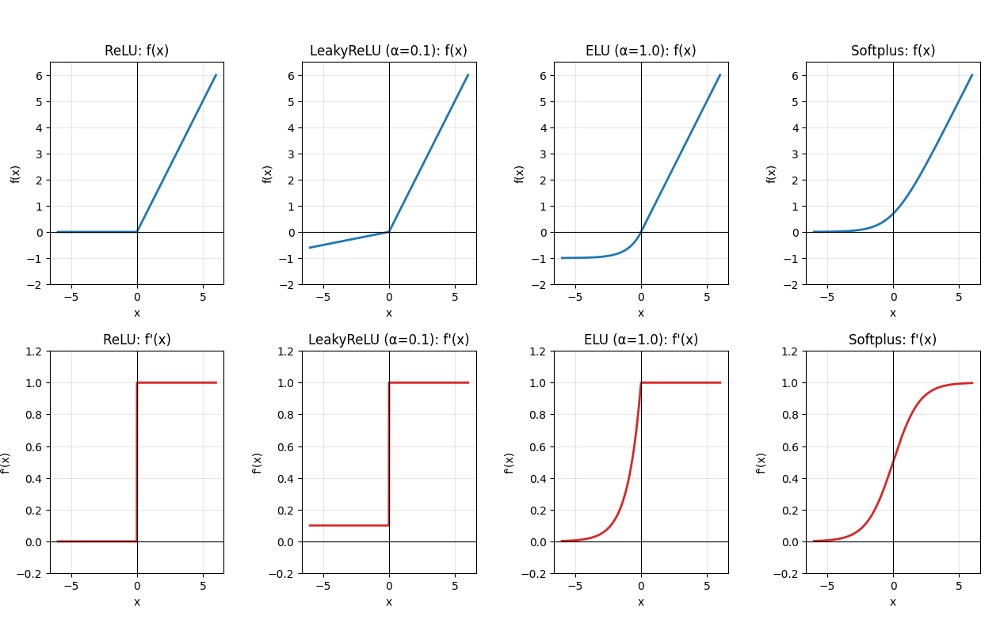
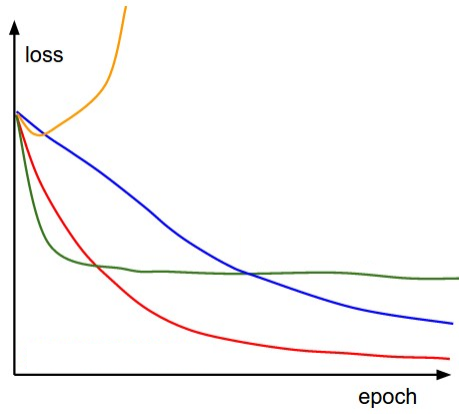

> 经过笔者考虑，还是将深度学习部分单独编组，但为体现与机器学习方法系列的衔接，沿用系列编号。

本系列以课内《深度学习》课程为主干，同时参考李航《机器学习方法（第2版）-深度学习编》、李沐《动手学深度学习》、邱锡鹏《神经网络与深度学习》（第2版）等书目编写。
# 多隐藏层神经网络
> 由于之前在[机器学习方法 Ch.3](/posts/computer-science/machine-learning/机器学习方法-ch3-人工神经网络/)中已经涉及了神经网络的基本概念，故这里不再赘述，仅作补充。

之前我们提到，根据万能近似定理，理论上只需要有足够多的隐藏层神经元数量，单隐藏层神经网络就可以逼近任意连续函数。那么，为什么还需要深度学习（多隐藏层神经网络）呢？
+ 这是因为，对于一些复杂函数，单隐藏层神经网络需要的神经元数量（与多隐藏层神经网络相比）呈指数级增长。所以增加神经网络的隐藏层深度可以提高网络的表达效率。
+ 另一方面，增加神经网络的隐藏层数量也有利于模型的复用（其他神经网络可以直接借用其一部分隐藏层参数）

多隐藏层神经网络的前馈与梯度反向传播推导可见[机器学习方法 Ch.3](/posts/computer-science/machine-learning/机器学习方法-ch3-人工神经网络/#前馈多层神经网络)，此处作略。【需注意矩阵偏导的计算】
## 训练技巧
在[机器学习方法 Ch.3](/posts/computer-science/machine-learning/机器学习方法-ch3-人工神经网络/#深度神经网络及其优化)中，我们介绍了一些神经网络的优化算法。这里我们再进行一些补充：
1. 激活函数
    + Sigmoid与Tanh函数都属于饱和函数，二者主要区别在于Tanh是零中心化函数，而Sigmoid会产生偏置参数$b$的偏移，这会导致其收敛速度比Tanh更慢。
    + ReLU函数实际上具有一定的正则化效果（因为前向传播时有些神经元的输入会变为0，相当于舍弃对应的权重）
    + 下面给出ReLU函数及其变体的表达式与一阶导数：

    | 激活函数 | 定义 | 一阶导数 |
    |---|---|---|
    | ReLU | $f(x)=\max(0,x)$ | $f'(x)=\begin{cases}1,&x>0\\0,&x<0\end{cases}$ |
    | LeakyReLU | $f(x)=\begin{cases}x,&x>0\\\alpha x,&x<0\end{cases}$ | $f'(x)=\begin{cases}1,&x>0\\\alpha,&x<0\end{cases}$ |
    | ELU | $f(x)=\begin{cases}x,&x>0\\\alpha(e^x-1),&x\le 0\end{cases}$ | $f'(x)=\begin{cases}1,&x>0\\\alpha e^x,&x<0\end{cases}$ |
    | Softplus | $f(x)=\ln(1+e^x)$ | $f'(x)=\dfrac{1}{1+e^{-x}}=\sigma(x)$ |
    
    可视化如下：
2. 参数初始化

3. 自适应学习率  
    [机器学习方法 Ch.3](/posts/computer-science/machine-learning/机器学习方法-ch3-人工神经网络/#优化算法)中提到的AdaGrad、RMSProp和Adam都属于自适应学习率方法，下面再补充两个方法：
    + AdaDelta方法：在AdaGrad方法的基础上解决了AdaGrad方法的学习率过快趋向0导致过早停止学习的问题。具体而言，其参数更新表达式为
        $$
        \begin{cases}
        G_t = \beta G_{t-1} + (1 - \beta) g_t \odot g_t \\
        \Delta X_t^2 = \beta \Delta X_{t-1}^2 + (1 - \beta) \Delta\theta_t \odot \Delta\theta_t \\
        \end{cases}\Longrightarrow
        \Delta\theta_t = - \frac{\sqrt{\Delta X_{t-1}^2 + \epsilon}}{\sqrt{G_t + \epsilon}} \odot g_t
        $$
        其中$\beta$为时间衰减率（参数更新量与梯度平方和更新量共用一个衰减率）。
    + Nesterov加速法：公式为
        $$
        \Delta\theta_t=\rho\Delta\theta_{t-1}-\alpha g_t(\theta_{t-1}+\rho\Delta\theta_{t-1})
        $$
        其与动量法的唯一区别在于梯度计算与惯性前进的先后顺序。可以证明Nesterov加速法的收敛速率快于动量法。
4. 梯度截断  
    主要用于解决梯度爆炸问题，包括按值截断（梯度每个分量都缩放到指定区间内）与按模截断（梯度整体范数的缩放）。截断阈值可作为超参数，也可根据训练梯度自动调整。
5. Mini-bath SGD（小批量梯度下降）  
    每次随机选取样本的一个子集进行梯度更新。其中Batch size为一个超参数，其设置一般与算力性能有关。批量越大，随机梯度方差越小，训练更稳定，因此可设更大的学习率（批量越小时恰好相反）。【不多展开】
6. 权重衰减  
    权重衰减也属于正则化方法，其一般形式为：
    $$
    \theta_{t+1} = \theta_t - \eta \nabla L(\theta_t) - \eta \lambda \theta_t = (1 - \eta\lambda)\theta_t - \eta \nabla L(\theta_t)
    $$
    其中$\lambda$为权重衰减率。在SGD中，权重衰减与L2正则化基本等价。
7. 数据增强  
    数据增强的本质是人为增加训练数据。以图像数据为例，常见的数据增强方法包括旋转、翻转、缩放、加噪声等。

<Spoiler title="...">btw我感觉这些知识也略有些outdated了（唉，发展太快了，明明五年前这些东西都还很前沿很时髦……）</Spoiler>

## 实施策略（调参）
虽然说神经网络的调参往往会被戏称为“炼丹”“玄学”，但掌握一定的调参经验仍然能够提高模型优化的效率。 
+ 首先我们整理一下多隐藏层神经网络的主要超参数及其重要性（参见吴恩达《深度学习》课程）：

    | 超参数 | 重要性 |
    | :--- | :--- |
    | $\alpha$（学习率） | 最重要 |
    | $\rho$（动量因子） | 次最重要 |
    | Mini-batch size | 次最重要 |
    | 隐藏层中的神经元数量 | 次最重要 |
    | 神经网络的层数 | 再次最重要 |
    | 权重衰减率 | 再次最重要 |
    | $\beta_1, \beta_2, \epsilon$（Adam中的衰减率和$\epsilon$） | 不太重要 |
    | 激活函数 | 未提及，但相对比较重要 |
    | Dropout | 同上 |
+ 调参的第一步是确定参数搜索的方式与搜索范围。
    + 参数搜索方式主要包括随机搜索与网格搜索，其中随机搜索的效果一般更好。
    + 参数搜索的范围一般是先大范围再小范围，具体范围及参数分布根据参数本身的性质确定（如学习率一般为$[0,1]$的均匀分布）。
+ 神经网络的训练与测试效果一般通过一种被称为Babysitting（监视）的方法得到，其本质就是绘制损失函数（或其他指标）随迭代次数增加的变化曲线。以下面这张曲线图为例（只改变了学习率参数）：
    这张图里黄色曲线对应的学习率太大，绿色曲线对应的学习率较大，蓝色曲线对应的学习率较小，而红色曲线对应的学习率适中。
    + 当然，上述比较都是相对的，在实际实验中一般不大能只通过一条曲线判断参数选择的好坏。
+ 一般而言，神经网络的调参优化策略分为以下四步：
    1. 在训练集上得到好的结果：更复杂的网络结构、不同的优化算法、更多的epoch、更大的MiniBatch Size……
    2. 在验证集上得到好的结果：正则化、dropput、更多的训练集数据（泛化能力更强）、数据增强……
    3. 在测试集上得到好的结果：更大的验证集（不容易过拟合到验证集）
    4. 在实际应用中得到好的效果：调整验证集和测试集数据分布（实际数据的分布可能有出入）、调整损失函数/评价指标……

    其中验证集是用于调参的主力。在调参时，往往采用正交化的策略（即控制其他超参数不变，一次只改变一个超参数）
    + 关于训练集/验证集/测试集的样本量比例分配：在传统机器学习中，三者的比例一般为3\:1\:1，而在深度学习中由于样本量更大，验证集与测试集的比例可以很低（如1%），只需要保证绝对样本量较高即可。
    + 另一方面，验证集与测试集的样本分布应当保持一致（训练集分布也尽量保持一致），一种简单的方案就是对样本进行随机分配。
## 误差分析
+ 如何评价训练集结果的好坏？一个直接的标准就是使用Bayes Error（使用贝叶斯分类器的结果，理论最佳）比较。当然，在一些情况下使用人类的表现也可以进行评估。
    + 如果以人的表现作为基准，那么当模型表现差于人类时，可以考虑人工标注得到更多的训练集或人工检查误判的样本错在哪里。
+ 另一方面，神经网络的误差主要分为偏差和方差。具体而言，模型的效果一般可以归纳为下述两种情形（数字仅作示例）：
    ||情形1|情形2|
    |:--:|:--:|:---:|
    |**人类表现**|1%|7.5%|
    |**训练误差**|8%|8%|
    |**验证误差**|10%|10%|
    |**对应的主要问题**|偏差问题|方差问题|

    其中人类表现与训练误差间的差距属于可避免偏差，而训练误差与验证误差间的差距属于方差。
+ 在考虑实际应用中的效果时，实际应用的数据分布可能与训练/测试数据有差别，此时一般会考虑将实际应用的数据分配到训练/验证/测试集上（趋向均匀分配）。
    + 当然，这也会导致训练集与验证/测试集的数据分布存在差异，这可以通过从训练集中在分出一个训练-测试（train-val）集解决。【另一个方案则是使用人工/LLM合成数据，不过这也需要注意过拟合问题】
## 迁移学习
当处理某个任务时发现数据不足，而恰好有另一个任务目标相近且数据充足的神经网络模型，就可以考虑使用迁移学习方法。
+ 具体而言，就是直接使用另一任务已训练过的神经网络一部分参数，再往后嫁接新的网络，这样只需要训练新网络的参数即可。