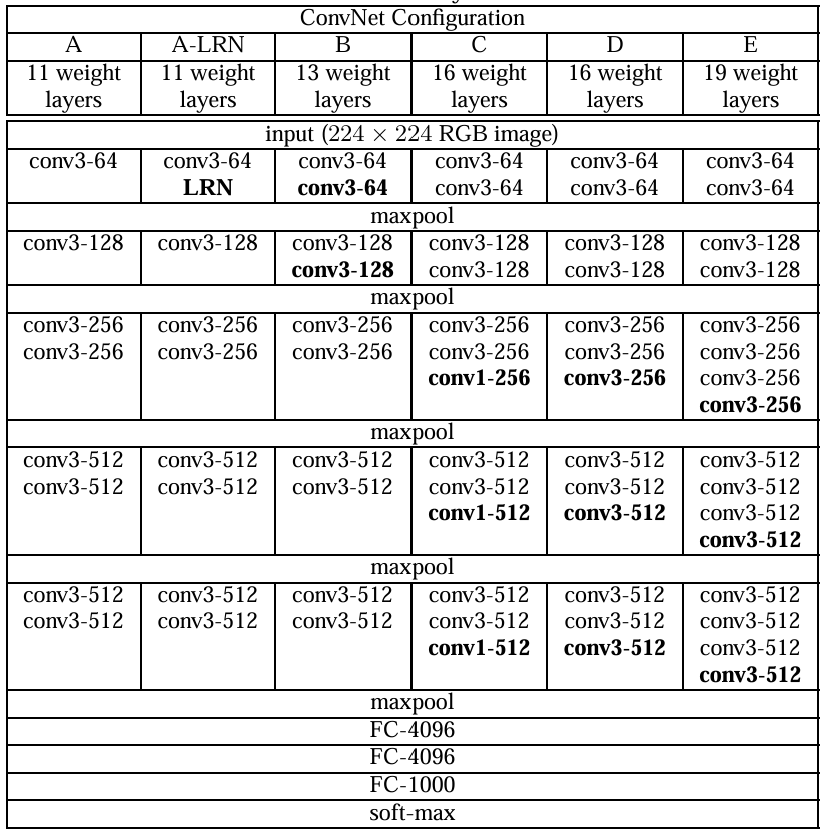
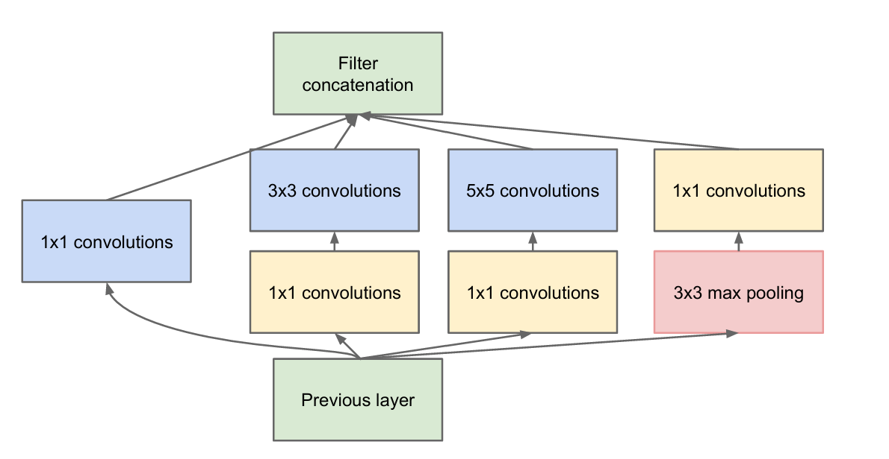
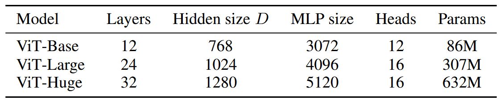
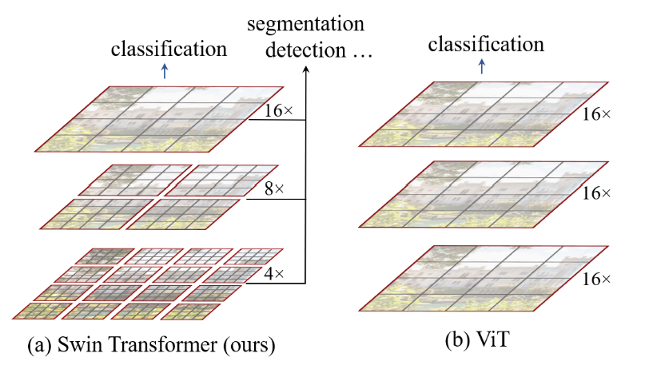
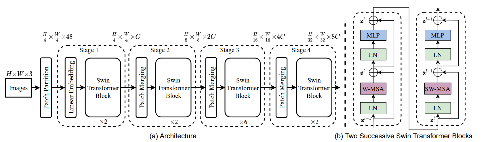
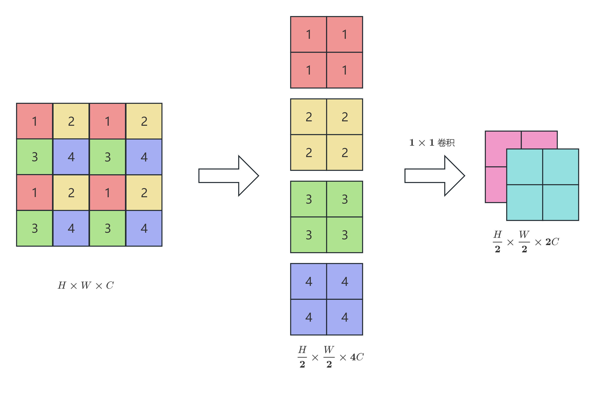
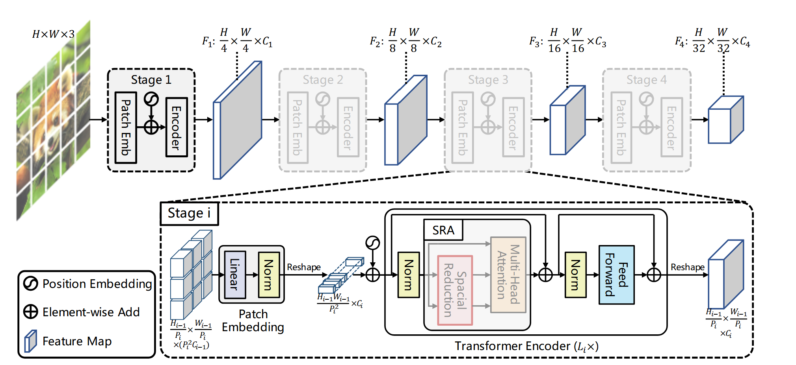
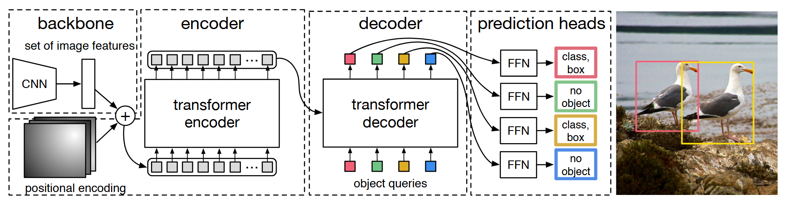
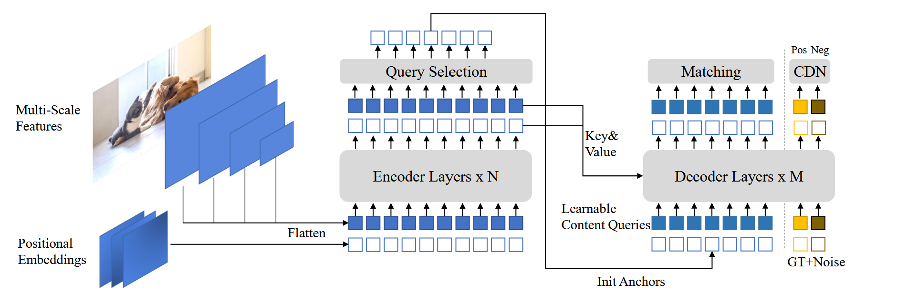

> 由于课内关于CNN的内容大多在机器学习方法（以及人工智能导论）中已经提及，因此经过笔者的考虑，决定在课堂内容的基础上拓展一些计算机视觉的内容，包括视觉Transformer，目标检测应用等（这也是笔者正在做的一个科研项目）。

# 卷积神经网络
> CNN基本概念请见[机器学习方法 Ch.4 卷积神经网络](/posts/computer-science/machine-learning/%E6%9C%BA%E5%99%A8%E5%AD%A6%E4%B9%A0%E6%96%B9%E6%B3%95-ch4-%E5%8D%B7%E7%A7%AF%E7%A5%9E%E7%BB%8F%E7%BD%91%E7%BB%9C/)，此处不再赘述。

在处理图像任务时，为何不直接使用全连接神经网络？答案很简单：参数太多，且无法有效提取图像局部特征（没有考虑像素间的位置关系）。
+ 那么如何进行局部特征提取呢？这里就用到了卷积这一方法。卷积核又称“滤镜”，它像一把刷子一样刷过原始图片，得到一张新的图片。
+ 不同的卷积核可以提取图片的不同特征，如轮廓，明暗程度，色彩，不同走向的线条等。当有了足够多的卷积核，图片就能够被多个提出来的特征所代表。

卷积神经网络的两大特性（~甚至就是统计机器学习的期末考题……~）：
1. 局部链接：卷积层中每一个矩阵元素仅与原始图像矩阵中的部分元素有关系
2. 权值共享：卷积层中每一个矩阵用的是同一个卷积核

池化层的作用：减小图像分辨率，减少估计的参数（特别是后续全连接层里的）

卷积层的一般形态：
+ 输入矩阵大小：$A\times B$
+ 卷积核大小：$f \times g$
+ 填充（padding）：$[p_1, p_2]$（水平方向左右各加$p_1$个$0$，垂直方向上下各加$p_2$个$0$） 
+ 步长（strides）：$[s_1, s_2]$
+ 输出矩阵：$\left(\dfrac{ A + 2 \times p_1 - f}{s_1} +1 \right) \times\left(\dfrac{B + 2 \times p_2 - g }{s_2}+1\right)$【默认可以整除】
+ 卷积的三种常见模式：
    1. valid 卷积：$p_1=p_2=0$
        + 不做 padding，就在矩阵范围内做卷积
        + 输出为$(A-f+1)\times(B-g+1)$（若$s_1=s_2=1$）
    2. full 卷积：$p_1=f-1,p_2=g-1$
        + 让卷积核遍历所有可能的位置（只要卷积核和输入矩阵有至少一个位置重叠）
        + 输出为$(A+f-1)\times(B+g-1)$（若$s_1=s_2=1$）
    3. same 卷积：$p_1=\dfrac{f-s_1}{2},p_2=\dfrac{g-s_2}{2}$
        + 输出为$\dfrac{A}{s_1}\times\dfrac{B}{s_2}$（若$s_1=s_2=1$则输出矩阵与输入矩阵维度相同）

一般的卷积神经网络会将一张窄通道（如RGB三通道）的图像转化为宽通道的小图像，最终拉直为一个向量经过全连接前馈神经网络。

关于多通道卷积：
+ 使用的每个卷积核通道数与输入通道数相同，卷积核的数量与输出通道数相同
+ 卷积核的每个通道矩阵与对应通道的输入矩阵做卷积，在将每个通道得到的结果相加

## 典型CNN
在[机器学习方法 Ch.4 卷积神经网络](/posts/computer-science/machine-learning/%E6%9C%BA%E5%99%A8%E5%AD%A6%E4%B9%A0%E6%96%B9%E6%B3%95-ch4-%E5%8D%B7%E7%A7%AF%E7%A5%9E%E7%BB%8F%E7%BD%91%E7%BB%9C/)中，我们介绍了LeNet-5和AlexNet两种卷积神经网络。下面我们再简单介绍另外两种卷积神经网络——VGGNet（[论文链接](https://arxiv.org/abs/1409.1556)）与GoogLeNet（[论文链接](https://arxiv.org/abs/1409.4842)）。它们分别是2014年ImageNet目标定位与图像识别的冠军。

VGGNet继承了AlexNet的设计，但是做了更多的优化： 
+ 更深的网络，常用的有16层和19层，取得良好性能；
+ 更简单，仅仅使用了$3\times 3$卷积核以及$2\times 2$最大池化，探索了深度与性能之间的关系。
+ VGGNet的某些模型也用到了$1\times 1$卷积核（其具体作用下面会介绍）。
+ 采用多块GPU并行训练。
+ 由于效果不明显，放弃了Local Response Normalization的使用。

VGGNet的模型架构如下图所示：
___
GoogLeNet相比VGGNet的主要创新包括两个方面：
1. 引入Inception模块，结构如下：
    可以看到模块的关键在于使用了$1\times 1$卷积核，其作用是对输入数据进行降维（减小通道数），同时能够增加模型的非线性表达能力。
2. 引入了批量归一化 Batch Normalization（准确而言是在Inception V2版本中首次引入）。其本质是在激活函数之前（或之后）对输入进行是将数据的分布进行标准化。具体方法如下（用于训练阶段）：
    1. 记一个 Mini Batch 中 $\mathbf{z}$ 的取值为 $\{z^{(1)}, \cdots, z^{(m)}\}$，其中 $m$ 为 batch size。
    2. 计算均值 $\mu = \displaystyle\frac1m\sum_{i=1}^m z^{(i)}$ 和方差 $\sigma^2 = \dfrac1m(z^{(i)} - \mu)^2$。
    3. 批归一化操作：$z_{norm}^{(i)} = \dfrac{z^{(i)} - \mu}{\sqrt{\sigma^2 + \epsilon}}$，其中 $\epsilon$ 是一个很小的给定正常数，仅仅是为了防止分母为0。
    4. 线性变化得到 $\tilde{z}^{(i)} = BN(z^{(i)}) = \beta + \gamma z_{norm}^{(i)}$，其中 $\beta$ 和 $\gamma$ 是两个待估计的参数。

    对于每个进行了 BN 操作的神经元，增加了4个参数（$\mu$，$\sigma^2$，$\beta$ 和 $\gamma$），但其中只有2个（$\beta$ 和 $\gamma$）需要从训练中得到。
    + 在卷积神经网络中，BN 同样采用权值共享（指同一通道的不同神经元使用一套$\beta,\gamma$）
    + 在测试阶段，一次可能只预测一个样本，此时如何计算 BN 均值和方差？主要的两种方案如下：
        1. 网络训练完成之后，基于全部的训练数据，计算一遍网络神经元的值，得到均值和方差的估计。
        2. 在进行训练时，每个 Mini Batch 下计算得到的均值和方差都记录下来，利用它们的指数加权平均值作为测试时的均值和方差。
# 视觉Transformer（ViT）
> 关于Transformer的基本概念可见[自然语言处理 Ch.7](/posts/computer-science/nlp/自然语言处理-ch7-transformer与llm/#transformer与预训练)以及[人工智能导论](https://souyerin.netlify.app/posts/computer-science/introduction-to-ai/%E4%BA%BA%E5%B7%A5%E6%99%BA%E8%83%BD%E5%AF%BC%E8%AE%BA-ch8-%E5%A4%A7%E8%AF%AD%E8%A8%80%E6%A8%A1%E5%9E%8B/)中已有所涉及，此处不再赘述。（实际上人工智能导论已经涉及到一丢丢的ViT，见[多模态LLM](https://souyerin.netlify.app/posts/computer-science/introduction-to-ai/%E4%BA%BA%E5%B7%A5%E6%99%BA%E8%83%BD%E5%AF%BC%E8%AE%BA-ch9-%E5%A4%9A%E6%A8%A1%E6%80%81%E5%A4%A7%E8%AF%AD%E8%A8%80%E6%A8%A1%E5%9E%8B/#%E5%A4%9A%E6%A8%A1%E6%80%81%E5%A4%A7%E6%A8%A1%E5%9E%8B%E7%9A%84%E5%9F%BA%E7%A1%80%E8%A7%86%E8%A7%89%E7%BC%96%E7%A0%81%E5%99%A8vision-transformer-vit)）

虽然Google的这篇[ViT论文](https://arxiv.org/abs/2010.11929)并不是第一个将Transformer应用于视觉任务的，但因为其模型简单且可扩展性强，从而成为CV领域的一大里程碑著作。下面我们就对这篇论文中的内容进行简单分析：
+ 这篇论文提出的一大核心结论是：当拥有足够多的数据进行预训练的时候，ViT的表现就会超过CNN，突破Transformer缺少归纳偏置的限制，且可以在下游任务中获得较好的迁移效果。
    + 这里的归纳偏置概念源于[机器学习](https://souyerin.netlify.app/posts/computer-science/introduction-to-ai/%E4%BA%BA%E5%B7%A5%E6%99%BA%E8%83%BD%E5%AF%BC%E8%AE%BA-ch5-%E6%9C%BA%E5%99%A8%E5%AD%A6%E4%B9%A0%E4%B8%8A/#%E6%9C%BA%E5%99%A8%E5%AD%A6%E4%B9%A0%E7%9A%84%E6%A0%B8%E5%BF%83%E5%BD%92%E7%BA%B3%E5%81%8F%E7%BD%AEinductive-bias%E6%88%96%E7%A7%B0%E4%B8%BA%E5%BD%92%E7%BA%B3%E6%80%A7%E5%81%8F%E5%A5%BD)，可以理解为一种先验假设。在CNN中有两个归纳偏置：局部性（图片上相邻的区域具有相似的特征）与平移等变性（输入平移与输出特征图平移同步）
+ 具体而言，ViT将图片划分为$16\times 16$的patch，再将每个patch投影为固定长度的向量送入Transformer（编码器部分，与Transformer原始论文中完全一致）。下面以ViT-B/16为例（也是ViT最经典的架构）：
    + 设图片大小为$224\times 224$，则patch个数即为$196$，每个patch的维度为$16\times 16\times 3=768$。然后patch向量会进入线性映射层，其权重矩阵$E\in\R^{768\times D}$（在ViT-B/16中$D=768$），然后再加上一个`[cls]`分类标记token，最终得到长度为$197$的token序列，每个token的维度为$768$。
    + 经过Tranformer块后，`[cls]`对应的输出会作为编码器的最终输出。【这其实受到了BERT的启发，可见[自然语言处理 Ch.8](/posts/computer-science/nlp/自然语言处理-ch8-bert/#双向编码器训练)】当然也可以选择不设置`[cls]`标记，直接对序列token输出取平均。
    + 关于位置编码，实验表明位置编码的选择对模型的性能影响并不很大，可能是因为image patch本身已经包含了一定的位置信息。
    > btw，这里输入图片尺寸大小其实是ImageNet分类任务下研究者不约而同确定的一个标准，自AlexNet以来几乎所有的ImageNet CV模型都采用这一尺寸。
+ ViT论文中使用的模型参数如下：
+ 实际上，这篇论文也探索了用卷积取代线性映射（即CNN+Transformer）方案，虽然并没有深入，但后续研究表明这种方案可以使ViT在较小规模数据集上性能更好。
> Google的ViT研究团队在之后又提出了MLP-Mixer模型，完全舍弃了CNN和注意力机制，只基于原始的多层感知机进行改造，这里笔者决定不详细展开。  
> 另外，2020年另一篇论文在ViT的基础上提出了能够高效利用数据的DeiT模型，其可以在ImageNet上达到能与CNN相抗衡的水平。这里也不详细展开。
## ViT经典变体
虽然ViT本身结构简单且效果很好，但其仍然存在下述问题：
+ 相比传统CNN（如ResNet）而言，其需要的数据量非常大，实验成本较高；
+ Patch大小固定导致特征图分辨率固定，缺乏对多尺度物体的建模能力；
+ Transformer架构本身的不足（如平方级别的注意力计算）等。

因此后续的研究提出了不少ViT的变体，下面对其中影响力较大的两个变体进行介绍：
1. Swin transformer  
    由Microsoft团队于2021年提出，其主要贡献在于将CNN的层级化设计与Transformer进行融合。
    Swin Transformer与ViT的主要区别如下图所示：
    由此可见，Swin Transformer将图像预先分割为若干个小窗口（每个窗口大小给定且一致），而注意力的计算就在窗口内进行。【这样计算复杂度就降到$O(N)$，$N$为图像大小】  
    + 当然，为了让窗口间也能进行注意力交互计算，模型使用了一种称为“滑动窗口”（Shifting Windows）的方法（这也是Swin名称的来源），通过移动窗口位置实现注意力跨窗口计算。【变相实现全局注意力】
    + Swin Transformer的模型架构如下图所示：
        可以看到，与ViT类似，Swin Transformer首先将图像分割为$4\times 4$的patch（这样输出通道变为$4\times 4\times 3=48$），然后它借鉴了CNN的池化层思想，使用了Patch Merging方法逐步提取特征。其具体步骤如图所示：
        如果初始图像大小为$224\times 224\times 3$，那么经过四个Stage后得到的输出维度就变为$7\times 7\times 768$。
    + 而在Transformer Block中，输入（二维）Token被分割为大小$M\times M$的小窗口（论文中$M=7$），然后在小窗口中计算自注意力。具体而言，如上面(b)图所示，其先经过一个窗口多头自注意力Transformer块，再经过一个滑动窗口多头自注意力Transformer块，这样就实现近似全局自注意力的效果。
    > 当然，论文里为提高计算性能，还使用了窗口移动划分方法与masked方法，这里就不详细展开了。
2. PVT（Pyramid Vision Trasformer）  
    同样在2021年提出（比Swin稍早一些，一作还是国人！）。顾名思义，其将CNN及目标检测（下面会详细介绍）中的特征金字塔架构引入Transformer中，思路与Swin Transformer的Patch merging比较类似（都是逐级降低特征图分辨率）。具体架构图如下：
    而与Swin Transformer的滑动窗口不同，PVT在Transformer块中引入空间降维注意力（SRA）模块，对键和值向量进行降维，以达到降低注意力计算复杂度的目的。
# 目标检测模型
可以说，目标检测是除去图像分类外计算机视觉中最重要的一项任务。它可以看作图像分类的延伸：在识别出物体的同时，标记出物体的位置。目标检测技术的发展历史大致如下：
1. 2013年前：手工特征提取  
    在深度学习兴起之前，传统的目标检测使用的一般是机器学习方法（如SVM、AdaBoost等），其核心在于滑动窗口得到候选区域，在进行特征提取。
    + 这一时期典型的特征提取方法包括Haar特征、HOG（梯度直方图）特征等，直到2008年的DPM（可变组件模型）达到巅峰。
2. 2013~2015年：深度学习两阶段检测  
    神经网络在计算机视觉任务上的优异表现使得目标检测开始全面转向深度学习模型。在这一时期的目标检测模型代表就是R-CNN（区域CNN）及其各种变体。
    + R-CNN（及后续变体，如Fast R-CNN、Faster R-CNN）使用的是两阶段检测方法：先生成候选区域，再对候选区域进行目标分类与位置回归。
    + 原始的R-CNN采用启发式搜索（selective search）得到候选锚框，并使用线性SVM作为分类器；Fast R-CNN在R-CNN的基础上引入RoI（Region of Interest）池化层对锚框生成固定长度的特征，并将分类输出改为直接从CNN的Softmax分类层输出；Faster R-CNN则进一步引入区域提议网络（Region Proposal Network）替代启发式搜索以得到更好的锚框。
3. 2016~2017年：单阶段检测&多尺度特征融合  
    这一时期的模型代表是YOLO，SSD与FPN，现代的目标检测架构范式在这一阶段基本建立。其中一个最重要的基础架构就是Backbone + Neck + Head 架构，具体如下：
    + Backbone：之前主要用于图像分类的网络（以VGGNet、ResNet等CNN为代表），负责提取图像特征；【这一部分在ResNet后直到Swin Transformer之前都没有明显演进】
    + Head：也称Detection Head，负责从特征中检测目标的位置与类别；
    + Neck：由FPN（Feature Pyramid Networks，特征金字塔）结构首次构建，其作用是在不同大小特征图上提取不同尺度的信息，并进行融合。这样可以让backbone提取出的信息可以被更充分地利用，从而让检测器可以更好应对多尺度的情形。
        + 除了FPN之外，Neck部分的代表模型还有ASPP（空洞空间金字塔池化）、SAM（空间注意力模块）等。  
    
    实际上，上述架构也是迁移学习的一个典型范例（将图像分类的成果迁移到目标检测中）
4. 2018~2019年：去锚框检测   
    这一阶段以CornerNet、CenterNet、FCOS为代表，尝试突破锚框检测这一框架，之后被YOLO v6等模型吸收沿用。
5. 2020年至今：Transformer与端到端检测   
    从DETR模型开始（甚至比ViT更早），目标检测就逐渐开始将Transformer作为Backbone。这一阶段的模型同样去掉了锚框，同时也摒弃了候选区域、RoI Pooling、NMS等手工设计，将目标检测直接建模为一个集合预测问题。

总体来看，目前的目标检测的研究主要分为两个方向：追求极致速度与效率的即时检测（如YOLO系列，仍以CNN为骨干）和追求高精度与复杂场景的检测（如DETR系列，大多以Transformer为骨干）【当然，也不乏对两个方向的融合研究】

下面我们就对DETR和其变体代表DINO进行介绍：
## DETR
DETR，即Detection Transformer，于2020年由Facebook AI团队提出，其基本架构图如下：
由这张图可以直观地看到，DETR先用卷积神经网络提取图像特征（集合），将其展平为向量后送入Transformer编码器。经过编码后在解码器使用目标查询（object queries，可学习）进行自注意力交互，最终输出固定数量的预测框。
> 注：DETR论文中强调了预测框输出是同时产生的，而不是传统Transformer里通过自回归逐个产生。
+ 那么，既然由解码器输出的预测框数量是固定的，如何计算它与真实目标框的偏差损失呢？这里就用到了一种称为二分图匹配（bipartile matching）的方法，最终只对匹配到真实目标框的预测框计算损失（其他框标记为no object）。
    + 具体而言，二分图匹配分别计算每个预测框与真实框的损失函数（得到损失矩阵），然后使用匈牙利算法进行匹配。这里的损失函数包括分类是否准确与预测框的偏差。
+ 那推理的时候DETR又是怎么做的呢？实际上，只需要将最后的二分图匹配损失计算改为对输出预测框进行置信度筛选即可。
+ 当然，原始的DETR对识别小物体目标还不太准确，而且训练较慢。不过仅仅半年后，Deformable DETR就解决了这两个问题。【这里不详细展开】
### DINO
> 注意，这里的DINO指的是[DETR with Improved DeNoising Anchor Boxes](https://arxiv.org/abs/2203.03605)这篇论文里的模型，而不是Meta的DINO系列（虽然后者也是CV相关的，而且名气似乎更大些）。

DINO的基本架构图如下：
它实际上是综合了Deformable DETR以及作者团队之前的两篇论文（DAB-DETR和DN-DETR）的成果。其与DETR的主要差别如下：
1. DETR的解码器位置与目标查询都是随机初始化，而DINO从编码器输出上选取top-K特征用于初始化位置查询。
2. 在检测框的迭代（由Deformable DETR首次提出）上，DINO改进为LFT（向前看两次）机制，以此提升早期预测质量。
3. DINO训练时在二分图匹配的基础上引入对比去噪训练，即增加一组正/负去噪查询，进一步提升小目标检测效果.。
## 数据集
最后，我们简单对目标检测使用的数据集以及模型评估指标进行介绍：
1. MS COCO数据集（[官网](https://cocodataset.org/#home)）   
    于2014年由Microsoft团队发布，其中COCO全称为Common Objects in Context。与ImageNet数据集中图像内物体往往大而居中不同，COCO数据集里的图像更接近真实场景——背景更杂乱，目标更多，适用的任务也更多样（除了目标检测外，还有实体分割、图像描述等）
    + 数据集共有约33万张图像，其中有标注的图像超过20万张（包含150万个目标实例）
    + 包括80个物体类别以及91个stuff类别。两种类别的区别在于前者表示有明确边界的可数物体（如动物，车辆等），而后者表示边界较模糊的不可数物体（如天空，草地等）。目标检测任务一般只考虑前者类别。
    > 在MS COCO出现之前（2005~2012年左右），目标检测一般会使用PASCAL VOC数据集，其基本确立了目标检测的模型效果检验范式。
2. PANDA数据集   
    于2020年由清华大学团队发布，全称为gigaPixel-level humANcentric viDeo dAtaset（十亿像素级人类中心视频数据集）。它的目标主要是针对大场景、长时间下以人为中心的目标检测与识别。【用于理解大规模人群交互行为】
    + 数据集由普通PANDA图像和PANDA-Crowd图像组成。前者包含555张图片，每张图片的平均人数为201.4人（总目标人数超过10万人）；后者包含45张图片，每张图片平均人数达到2713.8人（极端拥挤场景）。

### 评估指标
在介绍评估指标之前，首先定义IoU（Intersection over Union，交并比）：其表示预测框与真实框重叠部分面积与合并后总面积之比。目标检测的判定规则一般为：
1. 对每个真实框，找到与它 IoU 最高的预测框；
2. 如果这个 IoU 大于某个阈值，就认为这个预测是真正例（TP），否则就是假正例（FP）；
3. 没被任何预测框匹配上的真实框，就是假负例（FN）。
+ 目标检测数据集使用的评估指标一般如下：

|指标|定义|
|:--:|:---:|
|$\text{AP}$|在指定IoU阈值下计算精确率-召回率曲线下面积（如$\text{AP}_{50}$表示IoU阈值取0.5时的$\text{AP}$）|
|$\text{AR}$|在指定IoU阈值集合（如0.5到0.95，步长0.05）下召回率的平均值|
|$\text{AP}_s,\text{AP}_m,\text{AP}_l$|模型在处理小、中、大尺寸目标物体时的$\text{AP}$|

+ 当然，对于复杂的目标检测模型，还会使用GFLOPs（Giga Floating Point Operations Per Second，每秒处理十亿浮点运算次数）衡量模型的性能。
    + 一般而言，在模型预测准确度（可用上述指标衡量）基本一致的条件下，GFLOPs越低，模型越轻量，训练成本越低。