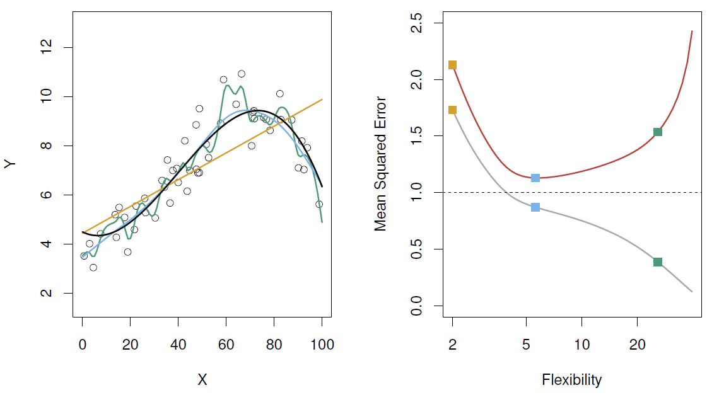
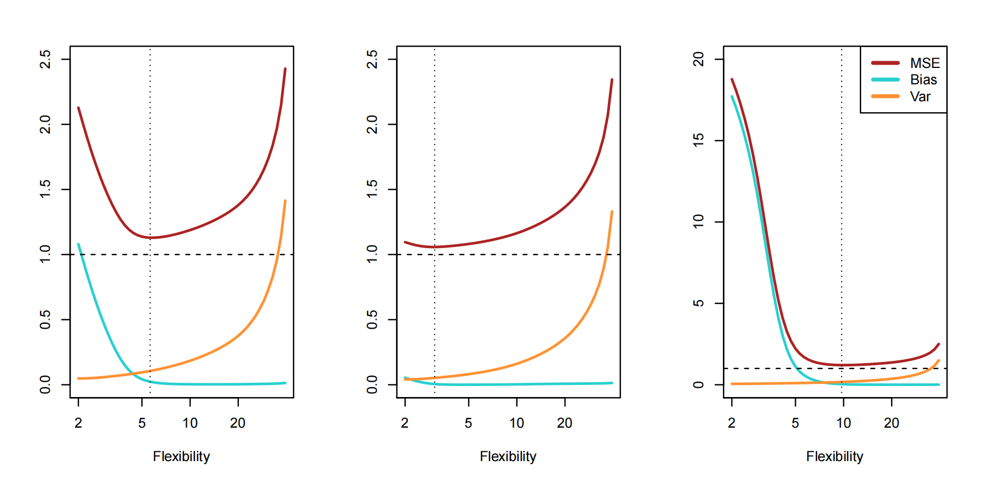

> 本系列笔记前期基于课内《统计机器学习》课程撰写，后期基于李航[《机器学习方法（第二版）》](https://www.tup.tsinghua.edu.cn/booksCenter/BOOK_10948801.html)及其他资料（如[机器学习白板推导](https://www.bilibili.com/video/BV17ZmWBmETP/)、[西瓜书](https://jingyuexing.github.io/Ebook/Machine_Learning/%E6%9C%BA%E5%99%A8%E5%AD%A6%E4%B9%A0_%E5%91%A8%E5%BF%97%E5%8D%8E.pdf)、[ESL](https://www.sas.upenn.edu/~fdiebold/NoHesitations/BookAdvanced.pdf)等）进行补充。  
Q：深度学习与强化学习部分是否会纳入计划？  
A：除了课内涉及的部分，其他暂无计划。   
Q：之前[人工智能导论](https://souyerin.pages.dev/categories/%E4%BA%BA%E5%B7%A5%E6%99%BA%E8%83%BD%E5%AF%BC%E8%AE%BA/)系列笔记不是已经有机器学习的内容了吗？为什么还要再记一遍？  
A：当时的笔记完全是囫囵吞枣，蜻蜓点水，纯粹是为了应付考试~~很多都是直接抄的PPT~~。这次我想从机器学习的数学底层开始，尝试梳理完整的ML体系。（这也是为什么我选择李航的书作为主要参考）  
当然，人工智能导论的笔记也并非一无是处，它就像测试集一样，给学习后的笔者提供知识检验的参照。

# Introduction（统计机器学习）
## 什么是机器学习？
+ 人工智能先驱Arthur Samuel在1959年定义：机器学习是计算机不通过显著式编程完成指定任务（如识别、分类、预测等）。
    + 这说明机器学习程序设计的目标不是满足特例，而是学习某种通用的规律或模式。
+ “机器学习之父”Tom Mitchell在1997年出版的《Machine Learning》中的定义：对于任务$T$，机器的表现用指标$P$衡量，机器从已有经验$E$中学习（训练），使其在$T$上的表现$P$变好。
    + 这样就将机器学习转化为一个最优化问题。
### 机器学习的分类
+ 按学习范式：
    1. 监督学习：经验$E$数据由人收集并输入计算机。
        + 包括传统监督学习（训练数据有标签）和无监督学习（训练数据都没有标签），也有半监督学习（部分数据有标签）。
    2. 强化学习：经验$E$由计算机与环境交互得到。
+ 按数据标签属性：
    + 分类（离散标签）与回归（连续标签）
### 机器学习算法的一般过程
+ 特征提取$\Longrightarrow$特征选择$\Longrightarrow$不同算法对特征空间进行划分（模型+学习准则+优化算法）$\Longrightarrow$比较不同算法的效果（$\Longrightarrow$开发新算法以适应场景）
+ 无免费午餐定理（No free lunch Theorem）：没有在任何情况下都最优的机器学习算法。（基本都受先验知识的影响）
## 统计学习与机器学习
+ 统计学习强调模型的**可解释性**与不确定性；机器学习则强调模型预测的**准确性**。但二者界限不断模糊，互相启发【后续笔记不会特意区分二者，可能混用】
+ 统计学习的目标：**预测**与**推断**
    + 预测（Prediction）：基于现有数据预测未来的结果。
        + 以回归为例：机器学习的目标是让学习函数的预测尽量准确，但实际的模型输出会存在**误差**，表示为：$y=f(x)+\epsilon$。
        + 误差产生的原因：
            1. 模型本身无法捕捉数据中的规律（不够复杂）
            2. 数据中的噪声和不确定性
            3. 有些影响结果的因素可能没有在模型中体现（不作为数据输入），例如政治、经济等因素
    + 推断（Inference）：理解数据背后的生成过程与因果关系。
### 参数模型
+ 以线性模型为例：$\hat{y}=\beta_0+\beta_1x_1+\cdots+\beta_px_p+\epsilon$（$x_1,\cdots,x_p$为预测变量【特征或输入】，$\hat{y}$为响应变量【输出】）
+ 模型自由度低，但可解释性强（$\beta_i(1\leq i\leq p)$表示$x_i$变化一个单位导致$y$变化的程度）
+ **模型目标**：找到$\beta_0,\cdots,\beta_p$使预测值$\hat{y}$尽量接近真实值$y$。
    + **学习准则**：$\displaystyle\min_{w,b}\sum_{i=1}^n(y_i-w\mathbf{x}_i-\beta_0)^2$（最小二乘）
    + **优化算法**：求导取零点（凸优化）
+ 如果最优参数误差仍然较大，则考虑更换更复杂的模型（如二次函数，高阶函数等）；
    + 一般情况下，模型越复杂，灵活性越高，可解释性越差，越可能导致过拟合（拟合了噪声，而非数据的真实规律）；
### 非参数模型
+ 以K近邻（KNN）算法为例：$\hat{y}=\mathrm{avg}(Y|X\in N(x))$（$N(x)$表示离$x$最近的$k$个邻居）
    + 适用于$x$维度较低，样本量较大的数据。
    + 当$x$维度变高，邻近距离会变大——导致**维度灾难**（模型复杂度上升，性能下降）
+ 非参数模型相比参数模型自由度更高，但泛化能力往往较弱，可解释性较差，训练数据量要求高。
## 模型表现评估
### 回归模型
+ **训练均方误差**（Training MSE）：$\mathrm{MSE}_{\mathrm{Tr}}\mathrm{Avg}_{i\in\mathrm{Tr}}[y_i-\hat{f}(x_i)]$；
    + 当训练均方误差较大时，称数据出现**欠拟合（Underfitting）**。
+ **测试均方误差**（Testing MSE）：$\mathrm{MSE}_{\mathrm{Te}}\mathrm{Avg}_{i\in\mathrm{Te}}[y_i-\hat{f}(x_i)]$；
    + 当训练均方误差较小，而测试均方误差较大时，称数据出现**过拟合（Overfitting）**。
+ 示例图如下：
    + 右图中灰线表示训练均方误差，红线表示测试均方误差。随着模型灵活性增加，我们观察到训练均方误差单调递减，测试均方误差呈U形。
    + 由此可见，当自由度较低时，模型往往会欠拟合，而自由度过高时，模型往往会过拟合。
+ **泛化能力**：机器学习模型对新数据的适应能力或推广能力。
    + 一个具有良好泛化能力的模型能够在未见过的数据上表现良好，而不仅仅是在训练数据上表现良好。
+ **Bias-Variance Trade-off**（偏差-方差权衡）
    + 对于给定的测试样本$x_0$，其测试均方误差可分解为：
        $$
        \begin{aligned}
        E \left( y_0 - \hat{f}(x_0) \right)^2 &=E \left( y_0 - E\hat{f}(x_0) \right)^2 + E \left(\hat{f}(x_0)-E\hat{f}(x_0)\right)^2+E(\epsilon^2)\\
        &=\left[\operatorname{Bias}(\hat{f}(x_0))\right]^2 +\operatorname{Var}(\hat{f}(x_0))+ \operatorname{Var}(\epsilon)
        \end{aligned}
        $$
    + 其中：
        + **偏差**（Bias）为预测期望值（平均表现）与实际值（目标）之差；
        + **方差**（Variance）为预测值与其期望的偏离程度（内部方差），与模型对数据的敏感度有关。
        + $\mathrm{Var}(\epsilon)$为无法消去的系统误差。
    + 二者与模型自由度（复杂度）的关系如图（对应不同数据分布）：
        + 一般情况下，当模型复杂度较低时，偏差较高，方差较低；模型复杂度较高时，偏差较低，方差较高。
### 分类模型
1. 参数模型
    + 以**逻辑回归**（Logit Regression）为例：
    $$
    \begin{aligned}
    P(y=1|x)&=\sigma(wx+b)\\
    \sigma(z)&=\frac{1}{1+e^{-z}}
    \end{aligned}
    $$
    + 分类方法：当预测概率大于$0.5$，则分为$y=1$，否则分为$y=0$。
    + 目标：最小化损失函数（交叉熵损失）
        $$
        L(w,b)=-\frac{1}{N}\sum_{i=1}^N\left[y_i\log(\hat{y}_i)+(1-y_i)\log(1-\hat{y}_i)\right]
        $$
    + 学习准则：梯度下降法更新$w$和$b$
2. 非参数模型：
    + KNN：当$\dfrac{1}{K}$变大时，模型自由度高，训练均方误差降低（$K=1$时为$0$），测试均方误差成U形。
    + 一个好的分类器需要让测试均方误差最小，
    + 理论最优的分类器是**贝叶斯分类器**（Bayes Classifier）：
        + 类别集合：$G = \{g_1, g_2, ..., g_k\}$
        + 分类器预测：$\hat{G}(x)$
        + 预测损失：$L(g_k, g)$ 表示预测 $g$，真实标签是 $g_k$ 的损失
            + 最简单的损失是0-1损失：$L(g_k, g) =\begin{cases}0, & g = g_k \\1, & g \neq g_k \end{cases}$
        + 最小化：$E\left[L(g_k, \hat{G}(x))\right]$
            + 即最小化：$\displaystyle\sum_{j=1}^{k} L(g_j, \hat{G}(x)) P(g_j | X = x)$
            + 即：$\displaystyle\hat{G}(x) = \arg \min_{g} \sum_{j=1}^{k} L(g_j, g) P(g_j | X = x)$
        > 然而后验概率$P(g_j | X = x)$不容易求（需要知道数据的联合分布或似然+先验概率），故这个分类器无法直接实现。
+ 准确率：单独用准确率判断模型的好坏是没有意义的（尤其是当不同标签数据量差异较大时）。
+ 为此，我们引入**混淆矩阵**（Confusion Matrix）的概念：
### 混淆矩阵
+ 其具体形式如下：
    | 真实\预测 | 正样本 | 负样本 |
    | :--- | :--- | :--- |
    | **正样本** | True Positive（$TP$） | False Negative（$FN$） |
    | **负样本** | False Positive（$FP$） | True Negative（$TN$） |
+ 满足条件：$TP+FN=1,FP+TN=1$；对于同一个分类器，$TP$与$FP$正相关。
+ 准确率计算：$\displaystyle\mathrm{Accuracy}=\frac{TP+TN}{TP+TN+FP+FN}$
+ 分类目标：$TP$尽量大，$FP$尽量小。
### ROC曲线
+ 是一条横坐标$FP$，纵坐标$TP$的曲线，表示不同参数/分类准则下，$TP$和$FP$的关系。
    + 参考图如下：
+ 判断曲线的好坏：使用**AUC**（Area Under Curve）
    + 定义：ROC曲线下与坐标轴围成的面积。（越大越好）
+ 选择合适的参数/分类准则：使用**EER**（Equal Error Rate）
    + 定义：两类错误$FP$和$FN$相等时候的错误率，可以直观的表示系统性能。（越小越好）
    + 可在$FP-TP$图中从左上角到右下角画一条直线，与曲线的交点坐标即为EER。
### 交叉验证
+ 用于确定模型超参数（基于Test Error衡量）
+ 基本方法：将数据集随机分为两部分，一部分用于训练，一部分用于验证。
    + 存在的问题：随机分配样本有一定的波动性（不稳定），且对数据量有要求。
+ 解决方案：使用K-fold交叉验证，即将数据均分为$K$份，其中$K-1$份用于训练，剩下$1$份用于验证。
    + 总共循环$K$次，保证每份数据均被用于验证。
    + 当$K=n$（样本量）时称为留一法交叉验证（LOOCV），其估计效果不一定优于K-fold（$K$一般取$5$或$10$）