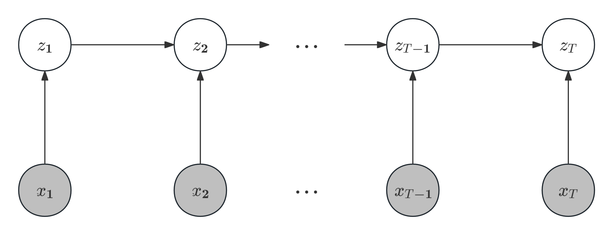

> 在[随机过程Cheat Sheet](https://souyerin.netlify.app/posts/mathematics/随机过程-cheat-sheet/#隐马氏链)中已经简单阐述了隐马尔可夫模型的基本概念，下面我们将对此进行扩充与完善。
# 隐马尔可夫模型
## 基本概念
+ 隐马尔可夫模型（hidden Markov model, HMM）是关于序列数据的含有隐变量的概率模型，也是概率生成模型，可以用概率图模型表示：
    
+ 下面对模型符号进行约定：
    1. 设所有可能的状态的集合为$\mathcal{S}$，所有可能的观测的集合为$\mathcal{O}$，且有
        $$
        \mathcal{S}=\{s_1,s_2,\cdots,s_I\},\quad\mathcal{O}=\{o_1,o_2,\cdots,o_K\}
        $$
    2. 设$\mathbf{z}$是长度为$T$的状态序列，$\mathbf{x}$是对应的观测序列：
        $$
        \mathbf{z}=z_1z_2\cdots z_T,\quad \mathbf{x}=x_1x_2\cdots x_T
        $$
        则隐马尔科夫模型可写作
        $$
        P_\lambda(\mathbf{x})=\sum_{\mathbf{z}}P_\lambda(\mathbf{z})P_\lambda(\mathbf{x}|\mathbf{z})
        $$
        其中$\lambda$为模型参数。
    3. 模型参数由马尔可夫链的初始状态概率分布、状态转移概率分布以及观测发射概率分布组成：
        + 状态转移分布由概率矩阵$A=(a_{ij})_{I\times I}$表示，其中
            $$
            a_{ij}=P(z_{t+1}=s_j|z_t=s_i),\quad i,j\in\{1,2,\cdots,I\},\quad t=1,2,\cdots,T-1
            $$
        + 观测发射分布由概率矩阵$B = (b_{ik})_{I \times K}$表示，其中，
            $$
            b_{ik} = P(x_t = o_k | z_t = s_i), \quad k = 1, 2, \cdots, K, \quad i = 1, 2, \cdots, I,\quad t = 1, 2, \cdots, T
            $$
        + 初始状态分布由概率向量$\pi = (\pi_i)$表示，其中
            $$
            \pi_i = P(z_1 = s_i), \quad i = 1, 2, \cdots, I
            $$
            是在时刻$t = 1$处于状态$s_i$的概率。
        
        综上，模型参数整体可写作$\lambda=(A,B,\pi)$。
+ 隐马尔可夫模型的三大假设：
    1. 马尔可夫性：$P(z_t|z_1z_2\cdots z_{t-1})=P(z_t|z_{t-1}),\quad t=1,2,\cdots,T$
    2. 观测独立性：$P(x_t|\mathbf{z},\mathbf{x}_{-t})=P(x_t|z_t)$（$\mathbf{x}_{-t}$表示除$t$时刻外的观测序列）【即发射概率与其他时刻的状态和观测无关】
    3. 状态的不可观测性：通常假设状态序列$\mathbf{z}$是隐藏的，不能被直接观察到，只能通过观测序列推断。
+ 隐马尔可夫模型的三个基本问题：
    1. 概率计算问题：给定模型$\lambda = (A, B, \pi)$和观测序列$\mathbf{x}= x_1 x_2 \cdots x_T$，计算在模型$\lambda$下观测序列$\mathbf{x}$出现的概率$P_\lambda(\mathbf{x})$。
    2. 学习问题：给定观测序列$\mathbf{x}= x_1 x_2 \cdots x_T$，估计模型参数$\hat{\lambda} = (\hat{A}, \hat{B}, \hat{\pi})$，使得观测序列概率$P_\lambda(\mathbf{x})$最大，即用极大似然估计法估计模型参数。
    3. 预测问题（也称为解码问题）：给定模型$\lambda = (A, B, \pi)$和观测序列$\mathbf{x}= x_1 x_2 \cdots x_T$，求条件概率$P_\lambda(\mathbf{z}|\mathbf{x})$最大的状态序列$\mathbf{z}^* = z_1^* z_2^* \cdots z_T^*$。即给定观测序列求最有可能的对应的状态序列。

    隐马尔可夫模型也可以用于处理序列标注问题（状态序列对应标记）。关于序列标注的概念可参见自然语言处理系列笔记。
## 前向-后向算法
+ 在处理概率计算问题时，一个直接的方法是考虑所有状态序列，求出联合概率后再求边际概率，即：
    $$
    \begin{aligned}
    P_{\lambda}(\mathbf{x}, \mathbf{z}) = P_{\lambda}(\mathbf{x}|\mathbf{z})P_{\lambda}(\mathbf{z})\Longrightarrow P_{\lambda}(\mathbf{x}) &= \sum_{\mathbf{z}} P_{\lambda}(\mathbf{x}|\mathbf{z})P_{\lambda}(\mathbf{z}) \\
    &= \sum_{\mathbf{z}} P(z_1)P(x_1|z_1)P(z_2|z_1)P(x_2|z_2)\cdots P(z_T|z_{T-1})P(x_T|z_T)
    \end{aligned}
    $$
    但这样计算的复杂度达到了$O(T\cdot I^T)$级别，实际不可行。于是我们需要考虑更好的算法，下面的前向-后向算法就可以解决这一问题。
### 前向算法
+ 定义前向概率
    $$
    \alpha_t(i)=P(z_t=s_i;x_1x_2\cdots x_t)
    $$
    即给定参数$\lambda$后时刻$t$观测序列为$x_1,\cdots,x_t$且时刻$t$状态为$s_i$的概率。
+ 具体计算步骤如下：
    1. 计算前向概率的初始值$\alpha_1(i)$：
        $$
        \alpha_1(i) = P(z_1 = s_i)P(x_1|z_1 = s_i), \quad i = 1, 2, \cdots, I
        $$
    2. 递归计算前向概率（$t = 2, 3, \cdots, T$）
        $$
        \alpha_t(i) = \left[ \sum_{j=1}^I \alpha_{t-1}(j)P(z_t = s_i|z_{t-1} = s_j) \right] P(x_t|z_t = s_i), \quad i = 1, 2, \cdots, I
        $$
    3. 计算观测序列概率
        $$
        P_\lambda(x) = \sum_{i=1}^I \alpha_T(i)
        $$
    > 可以理解为一种动态规划算法。
+ 这样就可以将计算复杂度降为$O(T\cdot I^2)$。
### 后向算法
+ 类似地，我们也可以定义后向概率
    $$
    \beta_t(i) = P(x_{t+1}\cdots x_T|z_t = s_i)
    $$
    即给定参数$\lambda$且时刻$t$状态为$s_i$条件下时刻$t+1$到时刻$T$的观测序列为$x_{t+1},\cdots,x_T$的概率。
+ 具体计算步骤如下：
    1. 计算后向概率初始值
        $$
        \beta_T(i) = 1, \quad i = 1, 2, \cdots, I
        $$
    2. 递归计算后向概率（$t = T - 1, T - 2, \cdots, 1$）
        $$
        \beta_t(i) = \sum_{j=1}^I P(z_{t+1} = s_j | z_t = s_i)P(x_{t+1} | z_{t+1} = s_j)\beta_{t+1}(j), \quad i = 1, 2, \cdots, I
        $$
    3. 计算观测序列概率
        $$
        P_\lambda(x) = \sum_{j=1}^I P(z_1 = s_j)P(x_1 | z_1 = s_j)\beta_1(j)
        $$
+ 其计算复杂度同样为$O(T\cdot I^2)$。

将前向算法与后向算法进行结合，就得到了前向-后向算法的表达式：
$$
\begin{aligned}
P_{\lambda}(x) &=\sum_{i=1}^{I}\alpha_t(i)\beta_t(i)\\
&=\sum_{i=1}^{I} \sum_{j=1}^{I} \alpha_t(i) P(z_{t+1} = s_j | z_t = s_i) P(x_{t+1} | z_{t+1} = s_j) \beta_{t+1}(j), \quad t = 1, 2, \cdots, T-1
\end{aligned}
$$

+ 利用前向与后向概率我们还可以推出给定观测序列$\mathbf{x}$后状态概率的表达式：
    $$
    \begin{aligned}
    \gamma_t(i)&\triangleq P(z_t=s_i|\mathbf{x})=\frac{\alpha_t(i)\beta_t(i)}{\displaystyle\sum_{j=1}^I\alpha_t(j)\beta_t(j)}\\
    \xi_t(i,j)&\triangleq  P_\lambda(z_t=s_i,z_{t+1}=s_j|\mathbf{x})\\
    &=\frac{\alpha_t(i)P(z_{t+1} = s_j | z_t = s_i)P(x_{t+1} | z_{t+1} = s_j)\beta_{t+1}(j)}{\displaystyle\sum_{i=1}^I \sum_{j=1}^I \alpha_t(i)P(z_{t+1} = s_j | z_t = s_i)P(x_{t+1} | z_{t+1} = s_j)\beta_{t+1}(j)}
    \end{aligned}
    $$
    将上述概率对时间$t$求和就可以得到状态出现次数的期望。
## 学习算法
+ 首先介绍监督学习算法：其适用于同时有观测序列与状态序列的训练数据
    $$
    \mathcal{D}=\{(x_1,z_1),\cdots,(x_N,z_N)\}
    $$
    那么就可以直接利用极大似然估计法估计模型参数$\hat{\lambda}=(\hat{A},\hat{B},\hat{\pi})$。【具体而言就是用频率估计概率】
+ 然而，上述方法需要的人工标注数据往往代价很高，所以在实际应用中往往更常使用无监督学习算法，即下面的Baum-Welch算法。
### Baum-Welch算法
Baum-Welch算法是EM算法在隐马尔可夫模型学习中的具体实现。【关于EM算法可参见[数理统计Cheat Sheet](https://souyerin.netlify.app/posts/mathematics/数理统计-cheat-sheet/#em算法)，之后可能也会单独记录】
+ 其具体过程如下：
    1. E步  
        定义Q函数
        $$
        \begin{aligned}
        Q(\lambda, \bar{\lambda}) &= \sum_\mathbf{z} P_{\bar{\lambda}}(\mathbf{z}|\mathbf{x}) \log P_{\lambda}(\mathbf{x}, \mathbf{z})\\
        &= \sum_z P_{\bar{\lambda}}(z|x) \log P(z_1) + \sum_z P_{\bar{\lambda}}(z|x) \left( \sum_{t=2}^T \log P(z_t|z_{t-1}) \right) + \sum_z P_{\bar{\lambda}}(z|x) \left( \sum_{t=1}^T \log P(x_t|z_t) \right)
        \end{aligned}
        $$
        其中$P_{\bar{\lambda}}(\mathbf{z}|\mathbf{x})$表示状态序列的基于已知参数的后验概率分布。而Q函数则可以理解为基于旧参数关于$\mathbf{z}$求对数似然期望。
    2. M步  
        对上述Q函数进行最大化（通过改变新参数$\lambda$）。得到结果（考虑参数约束条件，均使用拉格朗日乘子得到）：
        $$
        \begin{aligned}
        \pi_i &= \frac{P_{\lambda}(\mathbf{x}, z_1 = s_i)}{P_{\lambda}(\mathbf{x})} \\
        a_{ij} &= \frac{\displaystyle\sum_{t=2}^{T} P_{\lambda}(z_{t-1} = s_i, z_t = s_j | \mathbf{x})}{\displaystyle\sum_{t=2}^{T} P_{\lambda}(z_{t-1} = s_i | \mathbf{x})} \\
        b_{ik} &= \frac{\displaystyle\sum_{t=1}^{T} P_{\lambda}(\mathbf{x}, z_t = s_i) I(x_t = o_k)}{\displaystyle\sum_{t=1}^{T} P_{\lambda}(\mathbf{x}, z_t = s_i)}
        \end{aligned}
        $$
        当然，也可以使用上面的后验概率$\gamma_t(i)$和$\xi_t(i,j)$表达：
        $$
        \begin{aligned}
        a_{ij} &= \frac{\displaystyle\sum_{t=2}^{T} \xi_t(i, j)}{\displaystyle\sum_{t=2}^{T} \gamma_t(i)} \\
        b_{ik} &= \frac{\displaystyle\sum_{t=1, x_t = o_k}^{T} \gamma_t(i)}{\displaystyle\sum_{t=1}^{T} \gamma_t(i)} \\
        \pi_i &= \gamma_1(i)
        \end{aligned}
        $$
    
    由此两步循环迭代，最终收敛得到$\hat{\lambda}=(\hat{A},\hat{B},\hat{\pi})$。【注：只保证局部最优，不一定全局最优】
## 预测算法
+ 对于预测问题，主要有以下两种算法：
    1. 近似算法  
        近似算法的核心就是根据每一时刻状态的条件后验概率取其最大值对应的状态，即
        $$
        i_t^*=\argmax_i[\gamma_t(i)],\quad t=1,2,\cdots,T
        $$
        从而得到预测的状态序列$\mathbf{z}^*=s_{i_1^*}\cdots s_{i_T^*}$。  
        近似算法虽然计算简单，但其不能保证解是最优的（因为没有考虑到状态之间的转移）。
    2. 维特比（Viterbi）算法     
        维特比算法则使用动态规划解决预测问题。具体而言，其将状态序列看作一条概率路径，结点表示状态，有向边表示状态转移，然后利用子问题的最优解递归地求解整体问题的最优解。  
        算法具体步骤如下：
        1. 定义变量$\delta_t(i)$为第$t$个时刻到达状态$i$的所有路径中的最大概率值，即
            $$
            \begin{aligned}
            \delta_t(i) &= \max_{z_{1:t-1}} P(z_{1:t-1}, z_t = s_i, x_{1:t}), \quad i = 1, 2, \cdots, I, \quad t = 2, \cdots, T\\
            \delta_1(i) &= P(z_1 = s_i)P(x_1|z_1 = s_i)
            \end{aligned}
            $$
        2. 那么从第$1$个时刻到第$T$个时刻的所有路径中的最大概率值可以用$\displaystyle\max_i\delta_T(i)$表示。
        3. $\delta_t(i)$递归公式：
            $$
            \delta_t(i) = \max_j \left[ \delta_{t-1}(j)P(z_t = s_i | z_{t-1} = s_j) \right]P(x_t | z_t = s_i)
            $$
        4. 接着定义变量$\phi_t(i)$表示在第$t$个时刻到达状态$i$的概率最大路径在第$t-1$个时刻的状态指标：
            $$
            \begin{aligned}
            \phi_t(i) &= \arg \max_{z_{1:t-1}} P(z_{1:t-1}, z_t = s_i, x_{1:t}), \quad i = 1, 2, \cdots, I, \quad t = 2, \cdots, T\\
            \phi_1(i) &= 0
            \end{aligned}
            $$
            其推导公式（路径回溯）为
            $$
            \phi_t(i) = \argmax_j \left[ \delta_{t-1}(j)P(z_t = s_i|z_{t-1} = s_j) \right]
            $$
            最终得到最优路径作为预测结果。