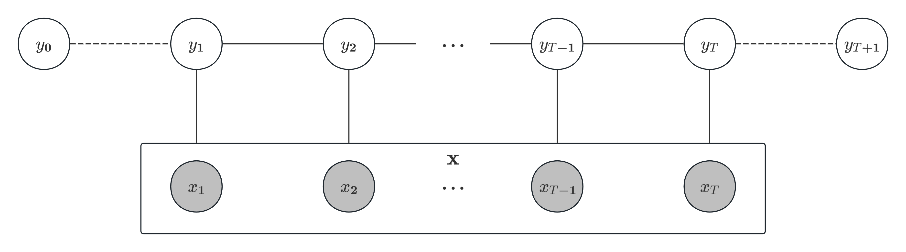
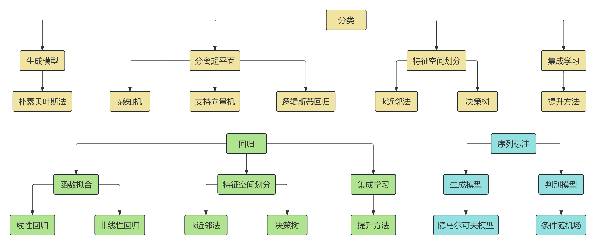
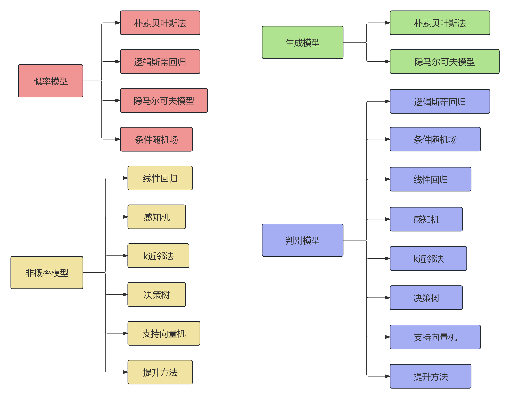

与之前提到的朴素贝叶斯，HMM不同，条件随机场属于概率无向图模型。因此我们需要先介绍概率无向图模型的相关概念。
# 概率无向图模型
概率无向图模型，也称为马尔可夫随机场，使用无向图表示一组随机变量$X$之间的相关关系，整体描述这些随机变量的联合概率分布$P(X)$。  
首先对概率无向图进行符号约定：图使用$G=(V,E)$表示（$V$为结点，$E$为无向边），$X_v$表示结点$v$对应的随机变量（$X_V$表示所有结点对应随机变量），$e\in E$表示随机变量之间的概率相关关系。
+ 如果两个随机变量对应的结点在图中没有边直接相连，那么在给定其他所有结点的变量的条件下，这两个变量条件独立。其联合概率分布满足以下性质：
    1. 成对马尔可夫性  
    设$u$和$v$是无向图$G$中任意两个没有边连接的结点，其他所有结点的集合记作$V\setminus\{u,v\}$。则给定随机变量$X_{V\setminus\{u,v\}}$的条件下随机变量$X_u$和$X_v$是条件独立的，即
        $$
        P(X_u, X_v|X_{V \setminus\{u,v\}}) =P(X_u|X_{V\setminus\{u,v\}})P(X_v|X_{V\setminus\{u,v\}})
        $$
        也记作$X_u \perp X_v|X_{V \setminus \{u,v\}}$。
    2. 局部马尔可夫性  
    设$u\in V$是无向图$G$中任意一个结点，$N(u)$是与$u$相连的所有结点的集合，$V\setminus(\{u\}\cup N(u))$是$u$和$N(u)$以外的其他所有结点的集合。则在给定随机变量$X_{N(u)}$的条件下随机变量$X_u$与随机变量$X_{V\setminus(\{u\}\cup N(u))}$是条件独立的，即
        $$
        P(X_u, X_{V \setminus (\{u\} \cup N(u))}|X_{N(u)}) = P(X_u|X_{N(u)})P(X_{V \setminus (\{u\}\cup N(u))}|X_{N(u)})
        $$
        也记作$X_u \perp X_{V\setminus (\{u\} \cup N(u))}|X_{N(u)}$。
    3. 全局马尔可夫性  
        设结点集合$A$和$B$是在无向图$G$中被结点集合$S$隔开的任意的结点集合。结点集合$A,B$和$S$所表示的随机变量分别是$X_A$、$X_B$和$X_S$。则给定随机变量$X_S$的条件下随机变量$X_A$和$X_B$是条件独立的，即
        $$
        P(X_A,X_B|X_S)=P(X_A|X_S)P(X_B|X_S)
        $$
        也记作$X_A\perp X_B|X_S$。
    
    实际上，如果联合概率分布$P(X)$是严格正的，那么这个联合概率分布的上述三条性质是等价的。
+ 由此可以得到概率无向图模型（或马尔可夫随机场）的定义：如果联合概率分布$P(X)$是严格正的，且满足成对、局部或全局马尔可夫性，就称此联合概率分布为概率无向图模型或马尔可夫随机场。
## 因子分解
对给定的概率无向图模型，我们希望将整体的联合概率写成若干子联合概率的乘积的形式，也就是对联合概率进行因子分解，这样便于模型的学习与计算。
+ 先定义概率无向图中的团与最大团：
    + 对于无向图$G$，其中任何两个结点均有边连接的结点子集称为团；
    + 若$C$是无向图$G$的一个团，并且不能再加进任何一个$G$的结点使其成为一个更大的团，则称此$C$为最大团。
+ 将概率无向图模型的联合概率分布表示为其最大团上的严格正函数的乘积除以一个归一化因子的操作，即为概率无向图模型的因子分解。
    + 具体而言，联合概率分布$P(X)$可写作图中所有最大团$C$上的严格正的函数$\Psi_C(X_C)$的乘积形式，即
        $$
        P(X)=\frac{1}{Z}\prod_C\Psi_C(X_C)
        $$
        其中$\displaystyle Z=\sum_{X}\prod_C\Psi_C(X_C)$为归一化因子。通常定义$\Psi_C(X_C)$为指数函数（称为势函数，一定严格正），即
        $$
        \Psi_C(X_C)=e^{-E(X_C)}
        $$
        其中$E(X_C)$是能量函数。
+ 概率无向图模型因子分解的存在性由Hammersley-Clifford定理保证。【其证明可参照[链接](https://note.jiepeng.tech/CS/Computational_Photography/Hammersley-Clifford/#_4)】
# 条件随机场
## 基本概念
+ 条件随机场（conditional random field，CRF）的定义如下：设$X$与$Y$是随机变量，$P(Y|X)$是在给定$X$的条件下$Y$的条件概率分布。若随机变量$Y$构成一个由无向图$G=(V,E)$表示的马尔可夫随机场，即
    $$
    P(Y_v|X,Y_w,w\not = v)=P(Y_v|X,Y_w,w\sim v)
    $$
    对任意结点$u$成立（与给定$X$下局部马尔可夫性等价），则称条件概率分布$P(Y|X)$为条件随机场。
+ 由定义可知，条件随机场属于判别模型。而对于随机变量$X$，其可以用另一个概率无向图表示（与$G$连接），也可以不由任何图表示。
+ 而在NLP领域中，最常见的CRF就是线性链条件随机场，主要用于序列标注。此时$P(\mathbf{y}|\mathbf{x})$中，$\mathbf{y}$是输出变量，表示标记（状态）序列，$\mathbf{x}$是输入变量，表示需要标注的观测序列。【与隐马尔科夫模型类似】
    + 设$\mathbf{x}=x_1,x_2,\cdots,x_T,\mathbf{y}=y_1,y_2,\cdots,y_T$，那么其局部马尔可夫性就可以表达为
        $$
        P(y_t|\mathbf{x},y_1,…,y_{t-1},y_{t+1},\cdots,y_T)=P(y_t|\mathbf{x},y_{t-1},y_{t+1}),\quad t=1,2,\cdots,T
        $$
        其概率无向图形式如下：
        注意这里序列的起始和终止由特殊标记表示（$y_0$表示序列起点，$y_{T+1}$表示序列终点）。
+ 线性链条件随机场具有以下三种主要形式：
    1. 基本形式  
        根据 Hammersley-Clifford 定理，整个序列的条件概率可以通过最大团（即上图中的所有$\{y_t,y_{t+1}\}$）上的势函数的乘积来表示：
        $$
        P(\mathbf{y}|\mathbf{x}) = \frac{1}{Z(\mathbf{x})} \prod_{t=1}^{T+1} \Psi_t(y_{t-1}, y_t, \mathbf{x})
        $$
        其中$\displaystyle Z(\mathbf{x})=\sum_{\mathbf{y}}\prod_{t=1}^{T+1}\Psi_t(y_{t-1}, y_t, \mathbf{x})$。而势函数的具体表达式为
        $$
        \Psi_t(y_{t-1}, y_t, \mathbf{x}) = \exp\left(\sum_{j=1}^{M+L} \lambda_j f_j(y_{t-1}, y_t, \mathbf{x}, t) + \sum_{l=1}^L \mu_l g_l(y_t, \mathbf{x}, t)\right)
        $$
        其中$f_j$和$g_l$是特征函数（前者为转移特征，后者为状态特征），$\lambda_j$和$\mu_l$是对应的权值。  
        + 特征函数通常为指示函数，当满足特征条件时取值为$1$，否则为$0$，且通常只与相对位置有关。因此可以将特征函数里的参数$\mathbf{x},t$替换为当前位置的输入观测$x_t$。 
        + 另一方面，由上面的基本形式可知，线性链条件随机场也属于对数线性模型，是Logistic回归/最大熵模型在序列数据上的推广。标记序列表示的类别数量会随着序列长度的增加而指数级增加。
        + 实际上，上一讲中的隐马尔科夫模型的联合概率也可以转换为线性链条件随机场的形式：
            $$
            \begin{aligned}
            P(\mathbf{y},\mathbf{x}) &= \prod_{t=1}^{T+1} P(y_t|y_{t-1}) \cdot \prod_{t=1}^{T} P(x_t|y_t)\\
            \Longrightarrow \log P(\mathbf{y}, \mathbf{x}) &= \sum_{t=1}^{T+1} \log P(y_t|y_{t-1}) + \sum_{t=1}^{T} \log P(x_t|y_t)\\
            &=\sum_{t=1}^{T+1}\sum_{s_i, s_j} I(y_{t-1} = s_i) I(y_t = s_j) \cdot \log P(s_j|s_i)+\sum_{t=1}^T\sum_{s_i, O_k} I(y_t = s_i) I(x_t = o_k) \cdot \log P(o_k|s_i)\\
            \Longrightarrow P(\mathbf{y},\mathbf{x})&=\exp \left( \sum_{t=1}^{T+1} \sum_{s_i, s_j} \lambda_{ij} I(y_{t-1} = s_i) I(y_t = s_j) + \sum_{t=1}^{T} \sum_{s_i, o_k} \mu_{ik} I(y_t = s_i) I(x_t = o_k) \right)
            \end{aligned}
            $$
            其中权重$\lambda_{ij}$和$\mu_{ik}$分别为转移概率和发射概率的对数。
        + 与HMM相比，线性链CRF作为判别模型，还可以利用转移特征和状态特征之外的其他特征进行序列标注，因而表现往往更好。
    2. 一般形式  
        考虑将状态特征函数并入转移特征中，即
        $$
        f_j(y_{t-1}, y_t, \mathbf{x}, t) =
        \begin{cases} 
        f_j(y_{t-1}, y_t, \mathbf{x}, t), & j = 1, 2, \cdots, M \\
        g_l(y_t, \mathbf{x}, t), & j = M + 1, M+2, \cdots, M+L
        \end{cases}
        $$
        此时模型可写作
        $$
        \begin{aligned}
        P(y|\mathbf{x}) &= \frac{1}{Z(\mathbf{x})} \exp \left( \sum_{t=1}^{T+1} \sum_{j=1}^{M+L} w_j f_j(y_{t-1}, y_t, \mathbf{x}, t) \right) \\
        Z(\mathbf{x}) &= \sum_{\mathbf{y}} \exp \left( \sum_{t=1}^{T+1} \sum_{j=1}^{M+L} w_j f_j(y_{t-1}, y_t, \mathbf{x}, t) \right) \\
        \end{aligned}
        $$
        当然更一般地，还可以隐藏$t$变量，即
        $$
        \begin{aligned}
        P(\mathbf{y}|\mathbf{x}) &= \frac{1}{Z(\mathbf{x})} \exp \left( \sum_{j=1}^{M+L} w_j f_j(\mathbf{y}, \mathbf{x}) \right) \\
        Z(\mathbf{x}) &= \sum_{\mathbf{y}} \exp \left( \sum_{j=1}^{M+L} w_j f_j(\mathbf{y}, \mathbf{x}) \right) \\
        \end{aligned}
        $$
        具体的概率计算中，计算量最大的就是归一化因子，计算复杂度为$O(T\cdot I^T)$。（$I$表示标记/状态种类数）
    3. 矩阵形式  
        对观测序列 $\mathbf{x}$ 的每一个位置 $t = 1, 2, \cdots, T + 1$，可以定义一个矩阵（通常为$I \times I$）：
        $$
        M_t(\mathbf{x}) = [\Psi_t(y_{t-1}, y_t, \mathbf{x})]_{I\times I} 
        $$
        元素为
        $$
        \Psi_t(y_{t-1}, y_t, \mathbf{x}) = \exp \left( \sum_{j=1}^{M+L} w_j f_j(y_{t-1}, y_t, \mathbf{x}, t) \right)
        $$
        特别地，$M_1(\mathbf{x})$为$1\times I$行向量，$M_{T+1}(\mathbf{x})$为$I\times 1$列向量。  
        由此我们可以得到条件概率的计算公式：
        $$
        \begin{aligned}
        P(\mathbf{y}|\mathbf{x})&=\frac{1}{Z(\mathbf{x})}\prod_{i=1}^{T+1}\Psi(y_{t-1},y_t,\mathbf{x})\\
        Z(\mathbf{x})&=M_1(\mathbf{x})M_2(\mathbf{x})\cdots M_{T}(\mathbf{x})M_{T+1}(\mathbf{x})
        \end{aligned}
        $$
        这样就将概率计算简化为矩阵乘积计算，复杂度降为$O(T\cdot I^2)$。
+ 与HMM类似，线性链CRF同样主要用于处理三个基本问题（略，见[上一讲](/posts/computer-science/machine-learning/机器学习方法-ch10-隐马尔可夫模型/#基本概念)），其中参数为$\mathbf{w}=\{w_1,\cdots,w_{M+L}\}$。
## 概率计算算法
+ 与HMM类似，线性链CRF概率如果直接计算会过于复杂，此时也有进行前向-后向算法简化计算。
+ 首先定义前向向量（$1\times I$行向量）
    $$
    \alpha_t(\mathbf{x})=M_1(\mathbf{x})M_2(\mathbf{x})\cdots M_t(\mathbf{x}),\quad t=1,2,\cdots,T+1
    $$
    因此有递推式$\alpha_{t+1}(\mathbf{x})=\alpha_t(\mathbf{x})M_{t+1}(\mathbf{x})$，最终得到$\alpha_{T+1}(\mathbf{x})$即为归一化因子$Z(\mathbf{x})$。
+ 然后定义后向向量（$I\times 1$列向量）
    $$
    \beta_t(\mathbf{x})=M_{t+1}(\mathbf{x})M_{t+2}(\mathbf{x})\cdots M_{T+1}(\mathbf{x}),\quad t=T,T-1,\cdots,0
    $$
    于是有递推式$\beta_{t}(\mathbf{x})=M_{t+1}(\mathbf{x})\beta_{t+1}(\mathbf{x})$，最终得到$\beta_{0}(\mathbf{x})=Z(\mathbf{x})$。
+ 结合前向向量与后向向量，就得到了归一化因子的前向-后向算法：
    $$
    Z_\mathbf{w}(\mathbf{x}) = \alpha_t(\mathbf{x})\beta_t(\mathbf{x}) = M_1(\mathbf{x})M_2(\mathbf{x})\cdots M_{T+1}(\mathbf{x})
    $$
    实际上，前向算法和后向算法分别是归一化因子计算中的矩阵右乘运算和矩阵左乘运算。
+ 由前向-后向向量，我们可以得到特征函数的期望：
    $$
    \begin{aligned}
    E_{P(\mathbf{y}|\mathbf{x})}[f_j]
    &= \sum_y P(\mathbf{y}|\mathbf{x})f_j(\mathbf{y}, \mathbf{x}) \\
    &= \sum_y P(\mathbf{y}|\mathbf{x}) \sum_{t=1}^{T+1} f_j(y_{t-1}, y_t, \mathbf{x}, t) \\
    &= \sum_{t=1}^{T+1} \sum_{y_{t-1}, y_t} f_j(y_{t-1}, y_t, \mathbf{x}, t)
    \frac{\alpha_{t-1}(y_{t-1}|\mathbf{x})\Psi_t(y_{t-1}, y_t,\mathbf{x})\beta_t(y_t|\mathbf{x})}{Z(\mathbf{x})},\quad j = 1, 2, \cdots, M.\\[20pt]
    E_{\tilde{P}(\mathbf{x}, \mathbf{y})}[f_j]&= \sum_{\mathbf{x}, \mathbf{y}} \tilde{P}(\mathbf{x}, \mathbf{y})f_j(\mathbf{y}, \mathbf{x}) \\
    &= \sum_{\mathbf{x}} \tilde{P}(\mathbf{x}) \sum_{\mathbf{y}} P(\mathbf{y}|\mathbf{x}) \sum_{t=1}^{T+1} f_j(y_{t-1}, y_t, \mathbf{x}, t) \\
    &= \sum_{\mathbf{x}} \tilde{P}(\mathbf{x})\sum_{t=1}^{T+1} \sum_{y_{t-1}, y_t} f_j(y_{t-1}, y_t, \mathbf{x}, t)
    \frac{\alpha_{t-1}(y_{t-1}|\mathbf{x})\Psi_t(y_{t-1}, y_t,\mathbf{x})\beta_t(y_t|\mathbf{x})}{Z(\mathbf{x})}, \quad j = 1, 2, \cdots, M.
    \end{aligned}
    $$
    其中$Z(\mathbf{x}) = \alpha_{T+1}(\mathbf{x})$，$\alpha_{t-1}(y_{t-1}|\mathbf{x})$和$\beta_t(y_t|\mathbf{x})$分别表示前向向量中$y_{t-1}$状态对应元素和后向向量中$y_t$状态对应元素。
## 学习算法
+ 与HMM类似，线性链CRF的学习算法同样有监督学习算法（极大似然估计法）：
    + 对于观测序列与标记序列均一致的训练数据，其联合概率可表达为
        $$
        \tilde{P}(\mathbf{x},\mathbf{y})=\tilde{P}(\mathbf{x})P_{\mathbf{w}}(\mathbf{y}|\mathbf{x})=\tilde{P}(\mathbf{x})\frac{\displaystyle\exp \left( \sum_{j=1}^{M+L} w_j f_j(\mathbf{y}, \mathbf{x}) \right) }{\displaystyle\sum_{\mathbf{y}} \exp \left( \sum_{j=1}^{M+L} w_j f_j(\mathbf{y}, \mathbf{x}) \right)} 
        $$
        由此得到目标优化函数
        $$
        \begin{aligned}
        L(\mathbf{w}) &= -\sum_{\mathbf{x},\mathbf{y}} \tilde{P}(\mathbf{x}, \mathbf{y}) \log P_{\mathbf{w}}(\mathbf{y}|\mathbf{x}) \\
        &= \sum_{\mathbf{x}} \tilde{P}(\mathbf{x}) \log \sum_{\mathbf{y}} \exp \left( \sum_{j=1}^{M+L} w_j f_j(\mathbf{y}, \mathbf{x}) \right) - \sum_{\mathbf{x},\mathbf{y}} \tilde{P}(\mathbf{x}, \mathbf{y}) \sum_{j=1}^{M+L} w_j f_j(\mathbf{y}, \mathbf{x})
        \end{aligned}
        $$
        对参数求梯度得
        $$
        \begin{aligned}
        \frac{\partial L}{\partial w_j} &= \sum_{\mathbf{x},\mathbf{y}} \tilde{P}(\mathbf{x}) P_{\mathbf{w}}(\mathbf{y}|\mathbf{x}) f_j(\mathbf{y},\mathbf{x}) - E_{\tilde{P}(\mathbf{x}, \mathbf{y})}[f_j], \\
        &=\sum_{\mathbf{x},\mathbf{y}} \tilde{P}(\mathbf{x})\cdot E_{P(\mathbf{y}|\mathbf{x})}[f_j]- E_{\tilde{P}(\mathbf{x}, \mathbf{y})}[f_j], \quad j = 1, 2, \cdots, M
        \end{aligned}
        $$
        其中第二项可以直接计算，而第一项需要用前向-后向算法计算，最终得到权重估计。
> 当然，作为无约束最优化问题，也可以使用迭代尺度法IIS、梯度下降法以及拟牛顿法（如BFGS）等进行计算，此处作略（可能在CS127中会涉及）
## 预测问题
+ 与HMM类似，线性链CRF的预测问题同样可使用维特比算法解决。首先将预测问题转化为优化问题：
    $$
    \begin{aligned}
    \argmax_{\mathbf{y}} \left[ \log P_w(\mathbf{y} | \mathbf{x}) \right] 
    &= \argmax_{\mathbf{y}} \left\{ \log \left[ \frac{1}{Z(\mathbf{x})} \exp \left( \sum_{j=1}^{M+L} w_j f_j(\mathbf{y}, \mathbf{x}) \right) \right] \right\} \\
    &= \argmax_{\mathbf{y}} \left\{ \log \left[ \frac{1}{Z(\mathbf{x})} \exp \left( \sum_{t=1}^{T+1} \sum_{j=1}^{M+L} w_j f_j(y_{t-1}, y_t, \mathbf{x}, t) \right) \right] \right\} \\
    &= \argmax_{y_1\cdots y_T} \left\{ \sum_{t=1}^{T+1} \sum_{j=1}^{M+L} w_j f_j(y_{t-1}, y_t, \mathbf{x}, t) \right\} 
    \end{aligned}
    $$
    下面假设标记序列状态集合为$\{1,2,\cdots,I\}$。定义从位置$1$到位置$t$的标记$y_t$的特征组合的最大值
    $$
    \delta_t(y_t) = \max_{y_1\cdots y_{t-1}} \sum_{t'=1}^t \sum_{j=1}^{M+L} w_j f_j(y_{t'-1}, y_{t'}, \mathbf{x}, t')
    $$
    由此得到递归公式，同时得到对应的标记：
    $$
    \begin{aligned}
    \delta_t(y_t) &= \max_{y_{t-1}} \left[ \delta_{t-1}(y_{t-1}) + \sum_{j=1}^{M+L} w_j f_j(y_{t-1}, y_t, \mathbf{x}, t) \right] \\
    \phi_t(y_t) &= \argmax_{y_{t-1}} \left[ \delta_{t-1}(y_{t-1}) + \sum_{j=1}^{M+L} w_j f_j(y_{t-1}, y_t, \mathbf{x}, t) \right]
    \end{aligned}
    $$
    最后在位置$t=T$终止，得到：
    $$
    \begin{aligned}
    \delta^*_T&=\max_{y_T}\delta(y_T)\\
    y_T^*&=\argmax_{y_T}\delta(y_T)
    \end{aligned}
    $$
    然后由最优路径的终止位置返回，得到最优路径上的每一个点：
    $$
    y_{t-1}^* = \phi_t(y_t^*), \quad t = T, T-1, \dots, 1
    $$
    最终求得最优路径$\mathbf{y}^* = y_1^* y_2^* \cdots y_T^*$。

___
最后我们梳理一下HMM和CRF相关模型算法提出的时间线：
|模型/算法|提出者|提出时间|
|:------:|:-----:|:-----:|
|隐马尔可夫模型（HMM）|Leonard Baum，Ted Petrie等|1966年|
|维特比算法|Andrew Viterbi|1967年|
|Baum-Welch算法（前向-后向算法）|Leonard Baum 与 Lloyd Welch|1972年|
|最大熵马尔可夫模型（MEMM）|Andrew McCallum，Dayne Freitag 与 Fernando Pereira|2000年|
|条件随机场（CRF）|John Lafferty，Andrew McCallum 和 Fernando Pereira|2001年|
> 注：MEMM可看作HMM与CRF中间的过渡形态，也属于判别模型，直接借鉴了最大熵模型，引入了特征函数，与CRF的主要区别在于使用局部归一化因子，这会导致标注偏置问题。

> p.s. 笔者在看李航《机器学习方法》的这一章内容的时候发现有不少笔误，令人忍俊不禁（
____
ok，这样我们就基本将监督学习方法梳理完成了，下面进行简单的归纳总结：
1. 按照学习问题与模型策略分类
    
2. 按照模型属性分类
    
3. 学习策略  
    概率模型的学习可以形式化为极大似然估计或贝叶斯估计的最大后验概率估计，而非概率模型学习的本质是最小化代理损失函数或正则化的代理损失函数。
4. 学习算法  
    监督学习方法在有了具体形式后，学习就变成了求解最优化问题。在多数情况下，最优化问题没有解析解，需要采用数值计算方法或启发式方法来求解。

下面正式开启无监督学习篇章！