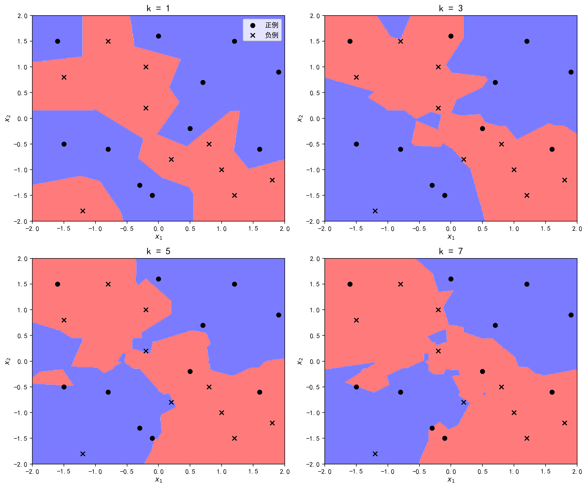
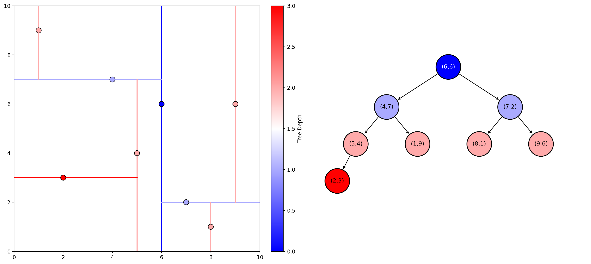

+ 从本讲开始，我们将踏入无监督学习方法的学习旅程中。在李航的《机器学习方法》里，无监督学习任务被分为聚类、降维、话题分析和概率模型估计。
+ 其中，降维方法（主成分分析PCA，奇异值分解SVD）已经在[CS127](https://souyerin.netlify.app/posts/computer-science/cs127/cs127-chapter-4/)中有所涉及，故笔者考虑不再重复。

本讲将介绍常用的聚类算法，包括层次聚类与k均值聚类。不过在此之前，笔者决定先将之前遗漏的k近邻算法补充在这里，正好可以作为对照。
# k近邻法
> 在[Introduction](/posts/computer-science/machine-learning/机器学习方法-ch1-introduction/#非参数模型)中我们简单提到了k近邻算法，下面对这一算法进行详述。
## 算法
k近邻法于1967年由Cover和Hart提出，其算法核心非常简单：
    + 给定一个训练数据集，对新的输入实例，在训练数据集中找出与其最邻近的$k$个实例；
    + 在分类时，如果这$k$个实例的多数属于某个类别，就把该输入实例分到这个类别；
    + 在回归时，对这$k$个实例的数值取平均值，作为该输入实例的数值。
+ 用符号表达式表示：
    1. 分类问题
        $$
        \hat{y} = \argmax_{c_j} \sum_{\mathbf{x}_i \in R_k(\mathbf{x})} I(y_i = c_j), \quad i = 1, 2, \cdots, N, j = 1, 2, \cdots, K
        $$
    2. 回归问题
        $$
        \hat{y} = \frac{1}{k}\sum_{\mathbf{x}_i \in R_k(\mathbf{x})} y_i, \quad i = 1, 2, \cdots, N
        $$
    其中$N$为训练集实例数，$K$为类别数，$R_k(\mathbf{x})$为输入实例$\mathbf{x}$（$D$维向量）最近邻的$k$个点组成的邻域。
+ 特别地，当$k=1$时，称为最近邻算法。
## 模型
+ 与决策树类似，k近邻算法的本质是对特征空间进行划分，但不具有显式的学习过程。以最近邻算法为例，可以将特征空间划分可视化：
+ 模型主要由距离度量、$k$值的选择和决策规则确定。
### 距离度量
    + k近邻模型的特征空间一般是$D$维实数向量空间$\R^D$。其距离度量主要使用$L_p$距离（也称为闵可夫斯基距离），其表达式为：
        $$
        d_{ij} = \left( \sum_{k=1}^D |x_{ki} - x_{kj}|^p \right)^{\frac{1}{p}}
        $$
        其中$p\geq 1$。
    + 特别地，$p=2$时也称为欧氏距离，$p=1$时也称为曼哈顿距离，$p=\infty$时为各坐标距离最大值。【详细理论可见[CS127](https://souyerin.netlify.app/posts/computer-science/cs127/cs127-chapter-2/)相关内容】
    + 由不同的距离度量所确定的最近邻点是不同的。
### k值选择
$k$值的选择会对k近邻法的结果产生重大影响：
+ 当$k$较小时，预测的偏差会减小，但预测的方差会增大（预测结果会对近邻的实例更敏感）。同时整体模型也会变得复杂，容易发生对训练数据的过拟合。
+ 当$k$较大时，可以减少预测的方差，但预测的偏差会增大，模型也会变得简单。极端情况下（$k=N$），模型会退化为单一预测结果（训练实例中最多的类别，或训练实例数值的均值）。
+ 在应用中，$k$值一般取一个比较小的数值（在分类问题中一般取奇数值，防止平票的出现）。通常采用交叉验证法来选取最优的$k$值。
### 决策规则
+ k近邻法中的分类决策规则一般是多数表决，或者加权表决（距离越近权重越大）。在概率上，多数表决等价于在邻域内对条件概率分布进行极大似然估计，选取估计的条件概率最大的类别作为预测的类别。
+ k近邻法中的回归决策规则一般是取平均值，这等价于对邻域内的一元正态条件分布进行估计，并取估计的正态分布的均值。
## k-d树
实现k近邻法的一个挑战是预测时的计算量较大，需要考虑如何对训练数据进行快速k近邻搜索。
+ 一种解决策略是使用特殊的结构存储训练数据，以减少计算距离的次数。其中最典型的一种就是k-d树（k dimentional tree），其由J.L. Bentley于1975年提出。【注意这里的$k$和k近邻的$k$含义不同】
### k-d树的构建
+ k-d树是二叉树，表示对$k$维空间的一个划分。其每个结点对应于一个$k$维超矩形区域（包含实例点的一个集合）。其构建算法如下：
    1. 构建根节点（对应包含所有实例的矩形区域）：以第1个维度作为坐标轴，选取中位数作为根节点（同时也是切分点）。【注：当有偶数个实例时中位数向上取实例】
    2. 将根结点对应的超矩形区域切分为两个子区域（以与第1维坐标轴垂直且通过切分点的超平面划分）
    3. 对两个子区域重复上述两个步骤（第$j$层使用的坐标轴维度为$l=j(\operatorname{mod} k)+1$，即从浅到深$1,2,\cdots,k-1,k,1,2,\cdots$循环），直到每一个子区域只包含一个实例时停止，成为叶结点，从而得到一个k-d树。
+ 二维k-d树构建示意图如下：
    可以证明这种方法构建的k-d树一定是平衡二叉树。
### k-d树的搜索
+ 在得到k-d树后，我们就可以对其进行搜索得到k近邻结点，具体算法如下：
    1. 在k-d树中找到包含目标点$\mathbf{x}$的叶结点：从根结点出发，递归向下访问k-d树。若目标点当前维度的坐标小于切分点的坐标，则移动到左子结点，否则移动到右子结点，直到子结点为叶结点为止。
    2. 初始化一个**容量为$k$的大顶堆**$\mathcal{H}$。以该叶结点为初始候选点，计算其与目标点的距离，并加入堆中。
    3. 递归地向上回退到父结点，在该结点进行以下操作：
        + 检查该结点保存的实例点：计算该点与目标点的距离。如果该距离小于$\mathcal{H}$中堆顶元素的距离（即当前$k$个候选点里最远的一个），或者堆$\mathcal{H}$尚未填满，则将该结点实例点加入堆中，并移除堆顶最远的点。
        + 检查该结点的另一个子结点对应的区域是否有更近的点。具体而言，检查另一子结点对应的区域是否与以目标点为球心，以当前堆顶元素距离为半径的超球面相交。如果相交，说明该区域可能存在距目标点更近的点，移动到另一子结点，递归地进行k近邻搜索；如果不相交，说明该区域的所有点必定比当前堆中距离还远，直接进行剪枝，忽略该子树。
    4. 当回退到根结点，且根结点的另一子结点检查完毕（或被剪枝跳过）时，搜索结束。此时大顶堆$\mathcal{H}$中保存的$k$个实例点即为目标点的k近邻。
+ 这样我们就可以省去对大部分实例点的搜索，从而减少搜索的计算量。
# 聚类方法
## 基本概念
聚类是针对给定的样本，依据它们特征的相似度或距离，将其归并到若干个“类”或“簇”的数据分析问题。直观上，相似的样本聚集在相同的类，不相似的样本分散在不同的类。
+ 聚类的核心概念是相似度或距离，这直接影响聚类的结果。下面给出集中常见的距离与相似度指标：
    1. $L_p$距离（闵可夫斯基距离）：略，见上。
    2. 马哈拉诺比斯距离（简称马氏距离）：给定一个$m$维实数向量空间$\mathbb{R}^m$中样本点的集合$\mathcal{X}$。设$x_i, x_j \in \mathcal{X}$，样本集的协方差矩阵为$\Sigma$，则样本$x_i$与样本$x_j$之间的马哈拉诺比斯距离$d_{ij}$定义为  
        $$
        d_{ij} = \left[ (x_i - x_j)^\top \Sigma^{-1} (x_i - x_j) \right]^{\frac{1}{2}}
        $$    
        特别地，当$\Sigma$为单位矩阵时，马氏距离即为欧氏距离。马氏距离与相似度呈负相关关系。
    3. 相关系数（略，见概率论或数理统计）
    4. 余弦相似度（略，可见人工智能导论或NLP相关笔记）
+ 聚类得到的类或簇属于样本的子集。如果假定一个样本只能属于一个类（类的交集为空集），那么这种聚类方法称为硬聚类方法，否则称为软聚类方法（本讲中不考虑）。
+ 将类或簇用$G$表示，$n_G$表示$G$中样本的个数。那么对类或簇可进行如下几种定义（$d_{ij}$为$x_i$与$x_j$之间的距离）：
    1. 设$T$为给定的正数，若对集合$G$的任意两个样本$x_i,x_j$，有$d_{ij} \leq T$，则称$G$为一个类或簇。  
    2. 设$T$为给定的正数，若对集合$G$的任意一个样本$x_i$，一定存在$G$中的另一个样本$x_j$，使得$d_{ij} \leq T$，则称$G$为一个类或簇。  
    3. 设$T$为给定的正数，若对集合$G$中任意一个样本$x_i$满足  
        $$
        \frac{1}{n_G - 1} \sum_{x_j \in G} d_{ij} \leq T
        $$
        其中，$n_G$为$G$中样本的个数，则称$G$为一个类或簇。  
    4. 设$T$为给定的正数，如果集合$G$满足  
        $$
        \frac{1}{n_G (n_G - 1)} \sum_{x_i \in G} \sum_{x_j \in G} d_{ij} \leq T
        $$
        则称$G$为一个类或簇。
    
    其中第一个定义最常用（可推出其他三个定义）。
+ 类或簇的常用特征包括：
    1. 类的均值（中心）
        $$
        \bar{x}_G=\frac{1}{n_G}\sum_{i=1}^{n_G}x_i
        $$
    2. 类的直径
        $$
        D_G=\max_{x_i,x_j\in G}d_{ij}
        $$
    3. 类的样本散布矩阵$A_G$与协方差矩阵$S_G$
        $$
        \begin{aligned}
        A_G &= \sum_{i=1}^{n_G} (x_i - \bar{x}_G)(x_i - \bar{x}_G)^\top \\
        S_G &= \frac{1}{n_G - 1} A_G = \frac{1}{n_G - 1} \sum_{i=1}^{n_G} (x_i - \bar{x}_G)(x_i - \bar{x}_G)^\top
        \end{aligned}
        $$
+ 类或簇之间的距离也有如下定义：
    1. 最短距离（单连接）    
        $$
        D_{pq} = \min \{ d_{ij} \mid x_i \in G_p, x_j \in G_q \}
        $$
    2. 最长距离（完全连接）    
        $$
        D_{pq} = \max \{ d_{ij} \mid x_i \in G_p, x_j \in G_q \}
        $$
    3. 中心距离   
        $$
        D_{pq} = d(\bar{x}_p, \bar{x}_q)
        $$
        其中$\bar{x}_p$和$\bar{x}_q$分别表示类$G_p$与类$G_q$的中心。
    4. 平均距离      
        $$
        D_{pq} = \frac{1}{n_p n_q} \sum_{x_i \in G_p} \sum_{x_j \in G_q} d_{ij}
        $$
## 层次聚类
层次聚类假设类别之间存在层次结构，将样本聚到层次化的类中。其分为聚合（自下而上）聚类、分裂（自上而下）聚类两种方法。
+ 聚合聚类（也称为AGNES算法）开始将每个样本各自分到一个类，之后将相距最近的两类合并，建立一个新的类，重复此操作直到达到预设的簇数量或某个终止条件。
    + 最基础的聚合聚类复杂度可达到$O(n^3m)$（$n$为样本个数，$m$为样本维数）【扫描$O(n)$轮$\times$距离比较$O(n^2)$次$\times$距离计算$O(m)$】
    + 一种优化策略是使用Lance-Williams方程：
        $$
        d(i\cup j, k) = \alpha_i\cdot d(i, k) + \alpha_j\cdot d(j, k) + \beta\cdot d(i, j) + \gamma\cdot |d(i, k) - d(j, k)|
        $$
        其中$\alpha_i,\alpha_j,\beta,\gamma$这四个参数取决于类间距离指标的选择。（如单连接对应的参数为$\alpha_i=\alpha_j=\dfrac{1}{2},\beta=0,\gamma=-\dfrac{1}{2}$）这样可以将距离比较复杂度降为$O(n)$。
    + 其对初始簇的选择和合并的顺序敏感，可能导致不同的聚类结果，且可能陷入局部最优解。
+ 分裂聚类开始将所有样本分到一个类，之后将已有类中相距最远的样本分到两个新的类（其他样本根据和这两个样本的距离分别划入这两个类中），重复此操作直到达到预设的簇数量或每个数据点都是一个单独的簇。
    + 其复杂度同样为$O(n^3m)$，一般不会直接使用。
    > 标准的DIANA算法步骤与上面略有不同：在分裂时选择直径最大的类，在其内部找到与其他所有点的平均距离最大的点作为新类的中心点，随后在旧类里找出到离新类距离更近的点，并将该点划入新类。（重复直到没有旧类点划入新类）
## k均值聚类
+ k均值聚类将样本集合划分为$k$个子集，构成$k$个类，将$n$个样本分到$k$个类中，每个样本到其所属类的中心的距离最小。实际上，k均值聚类可以用函数$l=C(i)$表示，其中$i\in\{1,2,\cdots,n\},l\in\{1,2,\cdots,k\}$。
+ k均值聚类的策略是通过损失函数的最小化选取最优的划分或函数$C^*$。使用欧氏距离作为样本间的距离度量，那么损失函数定义为样本与其所属类的中心之间的距离的总和，即
    $$
    L(C) = \sum_{l=1}^{k} \sum_{C(i)=l} \|x_i - \bar{x}_l\|^2
    $$
    其中$\bar{x}_l$为第$l$个类的均值（中心），另外定义$\displaystyle n_l=\sum_{i=1}^nI(C(i)=l)$为第$l$类样本的数量。
    + 于是就可以将聚类转化为最优化问题：$\displaystyle C^*=\argmin_CL(C)$，不过由于所有可能的分法达到了指数级，因此属于NP-Hard问题。现实中采用迭代的方法求解。
+ k均值聚类的迭代主要分为两个步骤：
    + 首先选择$k$个类的中心，将样本逐个指派到与其最近的中心的类中，得到一个聚类结果；
    + 然后更新每个类的样本的均值，作为类的新的中心；
    
    重复以上步骤，直到收敛为止。（具体算式省略）
    + k均值聚类的复杂度为$O(Imnk)$，其中$m$为样本维数，$I$为迭代次数。【当数据量很大时可近似为$O(n)$】
+ k均值聚类属于启发式方法，不能保证收敛到全局最优，初始中心的选择会直接影响聚类结果。
    + 对于初始中心的选择，可以先用层次聚类对样本进行聚类，得到$k$个类时停止，然后从每个类中选取一个与中心距离最近的点作为初始中心。
    + David Arthur和Sergei Vassilvitskii于2007年提出的k-means++算法对初始中心的选择进行了改进：
        1. 先随机选择一个样本$\mathbf{x}$作为初始中心；
        2. 然后对其他样本点计算到$\mathbf{x}$的距离$D(\mathbf{x})$，得到被选择概率$\dfrac{D(\mathbf{x})}{\sum D(\mathbf{x})}$；
        3. 根据被选择概率随机选择另一个样本作为另一个初始中心。重复上述步骤，直到选出$k$个初始中心。

        k-means++算法可以有效降低迭代次数，且能够更加接近全局最优解。【这也已经成为sci-kit learn库中默认的配置】
+ 对于$k$值的选择，往往会尝试用不同的k值聚类，检验各自得到的聚类结果的质量，推测最优的$k$值。一般地，类别数变小时，平均直径会增加；类别数变大超过某个值以后，平均直径会几乎不变，而这个值正是最优的$k$值。
## DBSCAN
+ 下面我们再介绍一种聚类算法：基于密度的带噪声应用空间聚类，即DBSCAN。它由Ester等人在1996年提出。
+ 顾名思义，DBSCAN通过点的密度来识别聚类集群，具体步骤如下：
    1. 设定一个超参数$\epsilon$，对于每个样本点，绘制搜索半径为$\epsilon$的超球体，统计包含在球体内的样本点数量。
    2. 再设定另一个超参数$\text{minPoints}$作为阈值，当样本点统计到的附近样本数量超过阈值，那么将其标记为密集点，否则标记为非密集点。
    3. 随机选取一个密集点划入一类，绘制一个半径为$\epsilon$的超球体，将球体内的所有密集点划入这一类中。
    4. 然后再对划入的密集点再进行绘制，使得簇不断扩散，直到无法再扩散为止。
    5. 接着再对所有划入的密集点绘制搜索球，将球内的非密集点也划入该类中，由此完成一个类的划定。
    6. 继续随机选取未归类的密集点，重复上述操作，直到所有密集点都被归类。剩下未被归类的非密集点就被称为孤立点或离群点。
+ 相比k均值聚类，DBSCAN无需指定簇的数量，可以发现任意形状的簇，同时能够自动发现噪声。但作为代价，其对两个超参数非常敏感，且不适用于数据量大/维度高的数据。
    > Mihael Ankerst等人在1999年提出的OPTICS算法对DBSCAN进行了改进，缓解了其对超参数敏感的问题。【具体可参见[scikit-learn文档](https://scikit-learn.cn/stable/modules/clustering.html#optics)】
+ 更多关于DBSCAN的介绍可参见[scikit-learn文档](https://scikit-learn.cn/stable/modules/clustering.html#dbscan)。
## 聚类内部评价指标
+ 最后介绍一些聚类算法的内部评价指标，它们都是依靠聚类结果和样本本身的属性来进行评估的办法。【适用无法得知样本真实标签的情形】
1. 轮廓系数  
    轮廓系数衡量的是每个样本点到其簇内样本的距离均值与其到最近簇样本之间距离的差异率。具体计算公式为
    $$
    s =\frac{1}{n}\sum_{i=1}^n s(i)=\frac{1}{n}\sum_{i=1}^n\frac{b(i)-a(i)}{\max(a(i),b(i))}
    $$
    其中$a(i)$表示样本$i$到自己簇内点的平均距离，$b(i)$表示样本$i$到其最近的其他簇内点的平均距离。
    + 轮廓系数的取值范围为$[-1,1]$，且系数越大，聚类结果越好。
2. Calinski-Harabasz指数（方差比准则）  
    方差比即为所有簇间距离和（用$B$表示）与簇内距离和（用$W$表示）的比值，具体计算公式为
    $$
    \begin{cases}
    \displaystyle W = \sum_{k=1}^K \sum_{x \in C_k} \|x - c_k\|^2\\[10pt]
    \displaystyle B = \sum_{k=1}^K n_k \|c_k - c\|^2\\
    \end{cases}\Longrightarrow s = \frac{B}{W} \cdot \frac{n - K}{K - 1}
    $$
    其中$K$表示簇数量，$C_k$表示第$k$个簇中的所有样本，$c_k$表示第$k$个簇对应的簇中心，$n_k$表示第$k$个簇中样本的数量，$n$表示所有样本的数量，$c$表示全局簇中心。
    + 方差比的范围为$[0,+\infty)$。如果方差比越大，说明聚类结果越好。
    > 实际上CH指数可以理解为ANOVA中的F统计量。
3. DB指数（Davies-Bouldin Index）  
    DB指数的核心思想是计算每个簇与之最相似簇之间相似度，然后再通过求得所有相似度的平均值来衡量整个聚类结果的优劣。具体的计算公式为：
    $$
    DB = \frac{1}{K} \sum_{i=1}^{K} \max_{j \neq i} \left( R_{ij} \right)
    $$
    其中，簇$i$与簇$j$的相似度$R_{ij}$定义为：
    $$
    R_{ij} = \frac{s_i + s_j}{d_{ij}}
    $$
    即簇内直径之和与簇间距离之比。
    + DB指数取值范围也在$[0,+\infty)$之间，值越小表示聚类结果越好。

更多关于聚类指标的知识可参见[scikit-learn文档](https://scikit-learn.cn/stable/modules/clustering.html#clustering-performance-evaluation)。
