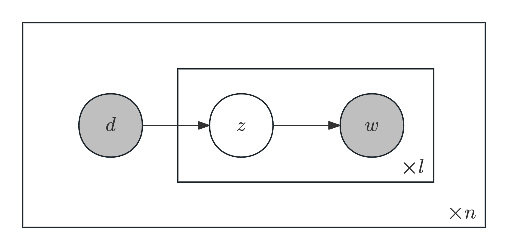
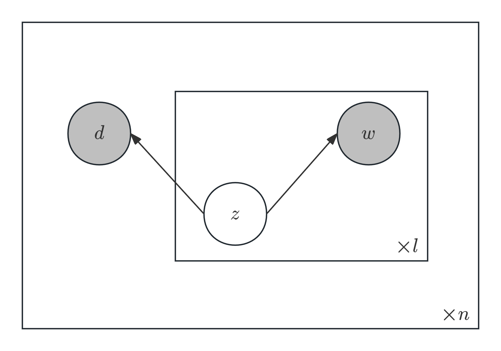

什么是话题分析？话题分析的基本思想是用单词的分布表示话题，用话题的分布表示文本。
+ 具体而言，话题分析方法可以自动地从文本数据中学习话题的单词分布和文本的话题分布，发现潜在的话题，以表示文本的内容，从而对文本的内容进行分析。
+ 话题分析模型可分为概率模型和非概率模型。其中，非概率模型的代表是潜在语义分析（LSA），而概率模型的代表是潜在语义分析（PLSA）和潜在狄利克雷分配（LDA）。
> 注：话题分析模型也属于自然语言处理中的统计模型，不过与n-gram，HMM代表的序列模型处理的任务有所区别。
# 潜在语义分析
+ 潜在语义分析（Latent Semantic Analysis，LSA）最早由Deerwester等人于1990年正式提出，最初用于信息检索，因此也被称作潜在语义索引（Latent Semantic Indexing，LSI）。
+ LSA的核心在于将文本集合表示为单词-文本矩阵，并对矩阵进行因子分解，从而得到话题向量空间，以及文本在话题向量空间的表示。
## 单词向量空间
文本信息处理的一个核心问题是如何对文本的语义内容进行量化，并进行文本之间的语义相似度计算。
+ 一个简单的思路是构建单词向量空间：将文本集合的每一段文本用一个向量表示，向量的每一维对应一个单词，其数值为单词出现的频次。此时文本之间的语义相似度使用向量内积或余弦相似度衡量。
    + 下面是符号定义：记文本集合$\mathcal{D}=\{d_1,d_2,\cdots,d_n\}$，所有单词的集合$\mathcal{W}=\{w_1,\cdots,w_m\}$，那么单词在文本中出现的数据用一个单词-文本矩阵$\mathbf{X}$表示：
        $$
        \mathbf{X}=\begin{bmatrix}
        x_{11}&x_{12}&\cdots&x_{1n}\\
        x_{21}&x_{22}&\cdots&x_{2n}\\
        \vdots&\vdots&\vdots&\vdots\\
        x_{m1}&x_{m2}&\cdots&x_{mn}\\
        \end{bmatrix}
        $$
        其中元素$x_{ij}$表示单词$w_i$在文本$d_j$中出现的频数或权值。可以预见的是，这个矩阵是一个稀疏矩阵。
    + 如果使用权值，则一般会采用单词频率-逆文本频率（TF-IDF），其表达式为
        $$
        \text{TF-IDF}_{ij}=\frac{\text{tf}_{ij}}{\text{tf}_{j}}\log\frac{\text{df}}{\text{df}_i},\quad i=1,2,\cdots,m,\quad j=1,2,\cdots,n
        $$
        其中$\text{tf}_{ij}$是单词$w_i$出现在文本$d_j$中的频数，$\text{tf}_{j}$是文本$d_j$的总词数，$\text{df}_i$是含有单词$w_i$的文本数，$\text{df}$是文本集合$\mathcal{D}$的全部文本数（即上面的$n$）。
        + TF-IDF综合度量了单词在文本中的出现频率和单词在文本集合分布的集中程度，其值越高表明该词越能反映文章的信息。
    + 由单词-文本矩阵构建的单词向量空间中，文本可用列向量$\mathbf{x}_j=\begin{bmatrix}x_{1j}\\\vdots\\x_{mj}\end{bmatrix}$表示，而文本$d_i$与$d_j$之间的相似度可用$\mathbf{x}_i\cdot\mathbf{x}_j$或$\dfrac{\mathbf{x}_i\cdot\mathbf{x}_j}{\|\mathbf{x}_i\|\|\mathbf{x}_j\|}$表示。 
+ 直观上，在两个文本中共同出现的单词越多，其语义内容就越相近，相似度越高。这在一定程度上能够满足应用的需求，至今仍在文本信息检索、文本数据挖掘等领域被广泛使用，可以认为是文本信息处理的一个基本原理。
+ 单词向量空间模型的优点是模型简单，计算效率高。然而它也有一定的局限性：因为自然语言存在有一词多义性及多词一义性，所以内积相似度未必能够准确表达两个文本的语义相似度。
## 话题向量空间
+ 对于上述单词的一词多义性与多词一义性的问题，我们引入了“话题”这一概念。话题可以由若干个语义相关的单词表示，同义词可以表示同一个话题，而多义词可以表示不同的话题。
+ 于是，类似单词向量空间，我们也可以构建话题向量空间：用话题空间的一个向量表示该文本，该向量的每一分量对应一个话题，其数值为该话题在该文本中出现的权值。话题向量空间的维度往往远低于单词向量空间。
+ 具体符号定义如下：文本、单词集合与单词-文本矩阵符号定义同上。设文本总共包含$k$个话题，每个话题由一个定义在$\mathcal{W}$上的$m$维向量表示：
    $$
    \mathbf{t}_l=\begin{bmatrix}t_{1l}\\\vdots\\t_{ml}\end{bmatrix},\quad l=1,2,\cdots,k
    $$
    其中$t_{il}$代表单词$w_i$在话题$t_l$的权值，权值越大，该单词在该话题中的重要度就越高。此时$\mathbf{t}_1,\cdots,\mathbf{t}_k$就构成了一个$k$维话题向量空间，记作$\mathbf{T}$。
    + $\mathbf{T}=[\mathbf{t}_1,\cdots,\mathbf{t}_k]$也被称为单词-话题矩阵，可看作$\mathbf{X}$的一个子空间。
+ 下面将文本向量$\mathbf{x}_j$投影到话题向量空间中，得到投影向量
    $$
    \mathbf{y}_j=\begin{bmatrix}y_{1j}\\\vdots\\y_{kj}\end{bmatrix},\quad j=1,2,\cdots,n
    $$
    其中$y_{lj}$是文本$d_j$中话题$\mathbf{t}_l$的权值，权值越大，该话题在该文本中的重要度就越高。
    + 此时$\mathbf{Y}=[\mathbf{y}_1,\cdots,\mathbf{y}_n]$也被称为话题-文本矩阵。
+ 在定义好$\mathbf{X},\mathbf{T}$和$\mathbf{Y}$三个矩阵后，我们就来探究它们之间的关系：由于文本向量在话题向量空间可近似表示为
    $$
    \mathbf{x}_j\approx\sum_{i=1}^ky_{ij}\mathbf{t}_k=\mathbf{T}\mathbf{y}_j
    $$
    因此可以得到$\mathbf{X}\approx\mathbf{T}\mathbf{Y}$。这便是潜在语义分析的核心模型。
## LSA算法
+ 由上述分析可知，LSA算法的关键在于如何将矩阵$\mathbf{X}$分解为话题向量与文本在话题向量空间的表示。这里就需要用到奇异值分解与低秩近似的知识（可参见[CS 127笔记](https://souyerin.netlify.app/posts/computer-science/cs127/cs127-chapter-4/#奇异值分解singular-value-decompositionsvd)）。
+ 矩阵$\mathbf{X}$的截断奇异值分解如下：
    $$
    \mathbf{X} \approx \mathbf{U}_k \mathbf{\Sigma}_k \mathbf{V}_k^\top = 
    \begin{bmatrix}
    u_1 & u_2 & \cdots & u_k
    \end{bmatrix}
    \begin{bmatrix}
    \sigma_1 &  & & \\
    & \sigma_2 &  &  \\
    &  & \ddots & \\
    &  & & \sigma_k
    \end{bmatrix}
    \begin{bmatrix}
    v_1^\top \\
    v_2^\top \\
    \vdots \\
    v_k^\top
    \end{bmatrix}
    $$
    其中$k\leq n\leq m$，$\sigma_1,\cdots,\sigma_k$为矩阵前$k$个最大奇异值，$u_i$为$m$维列向量，$v_j$为$n$维列向量。
    + 经过分解后，做奇异向量组$\mathbf{U}_k$即构成话题向量空间，而文本$d_j$的近似表达式
        $$
        \begin{aligned}
        \boldsymbol{x}_j \approx \mathbf{U}_k (\mathbf{\Sigma}_k \mathbf{V}_k^\top)_j
        &= \begin{bmatrix} \boldsymbol{u}_1 & \boldsymbol{u}_2 & \cdots & \boldsymbol{u}_k \end{bmatrix}
        \begin{bmatrix} \sigma_1 v_{j1} \\ \sigma_2 v_{j2} \\ \vdots \\ \sigma_k v_{jk} \end{bmatrix}\\
        &= \sum_{l=1}^{k} \sigma_l v_{jl} \boldsymbol{u}_l, \quad j = 1, 2, \cdots, n
        \end{aligned}
        $$
        这说明$(\mathbf{\Sigma}_k \mathbf{V}_k^\top)_j$可看作$d_j$在话题向量空间的表示。因此$\mathbf{\Sigma}_k \mathbf{V}_k^\top$可看作文本集合在话题空间的表示。
## 非负矩阵分解（NMF）
+ 注意到上述LSA算法中得到的话题空间向量与文本话题空间表示的元素都可能为负，这会导致得到的主题难以直接解释。对此，我们考虑将元素限制为非负，这样元素就可以被解释为权重，从而增强模型结果的可读性。
+ 下面给出符号定义：对于$m\times n$的非负单词-文本矩阵$\mathbf{X}$，将其分解为非负矩阵$\mathbf{U}\in\R^{m\times k}$和$\mathbf{V}\in\R^{k\times n}$，使得$\mathbf{X}\approx\mathbf{U}\mathbf{V}$。
    + 通过上述分解，得到$\mathbf{U}$为话题向量空间，而$\mathbf{V}$为文本向量在话题向量空间的表示。【可理解为话题向量的线性叠加】
+ 为了让非负矩阵分解尽量逼近原始矩阵，我们考虑将其转化为最优化问题，具体形式有以下两种：
    1. 平方损失：
        $$
        \begin{aligned}
        & \underset{\mathbf{U}, \mathbf{V}}{\operatorname{min}} && \|\mathbf{X} - \mathbf{U V}\|^2 \\
        & \text{s.t.} && \mathbf{U}, \mathbf{V} \geqslant 0
        \end{aligned}
        $$
        其中$\displaystyle\|\mathbf{A}-\mathbf{B}\|^2=\sum_{i,j}(a_{ij}-b_{ij})^2$。
    2. 散度损失：
        $$
        \begin{aligned}
        & \underset{\mathbf{U}, \mathbf{V}}{\operatorname{min}} && D(\mathbf{X}\|\mathbf{UV}) \\
        & \text{s.t.} && \mathbf{U}, \mathbf{V} \geqslant 0
        \end{aligned}
        $$
        其中$\displaystyle D ( \mathbf{A} \| \mathbf{B} ) = \sum _ { i , j } \left( a _ { i j } \log \frac { a _ { i j } } { b _ { i j } } - a _ { i j } + b _ { i j } \right)$。【广义散度，当$\displaystyle \sum _ { i , j }a_{ij}=b_{ij}=1$时退化为KL散度】
+ 那么如何求解这个最优化问题？直接使用梯度下降效率较低，一个较好的方法是采用下述乘法更新规则：
    + 对平方损失$\|\mathbf{X} - \mathbf{U}\mathbf{V}^\top\|^2$中参数作如下处理：
        $$
        \begin{aligned}
        V_{ij} &\leftarrow V_{ij} \frac{ (\mathbf{U}^\top \mathbf{X})_{ij} }{ (\mathbf{U}^\top \mathbf{UV})_{ij} }\\
        U_{il} &\leftarrow U_{il} \frac{ (\mathbf{X} \mathbf{V}^\top)_{il} }{ (\mathbf{UV} \mathbf{V}^\top)_{il} }
        \end{aligned}
        $$
    + 对散度损失 $D(\mathbf{X} \| \mathbf{UV})$中参数作如下处理：
        $$
        \begin{aligned}
        V_{ij} &\leftarrow V_{ij} \frac{ \displaystyle \sum_i \left[ \frac{U_{il} X_{ij}}{ (\mathbf{UV})_{ij}} \right] }{ \displaystyle \sum_i U_{il} }\\
        U_{il} &\leftarrow U_{il} \frac{ \displaystyle \sum_j \left[ \frac{U_{lj} X_{ij}}{ (\mathbf{UV})_{ij}}\right] }{ \displaystyle \sum_j V_{ij} }
        \end{aligned}
        $$
    
    则对应损失函数不增加，当且仅当$U$和$V$是对应损失函数的稳定点时函数的更新不变。
    <Note type="primary" title="补充">
    对上述更新表达式的简单推导如下（详细推导可参见[Lee & Seung 论文](http://belohlavek.inf.upol.cz/vyuka/Lee-Seung-NMF-1999-p.pdf)或[知乎](https://zhuanlan.zhihu.com/p/48141856)）：
    1. 平方损失函数的梯度：
        $$
        \begin{aligned}
        \frac{\partial \|\mathbf{X} - \mathbf{U V}\|^2}{\partial U_{il}} &= -\sum_j [X_{ij} - (\mathbf{U}\mathbf{V})_{ij}] V_{lj}\\
        &= -[(\mathbf{X}\mathbf{V}^\top)_{il} - (\mathbf{U}\mathbf{V}\mathbf{V}^\top)_{il}],\\
        \frac{\partial \|\mathbf{X} - \mathbf{U V}\|^2}{\partial V_{lj}} &= -[(\mathbf{U}^\top\mathbf{X})_{lj} - (\mathbf{U}^\top\mathbf{U}\mathbf{V})_{lj}].
        \end{aligned}
        $$
        于是又梯度下降法的更新规则得到
        $$
        \begin{aligned}
        U_{il} &= U_{il} + \lambda_{il}[(\mathbf{X}\mathbf{V}^\top)_{il} - (\mathbf{U}\mathbf{V}\mathbf{V}^\top)_{il}]\\
        V_{lj} &= V_{lj} + \mu_{lj}[(\mathbf{U}^\top\mathbf{X})_{lj} - (\mathbf{U}^\top\mathbf{U}\mathbf{V})_{lj}]
        \end{aligned}
        $$
        其中$\lambda_{il}, \mu_{lj}$为步长，若取
        $$
        \lambda_{il} = \frac{U_{il}}{(\mathbf{U}\mathbf{V}\mathbf{V}^\top)_{il}}, \quad \mu_{lj} = \frac{V_{lj}}{(\mathbf{U}^\top\mathbf{U}\mathbf{V})_{lj}}
        $$
        即得平方损失函数的乘法更新规则。
    2. 散度损失函数的梯度：
        $$
        \begin{aligned}
        \frac{\partial D(\mathbf{X}\|\mathbf{U}\mathbf{V})}{\partial U_{il}}
        &= \sum_j V_{lj} - \sum_j \frac{X_{ij}V_{lj}}{(\mathbf{U}\mathbf{V})_{ij}}
        = \sum_j V_{lj}\Big[1 - \frac{X_{ij}}{(\mathbf{U}\mathbf{V})_{ij}}\Big],\\
        \frac{\partial D(\mathbf{X}\|\mathbf{U}\mathbf{V})}{\partial V_{lj}}
        &= \sum_i U_{il} - \sum_i \frac{X_{ij}U_{il}}{(\mathbf{U}\mathbf{V})_{ij}}
        = \sum_i U_{il}\Big[1 - \frac{X_{ij}}{(\mathbf{U}\mathbf{V})_{ij}}\Big].
        \end{aligned}
        $$
        于是由梯度下降法的更新规则得到
        $$
        \begin{aligned}
        U_{il} &= U_{il} - \lambda_{il} \sum_j V_{lj}\Big[1 - \frac{X_{ij}}{(\mathbf{U}\mathbf{V})_{ij}}\Big],\\
        V_{lj} &= V_{lj} - \mu_{lj} \sum_i U_{il}\Big[1 - \frac{X_{ij}}{(\mathbf{U}\mathbf{V})_{ij}}\Big],
        \end{aligned}
        $$
        $\lambda_{il},\mu_{lj}$同上，若取
        $$
        \lambda_{il} = \frac{U_{il}}{\displaystyle\sum_j V_{lj}}, \qquad \mu_{lj} = \frac{V_{lj}}{\displaystyle\sum_i U_{il}},
        $$
        即得散度损失函数的乘法更新规则。
    </Note>
    选取初始矩阵$\mathbf{U}$和$\mathbf{V}$为非负矩阵，可以保证迭代过程及结果的矩阵$\mathbf{U}$和$\mathbf{V}$均为非负。
    + 另外，每次迭代后都需要对$\mathbf{U}$的列向量归一化，使其基向量为单位向量。
# 概率潜在语义分析
+ 概率潜在语义分析（Probabilistic Latent Semantic Analysis, PLSA）由Thomas Hofmann于1999年提出，使用概率生成模型对文本进行话题分析。整个模型表示文本生成话题，话题生成单词，从而得到文本-单词共现数据的过程。
+ 具体而言，文本-单词共现数据基于如下的概率模型产生：首先有话题的概率分布，然后有话题给定条件下文本的条件概率分布，以及话题给定条件下单词的条件概率分布。概率潜在语义分析就是发现由隐变量表示的话题，即潜在语义。
## 生成模型
+ 单词集合$\mathcal{W}$与文本集合$\mathcal{D}$定义同上，另设话题集合$\mathcal{Z}=\{z_1,\cdots,z_k\}$。取$w\in\mathcal{W},d\in\mathcal{D},z\in\mathcal{Z}$，则可以定义如下概率：
    + $P(d)$：生成文本$d$的概率；
    + $P(z|d)$：文本$d$生成话题$z$的概率；
    + $P(w|z)$：话题$z$生成单词$w$的概率。

    由此得到文本-单词共现数据的生成过程：
    1. 先根据$P(d)$分布生成$n$个文本；
    2. 对于每个文本，根据$P(z|d)$生成$l$个话题（$l$为文本长度，这里假定每个文本长度都相同）；
    3. 对于每个话题，根据$P(w|z)$随机选取一个单词$w$。

    由此得到$(w,z,d)$三元集合，其中$w$和$d$为观测变量，$z$为隐变量。观测数据形式为单词-文本矩阵，元素为$(w,d)$同时出现的次数。
+ 文本-单词共现数据$D$的生成概率可由$D$中所有$(w,d)$组合出现概率的乘积表示：
    $$
    P(D)=\prod_{(w,d)}P(w,d)^{f(w,d)}
    $$
    其中$f(w,d)$表示$(w,d)$的出现次数（总次数为$l\times n$）。每个$(w,d)$出现的概率计算公式如下：
        $$
        \begin{aligned}
        P(w,d)&=P(d)P(w|d)\\
        &=P(d)\sum_{z}P(w,z|d)\\
        &=P(d)\sum_{z}P(z|d)P(w|z)
        \end{aligned}
        $$
        其中最后一个等号使用了生成模型的一个假设：在话题$z$给定的条件下，单词$w$与文本$d$条件独立。
+ 生成模型的概率有向图形式如下：
## 共现模型
+ 共现模型在共现数据$D$出现概率形式上与生成模型完全相同，唯一的区别在于$(w,d)$出现概率的表达式：
    $$
    P(w,d)=\sum_{z\in\mathcal{Z}}P(z)P(w|z)P(d|z)
    $$
    其同样利用了上述生成模型的假设。
+ 共现模型对应的概率有向图形式如下：
+ 生成模型刻画文本-单词共现数据生成的过程，共现模型描述文本-单词共现数据拥有的模式。前者属于非对称模型，而后者属于对称模型。
## PLSA的性质
+ 由上述概率模型表达式可知，PLSA将原本表示$P(w,d)$需要的参数量$O(mn)$降到了表示$P(w|z)$和$P(d|z)$的参数量$O((m+n)k)$（$k\ll\min\{m,n\}$），由此减少了学习过程中过拟合的可能性。
+ 另一方面，PLSA的共现模型也可以用LSA的矩阵分解形式表示：
    $$
    \mathbf{X}' = \mathbf{U}' \boldsymbol{\Sigma}' \mathbf{V}'^\top\Longrightarrow
    \begin{cases}
    \mathbf{X}' &= [P(w,d)]_{m \times n} \\
    \mathbf{U}' &= [P(w|z)]_{m \times k} \\
    \boldsymbol{\Sigma}' &= [P(z)]_{k \times k} \\
    \mathbf{V}' &= [P(d|z)]_{n \times k}
    \end{cases}
    $$
    注意这里$\mathbf{U}'$和$\mathbf{V}'$天然满足非负性与归一化性质。实际上，PLSA与使用散度损失的NMF基本等价。
## 优化算法
概率潜在语义分析模型是含有隐变量的模型，其学习通常使用EM算法。关于EM算法的详细理论会在之后介绍，这里只给出核心推导（以生成模型为例）：
+ 以$P(D)$作为似然函数，那么其对数似然函数为
    $$
    \begin{aligned}
    L &= \sum_{i=1}^m \sum_{j=1}^n f(w_i, d_j) \log P(w_i, d_j) \notag \\
    &= \sum_{i=1}^m \sum_{j=1}^n f(w_i, d_j) \log \left[ \sum_{l=1}^k P(w_i|z_l) P(z_l|d_j) \right]
    \end{aligned}
    $$
    对$D$加入隐变量$z$，再对$z$求期望得到Q函数：
    $$
    Q = \sum_{l=1}^k \left\{
    \sum_{j=1}^n f(d_j)
    \left[
        \log P(d_j)
        + \sum_{i=1}^m \frac{f(w_i, d_j)}{f(d_j)} \log \bigl( P(w_i|z_l) P(z_l|d_j) \bigr)
    \right]
    P(z_l|w_i, d_j)
    \right\}
    $$
    其中$\displaystyle f(d_j)=\sum_{i=1}^m f(w_i,d_j)$。
+ 下面对$P(w_i|z_l)$和$P(z_l|d_j)$进行参数估计：
    + E步：由于$P(d_j)=\dfrac{f(d_j)}{\displaystyle\sum_{j'=1}^n f(d_{j'})}$可直接由数据估计得到，故可对Q函数进行简化：
        $$
        Q' = \sum_{i=1}^m \sum_{j=1}^n f(w_i, d_j) \sum_{l=1}^k P(z_l|w_i, d_j) \log\bigl[ P(w_i|z_l) P(z_l|d_j) \bigr]
        $$
        其中$P(z_l|w_i, d_j)$为上一轮估计参数通过贝叶斯公式得到的后验概率：
        $$
        P(z_l|w_i, d_j) = \frac{P(w_i|z_l) P(z_l|d_j)}{\displaystyle\sum_{l'=1}^k P(w_i|z_{l'}) P(z_{l'}|d_j)}
        $$
    + M步：由于参数$P(w_i|z_l)$和$P(z_l|d_j)$有如下约束：
        $$
        \begin{aligned}
        &\sum_{i=1}^m P(w_i|z_l) = 1, \quad l = 1, 2, \cdots, k\\
        &\sum_{l=1}^k P(z_l|d_j) = 1, \quad j = 1, 2, \cdots, n
        \end{aligned}
        $$
        使用拉格朗日法（具体略）对Q'函数求条件极值，得到参数估计表达式：
        $$
        \begin{aligned}
        P(w_i|z_l) &= \frac{\displaystyle\sum_{j=1}^n f(w_i, d_j) P(z_l|w_i, d_j)}{\displaystyle\sum_{i'=1}^m \sum_{j=1}^n f(w_{i'}, d_j) P(z_l|w_{i'}, d_j)} \\
        P(z_l|d_j) &= \frac{\displaystyle\sum_{i=1}^m f(w_i, d_j) P(z_l|w_i, d_j)}{f(d_j)}
        \end{aligned}
        $$
    <Note type="primary" title="共现模型推导">
    最后给出共现模型的EM算法迭代表达式，具体推导留给读者：
    + E步：
        $$
        P(z_l|w_i, d_j) = \frac{P(z_l) \, P(w_i|z_l) \, P(d_j|z_l)}{\displaystyle \sum_{l'=1}^k P(z_{l'}) \, P(w_i|z_{l'}) \, P(d_j|z_{l'})}
        $$
    + M步：
        $$
        \begin{aligned}
        P(w_i|z_l) &= \frac{\displaystyle \sum_{j=1}^n f(w_i, d_j) P(z_l|w_i, d_j)}{\displaystyle \sum_{i'=1}^m \sum_{j=1}^n f(w_{i'}, d_j) P(z_l|w_{i'}, d_j)} \\
        P(d_j|z_l) &= \frac{\displaystyle \sum_{i=1}^m f(w_i, d_j) P(z_l|w_i, d_j)}{\displaystyle \sum_{i=1}^m \sum_{j'=1}^n f(w_i, d_{j'}) P(z_l|w_i, d_{j'})} \\
        P(z_l) &= \frac{\displaystyle \sum_{i=1}^m \sum_{j=1}^n f(w_i, d_j) P(z_l|w_i, d_j)}{\displaystyle \sum_{i=1}^m \sum_{j=1}^n f(w_i, d_j)}
        \end{aligned}
        $$
    </Note>
