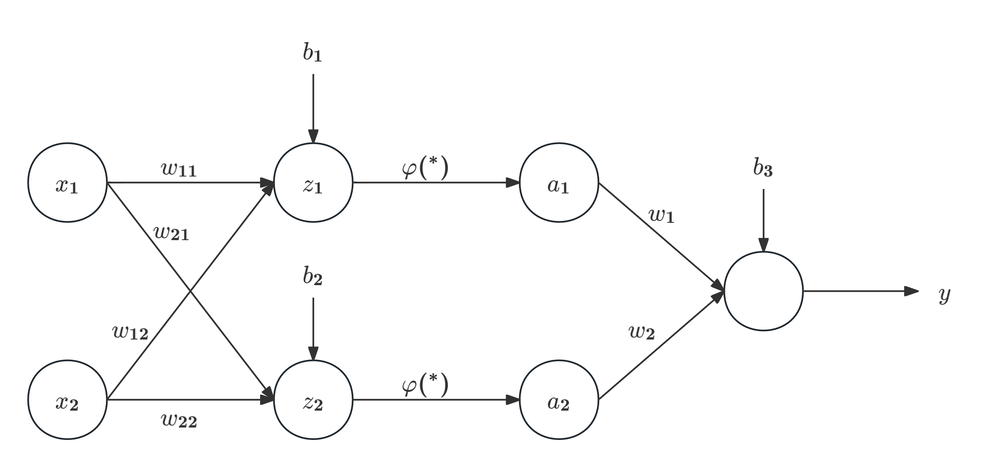

人工智能发展两大学派：
+ 数理学派（代表：支持向量机）
+ 仿生学派（代表：神经网络），其核心为模拟人类大脑对于世界的认识【**连接主义**】
# 人工神经网络（Artificial Neural Network）
+ 起源：1943年，McCulloch - Pitts（MCP）神经元模型
    + 数学形式：$\displaystyle y=\varphi\left(\sum_{i=1}^m\omega_ix_i+b\right)=\varphi\left(\sum_{i=1}^m\omega^\top\mathbf{x}+b\right)$；
    + 神经元本质为线性组合+非线性变换
## 感知器（Perceptron）
+ 1958年由Frank Rosenblatt提出，由此掀起神经网络的第一次研究热潮。
+ 模型描述：
    + 输入：若干样本$\{(x_i,y_i)\}_{i=1}^N$，其中$y_i=\pm 1$；
    + 目标：找到权重$\omega$和偏置$b$，使$y_i=\text{sgn}(\omega^\top x_i+b)$【类似支持向量机模型】
### 训练过程
1. 随机选择$\omega$和$b$
2. 取一个训练样本$(x, y)$，如果$(\omega^\top x + b)y < 0$，那么$\omega = \omega + yx,b = b + y$
    1. 若$\omega^\top x + b > 0,y = -1\Longrightarrow\omega = \omega - x$，$b = b - 1$
    2. 若$\omega^\top x + b < 0,y = +1\Longrightarrow\omega = \omega + x$，$b = b + 1$
    > 注：参数更新可设置学习率$\alpha$，即$\omega = \omega +\alpha yx,b = b + \alpha y$。
3. 再取另一个$(x, y)$，回到2，如此循环
4. 终止条件：所有样本均不满足2的条件，则退出循环，训练结束。
+ Rosenblatt已证明：只要数据线性可分，则感知器算法一定可以收敛（达到终止条件）。
<Note type="primary" title="简单证明">
  设权重向量（包括偏置）为$\tilde{\omega}=\begin{pmatrix}\omega\\1\end{pmatrix}$，样本为$\tilde{x}=\begin{pmatrix}x\\1\end{pmatrix}$（保证二者维度相同）。假设存在一个理想分类超平面$\tilde{\omega}^*$满足$\begin{cases}\|\tilde{\omega}^*\|=1\\y_i(\tilde{\omega}^{*\top})x_i\geq r>0\end{cases}$（$r$为间隔常数），则：
+ 当样本被错分时，参数更新：$\tilde{\omega}_{t+1}=\tilde{\omega}_t+\alpha y_i\tilde{x}_i$，则
    $$
    \tilde{\omega}^{*\top} \tilde{\omega}_{t+1} = \tilde{\omega}^{*\top} \tilde{\omega}_t + \alpha y_i \tilde{\omega}^{*\top} \tilde{x}_i \geq \tilde{\omega}^{*\top} \tilde{\omega}_t + \alpha r
    $$
    故迭代$T$次后，$\tilde{\omega}^{*\top} \tilde{\omega}_{T}\geq T\alpha r$。
+ 而权重的模长增长有界：
    $$
    \begin{aligned}
    \|\tilde{w}_{t+1}\|^2 &= \|\tilde{w}_t\|^2 + 2\alpha y_i \tilde{w}_t^\top \tilde{x}_i + \alpha^2 \|\tilde{x}_i\|^2\\
    &\leq\|\tilde{w}_t\|^2 + \alpha^2 \|\tilde{x}_i\|^2\\
    &\leq\|\tilde{w}_t\|^2 + \alpha^2 R^2
    \end{aligned}
    $$
    第一个不等号是因为错分样本$y_i \tilde{w}_t^\top \tilde{x}_i< 0$，而第二个不等号则是因为样本范数有界。因此$\|\tilde{\omega}_T\|^2\leq T\alpha^2 R^2$。
+ 综上可得
    $$
    T \alpha r \leq \tilde{\omega}^{*\top} \tilde{\omega}_T \leq \|\tilde{\omega}_T\| \leq \sqrt{T} \alpha R\Longrightarrow T\leq\dfrac{R^2}{r^2}
    $$
    即经过有限步参数更新后就会到达终止条件。
</Note>
+ 示例代码：
```python
import numpy as np
from sklearn.datasets import load_iris
from sklearn.preprocessing import StandardScaler

iris = load_iris() # 数据集
X = iris.data[:100, [0, 1]] # 样本
y = np.where(iris.target[:100] == 0, -1, 1) # 标签
scaler = StandardScaler() # 数据标准化
X = scaler.fit_transform(X)

# 初始化参数
learning_rate = 0.1
w = np.zeros(X.shape[1])
b = 0

# 感知机辅助函数
def sign(x, w, b):
    return np.dot(x, w) + b

# 感知机训练
is_wrong = False
epoch = 0
while not is_wrong:
    wrong_count = 0
    for i in range(len(X)):
        xi = X[i]
        yi = y[i]
        if yi * sign(xi, w, b) <= 0: # 分类错误
            w = w + learning_rate * yi * xi
            b = b + learning_rate * yi
            wrong_count += 1
    epoch += 1
    if wrong_count == 0:
        is_wrong = True
        print(f'Training finished after {epoch} epochs!')
```
可视化：

+ 与SVM相比，感知器只是找到了一个可分离样本的线性超平面，总体效果不如支持向量机。
+ 但其首次建立了机器学习的算法框架，且每次训练只需要一个样本数据，消耗资源很少，故这种训练方式被保留到了现代深度神经网络的训练过程中。
    + 相比之下，支持向量机算法的内存与时间消耗就较大，因而难以处理大规模数据。
## 前馈（多层）神经网络
+ 1969年，人工智能的先驱M.Minsky出版《感知器》一书。在书中，他举了几十个非线性可分的例子（如识别连通图和非连通图，异或问题等），用数学证明其无法用感知器解决。由于Minsky在学术界的地位和影响，其悲观论点影响极大，人工智能陷入第一次寒冬。
+ 在第一次AI寒冬中，科学家们仍然不断探索，提出了多层感知机的概念，并尝试将其作用于非线性可分问题中（比如加上非线性映射）。
+ 最终，在1986年，Rumelhart、Hinton和Williams提出了**反向传播**（Back Propagation，BP）算法，使多层神经网络的训练成为可能。
+ 一个两层的神经网络示意图如下：
    + 其中$z_1,z_2,y$为三个神经元，$\varphi(^*)$为激活函数。
+ **普适逼近定理（Universal Approximation Theorem）**：如果非线性函数是阶跃函数，那么三层神经网络可以模拟任意的非线性函数。【20世纪90年代初被证明】
<Note type="primary" title="简单解释">
一种证明思路（不大严谨，实际证明需要结合实分析知识）：
1. 先证明三层网络可以以任意精度逼近任意紧致区域的指示函数（即解决任意二分类问题）；【隐藏层可以形成任意凸多边形区域的组合】
2. 然后利用连续函数可以用有限个指示函数的线性组合（如简单函数）一致逼近这一性质证明。
</Note>
+ 下面我们进行前馈神经网络数据传递的推导。首先，我们约定以下记号：
| 记号 | 含义 |
| :---: | :---: |
|$L$| 神经网络的层数 |
|$M_l$| 第$l$层神经元的个数 |
|$\varphi_l(\cdot)$| 第$l$层神经元的激活函数 |
|$W^{(l)} \in \mathbb{R}^{M_l \times M_{l-1}}$| 第$l-1$层到第$l$层的权重矩阵 |
|$b^{(l)} \in \mathbb{R}^{M_l}$| 第$l-1$层到第$l$层的偏置 |
|$z^{(l)} \in \mathbb{R}^{M_l}$| 第$l$层神经元的净输入（净活性值） |
|$a^{(l)} \in \mathbb{R}^{M_l}$| 第$l$层神经元的输出（活性值） |
+ 那么可以建立以下递推关系：
    $$
    \begin{cases}
    z^{(l)}=W^{(l)}a^{(l-1)}+b^{(l)}\\
    a^{(l)}=\varphi(z^{(l)})
    \end{cases}
    $$
    约定$a^{(0)}=x$（即输入），最终输出为$a^{(L)}$。
### 反向传播：梯度下降算法
+ 对于给定训练集$D=\{x^{(n)},y^{(n)}\}_{n=1}^N$，前馈神经网络在$D$上的结构化风险函数为
    $$
    R(W,b)=\frac{1}{N}\sum_{i=1}^N\mathcal{L}(y^{(n)},\hat{y}^{(n)})+\frac{1}{2}\lambda\|W\|^2_F
    $$
    其中$\hat{y}^{(n)}$为$X^{(n)}$经过前馈神经网络后的预测值，$\|W\|^2_F$表示矩阵$W$的Frobenius范数（即所有元素平方和的平方根）。
+ 参数更新公式：
    $$
    \begin{aligned}
    W^{(l)} &\leftarrow W^{(l)} - \alpha \frac{\partial R(W, b)}{\partial W^{(l)}} \\
    b^{(l)} &\leftarrow b^{(l)} - \alpha \frac{\partial R(W, b)}{\partial b^{(l)}}
    \end{aligned}
    $$
+ 反向传播梯度计算公式：
    $$
    \begin{aligned}
    \frac{\partial \mathcal{L}}{\partial z^{(l)}}&=\frac{\partial \mathcal{L}}{\partial a^{(l)}}\odot\varphi'(z^{(l)})\\
    \frac{\partial \mathcal{L}}{\partial a^{(l)}}&=(W^{(l+1)})^\top\frac{\partial \mathcal{L}}{\partial z^{(l+1)}}\\
    \frac{\partial \mathcal{L}}{\partial W^{(l)}}&=\frac{\partial \mathcal{L}}{\partial z^{(l)}}\cdot(a^{(l-1)})^\top\\
    \frac{\partial \mathcal{L}}{\partial b^{(l)}}&=\frac{\partial \mathcal{L}}{\partial z^{(l)}}
    \end{aligned}
    $$
    其中$\odot$表示逐元素相乘，$\dfrac{\partial \mathcal{L}}{\partial z^{(l)}}$也称为误差项，记作$\delta^{(l)}$。
    + 综上，反向梯度的递推式为：
        $$
        \delta^{(l)}=\varphi'_l(z^{(l)})\odot((W^{(l+1)})^\top\delta^{(l+1)})
        $$
### 激活函数
按发现/使用时间排序：
1. Sigmoid型函数
    1. Logistic函数：$\sigma(x)=\dfrac{1}{1+e^{-x}}$；
    2. 双曲正切Tanh函数：$\tanh(x)=\dfrac{e^x-e^{-x}}{e^x+e^{-x}}$。
    + Sigmoid激活函数也可用于解决二分类问题（放在神经网络最后一层）；对于多分类问题，则使用Softmax激活函数$\mathrm{Softmax}(z_i) = \dfrac{e^{z_i}}{\sum_{j=1}^n e^{z_j}}$，输出概率式的结果。
    + 主要问题：当$x$较大时，梯度容易消失
2. Softplus函数（ReLU函数平滑版本）
    $$
    \text{Softplus}(x)=\log(1+e^x)
    $$
3. ReLU函数（Rectified Linear Unit，修正线性单元）【仍然为主流使用】
    $$
    \text{ReLU}(x)=\begin{cases}
    x,x\geq 0\\
    0,x< 0
    \end{cases}=\max(0,x)
    $$
    + 优点：计算上更加高效、生物学合理性（单侧抑制、宽兴奋边界）、在一定程度上缓解梯度消失问题；
    + 缺点（死亡ReLU问题）：神经元在训练过程中可能因输入长期为负，导致其输出恒为$0$且梯度无法更新，从而永久失去学习能力。
4. 带泄露的ReLU函数（Leaky ReLU）
    $$
    \text{LeakyReLU}(x)=\begin{cases}
    x,x> 0\\
    \gamma x,x\leq 0
    \end{cases}=\max(0,x)+\gamma\min(0,x)
    $$
5. ELU（指数线性单元）函数
    $$
    \text{ELU}(x)=\begin{cases}
    x,x> 0\\
    \alpha (e^{x}-1),x\leq 0
    \end{cases}
    $$
    + 优点：在原点处函数连续，这样能够加快函数收敛。
    + 变体1（SELU）：对函数整体乘以缩放因子$\lambda$，可以使每一层的输出均值和方差能够自动趋于稳定。
6. GELU（高斯误差线性单元）函数【BERT，Transformer使用】
    $$
    \text{GELU}(x)=x\Phi(x)
    $$
    其中$\Phi(\cdot)$是标准正态分布的累积分布函数。
    + 另一个类似的激活函数是Swish函数：$\text{Swish}(x)=x\sigma(x)$。
## 深度神经网络及其优化
+ 在BP算法提出后不久，SVM的出现加上神经网络梯度消失的问题导致神经网络再次陷入低谷。
+ 深度神经网络是层数比较多的神经网络，具有强大的特征提取的能力。但其也面临以下挑战：
    1. 难以找到最优解
        + 存在多个局部最优解（受超参数初始化影响）
        + 存在鞍点（不同方向梯度符号不同）
        + 可能有平坦局部解，对某些超参数的微小扰动不敏感
    2. 训练困难
        + 梯度消失/梯度爆炸
    3. 训练效果不稳定
        + 存在过拟合问题（模型过于复杂，参数量远大于数据量）
        + 泛化能力差
### 优化算法
1. 随机梯度下降（Stochastic Gradient Descent，SGD）
    + 核心：每次用一小部分数据（称为Mini-batch）更新模型【一个Epoch训练次数=总样本数/batch size】
    + 与Batch GD相比，虽然收敛速度慢一些（梯度方向存在噪声），但可以大量节省消耗空间，提高训练效率
2. 动量法（Momentum）【让SGD更稳定】
    + 核心：给梯度加惯性
    + 公式：$\Delta\theta_t=\rho\Delta\theta_{t-1}-\alpha g_t$
        + 其中$g_t$为第$t$次梯度，$\rho$为动量因子（通常设为$0.9$），$\alpha$为学习率。
3. AdaGrad和RMSProp【解决不同维度梯度大小不同，SGD易走“之字形”的问题】
    + 核心：不同维度用不同学习率，梯度大的维度学习率小一点
    + AdaGrad：使用之前所有的梯度
        $$
        G_t=\sum_{\tau=1}^tg_\tau\odot g_\tau\Longrightarrow\Delta\theta_t=-\frac{\alpha}{\sqrt{G_t+\epsilon}}\odot g_t
        $$
        其中$G_t$为梯度各个分量的平方和组成的向量按时间累积求和。
    + RMDProp：只看最近的梯度，采用滑动平均
        $$
        G_t = \beta G_{t-1} + (1 - \beta)g_t \odot g_t= (1 - \beta) \sum_{\tau=1}^t \beta^{t-\tau} g_\tau \odot g_\tau
        $$
        其中$\beta$为衰减率，一般取$0.9$。$\Delta\theta_t$更新公式同上。
3. Adam（Adaptive Moment Estimation）：动量法+RMSProp
    + 滑动平均：
        $$
        \begin{cases}
        M_t = \beta_1 M_{t-1} + (1 - \beta_1) g_t\\
        G_t = \beta_2 G_{t-1} + (1 - \beta_2) g_t \odot g_t
        \end{cases}
        $$
    + 偏差修正：
        $$
        \begin{cases}
        \hat{M}_t = \dfrac{M_t}{1 - \beta_1^t}\\[10pt]
        \hat{G}_t = \dfrac{G_t}{1 - \beta_2^t}
        \end{cases}
        $$
    + 更新：
        $$
        \Delta\theta_t=-\frac{\alpha}{\sqrt{\hat{G}_t+\epsilon}}\hat{M_t}
        $$
### 其他优化方法
1. 数据预处理（如Z-score）
    + 使不同维度数据范围相同，为参数初始化和训练提供稳定基础
2. 参数初始化
    + 设$d$为神经网络某一层的神经元个数，则对这一层的参数$(W,b)$，由以下初始化方法：
    1. Xavier初始化（适用sigmoid激活函数）：从$\left(-\dfrac{1}{\sqrt{d}},\dfrac{1}{\sqrt{d}}\right)$中随机取值；
    2. Kaiming初始化（适用ReLU）：从$N\left(0,\dfrac{2}{d}\right)$中随机取值【现代深度学习使用】
        + 因为ReLU会丢失一半信息，故方差变为两倍。
3. 批量归一化（Batch Normalization）
    + 在训练过程中，每一层输出的分布不断变化，后面层需要不断适应，这会导致训练不稳定、收敛慢。我们希望数据落在激活函数最敏感的区域，因此我们把每一层的输出“重新拉回稳定范围”。
    + 核心：对每个mini-batch进行标准化：$\hat{x}=\dfrac{x-\hat{\mu}_B}{\hat{\sigma}_B}$【放在线性层$z^{(l)}$和激活层$a^{(l)}$之间】
    + 但如果每次都做标准化，模型的表达能力可能被限制，故再引入两个参数让模型决定是否对数据进行缩放/平移：$y=\gamma\hat{x}+\beta$
4. 正则化（Regularization）
    + 如果模型过于复杂，会导致过拟合。故最简单的方法可以限制参数不要太大。常见正则化方法如下：
    1. Ridge：使用二阶范数限制，可以让权重尽量小，但不一定为$0$；
    2. Lasso：使用一阶范数限制，可把一些权重直接变成$0$；
    3. 提前停止（Early Stopping）：使用验证集来测试每一次迭代的参数在验证集上是否最优。如果在验证集上的错误率不再下降，就停止迭代
    4. Dropout：每次SGD更新时以概率$p$随机移除神经元，对保留神经元的权重乘上$\dfrac{1}{1-p}$补偿。【相当于训练了很多个子网络，再取平均】
+ 2006年，Hinton团队在[论文](https://www.cs.toronto.edu/~hinton/absps/science.pdf)中使用分层预训练有效解决了深层神经网络训练困难的问题，并正式提出“深度学习”这一概念，将神经网络重新拉回大众视野。
+ 2012年AlexNet的成功进一步推动深度神经网络的发展，开启深度学习热潮至今。
