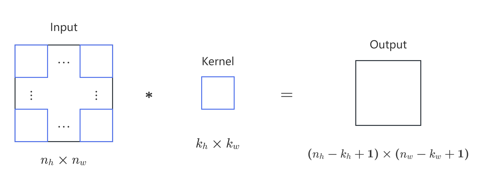

+ 早在1998年，由杨立昆等人发明的LeNet-5就在手写数字识别上取得成功。
+ 但在此后的十余年间，由于数据、算力等多方面原因，CNN陷入沉寂。彼时的图像识别主流策略是人工设计特征并提取，然后使用SVM分类。【“特征工程”是核心】
+ 而在2012年的ImageNet挑战赛中，AlexNet依靠大量数据+GPU算力+多种优化算法（ReLU、Dropout、数据增强等）一举击败所有手工提取特征的方法。AlexNet的成功也推动了卷积神经网络的复兴，计算机视觉领域开始大量研究应用深度学习方法。【核心思想：特征应该被学习，而不是被设计】
# 卷积神经网络（CNN）
+ 第一个问题：CNN学到的究竟是什么特征？
    + 低层：模型学习到了一些类似于传统滤波器的特征抽取器（边缘，颜色，纹理）。
    + 中层：建立在这些底层表示的基础上，以表示更大的特征（眼睛、鼻子、草叶等）。
    + 高层：可以检测整个物体，如人、飞机、狗或飞盘。
+ 由此可见，CNN的核心在于自动构建“层次化特征”。【模型自主“理解世界”】
## CNN的基本操作
1. 卷积
    + 一张图如何合理地转换为数据？如果直接将所有像素拼接成一个向量，效果不佳（一方面维度太高，另一方面会丢失像素的邻近关系与空间结构）
    + 于是我们考虑另一种策略——对局部区域建模，并使用卷积（convolution）进行运算。
        > 在数学中，卷积运算可以理解为将一个函数进行翻转然后与另一个函数滑动求和。而在这里，函数变为矩阵，翻转则对应为转置，最终运算为内积，即加权求和。（这一部分理论可参见[马同学的文章](https://www.zhihu.com/question/22298352)）
    + 图示：
    其中：
        + 卷积核（Kernel）的参数通过神经网络学习；【有时卷积核也称为滤波器（filter），主要用于图像处理】
        + 卷积结果（也称为**特征图**，feature map）反映局部区域与卷积核（特征）的匹配程度/相似度。
        + 数学表达式：$y=\varphi(w_1x_1+w_2x_2+\cdots+w_nx_n+b)$（即在加权求和后再经过激活函数得到输出结果）
2. 填充（padding）
    + 目标：防止边缘像素丢失（卷积会导致输出图变小）
    + 操作：在图像边缘补一圈$0$（默认对称填充）
    + 当$\mathrm{padding}=\dfrac{k_w-1}{2}$时，输出图尺寸与输入图一样。故卷积核尺寸一般为奇数【存在中心像素】。
3. 步幅（step）
    + 目标：防止卷积计算量过大（降低分辨率，减少数据量【不丢失重要信息】）
    + 操作：设置卷积核水平与垂直单次移动像素数量。步幅越大，输出越小（也称为**下采样**，downsampling）。
4. 池化（pooling）
    + 另一种下采样方法，操作为在一个小区域内取代表值（最大/平均）
    + 独立于卷积操作，同样有窗口大小，步幅，填充参数
    <Note type="primary" title="计算公式">
    已知输入图大小为$n_h\times n_w$，卷积核大小为$k_h\times k_w$，步幅为$s$，填充为$p$，卷积后再接一个$m\times m$最大池化（步幅为$1$，无填充）。那么：
        + 卷积操作后，输出特征图大小为：
            $$
            \left(\left\lfloor \frac{n_h + 2p - k_h}{s} \right\rfloor + 1\right) \times \left(\left\lfloor \frac{n_w + 2p - k_w}{s} \right\rfloor + 1\right)
            $$
        + 池化操作后，输出特征图大小为：
            $$
            \left(\left\lfloor \frac{n_h + 2p - k_h}{s} \right\rfloor -m+2\right) \times \left(\left\lfloor \frac{n_w + 2p - k_w}{s} \right\rfloor -m+2\right)
            $$
    </Note>
5. 多输入通道（如RGB三颜色通道）
    + 此时需要多通道卷积核（**仍然是一个卷积核**），分别运算卷积并相加（得到一个特征图）。
6. 多输出通道
    + 因为一个卷积核找一种特征，所以如果想找多个特征（检测边缘/纹理/颜色变化……），就会使用多个卷积核
    + 卷积核数 = 输出通道数 = 特征检测器数
## LeNet-5实现
+ 参考图（图源[维基百科](https://en.wikipedia.org/wiki/LeNet)）：
+ 输入为$28\times 28$图像（填充至$32\times 32$），最终输出$10$类之一（$0\sim 9$）。
+ 参数统计：
    + 输入层$\Longrightarrow$卷积层1：$(5\times 5+1)\times 6=156$【$6$个$5\times 5$卷积核（带偏置）】
    + 池化层1$\Longrightarrow$卷积层2：$(5\times 5\times 6+1)\times 16=2416$【$16$个$6\times 5\times 5$卷积核（带偏置）】
    + 池化层2$\Longrightarrow$全连接层1：$(5\times 5\times 16+1)\times 120=48120$【特征图展平为向量（带偏置），乘以神经元个数】
    + 全连接层1$\Longrightarrow$全连接层2：$(120+1)\times 84=10164$【第一层神经元个数（+偏置）乘以第二层神经元个数，下同】
    + 全连接层2$\Longrightarrow$全连接层3：$(84+1)\times 10=850$

    总计$61706$个参数。【主要在最后的全连接神经网络中】
## AlexNet的改进
+ 相比LeNet，AlexNet更大更深，通道更多，并第一次引入GPU进行大规模训练。具体架构可参考[原论文](https://proceedings.neurips.cc/paper_files/paper/2012/file/c399862d3b9d6b76c8436e924a68c45b-Paper.pdf)及如下图示（图源维基百科）：

## 批量归一化
+ 之前我们已经提到，对于前馈神经网络，对于全连接层，批量归一化层会置于全连接层中的线性变换和激活函数之间。
+ 而对于卷积神经网络，若存在多个输出通道，则对每个通道分别做BN。表达式：$h=\varphi(\text{BN}(W\mathbf{x}+b))$。
    + 每个通道都有自己的拉伸和偏移参数
    + 假设小批量包含$m$个样本，每个卷积通道输出高度$p$和宽度$q$，则在$m\times p\times q$个元素上执行BN【注意不是在单个像素/单张图片上执行BN】
## ResNet（残差网络）
+ AlexNet之后，研究者曾尝试不断增加网络层数以优化模型表现。然而，研究发现：网络越深，训练与测试效果不一定越好。
    + 核心问题在于：模型越复杂，训练难度越高。（增加网络层数，理论上模型应该可以学习到让冗余的层数“什么都不做”，但神经网络很难学到“什么都不做”。
+ 于是，2015年何凯明等人发明了[ResNet](https://www.cv-foundation.org/openaccess/content_cvpr_2016/papers/He_Deep_Residual_Learning_CVPR_2016_paper.pdf)，提出一种解决方法：先把输入$x$直接保留下来，然后只需要学习残差$f(x)$，即**残差连接（Residual Connection）**。
+ ResNet让优化变得更简单了，因为残差连接提供了一条“捷径路径”，使梯度可以直接传播到前面层，缓解梯度消失；通过堆叠残差块，网络可以堆叠到上千层。
+ 残差网络对随后深层神经网络设计产生了深远影响。不同的残差块结构如图（图源动手学机器学习课程）：

