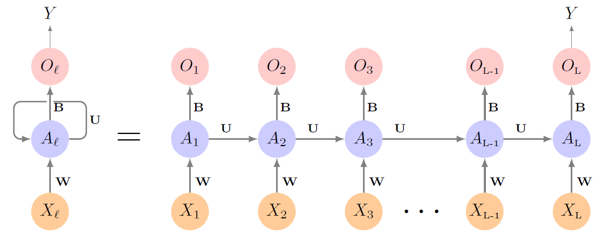

> 在讲RNN之前，来了一位新老师讲了语言模型和Word Embedding，经过笔者思考决定将其放到自然语言处理系列笔记中（挖坑doge）
+ 对于一些特定的任务，如机器翻译、情感分类、语音识别等，因为数据具有时序性，所以需要神经网络具备“记忆”功能。
+ 而前馈神经网络与卷积神经网络都无法处理序列数据，于是催生出循环神经网络。
# 循环神经网络（RNN）
+ 循环神经网络架构的建立可追溯至1982年的霍普菲尔德网络（Hopfield Network）。
    + 1986年，Jordan Network被提出，建立了早期的循环网络；
    + 1990年，Elman Network被提出，建立了真正意义上全连接的简单循环网络。
+ 循环神经网络可以处理的任务包括：
    + 一对一：固定输入到固定输出，如图像分类
    + 一对多：固定输入到序列输出，如图像文字描述
    + 多对一：序列输入到固定输出，如情感分类
    + 多对多：序列输入到序列输出，如机器翻译
    + 同步多对多：如视频帧动作分类
+ RNN的架构图（基于Elman Network）：
    + 在序列的每一步中都使用相同的权重$W$、$U$和$B$，因此称为循环（recurrent）。
    + 隐藏状态更新与输出公式为：
        $$
        \begin{aligned}
        A_l&=\varphi(UA_{l-1}+WX_l+b)\\
        O_l&=g(BA_l+c)
        \end{aligned}
        $$
        即隐藏状态随着处理每个输入不断更新，且包含所有历史信息。
+ 损失函数（基于时间反向传播BPTT）：
    $$
    \sum_{i=1}^n (y_i - o_{iL})^2 = \sum_{i=1}^n \left\{ y_i - \left[\beta_0 + \sum_{k=1}^K \beta_k g\left( \underbrace{w_k}_{\text{bias}} + \underbrace{\sum_{j=1}^p w_{kj} x_{iL_j}}_{\text{input}} + \underbrace{\sum_{s=1}^K u_{ks} a_{i,L-1,s}}_{\text{hidden state}} \right) \right] \right\}^2
    $$
    其中$n$为样本总量，$L$为时间步长，$K$为隐藏层神经元数量，$p$为输入向量维度。
## LSTM
+ RNN模型存在的问题：
    + 模型需要**长期记忆**，而RNN每一步都要更新隐藏状态，把过去的信息压缩进去，导致每一步都在“覆盖”之前的信息，因而容易忘记**长期信息**。【梯度消失/爆炸】
+ 1997年，由Hochreiter和Schmidhuber提出的长短时记忆（LSTM）架构有效解决了这一问题。
+ 其核心在于在隐藏状态之外加入了记忆单元$C_t$和四个“门”：
    + 遗忘门$F_t$：决定删去多少旧记忆；
    + 输入门$I_t$：决定写入多少新信息；
    + 候选记忆门$\tilde{C_t}$：生成候选的新信息内容；
    + 输出门$O_t$：决定输出多少信息。
+ 公式：
    $$
    \begin{aligned}
    F_t&=\sigma(X_tW_{Xf}+H_{t-1}W_{hf}+b_f)\\
    I_t&=\sigma(X_tW_{Xi}+H_{t-1}W_{hi}+b_i)\\
    O_t&=\sigma(X_tW_{Xo}+H_{t-1}W_{ho}+b_o)\\
    \tilde{C_t}&=\tanh(X_tW_{Xc}+H_{t-1}W_{hc}+b_c)\\
    C_t&=F_t\odot C_{t-1}+I_t\odot\tilde{C_t}\\
    H_t&=O_t\odot\tanh(C_t)
    \end{aligned}
    $$
+ 应用：在2014~2017年之间，图像文本描述/视频分析领域使用CNN + LSTM的方法非常成功，因而成为主流方法。
+ 然而，2017年一篇论文的出现打破了这一范式——
# Transformer
> 呃，笔者又看了下课程的PPT，写的也太简略了，还不如之前人工智能导论的详细。所以这里就直接放上之前笔记的链接，之后有机会再补……  

[Transformer与大语言模型](https://souyerin.netlify.app/posts/computer-science/introduction-to-ai/%E4%BA%BA%E5%B7%A5%E6%99%BA%E8%83%BD%E5%AF%BC%E8%AE%BA-ch8-%E5%A4%A7%E8%AF%AD%E8%A8%80%E6%A8%A1%E5%9E%8B/)
