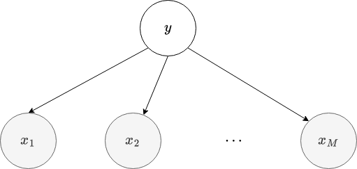

在继续机器学习的学习之前，先介绍几个前面没有涉及到的概念：
1. 生成模型与判别模型  
    生成方法与判别方法是监督学习的两大方法，二者的主要区别在于：
    + 生成方法由数据学习联合概率分布$P(\mathbf{x},y)$，然后求出条件概率分布$P(y|\mathbf{x})$作为预测的模型；【通过对联合分布采样可得到新样本】
    + 判别方法则由数据直接学习函数$f(\mathbf{x})$或者条件概率分布$P(y|\mathbf{x})$作为预测的模型。

    生成模型的优势在于当训练数据较少时能具备更好的泛化能力，而判别模型通常在预测任务上表现更好，且适用于拟合大规模数据。
2. 概率图模型  
    概率图模型是可以由有向图（称为贝叶斯网络）或者无向图（称为马尔可夫随机场）表示的概率模型，其一定满足条件独立假设（即多元变量的联合概率可表示为条件概率的乘积）

在[Introduction](/posts/computer-science/machine-learning/机器学习方法-ch1-introduction/#分类模型)中，我们提到理论最优的机器学习分类模型是贝叶斯分类器，然而这一模型难以直接实现。而朴素贝叶斯法就是在贝叶斯分类器的基础上对样本进行条件限制，从而使其容易实现。
# 朴素贝叶斯模型
+ 朴素贝叶斯模型的本质是贝叶斯定理：
    $$
    P(y|\mathbf{x})=\frac{P(\mathbf{x},y)}{P(\mathbf{x})}=\frac{P(y)P(\mathbf{x}|y)}{P(\mathbf{x})}
    $$
    其中$P(y|\mathbf{x})$为后验概率分布，$P(y)$为先验概率分布，$P(\mathbf{x}|y)$为似然函数，$P(\mathbf{x})$为证据。【可参考[贝叶斯估计](https://souyerin.netlify.app/posts/mathematics/数理统计-Cheat-Sheet/#贝叶斯估计)理解】
    + 这里只考虑离散输入的情形：记输入特征数为$M$（输入$\mathbf{x}=(x_1,x_2,\cdots,x_M)^\top$），每个特征有$L$个可能特征值，输出空间共$K$个类别，那么模型可以表示为
        $$
        P(y|x_1,\cdots,x_M)=\frac{P(y)P(x_1,\cdots,x_M|y)}{P(x_1,\cdots,x_M)}
        $$
        其中$x_j\in A_j=\{a_{j1},a_{j2},\cdots,a_{jL}\},j=1,2,\cdots,M$，$y\in\{c_1,\cdots,c_K\}$。
+ 朴素贝叶斯的另一核心在于**条件独立假设**：分类的特征在类别确定的条件下都是相互独立的，其可表示为
    $$
    P(x_1,\cdots,x_M|y)=\prod_{i=1}^MP(x_i|y)
    $$
    于是模型表达式就变为
    $$
    P(y|\mathbf{x})=\frac{\displaystyle P(y)\prod_{i=1}^MP(x_i|y)}{P(\mathbf{x})}\propto P(y)\prod_{i=1}^MP(x_i|y).
    $$
    因为分母在分类中保持不变，所以朴素贝叶斯模型的目标就是求输入$\mathbf{x}$与输出$y$的联合分布。
+ 朴素贝叶斯模型属于生成模型，也是最简单的概率图模型（贝叶斯网络）。其图示如下：
+ 相比贝叶斯分类器，朴素贝叶斯模型牺牲了一定的分类正确率，但能够将参数量从$O(K\cdot L^M)$降到$O(K\cdot L\cdot M)$，从而大大降低模型复杂度。
+ 在训练后进行分类任务时，对于给定输入$\mathbf{x}$，模型会输出后验概率最大的类别，即
    $$
    \hat{y}=\argmax_yP(y)\prod_{i=1}^MP(x_i|y).
    $$
+ 当输出为二分类，输入特征空间也为$\{0,1\}$时，朴素贝叶斯模型条件概率的对数形式恰为一个线性判别函数。这说明生成模型与判别模型之间存在一定的联系。
## 模型学习算法
+ 朴素贝叶斯模型的训练目标可以分解为估计先验分布$P(y=c_k)$和条件概率分布$\displaystyle P(\mathbf{x}|y=c_k)=\sum_{j=1}^MP(x_j|y=c_k)$（$k=1,2,\cdots,K$）：
    + 对数似然函数为
        $$
        \ell = -\sum_{i=1}^N \log P(x_i, y_i) = -\sum_{i=1}^N \log P(y_i) - \sum_{i=1}^N \sum_{j=1}^M \log P(x_{ij}| y_i)
        $$
        得到极大似然估计（本质是用频率估计概率）
        $$
        \begin{aligned}
        P(y = c_k) &= \frac{\displaystyle\sum_{i=1}^N I(y_i = c_k)}{N}, \quad k = 1, 2, \cdots, K \\
        P(x_j = a_{jl} \mid y = c_k) &= \frac{\displaystyle\sum_{i=1}^N I(x_{ij} = a_{jl}, y_i = c_k)}{\displaystyle\sum_{i=1}^N I(y_i = c_k)}, \quad j = 1, 2, \cdots, M, \quad l = 1, 2, \cdots, L, \quad k = 1, 2, \cdots, K
        \end{aligned}
        $$
    + 通过学习得到这些概率估计后，对于待预测输入$\mathbf{x}=(x_1,\cdots,x_M)^\top$，计算后验概率，并返回概率最大的类别
        $$
        \hat{y}=\argmax_{c_k}P(y=c_k)\prod_{i=1}^MP(x_i|y=c_k).
        $$
## 贝叶斯估计与拉普拉斯平滑
+ 有时因为样本量较少，可能出现某个似然概率为$0$，导致分类结果出现较大偏差。为避免这一情形，我们会考虑引入超参数$\alpha$，将条件概率和先验概率估计修改如下：
    $$
    \begin{aligned}
    P_\alpha(x_j = a_{jl} \mid y = c_k) &= \frac{\displaystyle\sum_{i=1}^N I(x_{ij} = a_{jl}, y_i = c_k) + \alpha}{\displaystyle\sum_{i=1}^N I(y_i = c_k) + \alpha L},\\
    P_\alpha(y = c_k) &= \frac{\displaystyle\sum_{i=1}^N I(y_i = c_k) + \alpha}{N + \alpha K}.
    \end{aligned}
    $$
    其中$\alpha\geq 0$（特别地，当$\alpha=1$时称为拉普拉斯平滑）。可以验证这就是类别先验分布为狄利克雷分布时的贝叶斯估计。
    