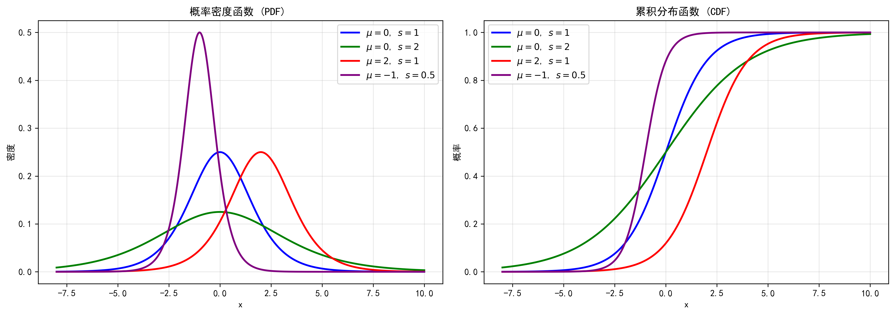

在[Introduction](/posts/computer-science/machine-learning/机器学习方法-ch1-introduction/#分类模型)中，我们简单提到了Logistic回归模型，这是最简单也是最常见的分类模型。本节我们将从最基本的二项逻辑斯蒂回归开始，推广到多项逻辑斯蒂回归，然后和最大熵模型进行比较。
# 逻辑斯蒂回归模型
## Logistic分布
+ 首先定义Logistic分布的分布函数与概率密度函数：
    $$
    \begin{aligned}
    F(x)&=\frac{1}{1+e^{-\frac{x-\mu}{s}}}\\
    f(x)&=\frac{e^{-\frac{x-\mu}{s}}}{s\left(1+e^{-\frac{x-\mu}{s}}\right)^2}
    \end{aligned}
    $$
    其中$\mu\in\R$为位置参数，$s>0$为形状参数。分布图像如下：
    可以看到分布函数呈S形（Sigmoid函数就是$\mu=0,s=1$时的曲线），且关于$\displaystyle\left(\mu,\frac{1}{2}\right)$中心对称。
## 二项逻辑斯蒂回归
+ 二项逻辑斯蒂回归模型的输出是二分类，其条件概率分布为参数化的Logistic分布，即
    $$
    \begin{aligned}
    P(y=1|\mathbf{x})&=\frac{1}{1+e^{-(\mathbf{w}\cdot\mathbf{x}+b)}}\\
    P(y=0|\mathbf{x})&=\frac{e^{-(\mathbf{w}\cdot\mathbf{x}+b)}}{1+e^{-(\mathbf{w}\cdot\mathbf{x}+b)}}\\
    \end{aligned}
    $$
    其中$\mathbf{x}$为$M$维特征向量，$\mathbf{w}$为$M$维权重向量，$b$为偏置。模型就是根据两个条件概率的大小比较得到最终的输出。
    > 有时也将偏置项并入权重向量，即$\mathbf{w}=(w_1,w_2,\cdots,w_M,b)^\top,\mathbf{x}=(x_1,x_2,\cdots,x_M,1)^\top$。
+ 这个模型也可以看作对输入进行仿射变换（线性变换+平移）后，再经过一次非线性（Sigmoid）变换。【其输出与[前馈神经网络](/posts/computer-science/machine-learning/机器学习方法-ch3-人工神经网络/#激活函数)中神经元的变换等价】
+ 与线性模型的关系：考虑对数几率（logit函数）
    $$
    \text{logit}(P)=\log\frac{P}{1-P}
    $$
    那么将上述两个概率代入得
    $$
    \begin{aligned}
    \log\frac{P(y=1|\mathbf{x})}{1-P(y=1|\mathbf{x})}&=\mathbf{w}\cdot\mathbf{x}+b\\
    \log\frac{P(y=0|\mathbf{x})}{1-P(y=0|\mathbf{x})}&=-(\mathbf{w}\cdot\mathbf{x}+b)   
    \end{aligned}
    $$
    因此模型具有良好的解释性：每一维特征对应的权重表示该特征对分类的贡献（大小与方向）。
+ 二项逻辑斯蒂回归模型还有另一种形式——分类标签$y=\{-1,+1\}$。此时考虑负对数损失函数（分类模型的目标是正确输出条件概率尽量接近$1$），那么
    $$
    \begin{aligned}
    -\log_2 P(y = +1 | \mathbf{x}) &= -\log_2 \frac{1}{1 + e^{-(\mathbf{w} \cdot \mathbf{x} + b)}}\\
    &= \log_2 \left[1 + e^{-y f(\mathbf{x})}\right],\\[10pt]
    -\log_2 P(y = -1 | \mathbf{x}) &= -\log_2 \frac{e^{-(\mathbf{w}\cdot \mathbf{x} + b)}}{1 + e^{-(\mathbf{w} \cdot \mathbf{x} + b)}}\\
    &= \log_2 \left[1 + e^{-y f(\mathbf{x})}\right] 
    \end{aligned}
    $$
    因此可以统一为对数损失或逻辑斯谛损失$\log_2 \left[1 + e^{-y f(\mathbf{x})}\right]$。
