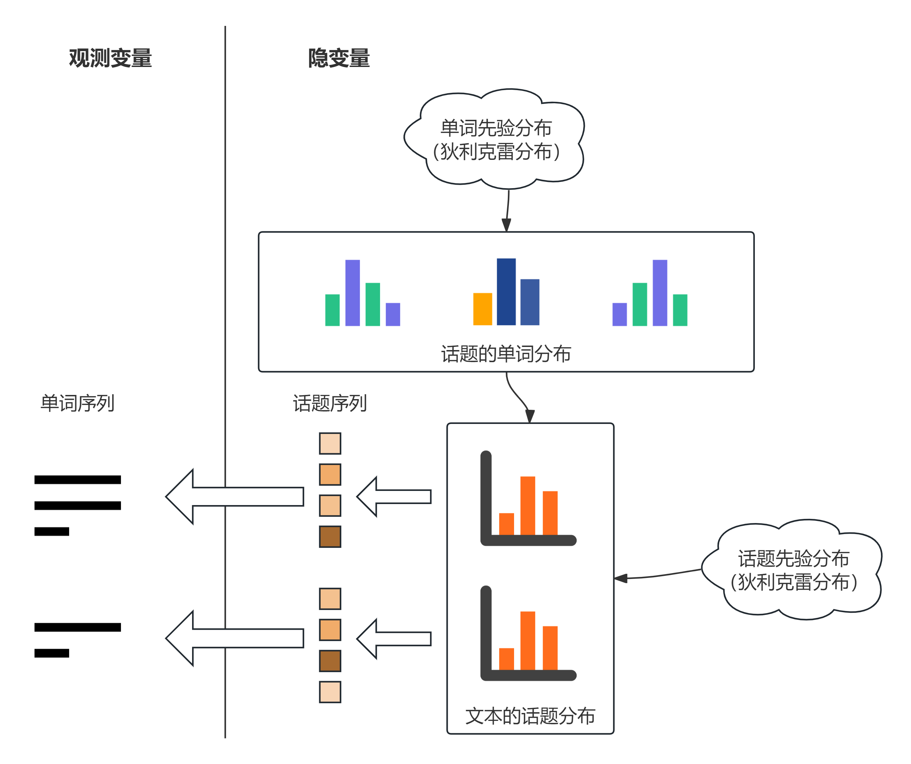

# 潜在狄利克雷分配
+ 潜在狄利克雷分配（latent狄利克雷allocation, LDA）于2002年由Blei等提出。它和概率潜在语义分析都属于概率主题建模方法，二者之间的差异恰好反映了频率学派与贝叶斯学派对参数估计上的不同理解：
    + PLSA将模型参数看作是固定的未知常数，使用类似点估计的方法进行参数估计；
    + LDA则将模型参数看作是服从特定分布的随机变量，引入了狄利克雷先验分布，并通过观察到的数据来修正这个先验，得到后验分布。

    研究表明，虽然LDA更加复杂，但其模型性能比PLSA更好，泛化能力也更强。
## 狄利克雷分布
简要回顾一些概率论与数理统计的知识：
1. 多项分布  
    重复进行$n$次独立随机试验，每次试验可能出现的结果有$k$种，第$i$种结果出现的概率为$\theta_i$，出现的次数为$n_i$。
    + 如果用随机变量$\mathbf{x}=(x_1,x_2,\cdots,x_k)^\top$表示试验所有可能结果的次数（其中$x_i$表示第$i$种结果出现的次数），那么随机变量$\mathbf{x}$服从多项分布，对应概率密度函数为
        $$
        \begin{aligned}
        P(x_1 = n_1, x_2 = n_2, \cdots, x_k = n_k) 
        &= \frac{n!}{n_1!n_2!\cdots n_k!} \theta_1^{n_1} \theta_2^{n_2} \cdots \theta_k^{n_k} \\
        &= \frac{n!}{\displaystyle\prod_{i=1}^k n_i!} \prod_{i=1}^k p_i^{n_i}
        \end{aligned}
        $$
        也记作$\mathbf{x}\sim\text{Mult}(n,\boldsymbol{\theta})$，其中$\displaystyle\boldsymbol{\theta}=(\theta_1,\cdots,\theta_k)^\top,n=\sum_{i=1}^k n_i$。
    + 特别地，当$n=1$时，多项分布退化为类别分布，表示表示试验可能出现的$k$种结果的概率。
2. 狄利克雷分布  
    在贝叶斯学习中，狄利克雷分布常作为多项分布的先验分布使用。其定义如下：
    + 若多元连续随机变量$\boldsymbol{\theta}= (\theta_1, \theta_2, \cdots, \theta_k)^\top$的概率密度函数为
        $$
        p(\boldsymbol{\theta}| \alpha) = \frac{\displaystyle\Gamma \left( \sum_{i=1}^k \alpha_i \right)}{\displaystyle\prod_{i=1}^k \Gamma(\alpha_i)} \prod_{i=1}^k \theta_i^{\alpha_i - 1} 
        $$
        其中
        $$
        \sum_{i=1}^k \theta_i = 1, \theta_i \geq 0, \boldsymbol{\alpha} = (\alpha_1, \alpha_2, \cdots, \alpha_k)^\top, \alpha_i > 0, i = 1, 2, \cdots, k
        $$
        $\Gamma(\cdot)$表示Gamma函数，则称随机变量$\boldsymbol{\theta}$服从参数为$\boldsymbol{\alpha}$的狄利克雷分布，记作$\boldsymbol{\theta}\sim \text{Dir}(\boldsymbol{\alpha})$。
    + 上述概率密度函数表达式也可用多元Beta函数表示：记$\Beta(\boldsymbol{\alpha})=\frac{\displaystyle\prod_{i=1}^k\Gamma(\alpha_i) }{\displaystyle \Gamma \left( \sum_{i=1}^k \alpha_i\right)}$，则有
        $$
        p(\boldsymbol{\theta}|\boldsymbol{\alpha}) = \frac{1}{\Beta(\boldsymbol{\alpha})} \prod_{i=1}^k \theta_i^{\alpha_i - 1} 
        $$
        特别地，当$k=2$时，就得到Beta分布。
+ 狄利克雷分布有一些重要性质：
    + 狄利克雷分布属于指数分布族；
    + 狄利克雷分布是多项分布的共轭先验分布。【共轭先验分布概念可参见[数理统计 Cheat Sheet](https://souyerin.netlify.app/posts/mathematics/数理统计-cheat-sheet/#共轭先验分布)】
        + 具体而言，当总体分布$D\sim\text{Mult}(n,\boldsymbol{\theta})$，$\boldsymbol{\theta}$先验分布为$\text{Dir}(\alpha)$，那么其后验分布为$\text{Dir}(\alpha+n)$。因此$\boldsymbol{\alpha}$也被称作先验伪计数（prior pseudo-counts）。
## LDA模型
+ LDA是文本集合的生成概率模型。模型假设话题由单词的多项分布表示，文本由话题的多项分布表示，单词分布和话题分布的先验分布都是狄利克雷分布。
    + 严格意义上说，这里的多项分布都是类别分布，不过在机器学习与自然语言处理中，有时对两者不作严格区分。
+ LDA的文本集合的生成过程示意图如下：
    利用LDA进行话题分析就是对给定文本集合，学习到每个文本的话题分布，以及每个话题的单词分布。
+ 下面给出模型的符号定义：
    + 单词、文本、话题集合符号沿用[上一讲](/posts/computer-science/machine-learning/机器学习方法-ch13-潜在语义分析/)；
    + 设所有文本的长度均为$l$，且每个文本$d_i$都有对应可观测的单词序列$W_i=w_{i1},\cdots,w_{il}$与不可观测的话题序列$Z_i=z_{i1},\cdots,z_{il}$；
    + 每个话题$z_i$可由单词的条件概率分布$P(w|z_i),w\in\mathcal{W}$表示，其服从多项（类别）分布，参数用$\boldsymbol{\varphi}_i=(\varphi_{i1},\cdots,\varphi_{im})$表示，因而整个话题的参数可用矩阵$\boldsymbol{\varphi}=(\boldsymbol{\varphi}_1,\cdots,\boldsymbol{\varphi}_k)$表示。【$\boldsymbol{\varphi}_i\sim\text{Dir}(\boldsymbol{\beta}),\boldsymbol{\beta}=(\beta_1,\cdots,\beta_m)^\top$】
    + 每个文本$d_j$可由话题的条件概率分布$P(z|d_j),z\in\mathcal{Z}$表示，同样服从多项（类别）分布，参数用$\boldsymbol{\theta}_i=(\theta_{i1},\cdots,\theta_{ik})$表示，因而整个文本的参数可用矩阵$\boldsymbol{\theta}=(\boldsymbol{\theta}_1,\cdots,\boldsymbol{\theta}_n)$表示。【$\boldsymbol{\theta}_i\sim\text{Dir}(\boldsymbol{\alpha}),\boldsymbol{\alpha}=(\alpha_1,\cdots,\alpha_m)^\top$】
+ 由此可得LDA文本生成算法如下：
    1. 对于话题$z_i$（$i = 1, 2, \cdots, k$）：生成多项分布参数$\boldsymbol{\varphi}_i \sim \text{Dir}(\boldsymbol{\beta})$作为话题的单词分布$p(w|z_k)$。
    2. 对于文本$d_i$（$i = 1, 2, \cdots, n$）：生成多项分布参数$\boldsymbol{\theta}_i \sim \text{Dir}(\boldsymbol{\alpha})$作为文本的话题分布$p(z|d_n)$。
    3. 对于文本$d_i$的单词$w_{ij}$（$i = 1, 2, \cdots, n,\, j = 1, 2, \cdots, l$）：生成话题$z_{ij} \sim \text{Mult}(\boldsymbol{\theta}_i)$作为单词对应的话题，生成单词$w_{ij} \sim \text{Mult}(\boldsymbol{\varphi}_{z_{ij}})$作为该话题下的单词。

    最终得到文本序列$W_i=w_{i1},w_{i2},\cdots,w_{il}$。
    + 上述参数中，话题数$k$一般通过实验确定。狄利克雷分布的超参数$\boldsymbol{\alpha}$和$\boldsymbol{\beta}$通常也是事先给定的。在没有其他先验知识的情况下，可以假设向量$\boldsymbol{\alpha}$和$\boldsymbol{\beta}$的所有分量均为$1$，此时文本与话题的先验分布均为均匀分布。
+ LDA模型的概率图形式如下：
+ LDA假设文本由无限可交换的话题序列组成，即话题序列的任意一个有限子序列的联合概率对随机变量的排列不变。由De Finetti定理知，实际是假设文本中的话题对随机参数（即上面的$\boldsymbol{\varphi}$）是条件独立同分布的。
    + 实际上，我们也可以证明在给定$\boldsymbol{\varphi}$的$\boldsymbol{\varphi}$时，文本序列的各个元素都是相互条件独立的。
+ LDA模型的概率计算公式如下：
    $$
    p(W,Z, \boldsymbol{\theta}, \boldsymbol{\varphi}|\boldsymbol{\alpha}, \boldsymbol{\beta}) = \prod_{t=1}^{k} p(\boldsymbol{\varphi}_t|\boldsymbol{\beta}) \prod_{i=1}^{n} p(\boldsymbol{\theta}_i|\boldsymbol{\alpha}) \prod_{j=1}^{l} p(z_{ij}|\boldsymbol{\theta}_i) p(w_{ij}|\boldsymbol{\varphi}_{z_{ij}})
    $$
    其中$W$为所有文本序列集合，$Z$为所有话题序列集合。如果具体到第$i$个文本，则概率为
    $$
    p(W_i,Z_i, \boldsymbol{\theta}_i, \boldsymbol{\varphi}|\boldsymbol{\alpha}, \boldsymbol{\beta}) = \prod_{t=1}^{k} p(\boldsymbol{\varphi}_t|\boldsymbol{\beta})p(\boldsymbol{\theta}_i|\boldsymbol{\alpha}) \prod_{j=1}^{l} p(z_{ij}|\boldsymbol{\theta}_i) p(w_{ij}|\boldsymbol{\varphi}_{z_{ij}})
    $$
    然后考虑给定文本与话题参数后文本$W_i$的生成概率：
    $$
    p(W_i | \boldsymbol{\theta}_i, \boldsymbol{\varphi}) = \prod_{j=1}^{l} \left[ \sum_{t=1}^{k} p(z_{ij} = t | \boldsymbol{\theta}_i) \, p(w_{ij} | \boldsymbol{\varphi}_t) \right]
    $$
    将参数替换为超参数$\boldsymbol{\alpha}, \boldsymbol{\beta}$，得到
    $$
    p(W_i | \boldsymbol{\alpha}, \boldsymbol{\beta}) = \prod_{t=1}^{k} \int p(\boldsymbol{\varphi}_t | \boldsymbol{\beta}) \left\{ \int p(\boldsymbol{\theta}_i | \boldsymbol{\alpha}) \, p(W_i | \boldsymbol{\theta}_i, \boldsymbol{\varphi}) \, \mathrm{d}\boldsymbol{\theta}_i \right\} \mathrm{d}\boldsymbol{\varphi}_t 
    $$
    最终得到超参数给定条件下所有文本的生成概率：
    $$
    p(W | \boldsymbol{\alpha}, \boldsymbol{\beta}) = \prod_{t=1}^{k}\int p(\boldsymbol{\varphi}_t | \boldsymbol{\beta}) \left\{ \prod_{i=1}^{n} \left[ \int p(\boldsymbol{\theta}_i | \boldsymbol{\alpha}) \, p(W_i | \boldsymbol{\theta}_i, \boldsymbol{\varphi}) \, \mathrm{d}\boldsymbol{\theta}_i \right] \right\} \mathrm{d}\boldsymbol{\varphi}_t
    $$
    其中$\displaystyle \prod_{t=1}^{k} \int[\dots]\mathrm{d}\boldsymbol{\varphi}_t$表示$k$重嵌套积分。
## 学习算法
+ LDA的学习（参数估计）是一个复杂的最优化问题，很难精确求解，只能近似求解。常用的近似求解方法有吉布斯抽样和变分EM算法。
> 下面只给出算法的形式，具体阐述请参见下一讲。
### 吉布斯抽样算法
+ **输入**：文本的单词序列$W = W_1, \cdots, W_i, \cdots, W_n$，其中$W_i = w_{i1}, w_{i2}, \cdots, w_{il}$。
+ **输出**：文本的话题序列$Z = Z_1, \cdots, Z_i, \cdots, Z_n$，其中$Z_i = z_{i1}, z_{i2}, \cdots, z_{il}$的后验概率分布$p(Z|W, \boldsymbol{\alpha}, \boldsymbol{\beta})$的样本计数、模型的参数$\boldsymbol{\varphi}$和$\boldsymbol{\theta}$的估计值。
+ **参数**：超参数$\boldsymbol{\alpha}$和$\boldsymbol{\beta}$，话题个数$k$。
1. 设所有计数矩阵的元素$n_{it}$、$n_{tm}$，计数向量的元素$n_i$、$n_t$初值为$0$。
2. 对所有文本$d_i$（$i = 1, 2, \cdots, n$），对第$i$个文本中的所有单词$w_{ij}$（$j = 1, 2, \cdots, l$），抽样话题$z_{ij} = z_t \sim \text{Mult}(1/k)$；增加话题-单词计数$n_{tm} = n_{tm} + 1$，增加话题-单词和计数$n_t = n_t + 1$，增加文本-话题计数$n_{it} = n_{it} + 1$，增加文本-话题和计数$n_i = n_i + 1$。
3. 循环执行以下操作，直到进入燃烧期：对所有文本$d_i$（$i = 1, 2, \cdots, n$），对第$i$个文本中的所有单词$w_{ij}$（$j = 1, 2, \cdots, l$）：
    - 当前的单词$w_{ij}$是词汇表中第$m$个单词，话题指派$z_{ij}$是第$t$个话题；减少计数$n_{tm} = n_{tm} - 1$，$n_t = n_t - 1$，$n_{it} = n_{it} - 1$，$n_i = n_i - 1$；
    - 按照满条件分布进行抽样：
        $$
        p(z_{ij} = t | Z_{-(ij)}, W, \boldsymbol{\alpha}, \boldsymbol{\beta}) \propto \frac{n_{tm} + \beta_m}{\sum_{m=1}^M (n_{tm} + \beta_m)} \cdot \frac{n_{it} + \alpha_t}{\sum_{t'=1}^k (n_{it'} + \alpha_{t'})}
        $$
        得到新的第$t'$个话题，分配给$z_{ij}$；
    - 增加计数$n_{t'm} = n_{t'm} + 1$，$n_{t'} = n_{t'} + 1$，$n_{it'} = n_{it'} + 1$，$n_i = n_i + 1$；
    - 得到更新的两个计数矩阵$N_{k \times M} = [n_{tm}]$和$N_{n \times k} = [n_{it}]$，表示后验概率分布$p(Z|W, \boldsymbol{\alpha}, \boldsymbol{\beta})$的样本计数。
4. 利用得到的样本计数，计算模型参数：
    $$
    \begin{aligned}
    \varphi_{tm} &= \frac{n_{tm} + \beta_m}{\displaystyle\sum_{m=1}^M (n_{tm} + \beta_m)}\\
    \theta_{it} &= \frac{n_{it} + \alpha_t}{\displaystyle\sum_{t'=1}^k (n_{it'} + \alpha_{t'})}
    \end{aligned}
    $$
### 变分EM算法
+ **输入**：给定所有文本$D = (d_1, d_2, \cdots, d_i, \cdots, d_n)$，主题数$k$，词汇表大小$m$。
+ **输出**：变分参数$(\boldsymbol{\gamma}, \boldsymbol{\eta})$，以及完整模型参数：$k$个主题的词分布矩阵$\boldsymbol{\varphi} = \{\varphi_1, \varphi_2, \cdots, \varphi_r, \cdots, \varphi_k\}$，狄利克雷超参数$\boldsymbol{\alpha}$。
    1. E 步（变分参数估计）  
        固定全局模型参数$\boldsymbol{\alpha}, \boldsymbol{\varphi}$，通过最大化证据下界（ELBO），估计变分参数$\boldsymbol{\gamma}, \boldsymbol{\eta}$。
        + 初始化：对所有文档$i$和主题$r$，令变分狄利克雷参数$\gamma_{ir}^{(0)} = \alpha_r + l/k$；对所有位置$j$和主题$r$，令变分多项分布参数$\eta_{ijr}^{(0)} = 1/k$。
        + 重复（直到变分参数收敛）：
        1.  对所有文本位置$j = 1 \to l$，对所有主题$r = 1 \to k$：
            $$
            \eta_{ijr}^{(t+1)} = \varphi_{r, w_{ij}} \cdot \exp \left[ \Psi\left(\gamma_{ir}^{(t)}\right) - \Psi\left(\sum_{r'=1}^k \gamma_{ir'}^{(t)}\right) \right] 
            $$
            其中$\varphi_{r, w_{ij}}$是主题$r$下单词$w_{ij}$的概率，$\Psi(\cdot)$为双伽马函数。（Gamma函数导数）
        2.  对每个$\eta_{ijr}^{(t+1)}$进行**归一化**，使得$\displaystyle\sum_{r=1}^k \eta_{ijr}^{(t+1)} = 1$。
        3.  更新文档-主题变分参数：
            $$
            \gamma_{ir}^{(t+1)} = \alpha_r + \sum_{j=1}^{l} \eta_{ijr}^{(t+1)} 
            $$
    2. M 步（模型参数估计）   
        固定当前的变分参数$\boldsymbol{\gamma}, \boldsymbol{\eta}$，通过最大化证据下界，估计全局模型参数$\boldsymbol{\alpha}, \boldsymbol{\varphi}$。
        + 更新词分布矩阵$\boldsymbol{\varphi}$：
            + 首先计算$k$个主题的词分布。对于每个主题$r \in \{1, \dots, k\}$和词汇表中的每个单词$v \in \{1, \dots, m\}$：
                $$
                \varphi_{rv} \propto \sum_{i=1}^{n} \sum_{j=1}^{l} \eta_{ijr} \cdot \mathbf{1}(w_{ij} = v) 
                $$
            + 然后对每个主题$r$的所有词汇$v$进行**归一化**：
                $$
                \varphi_{rv} = \frac{\displaystyle\beta_v + \sum_{i=1}^{n} \sum_{j=1}^{l} \eta_{ijr} \mathbf{1}(w_{ij}=v)}{\displaystyle\sum_{v'=1}^{m} \left(\beta_{v'} + \sum_{i=1}^{n} \sum_{j=1}^{l} \eta_{ijr} \mathbf{1}(w_{ij}=v')\right)} 
                $$
        + 更新超参数$\boldsymbol{\alpha}$：  
            + $\boldsymbol{\alpha}$没有解析解，可以通过牛顿法迭代求解，具体更新步骤如下：
                1. 计算梯度向量：对每个主题$r$求导：
                    $$
                    \nabla L(\alpha_r) = n \left[ \Psi\left(\sum_{r'=1}^k \alpha_{r'}\right) - \Psi(\alpha_r) \right] + \sum_{i=1}^{n} \left[ \Psi(\gamma_{ir}) - \Psi\left(\sum_{r'=1}^k \gamma_{ir'}\right) \right]
                    $$
                2. 计算黑塞矩阵（Hessian）元素：
                    $$
                    \nabla^2 L(\alpha_r \alpha_{r'}) = n \left[ \Psi'\left(\sum_{r'=1}^k \alpha_{r'}\right) - \mathbf{1}(r=r')\Psi'(\alpha_r) \right]
                    $$
                3. 执行牛顿更新迭代：
                    $$
                    \boldsymbol{\alpha}_{\text{new}} = \boldsymbol{\alpha}_{\text{old}} - [\nabla^2 L(\boldsymbol{\alpha}_{\text{old}})]^{-1} \nabla L(\boldsymbol{\alpha}_{\text{old}})
                    $$