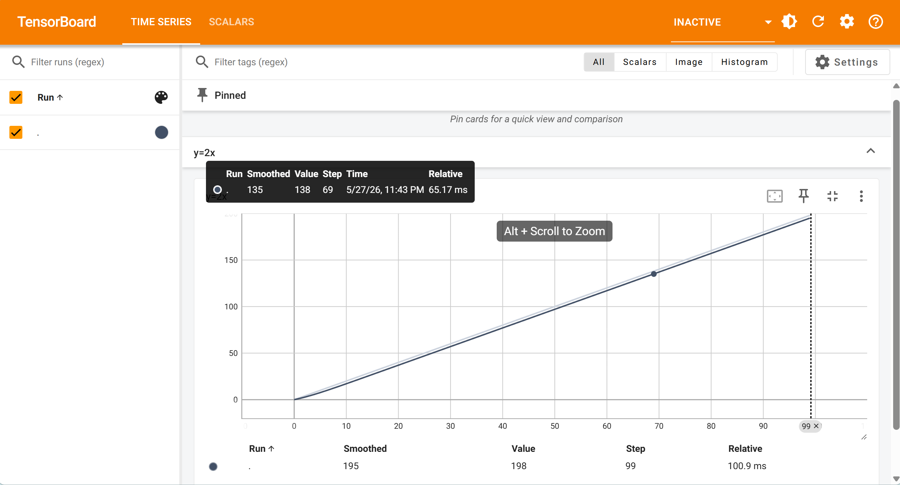

> 主要参考[小土堆教程](https://www.bilibili.com/video/BV1hE411t7RN)和[pytorch官方文档](https://docs.pytorch.ac.cn/docs/stable/index.html)。
+ PyTorch的安装：可参考[教程](https://www.cnblogs.com/HorizonTree/p/18431048)或小土堆的视频，这里作略。
+ 查看PyTorch的属性和方法可使用`dir()`函数，获取方法解释可使用`help()`函数。
# PyTorch加载数据
+ 数据的原始形式：
    1. 不同标签的数据在不同文件夹
    2. 数据与标签分别在不同文件夹【最常见】
    3. 数据文件名称即为其标签
+ pytorch加载数据的一大方法为`Dataset`类，通过`from torch.utils.data import Dataset`导入。导入这个类后需要在这个类上进行继承，并定义`__getitem__`和`__len__`方法才能在自己的数据集上使用。
+ 示例（读取图片数据+标签，假设数据原始形式为第二种）：
```python
import torch
from torch.utils.data import Dataset
from PIL import Image
import os
class MyData(Dataset):

    def __init__(self, root_dir, image_dir, label_dir):
        self.root_dir = root_dir
        self.image_dir = image_dir
        self.label_dir = label_dir
        self.label_path = os.path.join(self.root_dir, self.label_dir) # 标签路径
        self.image_path = os.path.join(self.root_dir, self.image_dir) # 图片路径
        self.image_list = os.listdir(self.image_path) # 所有图片列表
        self.label_list = os.listdir(self.label_path) # 所有标签列表
    
    def __getitem__(self, idx): # idx为索引
        img_name = self.image_list[idx] # 获取图片名称
        label_name = self.label_list[idx] # 获取标签
        img_item_path = os.path.join(self.root_dir, self.image_dir, img_name) # 获取图片路径
        label_item_path = os.path.join(self.root_dir, self.label_dir, label_name) # 获取标签路径

    def __len__(self):
        assert len(self.image_list) == len(self.label_list)
        return len(self.image_list) # 列表长度

root_dir = "dataset/train"
image_ants = "ants_image"
label_ants = "ants_label"
ants_dataset = MyData(root_dir, image_ants, label_ants) # 获取ants数据集+标签
image_bees = "bees_image"
label_bees = "bees_label"
bees_dataset = MyData(root_dir, image_bees, label_bees) # 获取bees数据集+标签
train_dataset = ants_dataset + bees_dataset
len(train_dataset) # 
```

# Torchvision
## TensorBoard（数据可视化）
> 以下内容部分参考[pytorch官方文档](https://docs.pytorch.ac.cn/tutorials/recipes/recipes/tensorboard_with_pytorch.html)。
+ 注：TensorBoard并不是PyTorch自带内容，需要单独安装：`pip install tensorboard`。
+ TensorBoard 是用于机器学习实验的可视化工具包，源自TensorFlow。在进行可视化之前，我们需要先用`SummaryWriter`创建一个实例：
    ```python
    import torch
    from torch.utils.tensorboard import SummaryWriter
    writer = SummaryWriter()
    ```
    上述`writer`默认输出到`./runs/`目录（也可以通过`log_dir`自行设置，或者再加上`comment`）。
### 标量可视化
+ 设置完实例后，使用`add_scalar(tag, scalar_value, global_step=None, walltime=None)`指令记录训练指标。主要参数解释如下：
    |参数|解释|
    |:--:|:---:|
    |`tag`|数据标识（可理解为图的标题）|
    |`scalar_value`|标量值（即训练指标数据）|
    |`global_step`|训练迭代步数设置|
+ 一个简单的例子：
    ```python
    from torch.utils.tensorboard import SummaryWriter
    writer = SummaryWriter("logs")
    # y = 2x
    for i in range(100):
        writer.add_scalar("y=2x", 2*i, i)

    writer.close()
    ```
    执行代码后需要通过以下命令查看TensorBoard图表：
    ```bash
    tensorboard --logdir=logs
    ```
    后面可以加`--port [xxxx]`指定端口。（默认为`6006`）界面如下：
### 加入图像
+ 除了标量（图表）之外，还可以使用`add_image(tag, img_tensor, global_step=None, walltime=None, dataformats='CHW')`加载图像。主要参数解释如下：
    |参数|解释|
    |:--:|:---:|
    |`tag,global_step`|同上|
    |`img_tensor`|图像数据（类型为`torch.Tensor`，`numpy.ndarray`或`string/blobname`）|
    |`dataformats`|图像数据格式规范（`H`，`W`，`C`分别表示图像的高度，宽度和颜色通道数）|
+ 示例：
    ```python
    from torch.utils.tensorboard import SummaryWriter
    import numpy as np
    from PIL import Image

    writer = SummaryWriter("logs")
    image_path = "data/train/ants_image/6240329_72c01e663e.jpg" # 图片路径
    img_PIL = Image.open(image_path)
    img_array = np.array(img_PIL) # 需要进行数据类型转换
    print(type(img_array)) # <class 'numpy.ndarray'>
    print(img_array.shape) # (369, 500, 3)，表示Height*Width*Color
    

    writer.add_image("train", img_array, 1, dataformats='HWC')  
    writer.close()
    ```
    或者使用`opencv-python`库：
    ```python
    from torch.utils.tensorboard import SummaryWriter
    import cv2

    writer = SummaryWriter("logs")
    image_path = "data/train/ants_image/6240329_72c01e663e.jpg"
    img_bgr = cv2.imread(image_path)
    img_rgb = cv2.cvtColor(img_bgr, cv2.COLOR_BGR2RGB) # 需要转换为 RGB 通道顺序

    writer.add_image("train", img_rgb, 1, dataformats='HWC')
    writer.close()
    ```
## Transforms数据转换
+ 在PyTorch中，可以使用`transforms`库（来自`torchvision`库）对图像数据进行处理或转换
    > 注：自Torchvision 0.15起，`torchvision.transforms`库更新为`torchvision.transforms.v2`，下述功能均基于`v2`库介绍，可参考[v2教程](https://docs.pytorch.org/vision/main/auto_examples/transforms/plot_transforms_getting_started.html)。
+ `transforms.v2`类似一个工具箱，其包含：
    1. `v2.ToTensor`：将`PIL Image`或`ndarray`数据转换为Tensor张量（方便传入神经网络，或者作为上面`add_image`的图像参数）
        + 已弃用，官方文档建议使用`v2.Compose([v2.ToImage(), v2.ToDtype(torch.float32, scale=True)])`
        + 使用例：
            ```python
            from PIL import Image
            from torchvision.transforms import v2
            import torch

            img = Image.open("cat.jpg")
            
            # import cv2
            # img = cv2.imread("cat.jpg")
            # img = cv2.cvtColor(img, cv2.COLOR_BGR2RGB)

            transform = v2.Compose([
                v2.ToImage(),
                v2.ToDtype(torch.float32, scale=True),
            ])

            x = transform(img)

            print(x.dtype) # torch.float32
            print(x.min(), x.max()) # tensor(0.) tensor(1.)
            print(x.shape) # torch.Size([3, H, W])
            ```
        + 张量可看作一种特殊的数组（或`ndarray`），可以用索引访问数值。使用`.item()`还可以单元素张量转为标量。
    2. `v2.ToPILImage`：将`Tensor`或`ndarray`转换为PIL图像
    3. `v2.Compose`：输入`transforms`函数列表，将其进行组合（例子见上）。
        + 这里补充一个python类小知识：在python类中定义`__call__`方法可以让实例化对象作为函数“被调用”（比如上面例子中的`x=transform(img)`）。
        + 注意列表中前一个`transforms`输出与后一个`transforms`输入类型需要匹配。
    4. `v2.Normalize`：使用均值和标准差对tensor类型图像或视频进行归一化。（输入参数为`mean`和`std`，维数需要和图像/视频匹配）
    5. `v2.Resize`：将图像输入调整为指定大小（输入参数为`(h,w)`或单个数，如果为后者则对应原尺寸中最短的边）

    等等。
+ 使用总结：
    + 关注函数输入输出类型
    + 多看[官方文档](https://docs.pytorch.ac.cn/vision/stable/transforms.html#)
    + 关注函数的参数及其类型
## Torchvision数据集
+ Torchvision可使用的数据集可在[官方文档](https://docs.pytorch.ac.cn/vision/stable/datasets.html)中查看。下面以[CIFAR10](https://www.cs.toronto.edu/~kriz/cifar.html)数据集为例说明如何在python中加载与使用Torchvision数据集：
    1. 加载数据集
        ```python
        import torchvision
        from torch.utils.tensorboard import SummaryWriter

        dataset_transform = torchvision.transforms.ToTensor()

        train_set = torchvision.datasets.CIFAR10(root="./dataset", train=True, transform=dataset_transform, download=True)
        test_set = torchvision.datasets.CIFAR10(root="./dataset", train=False, transform=dataset_transform, download=True)
        ```
        相关参数解释如下：  
        |参数|含义|
        |:--:|:--:|
        |`root`|数据集存放路径（根目录）|
        |`train`|选择训练集or测试集（不同数据集这个参数可能不同）|
        |`transform`|对数据集所有数据进行转换|
        |`download`|如果为`True`，则会则从互联网下载数据集并解压到根目录。如果数据集已下载，则不会再次下载。|

        当然我们也可以从数据集网站手动下载数据集，放到指定文件夹中。
    2. 数据集使用  
        因为前面我们已经将数据转化为张量，所以下面我们直接将数据集以张量处理：
        ```python
        from torch.utils.tensorboard import SummaryWriter
        writer = SummaryWriter("log")
        for i in range(10):
            img, target = test_set[i]
            writer.add_image("test_set", img, i)

        writer.close()
        ```
## DataLoader
+ 使用`DataLoader`可以在数据集中选取样本作为模型输入。其主要参数如下：
    |参数|解释|
    |:--:|:--:|
    |`dataset`|数据集（类型为之前提到的`Dataset`类）|
    |`batch_size`|每个批次加载多少个样本（默认为1）|
    |`shuffle`|每个epoch是否打乱数据（默认`False`，但一般设置为`True`）|
    |`sampler`|定义从数据集中抽取样本的策略（默认简单随机抽样）|
    |`batch_sampler`|类似于`sampler`，但每次返回一批索引。（一般不用）|
    |`num_workers`|用于数据加载的子进程数量（默认0，表示主进程加载）|
    |`drop_last`|如果数据集大小不能被批次大小整除，设置为`True`可丢弃最后一个不完整的批次，`False`则保留。|
+ DataLoader返回的是一个可迭代对象，可通过`for`循环得到其具体数据。示例：
```python
import torchvision
from torch.utils.data import DataLoader
from torch.utils.tensorboard import SummaryWriter

test_data = torchvision.datasets.CIFAR10("./dataset", train=False, transform=torchvision.transforms.ToTensor())

test_loader = DataLoader(dataset=test_data, batch_size=64, shuffle=True, num_workers=0, drop_last=True)

writer = SummaryWriter("dataloader")
for epoch in range(2):
    step = 0
    for data in test_loader:
        imgs, targets = data
        # print(imgs.shape)
        # print(targets)
        writer.add_images("Epoch: {}".format(epoch), imgs, step)
        step = step + 1

writer.close()
```