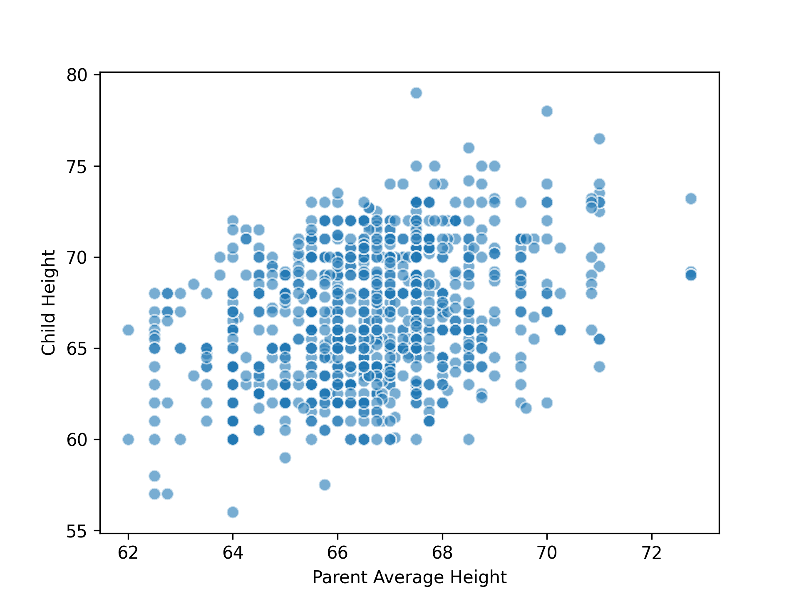
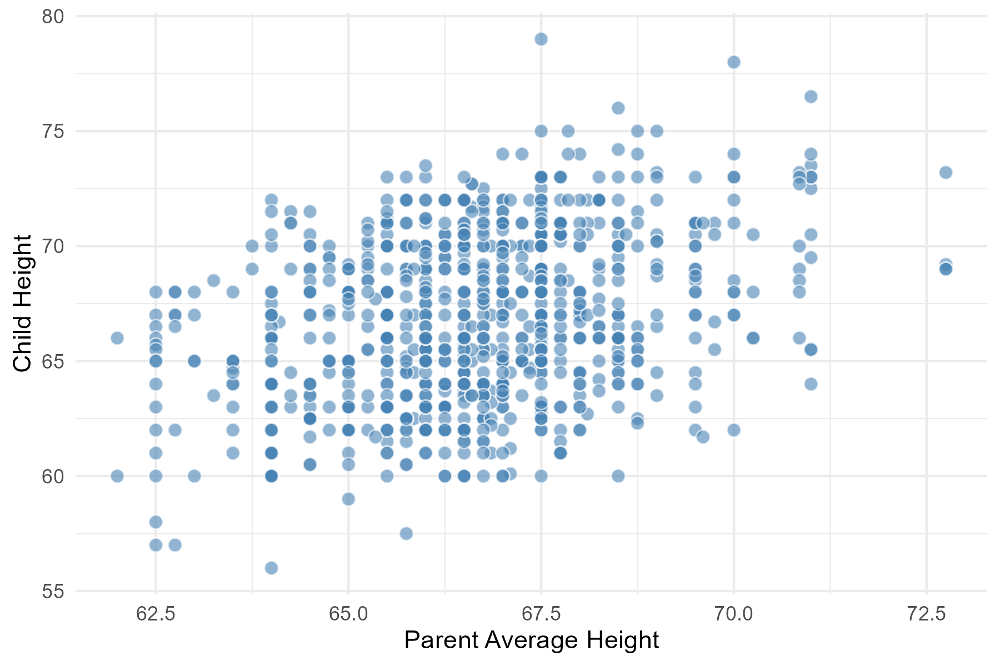
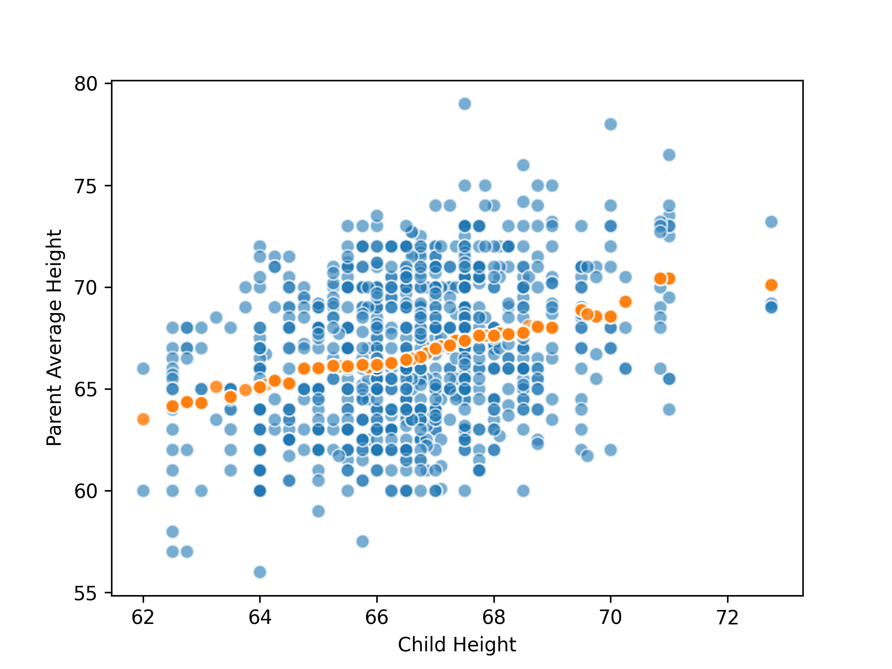
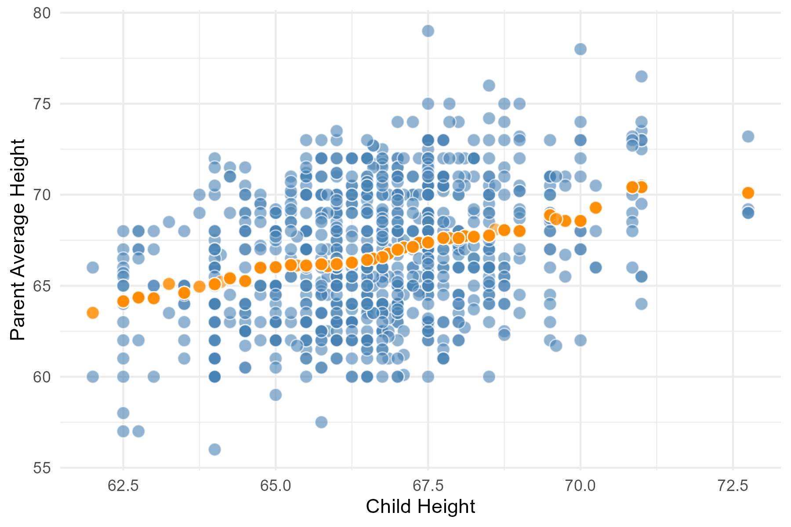

# 函数（Functions）
+ 关于函数的基本定义与调用从略（可见[CS61A](/posts/computer-science/cs61a/cs61a-chapter-2/)），下面只说明一些函数的进阶用法。
> 同样，本节也会用R语言作为对照。
## 将函数作用于列
+ 在之前的表格操作中，我们常常在创建新列时将已有列作为数组传入函数中进行转化运算。但是一些函数可能无法直接接受数组参数，而只能接受单个数字。
+ 比如下面这个例子：
<div className="code-compare">
```python
import pandas as pd
ages = pd.DataFrame({
    'Person': ['A', 'B', 'C', 'D', 'E', 'F'],
    'Age': [17, 117, 52, 100, 6, 101]
})
ages
```

```r
ages <- data.frame(
    Person = c('A', 'B', 'C', 'D', 'E', 'F'),
    Age = c(17, 117, 52, 100, 6, 101)
)
ages
```
</div>
| Person | Age |
|:---------:|:--------:|
| A         | 17       |
| B         | 117      |
| C         | 52       |
| D         | 100      |
| E         | 6        |
| F         | 101      |
+ 现在我们希望在创建新列时使用以下函数：
<div className="code-compare">
```python
def cut_off_at_100(x):
    """取x与100中的较小值。"""
    return min(x, 100)
```

```r
cut_off_at_100 <- function(x) {
  return(min(x, 100))
}
```
</div>
+ 直接将`ages['Age']`传进`cut_off_at_100`中不太行，此时我们就可以使用：
### apply
+ python的pandas库中提供了`apply`函数（r中`apply`是原生函数）。其可以传入数组与函数，然后对每一列的每个元素调用函数，并形成一个包含返回值的新数组。
+ 比如上面的例子：
<div className="code-compare">
```python
ages['Cut Off Age']=ages['Age'].apply(cut_off_at_100)
```

```r
ages$'Cut Off Age' <- sapply(ages$Age,cut_off_at_100)
```
</div>
| Person | Age | Cut Off Age |
|:------:|:---:|:-----------:|
| A      | 17  | 17          |
| B      | 117 | 100         |
| C      | 52  | 52          |
| D      | 100 | 100         |
| E      | 6   | 6           |
| F      | 101 | 100         |

<Note type="info" title="R语言apply家族">
补充R语言`apply`相关函数及其用法：
1. `apply`：用于矩阵或数组（至少二维）
    + 格式：`apply(X, MARGIN, FUN)`
    + `X`表示矩阵或数组，`MARGIN`取`1`表示按行，取`2`表示按列，`FUN`表示作用函数
2. `lapply`：逐元素处理
    + 格式：`lapply(X, FUN)`
    + 返回一个列表
3. `sapply`
    + 格式：`sapply(X, FUN)`
    + 与`lapply`类似，将结果简化为向量/矩阵
4. `vapply`
    + 格式：`vapply(X, FUN, FUN.VALUE)`
    + 用`FUN.VALUE`指定输出类型（比`sapply`更稳定）
5. `tapply`
    + 格式：`tapply(X, INDEX, FUN)`
    + 按`INDEX`将`X`分组作用函数
6. `mapply`
    + 格式：`mapply(FUN, ...)`
    + 多变量映射（类似python的`map`）
</Note>
### 实例：身高预测
+ 下面我们阐述一个经典的例子：利用预测子女的身高。原始数据（前10行）如下：

| family | father | mother | midparentHeight | children | childNum | gender | childHeight |
|:------:|:------:|:------:|:---------------:|:--------:|:--------:|:------:|:-----------:|
| 1      | 78.5   | 67     | 75.43           | 4        | 1        | male   | 73.2        |
| 1      | 78.5   | 67     | 75.43           | 4        | 2        | female | 69.2        |
| 1      | 78.5   | 67     | 75.43           | 4        | 3        | female | 69          |
| 1      | 78.5   | 67     | 75.43           | 4        | 4        | female | 69          |
| 2      | 75.5   | 66.5   | 73.66           | 4        | 1        | male   | 73.5        |
| 2      | 75.5   | 66.5   | 73.66           | 4        | 2        | male   | 72.5        |
| 2      | 75.5   | 66.5   | 73.66           | 4        | 3        | female | 65.5        |
| 2      | 75.5   | 66.5   | 73.66           | 4        | 4        | female | 65.5        |
| 3      | 75     | 64     | 72.06           | 2        | 1        | male   | 71          |
| 3      | 75     | 64     | 72.06           | 2        | 2        | female | 68          |
+ 我们提取出`father`，`mother`和`childHeight`这三列，并计算父母身高的平均值，最终得到两列数据：
<div className="code-compare">
```python
import pandas as pd
family_heights = pd.read_csv('heights.csv')
heights = pd.DataFrame({
    'Parent Average': (family_heights['father'] + family_heights['mother']) / 2,
    'Child': family_heights['childHeight']
})
heights
```

```r
family_heights <- read.csv('heights.csv')
heights <- data.frame(
  Parent.Average = (family_heights$father + family_heights$mother) / 2,
  Child = family_heights$childHeight
)
```
</div>
| Parent Average  | childHeight |
|:---------------:|:-----------:|
| 72.75           | 73.2        |
| 72.75           | 69.2        |
| 72.75           | 69          |
| 72.75           | 69          |
| 71              | 73.5        |
| 71              | 72.5        |
| 71              | 65.5        |
| 71              | 65.5        |
| 69.5            | 71          |
| 69.5            | 68          |
+ 用散点图表示：
<div className="code-compare">
```python
import matplotlib.pyplot as plt
plt.scatter(heights['Parent Average'], heights['Child'], alpha=0.6, edgecolors='w', s=50)
plt.xlabel('Parent Average Height')
plt.ylabel('Child Height')
plt.show()
```

```r
library(ggplot2)
plot <- ggplot(heights, aes(x = Parent.Average, y = Child)) +
  geom_point(alpha = 0.6, shape = 21, fill = "steelblue", color = "white", size = 2.5) +
  labs(x = "Parent Average Height", y = "Child Height") +
  theme_minimal()
plot
```
</div>


可以看到二者基本呈正相关关系。~~也可以顺便看看python和r可视化的微妙区别~~
+ 下面我们探索数据预测的方法。一种比较直接的想法是，取预测使用的子女身高附近的所有父母平均身高的平均值作为预测值。
+ 具体而言，假设我们需要预测父母平均身高为$68$英寸时子女的身高，那么我们就取父母平均身高在$67.5$到$68.5$英寸之间的所有子女的身高，再取均值：
    <div className="code-compare">
    ```python
    import numpy as np
    close_to_68 = heights.loc[(heights['Parent Average']>=67.5) & (heights['Parent Average']<=68.5)]
    np.average(close_to_68['Child'])
    ```

    ```r
    close_to_68 <- heights[heights$Parent.Average >= 67.5 & heights$Parent.Average <= 68.5, ]
    mean(close_to_68$Child)
    ```
    </div>
    得到结果约为`67.61`英寸。
+ 接下来我们尝试将上述过程包装为一个函数：
<div className="code-compare">
```python
def predict_child(p_avg):
    """通过父母平均身高预测子女身高。
    """
    close_points = heights.loc[(heights['Parent Average']>=p_avg - 0.5) & (heights['Parent Average']<=p_avg + 0.5)]
    return np.average(close_points['Child'])  

predict_child(68) # 67.61                   
```

```r
predict_child <- function(p_avg) {
  close_points <- heights[heights$Parent.Average >= p_avg - 0.5 & 
                          heights$Parent.Average <= p_avg + 0.5, ]
  mean(close_points$Child)
}

predict_child(66) # 66.18 
```
</div>
+ 为考查预测的准确性，我们将预测值与真实值进行比较：
<div className="code-compare">
```python
heights['Parent Average']=heights['Prediction'].apply(predict_child)                
plt.scatter(heights['Parent Average'], heights['Child'], alpha=0.6, edgecolors='w', s=50)
plt.scatter(heights['Parent Average'], heights['Prediction'], alpha=0.6, edgecolors='w', s=50)
plt.xlabel('Child Height')
plt.ylabel('Parent Average Height')
plt.show()
```

```r
heights$Prediction <- sapply(heights$Parent.Average, predict_child)
ggplot(heights, aes(x = Parent.Average, y = Prediction)) +
  geom_point(alpha = 0.6,      
             color = "white", 
             fill = "gray",   
             size = 2,       
             shape = 21) +  
  geom_point(alpha = 0.6, color = "white", fill = "gray", size = 2, shape = 21) +  
  labs(x = "Child Height", y = "Parent Average Height") +
  theme_minimal() 
```
</div>
结果：



注意到，预测的结果近似为一条直线，它也被称为**回归线**（regression line）。
+ 实际上，以上研究正是**回归分析**的起源——由19世纪英国统计学家高尔顿（达尔文的表弟）发现。另外，这一研究也催生出**均值回归**（mean reversion）理论。
