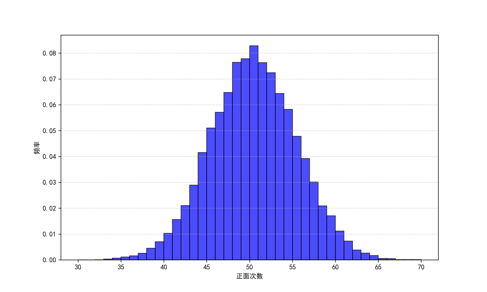
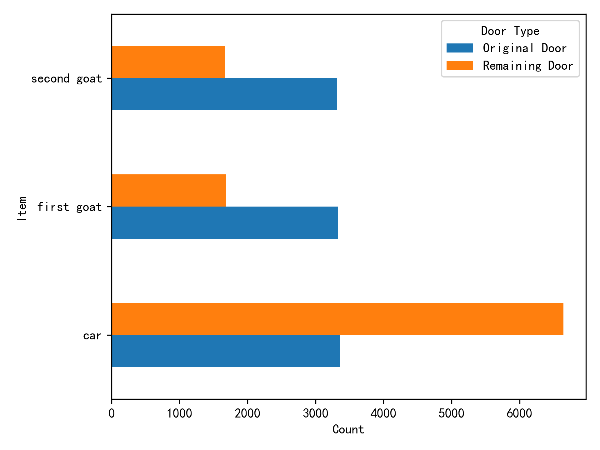

# 随机抽样（Random Choice）
+ 在进行数据分析之前，我们往往需要对总体中的元素进行简单随机抽样。一个简单的例子：
    <div className="code-compare">
    ```python
    import numpy as np
    two_groups = ['treatment', 'control']
    print(np.random.choice(two_groups,10)) # 第二个参数表示样本数量
    ```

    ```r
    two_groups <- c('treatment', 'control')
    print(sample(two_groups, 10, replace = TRUE)) # 有放回抽样
    ```
    </div>
## 布尔值与比较
+ 略，除了以下两个小点：
1. 当一个元素与一个数组进行比较时，会返回一个数组，其内容为此元素与数组中每个元素比较的结果：
    <div className="code-compare">
    ```python
    import numpy as np
    tosses = np.array(['Tails', 'Heads', 'Tails', 'Heads', 'Heads'])
    tosses == 'Heads' # array([False,  True, False,  True,  True])
    ```

    ```r
    tosses <- c('Tails', 'Heads', 'Tails', 'Heads', 'Heads')
    tosses == 'Heads'   # [1] FALSE  TRUE FALSE  TRUE  TRUE
    ```
    </div>
2. `numpy`中`np.count_nonzero()`可以统计数组中非零项数量：
    ```python
    np.count_nonzero(tosses == 'Heads') # 3
    ```
# 模拟实验（Simulation）
+ 如果要用程序进行一个随机模拟实验，一般经历以下步骤：
    1. 确定要模拟什么
    2. 模拟一个值（如定义一个返回模拟值的函数）
    3. 重复多次
    4. 将所有模拟得到的值整合为一个数组

    之后就可以用统计方法研究这个数组的性质，或者可视化其分布等。
+ 以下面这个抛硬币的实验为例：
    ```python
    import numpy as np
    coin = ['Heads', 'Tails']
    def one_simulated_value(): # 一次模拟实验
        outcomes = np.random.choice(coin, 100)
        return np.count_nonzero(outcomes == 'Heads') # 统计正面数量

    num_repetitions = 20000   # 实验重复次数
    heads = []
    for i in np.arange(num_repetitions):   
        new_value = one_simulated_value() 
        heads = np.append(heads, new_value) # 收集实验结果

    import matplotlib.pyplot as plt
    plt.rcParams['font.sans-serif'] = ['SimHei']  # 设置中文字体为黑体
    plt.rcParams['axes.unicode_minus'] = False    # 解决负号显示问题
    plt.figure(figsize=(10, 6))
    plt.hist(heads, bins=range(30, 71, 1), density=True,color = "blue",edgecolor='black', alpha=0.7)  # bins 设为 0~100，每个整数一个柱
    plt.xlabel('正面次数')
    plt.ylabel('频率')
    plt.grid(axis='y', linestyle='--', alpha=0.5)
    ```
    结果可视化：
    + 由此可见，模拟实验结果中正面次数在50次附近呈大致对称分布，大部分正面次数都在35次和65次之间。
## 三门问题（Monty Hall problem）
+ 下面我们尝试用模拟实验解决一个经典的概率问题：
    + 参赛者面前有三扇门，其中一扇门后藏有汽车，其余两扇门后是山羊。参赛者先选择一扇门，但不立即打开。随后，主持人会打开剩余两扇门中一扇有山羊的门，并询问参赛者是否要更换选择。
    + 直觉上，很多人认为剩下两扇门的概率各为50%，但实际上，根据概率计算，换门获奖的概率可以从$\dfrac{1}{3}$提升至$\dfrac{2}{3}$。这有些违反直觉，那么我们就用模拟实验验证：
    ```python
    import numpy as np
    goats = ['first goat', 'second goat']
    def other_goat(x): # 返回另一只山羊
        if x == 'first goat':
            return 'second goat'
        elif x == 'second goat':
            return 'first goat'
    
    hidden_behind_doors = np.append(goats, 'car')

    def monty_hall_game():
    """返回一个列表，顺序为：[参赛者的选择，主持人揭露的山羊，剩下一个门后的东西]"""
    
        contestant_guess = np.random.choice(hidden_behind_doors)
        
        if contestant_guess == 'first goat':
            return [contestant_guess, 'second goat', 'car']
        
        if contestant_guess == 'second goat':
            return [contestant_guess, 'first goat', 'car']
        
        if contestant_guess == 'car':
            revealed = np.random.choice(goats)
            return [contestant_guess, revealed, other_goat(revealed)]

    data = []
    for i in range(10000):
        result = monty_hall_game()   
        data.append(result)

    import pandas as pd
    games = pd.DataFrame(data, columns=['Guess', 'Revealed', 'Remaining'])

    original_choice = games['Guess'].value_counts().reset_index()
    original_choice.columns = ['Guess', 'count_guess']

    remaining_door = games['Remaining'].value_counts().reset_index()
    remaining_door.columns = ['Remaining', 'count_remaining']

    joined = pd.merge(original_choice, remaining_door,
                    left_on='Guess', right_on='Remaining',
                    how='inner').drop(columns=['Remaining'])

    combined = joined.rename(columns={
        'Guess': 'Item',
        'count_guess': 'Original Door',
        'count_remaining': 'Remaining Door'
    })
    combined = combined.sort_values('Item').reset_index(drop=True)

    print(combined)

    import matplotlib.pyplot as plt
    combined.set_index('Item').plot.barh()
    plt.xlabel('Count')
    plt.legend(title='Door Type')
    plt.tight_layout()
    plt.show()
    ```
    + 结果为：
        | Item         | Original Door | Remaining Door |
        |--------------|---------------|----------------|
        | car          | 3368          | 6632           |
        | first goat   | 3342          | 1661           |
        | second goat  | 3290          | 1707           |
        
        
        + 由此可见，如果参赛者换门，他中奖的概率会翻倍。

