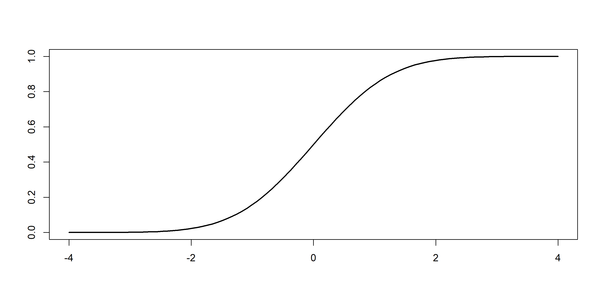
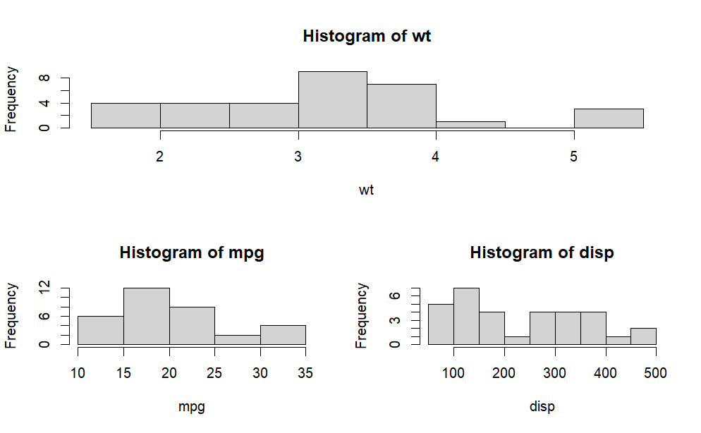

> 鉴于笔者对R语言还不够熟练，故特意整理R语言基本使用如下。   
> 注：部分语法使用可参见[DATA8 CHAPTER 3](/posts/data-science/data-8/data8-chapter-3/)、[DATA8 CHAPTER 4](/posts/data-science/data-8/data8-chapter-4/)和[DATA8 CHAPTER 5](/posts/data-science/data-8/data8-chapter-5/)。
+ R语言入门文档：[R-manual](https://cran.r-project.cn/doc/manuals/r-release/R-intro.html)
+ R数据科学：[R for Data Science](https://bjmu.edu.kg/r4ds-cn/)
+ R Charts：[R-charts](https://r-charts.com/)
# 基本运算
```r
5 %/% 2 # 2（地板除）
5 %% 2 # 1（取余数）
```
## 向量
```r
x = c(1,2,3,4,5)
x > 3 # FALSE FALSE FALSE  TRUE  TRUE
c(1.5:10,11) # 1.5  2.5  3.5  4.5  5.5  6.5  7.5  8.5  9.5 11.0
```
+ 注：单个向量的所有数据类型必须相同。
## 序列
```r
1.5:10 # 1.5 2.5 3.5 4.5 5.5 6.5 7.5 8.5 9.5 (注意冒号默认步长为1)
prod(seq(2,12,by=2)) # 2*4*6*8*10*12 = 46080
seq(1,5,length = 7) # 1.000000 1.666667 2.333333 3.000000 3.666667 4.333333 5.000000
rep(1:4,times = 3,each =2) # 1 1 2 2 3 3 4 4 1 1 2 2 3 3 4 4 1 1 2 2 3 3 4 4
rep(1:4,each =2,length = 12) # 1 1 2 2 3 3 4 4 1 1 2 2
```
## 数学运算
```r
round(4.5) # 4（round to even）
round(4.5556666) # 5
round(0.05555666,digits=3) # 0.056 保留三位小数
signif(0.005555666, digits = 3) # 0.00556 保留三位有效数字
seq(0, 1, by = 0.1)[4] == 0.3 # FALSE （Why?）
print(seq(0, 1, by = 0.1)[4], digits = 20) # 0.30000000000000004441
library(tidyverse)
near(1 / 49 * 49, 1) # True
```
# 基本数据管理
## 矩阵（matrix）
```r
matrix(data = NA, nrow = 1, ncol = 1, byrow = FALSE, dimnames = NULL)
```
|参数|含义|
|:-:|:-:|
|`data`|原始数据（一般为向量，若长度小于矩阵数据量，则重复填充）|
|`nrow`|行数|
|`ncol`|列数|
|`byrow`|`TRUE`表示先填充行，`FALSE`表示先填充列（默认为`FALSE`）|
|`dimnames`|`dimnames=list(rnames,cnames)`：给行列命名|

矩阵的所有元素数据类型均相同。
## 数组（array）
```r
array(data = NA, dim = length(data), dimnames = NULL)
```
+ `dim`可为向量，`data`填充方式为：将按`dim`第一个维度填满，再变第二个维度，以此类推。
+ 例：
```r
dim1 <- c("A1", "A2")
dim2 <- c("B1", "B2", "B3")
dim3 <- c("C1", "C2", "C3", "C4")
z <- array(1:24, c(2, 3, 4), dimnames=list(dim1, dim2, dim3))
z
## , , C1
## 
##    B1 B2 B3
## A1  1  3  5
## A2  2  4  6
## 
## , , C2
## 
##    B1 B2 B3
## A1  7  9 11
## A2  8 10 12
## 
## , , C3
## 
##    B1 B2 B3
## A1 13 15 17
## A2 14 16 18
## 
## , , C4
## 
##    B1 B2 B3
## A1 19 21 23
## A2 20 22 24
```
数组的所有元素数据类型均相同。
## 数据框（dataframe）
```r
data.frame(..., row.names = NULL, check.rows = FALSE,
           check.names = TRUE, fix.empty.names = TRUE,
           stringsAsFactors = FALSE)
```
+ `...`里面填充数据（一般为预先存好向量的变量，变量名即作为列名，行名可通过`row.names`参数设置）
+ `attach()`和`detach()`：在括号内加上dataframe，那么中间使用列名时就不需要再写dataframe名称。
    + 另一种等价方式：使用`with(dataframe,{...})`或`within(dataframe,{...})`（二者区别在于后者可以对dataframe本身进行修改）
+ 关于Dataframe的使用部分可见[DATA8 CHAPTER 3](/posts/data-science/data-8/data8-chapter-3/)，这里只做一些补充：
+ 以下面这个数据集为例：
    ```r
    leadership <- data.frame(
        manager = c(1,2,3,4,5),
        date = c("10/24/08","10/28/08","10/1/08","10/12/08","5/1/09"),
        country = c("US","US","UK","UK","UK"),
        gender = c("M","F","F","M","F"),
        age = c(32,45,25,39,99),
        q1 = c(5,3,3,3,2),
        q2 = c(4,5,5,3,2),
        q3 = c(5,2,5,4,1),
        q4 = c(5,5,5,NA,2),
        q5 = c(5,5,2,NA,1)
    )
    ```
1. 增加新变量 
    ```r
    # 方法一：直接计算并添加新列
    leadership$total_score <- leadership$q1 + leadership$q2 + leadership$q3 +
        leadership$q4 + leadership$q5
    leadership$mean_score <- (leadership$q1 + leadership$q2 + leadership$q3 +
        leadership$q4 + leadership$q5) / 5

    # 方法二：使用 transform() 函数一次性添加两列
    leadership <- transform(leadership,
        total_score = q1 + q2 + q3 + q4 + q5,
        mean_score = (q1 + q2 + q3 + q4 + q5) / 5)
    ```
2. 变量重编码
    ```r
    leadership <- within(leadership, {
        agecat <- NA
        agecat[age > 75] <- "Elder"
        agecat[age >= 55 & age <= 75] <- "Middle Aged"
        agecat[age < 55] <- "Young"
    })
    ```
3. 变量重命名
    ```r
    names(leadership)
    #  [1] "manager" "date"    "country" "gender"  "age"     "q1"      "q2"      "q3"      "q4"      "q5"    
    names(leadership)[2] <- "testDate"
    print(leadership)
    #   manager testDate country gender age q1 q2 q3 q4 q5
    # 1       1 10/24/08      US      M  32  5  4  5  5  5
    # 2       2 10/28/08      US      F  45  3  5  2  5  5
    # 3       3  10/1/08      UK      F  25  3  5  5  5  2
    # 4       4 10/12/08      UK      M  39  3  3  4 NA NA
    # 5       5   5/1/09      UK      F  99  2  2  1  2  1
    ```
4. 缺失值处理
    ```r
    is.na(leadership[,6:10])
            q1    q2    q3    q4    q5
    [1,] FALSE FALSE FALSE FALSE FALSE
    [2,] FALSE FALSE FALSE FALSE FALSE
    [3,] FALSE FALSE FALSE FALSE FALSE
    [4,] FALSE FALSE FALSE  TRUE  TRUE
    [5,] FALSE FALSE FALSE FALSE FALSE

    newdata <- na.omit(leadership) # 删去所有包含缺失值的行
    print(newdata)
    #   manager testDate country gender age q1 q2 q3 q4 q5
    # 1       1 10/24/08      US      M  32  5  4  5  5  5
    # 2       2 10/28/08      US      F  45  3  5  2  5  5
    # 3       3  10/1/08      UK      F  25  3  5  5  5  2
    # 5       5   5/1/09      UK      F  99  2  2  1  2  1
    ```
5. 日期
    ```r
    myformat <- "%m/%d/%y"
    leadership$date <- as.Date(leadership$date, myformat) # 将变量类型转换为日期
    ```
6. 数据集排序
    ```r
    newdata <- leadership[order(leadership$age),] # 默认升序
    print(newdata)
    #   manager     date country gender age q1 q2 q3 q4 q5
    # 3       3  10/1/08      UK      F  25  3  5  5  5  2
    # 1       1 10/24/08      US      M  32  5  4  5  5  5
    # 4       4 10/12/08      UK      M  39  3  3  4 NA NA
    # 2       2 10/28/08      US      F  45  3  5  2  5  5
    # 5       5   5/1/09      UK      F  99  2  2  1  2  1
    newdata2 <- leadership[order(leadership$gender,-leadership$age),] # 降序使用负号
    print(newdata2)
    #   manager     date country gender age q1 q2 q3 q4 q5
    # 5       5   5/1/09      UK      F  99  2  2  1  2  1
    # 2       2 10/28/08      US      F  45  3  5  2  5  5
    # 3       3  10/1/08      UK      F  25  3  5  5  5  2
    # 4       4 10/12/08      UK      M  39  3  3  4 NA NA
    # 1       1 10/24/08      US      M  32  5  4  5  5  5
    ```
7. 数据集合并（merge）
    ```r
    merge(x, y, by = intersect(names(x), names(y)),
        by.x = by, by.y = by, all = FALSE, all.x = all, all.y = all,
        sort = TRUE, suffixes = c(".x",".y"), no.dups = TRUE,
        incomparables = NULL, ...)
    ```
    |参数|含义|
    |:-:|:-:|
    |`x`|第一个数据框|
    |`y`|第二个数据框|
    |`by`|按照指定列名合并（默认为两个数据框的同名变量）|
    |`by.x`（`by.y`）|`TRUE`表示先填充行，`FALSE`表示先填充列（默认为`FALSE`）|
    |`all`|是否进行全连接（若为`TRUE`，则未匹配数据用缺失值填充，下同）|
    |`all.x`（`all.y`）|表示是否保留`x`（或`y`）中所有行|
    |`sort`|是否按合并列排序结果|

    + 也可以直接用`rbind()`（纵向）或`cbind()`（横向）进行合并，前提是两个对象的列数（行数）相同。
8. 数据集取子集
    + 使用`subset`
        ```r
        newdata <- subset(leadership, age >= 35 | age < 24, select=c(q1,q2,q3,q4))
        newdata <- subset(leadership, gender=="M" & age > 25, select=gender:q4)
        ```
    + 剔除变量
        ```r
        # 方法1：使用%in%反向判断
        myvars <- names(leadership) %in% c("q3", "q4")
        newdata <- leadership[!myvars]
        
        # 方法2：使用负号
        newdata <- leadership[c(-8,-9)]

        # 方法3：数据设为NULL（直接对原始数据操作）
        leadership$q3 <- leadership$q4 <- NULL
        ```
    + 随机抽样
        ```r
        # sample(x, size, replace = FALSE, prob = NULL)
        # size表示样本数量，replace表示是否放回抽样，prob表示样本权重
        # 可使用set.seed()固定抽样结果
        set.seed(123)
        mysample <- leadership[sample(1:nrow(leadership), 3, replace=FALSE),]
        print(mysample)
        #   manager     date country gender age q1 q2 q3 q4 q5
        # 3       3  10/1/08      UK      F  25  3  5  5  5  2
        # 2       2 10/28/08      US      F  45  3  5  2  5  5
        # 5       5   5/1/09      UK      F  99  2  2  1  2  1
        ```
9. 数据集聚合
```r
# aggregate(x, by, FUN, ..., simplify = TRUE, drop = TRUE)
options(digits=3)
attach(mtcars)
aggregate(mtcars, 
          by=list(cyl, gear),
          FUN=mean,
          na.rm=TRUE)
#   Group.1 Group.2  mpg cyl disp  hp drat   wt qsec  vs   am gear carb
# 1       4       3 21.5   4  120  97 3.70 2.46 20.0 1.0 0.00    3 1.00
# 2       6       3 19.8   6  242 108 2.92 3.34 19.8 1.0 0.00    3 1.00
# 3       8       3 15.1   8  358 194 3.12 4.10 17.1 0.0 0.00    3 3.08
# 4       4       4 26.9   4  103  76 4.11 2.38 19.6 1.0 0.75    4 1.50
# 5       6       4 19.8   6  164 116 3.91 3.09 17.7 0.5 0.50    4 4.00
# 6       4       5 28.2   4  108 102 4.10 1.83 16.8 0.5 1.00    5 2.00
# 7       6       5 19.7   6  145 175 3.62 2.77 15.5 0.0 1.00    5 6.00
# 8       8       5 15.4   8  326 300 3.88 3.37 14.6 0.0 1.00    5 6.00
``` 
+ 不常用，实际情况下常用`dplyr`的`group_by()`函数（类似python的`group_by()`）。
## 因子（Factor）
```r
factor(x = character(), levels, labels = levels,
       exclude = NA, ordered = is.ordered(x), nmax = NA)
```
|参数|含义|
|:-:|:-:|
|`x`|原始向量|
|`levels`|指定各水平值, 不指定时取`x`的不同值|
|`labels`|水平的标签（用于指定类别顺序）, 不指定时用各水平值的对应字符串|
|`exclude`|排除的字符|
|`ordered`|`TRUE`表示有序变量（适用字符型变量）|
|`nmax`|水平的上限数量|

主要用于分类变量。（注：所有不在`levels`或`labels`范围内的`x`数据都会设为缺失值）
示例：
```r
patientID <- c(1, 2, 3, 4)
age <- c(25, 34, 28, 52)
diabetes <- c("Type1", "Type2", "Type1", "Type1")
status <- c("Poor", "Improved", "Excellent", "Poor")
diabetes <- factor(diabetes)
status <- factor(status, order=TRUE)
patientdata <- data.frame(patientID, age, diabetes, status)
str(patientdata)

# 'data.frame':	4 obs. of  4 variables:
#  $ patientID: num  1 2 3 4
#  $ age      : num  25 34 28 52
#  $ diabetes : Factor w/ 2 levels "Type1","Type2": 1 2 1 1
#  $ status   : Ord.factor w/ 3 levels "Excellent"<"Improved"<..: 3 2 1 3

summary(patientdata)
#    patientID         age         diabetes       status 
#  Min.   :1.00   Min.   :25.00   Type1:3   Excellent:1  
#  1st Qu.:1.75   1st Qu.:27.25   Type2:1   Improved :1  
#  Median :2.50   Median :31.00             Poor     :2  
#  Mean   :2.50   Mean   :34.75                          
#  3rd Qu.:3.25   3rd Qu.:38.50                          
#  Max.   :4.00   Max.   :52.00                          
```
## 列表（List）
+ 类似python的list，元素可为向量、数组、矩阵、数据框等。
+ 示例：
```r
g <- "My First List"
h <- c(25, 26, 18, 39)
j <- matrix(1:10, nrow=5)
k <- c("one", "two", "three")
mylist <- list(title=g, ages=h, j, k)
mylist

## $title
## [1] "My First List"
## 
## $ages
## [1] 25 26 18 39
## 
## [[3]]
##      [,1] [,2]
## [1,]    1    6
## [2,]    2    7
## [3,]    3    8
## [4,]    4    9
## [5,]    5   10
## 
## [[4]]
## [1] "one"   "two"   "three"

mylist$ages # 或mylist[["ages"]],mylist[[2]]
# [1] 25 26 18 39
```
## dplyr
见[官方文档](https://dplyr.tidyverse.org/articles/dplyr.html)。~~实在不想写，反正不考，留着~~
# 高级数据管理
## 数据处理函数
1. 矩阵计算
    | 函数        | 完成功能                                                           | 使用方法               |
    |-------------|--------------------------------------------------------------------|------------------------|
    | `+/-`         | 对矩阵的各个元素完成加减乘运算                                      | `A+B`; `A-B`; `A*B`          |
    | `%*% `        | 矩阵乘法                                                           | `A%*%B`                  |
    | `crossprod`   | 矩阵$A$的转置与矩阵$B$的乘法（$A^\top B$）                                           | `crossprod(A,B)`         |
    | `tcrossprod`  | 矩阵$A$与矩阵$B$的转置的乘法($AB^\top$)                                           | `tcrossprod(A,B)`        |
    | `t`           | 求矩阵$A$的转置$A^\top$                                                      | `t(A)`                   |
    | `solve`       | 求矩阵$A$的逆$A^{-1}$                                                       | `solve(A)`               |
    | `eigen`       | 对矩阵进行特征值分解,结果输出特征值及特征向量                      | `eigen(A)`               |
    | `svd`         | 对矩阵进行svd奇异值分解,结果可输出矩阵$A$的奇异值及两个正交阵$U$、$V$    | `svd(A)`                 |
2. 概率函数
    + 格式：`[dpqr]+distribution_abbreviation()`
        + d = 密度函数(density)
        + p = 分布函数(distribution function)
        + q = 分位数函数(quantile function)
        + r = 生成随机数(random generation)  
    + 示例：
    ```r
    dnorm(x = 0, mean = 0, sd = 1) 
    # [1] 0.3989423

    set.seed(123)
    rnorm(10) # 生成10个标准正态分布样本值
    #  [1] -0.56047565 -0.23017749  1.55870831  0.07050839  0.12928774  1.71506499  0.46091621 -1.26506123 -0.68685285 -0.44566197

    x <- seq(-4, 4, length = 100)
    y <- pnorm(x)
    plot(x, y, type = "l", lwd = 2, xlab = "", ylab = "")
    ```
    
    + 生成多元正态分布数据：
        ```r
        options(digits=3)
        set.seed(1234)

        mean <- c(230.7, 146.7, 3.6) # 均值向量
        sigma <- matrix(c(15360.8, 6721.2, -47.1, 
                        6721.2, 4700.9, -16.5, 
                        -47.1, -16.5, 0.3), nrow=3, ncol=3) # 协方差矩阵

        # 法1：使用MASS包
        library(MASS)
        mydata <- mvrnorm(500, mean, sigma)
        # 法2：使用MultiRNG包
        library(MultiRNG)
        mydata <- draw.d.variate.normal(500, 3, mean, sigma)

        mydata <- as.data.frame(mydata)
        names(mydata) <- c("y", "x1", "x2")

        dim(mydata)
        print(head(mydata, n=10))

        # [1] 500   3
        #        y    x1   x2
        # 1   98.8  41.3 3.43
        # 2  244.5 205.2 3.80
        # 3  375.7 186.7 2.51
        # 4  -59.2  11.2 4.71
        # 5  313.0 111.0 3.45
        # 6  288.8 185.1 2.72
        # 7  134.8 165.0 4.39
        # 8  171.7  97.4 3.64
        # 9  167.2 101.0 3.50
        # 10 121.1  94.5 4.10
        ```
3. 统计函数
    | 函数 | 描述 |
    |------|------|
    | `mean(x)` | 平均数|
    | `median(x)` | 中位数|
    | `sd(x)` | 标准差|
    | `var(x)` | 方差（无偏）|
    | `mad(x)` | 绝对中位差，表示每个数据点与中位数偏差绝对值的中位数|
    | `quantile(x, probs)` | 求分位数|
    | `range(x)` | 求值域（返回区间上界与下界）|
    | `sum(x)` | 求和|
    | `diff(x, lag=n)` | 滞后差分，lag 用以指定滞后几项。默认`lag=1`|
    | `min(x)` | 求最小值|
    | `max(x)` | 求最大值|
    | `scale(x, center=TRUE, scale=TRUE)` |`center=TRUE`：按列进行中心化（减去均值）；`center=TRUE, scale=TRUE`：按列标准化（减去均值再除以标准差）|
4. 字符处理函数
    | 函数 | 描述 |
    |------|------|
    | `nchar(x)` | 计算字符串`x`中的字符数量|
    | `substr(x, start, stop)` | 提取或替换一个字符串向量中的子串（替换时对`substr`赋值，取对应长度字符串）|
    | `grep(pattern, x, ignore.case=FALSE, fixed=FALSE)` | 在`x`中搜索某种模式。若 `fixed=FALSE`，则 pattern 为一个正则表达式。若 `fixed=TRUE`，则 pattern 为一个文本字符串。|
    | `sub(pattern, replacement, x, ignore.case=FALSE, fixed=FALSE)` | 在 x 中搜索 pattern，并以文本 replacement 将其替换。`fixed`参数同上。|
    | `strsplit(x, split, fixed=FALSE)` | 按照`split`字符分割字符串`x`（若为空或无匹配则默认切分单个字符），返回一个列表。`fixed`参数同上。|
    | `paste(..., sep="")` | 连接字符串，使用`sep`分隔（当字符串为向量时，返回的也是向量）|
    | `toupper(x)` | 大写转换|
    | `tolower(x)` | 小写转换|
5. 其他实用函数

    | 函数 | 描述 |
    |----------|------|
    | `cut(x, n)` | 将连续型变量`x`分割为`n`个level的因子（或者设置`breaks`分割点）。可指定`ordered_result = TRUE`使因子有序|
    | `pretty(x, n)` | 创建美观的分割点。通过选取`n+1`个等间距的取整值，将一个连续型变量`x`分割为`n`个区间。常用于绘图|
    | `cat(... , file = "myfile", append = FALSE)` | 连接`...`中的对象（默认空格分隔），并将其输出到屏幕上或文件中|
    |`table(x,y)`|生成列联表（`x`，`y`为因子，一般为数据框的两个变量）|
6. `apply`函数
    + 可见[DATA8-CHAPTER-5](https://souyerin.pages.dev/posts/data-science/data-8/data8-chapter-5/#apply)。
## 控制流
略，就是`if-else`、`for`、`while`、`switch`这些，下面只给出格式规范：
```r
if(cond) expr
if(cond) cons.expr  else  alt.expr

for(var in seq) expr
while(cond) expr
repeat expr # 相当于while(TRUE)，直到break跳出循环
break

ifelse(test, yes, no) # 三元表达式

switch(expression, case1, case2, case3....) 
# switch示例：
feelings <- c("sad", "afraid")
for (i in feelings)
    print(
        switch(i,
        happy = "I am glad you are happy",
        afraid = "There is nothing to fear",
        sad = "Cheer up",
        angry = "Calm down now"
    )
)
## [1] "Cheer up"
## [1] "There is nothing to fear"
```
## 用户自编函数
同略。
```r
name <- function( arglist ) expr
\( arglist ) expr
return(value)
```
+ 原则：参数为向量时最优（处理速度最快），尽量使用内置函数
# 图形初阶
> 注：关于数据可视化可参见[DATA8 CHAPTER 4](/posts/data-science/data-8/data8-chapter-4/)。
## R原生绘图
+ 一个简单示例：
```r
pdf("mygraph.pdf")  # 保存图形（打开输出设备），也可改为png(),jpeg(),…

# 绘制图形
attach(mtcars)
plot(wt, mpg)
abline(lm(mpg~wt))
title("Regression of MPG on Weight")
detach(mtcars)

dev.off() # 清空画布（关闭输出设备）
```
### 图形参数
+ 修改`plot`参数方法：
```r
# 方法一
opar <- par(no.readonly=TRUE)
par(lty=2, pch=17)   # 注意是在plot语句之前修改
# 或 par(lty=2)
#    par(pch=17) 
plot(dose, drugA, type="b")
par(opar)     # 还原原始设置

# 方法二
plot(dose, drugA, type="b", lty=2, pch=17)
```
1. 符号和线条
    | 参数 | 描述 |
    |------|------|
    | `pch`（point character） | 指定绘制点时使用的符号 |
    | `cex`（character expansion） | 指定符号的大小。cex 是一个数值，表示绘图符号相对于默认大小的缩放倍数。默认大小为1，1.5表示放大为默认值的1.5倍，0.5表示缩小为默认值的50%，等等 |
    | `lty`（line type） | 指定线条类型|
    | `lwd`（line width） | 指定线条宽度。lwd 是以默认值的相对大小来表示的（默认值为1）|

    + `pch`样式（图源[R charts](https://r-charts.com/)，下同）：
        + 其中21~25还可以指定`col`（边框颜色）和`bg`（填充颜色）。
    + `lty`样式：
2. 颜色
    | 参数 | 描述 |
    |------|------|
    | col | 默认的绘图颜色。某些函数（如 lines 和 pie）可以接受一个含有颜色值的向量并自动循环使用。|
    | col.lab | 坐标轴标签（名称）的颜色 |
    | col.main | 标题颜色 |
    | col.sub | 副标题颜色 |
    | fg | 图形的前景色 |
    | bg | 图形的背景色 |
    + 可使用[RColorBrewers](https://r-graph-gallery.com/38-rcolorbrewers-palettes.html)或`rainbow()`函数取颜色。
3. 文本属性
    | 参数 | 描述 |
    |------|------|
    | `cex` | 表示相对于默认大小缩放倍数的数值|
    | `cex.axis` | 坐标轴刻度文字的缩放倍数|
    | `cex.lab` | 坐标轴标签（名称）的缩放倍数|
    | `cex.main` | 标题的缩放倍数|
    | `cex.sub` | 副标题的缩放倍数
    | `font` | 整数，用于指定绘图使用的字体样式。`1`=常规，`2`=粗体，`3`=斜体，`4`=粗斜体，`5`=符号字体（以 Adobe 符号编码表示）|
    | `font.axis` | 坐标轴刻度文字的字体样式 |
    | `font.lab` | 坐标轴标签（名称）的字体样式 |
    | `font.main` | 标题的字体样式 |
    | `font.sub` | 副标题的字体样式 |
    | `ps` | 字体磅值（1磅约为1/72英寸）。文本的最终大小为 `ps*cex` |
    | `family` | 绘制文本时使用的字体族。标准的取值为 `serif`（衬线）、 `sans`（无衬线）和 `mono`（等宽） |
4. 图形尺寸与边界尺寸
    | 参数 | 描述 |
    |------|------|
    | pin | 以英寸表示的图形尺寸（宽和高） |
    | mai | 以数值向量表示的边界大小，顺序为“下、左、上、右”，单位为英寸 |
    | mar | 以数值向量表示的边界大小，顺序为“下、左、上、右”，单位为英分（1/8英寸）。默认值为`c(5, 4, 4, 2) + 0.1`|
### 添加文本、自定义坐标轴和图例
1. 标题
    ```r
    title(main="main title", sub="subtitle", xlab="x-axis label", ylab="y-axis label")
    # 亦可指定其他图形参数（如文本大小、字体、旋转角度和颜色）
    ```
2. 坐标轴
    ```r
    axis(side, at=, labels=, pos=, lty=, col=, las=, tck=, ...)
    ```
    | 选项    | 描述                                                          |
    |---------|---------------------------------------------------------------|
    | side    | 一个整数，表示在图形的哪边绘制坐标轴（`1`=下，`2`=左，`3`=上，`4`=右） |
    | at      | 一个数值型向量，表示需要绘制刻度线的位置                      |
    | labels  | 一个字符型向量，表示置于刻度线旁边的文字标签（如果为`NULL`，则将直接使用`at`中的值） |
    | pos     | 坐标轴线绘制位置的坐标（即与另一条坐标轴相交位置的值）        |
    | lty     | 线条类型                                                      |
    | col     | 线条和刻度线颜色                                              |
    | las     | `=0`：标签平行于坐标轴；`=2`：标签垂直于坐标轴               |
3. 参考线
    ```r
    abline(h=yvalues, v=xvalues) # 也可以指定其他图形参数（如线条类型、颜色和宽度）
    ```
4. 图例
    ```r
    legend(location, title, legend, ...)
    ```
    | 参数     | 描述                                                                                                   |
    |----------|--------------------------------------------------------------------------------------------------------|
    | location | 图例位置。可给定坐标（`locator(1)`+鼠标单击），或使用关键字 `bottom`、`left`、`top`、`right`、`center`等；同时可用 `inset` 指定向图形内侧移动的大小（以绘图区域大小的分数表示）。 |
    | title    | 图例标题的字符串（可选）                                                                               |
    | legend   | 图例标签组成的字符型向量                                                                               |
5. 文本标注
    ```r
    text(location, "text to place", pos, ...) # 向绘图区域内部添加文本
    mtext("text to place", side, line=n, ...) # 向图形的四个边界之一添加文本
    ```
    + 数学标注：可使用`expression()`或`substitute()`插入latex公式。

### 图形组合
1. `mfrow`和`mfcol`
    + `mfrow=c(nrows, ncols)`：创建按行填充的、行数为`nrows`、列数为`ncols`的图形矩阵。
    + `mfcol=c(nrows, ncols)`：按列填充矩阵。
2. `layout`
    函数`layout()`的调用形式为`layout(mat)`，其中的`mat`是一个矩阵，它指定了所要组合的多个图形的所在位置。
    示例：
    ```r
    attach(mtcars)
    layout(matrix(c(1,1,2,3), 2, 2, byrow = TRUE))
    hist(wt); hist(mpg); hist(disp); detach(mtcars)
    ```
    
3. 图形布局精细控制
    + 可使用`fig=c(b,l,t,r)`参数控制图形的方位，配合`new=TRUE`叠加绘图。
## ggplot2
同样略~~因为不考~~，使用例可见[DATA8 CHAPTER 4](/posts/data-science/data-8/data8-chapter-4/)。