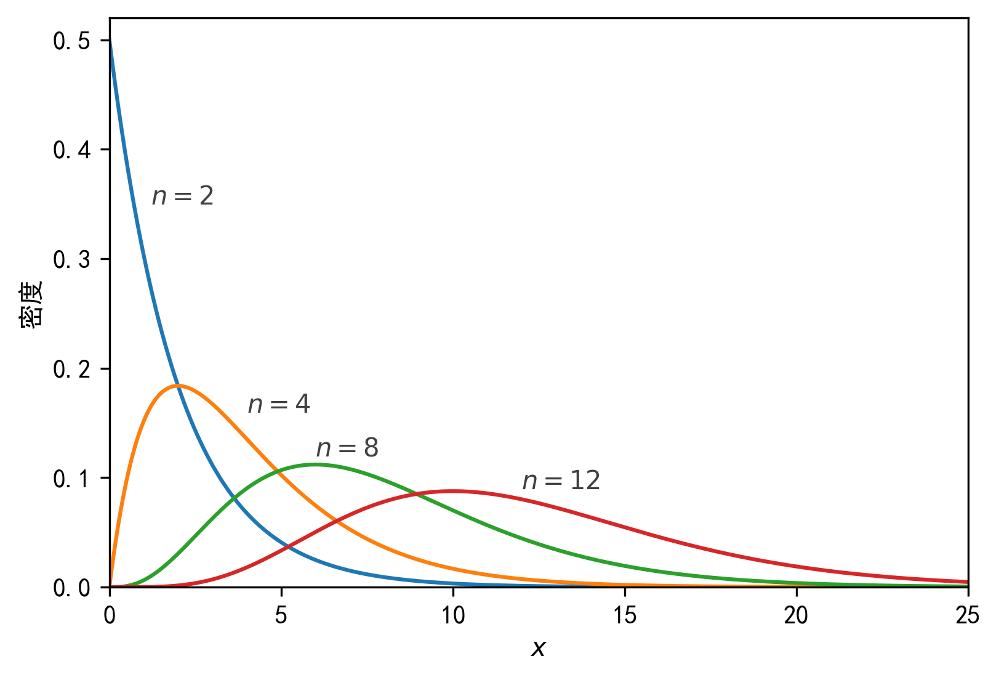
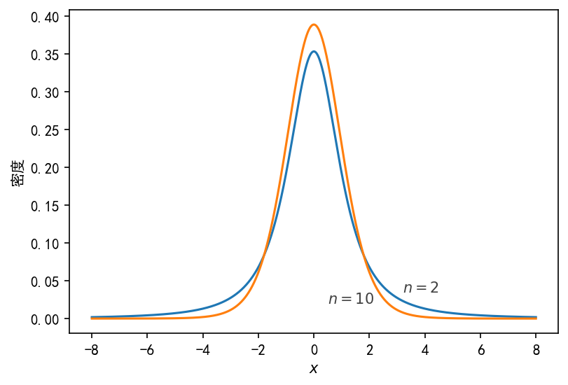
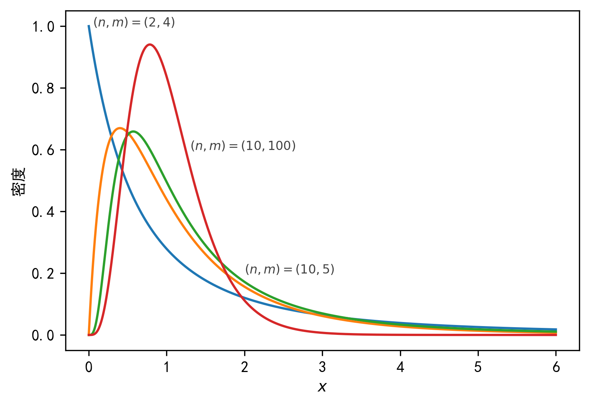
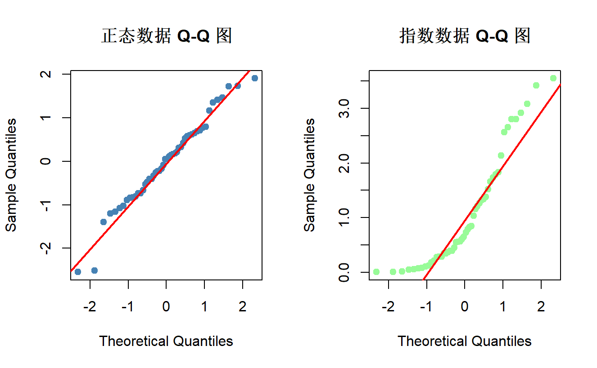

在学习完《数理统计》这门课后，笔者感觉这门课仅仅停留在理论是不太够的，需要进行上机实践。因此，笔者决定整理涉及数理统计概念的代码。
> 主要参考《[概率论与数理统计——基于python](https://www.ecsponline.com/goods.php?id=226704)》这一教材，并补充对应的R代码（~~所以也可看作[统计软件Cheat Sheet](/posts/data-science/统计软件-cheat-sheet/)的DLC~~）
+ python部分主要使用scipy库的stats模块，可参考[官方文档](https://docs.scipy.org.cn/doc/scipy/reference/stats.html)。
# 统计量及其分布
1. 经验分布函数
    <div className="code-compare">
    ```python
    import numpy as np
    import scipy.stats as stats
    a = np.array([21,25,25,30])
    stats.cumfreq(a,numbins=len(a))
    print(stats.cumfreq(a,numbins=len(a))[0]/len(a))
    ```

    ```r
    a <- c(21, 25, 25, 30)
    breaks <- seq(min(a), max(a), length.out = length(a) + 1)
    freq <- table(cut(a, breaks = breaks, include.lowest = TRUE))
    cum_rel_freq <- cumsum(freq) / length(a)
    print(cum_rel_freq)
    ```
    </div>
2. 样本统计量
    <div className="code-compare">
    ```python
    import numpy as np
    a = np.array([344,336,345,342,340,338,344,343,344,343])
    print("样本均值：", np.mean(a))
    print("样本方差：", np.sum((a-np.mean(a))**2)/(len(a)-1))
    print("样本标准差：", (np.sum((a-np.mean(a))**2)/(len(a)-1))**0.5)
    print("样本二阶中心矩：", np.mean((a-np.mean(a))**2))
    print(np.var(a))  # 样本二阶中心矩另一算法
    print("样本二阶原点矩：", np.mean(a**2))
    ```

    ```r
    a <- c(344, 336, 345, 342, 340, 338, 344, 343, 344, 343)
    mean(a) # 均值
    var(a)  # 样本方差（无偏）
    sqrt(var(a)) # 样本标准差（无偏）
    mean((a - mean(a))^2) # 样本二阶中心矩
    mean(a^2) # 样本二阶原点矩
    ```
    </div>
3. 卡方分布
    <div className="code-compare">
    ```python
    import numpy as np
    import scipy.stats as stats
    import matplotlib.pyplot as plt

    plt.rcParams['font.sans-serif'] = "SimHei"
    plt.figure(figsize=(6, 4), dpi=150)  # 设置图形大小
    x = np.arange(0, 25, 0.001)
    for n in [2, 4, 8, 12]:
        plt.plot(x, stats.chi2.pdf(x, df=n))  # 绘制不同自由度的卡方分布的概率密度函数
    plt.xlim(0, 25)
    plt.ylim(0, 0.52)
    plt.xlabel('$x$')
    plt.ylabel('密度')
    # 添加文本标注，模拟图例
    plt.text(x=1.2, y=0.35, s="$n=2$", alpha=0.75, weight="bold")  # 标记不同自由度
    plt.text(x=4, y=0.16, s="$n=4$", alpha=0.75, weight="bold")
    plt.text(x=6, y=0.12, s="$n=8$", alpha=0.75, weight="bold")
    plt.text(x=12, y=0.09, s="$n=12$", alpha=0.75, weight="bold")
    # 计算分位数
    stats.chi2.ppf(q=0.05, df=8)  # 计算自由度为8的卡方分布下 5% 分位数
    stats.chi2.ppf(q=0.95, df=8)  # 计算自由度为8的卡方分布下 95% 分位数
    ```

    ```r
    library(ggplot2)

    # 构建数据框
    x_vals <- seq(0, 25, length.out = 25000)
    dfs <- c(2, 4, 8, 12)
    data <- do.call(rbind, lapply(dfs, function(df_val) {
      data.frame(x = x_vals, y = dchisq(x_vals, df = df_val), df = as.factor(df_val))
    }))

    # 绘图
    ggplot(data, aes(x = x, y = y, color = df)) +
      geom_line(linewidth = 0.8) +
      xlim(0, 25) + ylim(0, 0.52) +
      labs(x = "x", y = "密度") +
      theme_minimal() +
      theme(legend.position = "none") +  # 隐藏图例，与 Python 代码保持一致
      annotate("text", x = c(1.2, 4, 6, 12), y = c(0.35, 0.16, 0.12, 0.09),
              label = c("n=2", "n=4", "n=8", "n=12"), fontface = "bold", alpha = 0.75)

    # 计算自由度为8的卡方分布的 5% 和 95% 分位数
    qchisq(p = 0.05, df = 8)
    qchisq(p = 0.95, df = 8)
    ```
    </div>
    输出图像（python输出，下同）：
4. t分布
    <div className="code-compare">
    ```python
    import numpy as np
    import scipy.stats as stats
    import matplotlib.pyplot as plt

    plt.rcParams['font.sans-serif'] = "SimHei"
    plt.figure(figsize=(6, 4), dpi=150)  # 设置图形大小
    plt.rcParams['axes.unicode_minus']=False # 使绘图正常显示负号
    x=np.arange(-8, 8, 0.001)
    for n in [2, 10]:
        plt.plot(x, stats.t.pdf(x, df=n)) # 画不同自由度 t 分布的密度函数图
    plt.xlabel('$x$')
    plt.ylabel('密度')
    plt.text(x=3.2,y=0.035,s="$n=2$",alpha=0.75,weight="bold") # 标记不同自由度图例
    plt.text(x=0.5,y=0.02,s="$n=10$",alpha=0.75,weight="bold")
    print(stats.t.ppf(q=0.05, df=10)) # 计算自由度为10的 t 分布分位数（-1.8124611228107341）
    ```

    ```r
    library(ggplot2)

    x <- seq(-8, 8, by = 0.001)
    dfs <- c(2, 10)
    plot_data <- data.frame()
    for (n in dfs) {
      y <- dt(x, df = n)
      temp <- data.frame(x = x, density = y, df = as.factor(n))
      plot_data <- rbind(plot_data, temp)
    }

    p <- ggplot(plot_data, aes(x = x, y = density, color = df)) +
      # 绘制密度曲线
      geom_line(linewidth = 1) +
      coord_cartesian(xlim = c(-8, 8), ylim = c(0, 0.4)) +
      annotate("text", x = 3.2, y = 0.035, label = "n == 2", 
              parse = TRUE, alpha = 0.75, fontface = "bold", color = "black") +
      annotate("text", x = 0.5, y = 0.02, label = "n == 10", 
              parse = TRUE, alpha = 0.75, fontface = "bold", color = "black") +
      labs(x = expression(x), y = "密度") +
      theme(legend.position = "none") +
      theme_bw() 
    print(p)

    print(paste("自由度为10的 t 分布 0.05 分位数为:", qt(p = 0.05, df = 10)))
    ```
    </div>
    输出图像：

5. F分布
    <div className="code-compare">
    ```python
    import numpy as np
    import scipy.stats as stats
    import matplotlib.pyplot as plt

    plt.figure(figsize=(6, 4), dpi=300) 
    x = np.arange(0, 6, 0.001)

    for n in [[2,3], [4,8], [10,5], [10,100]]:
        plt.plot(x, stats.f.pdf(x, dfn=n[0], dfd=n[1]))  # 画出不同自由度F分布概率密度曲线

    plt.xlabel('$x$')
    plt.ylabel('概率')

    plt.text(x=0.05, y=1, s="$(n,m)=(2,4)$", fontsize=8, alpha=0.75, weight="bold")
    plt.text(x=2, y=0.2, s="$(n,m)=(10,5)$", fontsize=8, alpha=0.75, weight="bold")
    plt.text(x=1.3, y=0.6, s="$(n,m)=(10,100)$", fontsize=8, alpha=0.75, weight="bold")

    stats.f.ppf(q=0.95, dfn=10, dfd=5)  # 计算自由度(10,5)的F分布分位点
    stats.f.ppf(q=0.05, dfn=10, dfd=5)
    stats.f.ppf(q=0.95, dfn=5, dfd=10)  # 与上行代码计算的值做比较

    plt.show() 
    ```

    ```r
    library(ggplot2)

    # 1. 准备数据
    x_vals <- seq(0, 6, length.out = 6000)
    df1_list <- c(2, 4, 10, 10)
    df2_list <- c(3, 8, 5, 100)

    # 构建数据框
    plot_data <- do.call(rbind, lapply(seq_along(df1_list), function(i) {
      data.frame(
        x = x_vals,
        df1 = df1_list[i],
        df2 = df2_list[i],
        density = df(x_vals, df1 = df1_list[i], df2 = df2_list[i]),
        label = paste0("(n,m)=(", df1_list[i], ",", df2_list[i], ")")
      )
    }))

    # 2. 绘制图形
    ggplot(plot_data, aes(x = x, y = density, color = label)) +
      geom_line(linewidth = 1) +
      labs(x = "x", y = "密度", color = "参数 (n,m)") +
      theme_bw() + 
      coord_cartesian(ylim = c(0, 1.2)) 

    # 3. 计算 F 分布分位点
    qf(p = 0.95, df1 = 10, df2 = 5)
    qf(p = 0.05, df1 = 10, df2 = 5)
    qf(p = 0.95, df1 = 5, df2 = 10)
    ```
    </div>
    输出图像：

依旧放一个分位数计算器在这里：
<DistributionCalculator />

# 区间估计
1. 单样本均值置信区间
    <div className="code-compare">
    ```python
    import numpy as np
    from scipy import stats
    x = [5.52, 5.48, 5.59, 5.51, 5.45]
    mean = np.mean(x)
    print("样本均值为:", mean)
    std = 0.1 # 样本标准差已知
    CI = stats.norm.interval(0.95, loc=mean, scale=std)
    print(CI)
    ```

    ```r
    x <- c(5.52, 5.48, 5.59, 5.51, 5.45)

    mean_x <- mean(x)
    print(paste("样本均值为:", mean_x))

    std <- 0.1
    CI_lower <- qnorm(0.025, mean = mean_x, sd = std)
    CI_upper <- qnorm(0.975, mean = mean_x, sd = std)
    CI <- c(CI_lower, CI_upper)

    print(CI)
    ```
    </div>

2. 单样本方差（标准差）置信区间
    <div className="code-compare">
    ```python
    import numpy as np
    from scipy import stats
    # mean: 样本均值; std: 样本标准差; n: 样本量; confidence: 置信水平
    # 总体估计函数: 构建总体方差或总体标准差的置信区间
    def stdinterval(mean=None, std=None, n=None, confidence=0.95, para="总体标准差"):
        variance=np.power(std,2)
        alpha=1-confidence
        chiscore0=stats.chi2.isf(alpha/2, df=(n-1))
        chiscore1=stats.chi2.isf(1-alpha/2, df=(n-1))
        if para=="总体标准差":
            lowerlimit=np.sqrt((n-1)*variance/chiscore0)
            upperlimit=np.sqrt((n-1)*variance/chiscore1)
        if para=="总体方差":
            lowerlimit=(n-1)*variance/chiscore0
            upperlimit=(n-1)*variance/chiscore1
        return (round(lowerlimit, 2), round(upperlimit, 2))
    stdinterval(mean=None, std=0.2, n=12, confidence=0.95, para="总体方差")
    ```

    ```r
    stdinterval <- function(mean=NULL, std=NULL, n=NULL, confidence=0.95, para="总体标准差") {
      variance = std^2
      alpha = 1 - confidence
      chiscore0 = qchisq(1 - alpha/2, df = n - 1) 
      chiscore1 = qchisq(alpha/2, df = n - 1)    

      if (para == "总体标准差") {
        lowerlimit = sqrt((n - 1) * variance / chiscore0)
        upperlimit = sqrt((n - 1) * variance / chiscore1)
      }
      if (para == "总体方差") {
        lowerlimit = (n - 1) * variance / chiscore0
        upperlimit = (n - 1) * variance / chiscore1
      }

      return(c(round(lowerlimit, 2), round(upperlimit, 2)))
    }

    stdinterval(std = 0.2, n = 12, confidence = 0.95, para = "总体方差")
    ```
    </div>

3. 两样本均值差置信区间
    <div className="code-compare">
    ```python
    import numpy as np
    from scipy import stats

    alpha=0.05
    mean1=1282
    std1=80
    mean2=1208
    std2=94  
    m=50
    n=60

    mean=mean1-mean2
    # 计算合并标准差
    std=np.sqrt(((m-1)*np.power(std1,2)+(n-1)*np.power(std2,2))/(m+n-2))
    # t分布的分位数
    tscore=stats.t.isf(alpha/2, df=(m+n-2))
    # 计算误差范围
    me=tscore*std*np.sqrt(1/m+1/n)
    # 计算置信区间
    CI=[mean-me, mean+me]
    print(CI)
    ```

    ```r
    # 1. 定义变量
    alpha <- 0.05
    mean1 <- 1282
    std1 <- 80
    mean2 <- 1208
    std2 <- 94  

    m <- 50
    n <- 60

    # 2. 计算均值差
    mean_diff <- mean1 - mean2

    # 3. 计算合并标准差
    std_pooled <- sqrt(((m - 1) * std1^2 + (n - 1) * std2^2) / (m + n - 2))

    # 4. 计算 t 分布临界值
    tscore <- qt(1 - alpha/2, df = m + n - 2)

    # 5. 计算误差范围
    me <- tscore * std_pooled * sqrt(1/m + 1/n)

    # 6. 计算并打印置信区间
    CI <- c(mean_diff - me, mean_diff + me)
    print(CI)
    ```
    </div>

4. 两样本方差比置信区间
    <div className="code-compare">
    ```python
    import numpy as np
    from scipy import stats

    data1=[20.5, 19.8, 19.7, 20.4, 20.1, 20.0, 19.0, 19.9]
    data2=[20.7, 19.8, 19.5, 20.8, 20.4, 20.2, 19.6]

    def twostdinterval(d1, d2, confidence=0.95, para="两个总体方差比"):
        n1=len(d1)
        n2=len(d2)
        var1=np.var(d1, ddof=1)
        var2=np.var(d2, ddof=1)
        alpha=1-confidence
        
        fscore0=stats.f.isf(alpha/2, dfn=n1-1, dfd=n2-1)
        fscore1=stats.f.isf(1-alpha/2, dfn=n1-1, dfd=n2-1) 
        
        if para=="两个总体标准差比":
            lowerlimit=np.sqrt((var1/var2)/fscore0)
            upperlimit=np.sqrt((var1/var2)/fscore1)
        if para=="两个总体方差比":
            lowerlimit=(var1/var2)/fscore0
            upperlimit=(var1/var2)/fscore1
            
        return (round(lowerlimit, 2), round(upperlimit, 2))

    twostdinterval(data1, data2, confidence=0.95, para="两个总体方差比")
    ```

    ```r
    # 1. 定义数据
    data1 <- c(20.5, 19.8, 19.7, 20.4, 20.1, 20.0, 19.0, 19.9)
    data2 <- c(20.7, 19.8, 19.5, 20.8, 20.4, 20.2, 19.6)

    # 2. 定义函数
    twostdinterval <- function(d1, d2, confidence=0.95, para="两个总体方差比") {
      n1 <- length(d1)
      n2 <- length(d2)

      var1 <- var(d1) 
      var2 <- var(d2)
      
      alpha <- 1 - confidence

      fscore0 <- qf(1 - alpha/2, df1 = n1-1, df2 = n2-1)
      fscore1 <- qf(alpha/2, df1 = n1-1, df2 = n2-1)
      
      if (para == "两个总体标准差比") {
        lowerlimit <- sqrt((var1 / var2) / fscore0)
        upperlimit <- sqrt((var1 / var2) / fscore1)
      }
      if (para == "两个总体方差比") {
        lowerlimit <- (var1 / var2) / fscore0
        upperlimit <- (var1 / var2) / fscore1
      }
      
      return(c(round(lowerlimit, 2), round(upperlimit, 2)))
    }

    # 3. 调用函数测试
    twostdinterval(data1, data2, confidence=0.95, para="两个总体方差比")
    ```
    </div>

# 假设检验
1. 单样本均值假设检验（方差已知）
    + 拒绝域检验：
    <div className="code-compare">
    ```python
    import numpy as np
    from scipy import stats

    n=25
    mean=950
    mean0=1000
    std=100

    # 计算检验统计量
    U=(mean-mean0)*np.sqrt(n)/std

    # 临界值
    alpha=0.05

    c=-stats.norm.ppf(1-alpha, 0, 1)

    # 比较 U 统计量和临界值
    if U<c:
        print('拒绝原假设')
    else:
        print('不能拒绝原假设')
    ```

    ```r
    # 1. 设置变量
    n <- 25
    mean <- 950
    mean0 <- 1000
    std <- 100

    # 2. 计算检验统计量 
    U <- (mean - mean0) * sqrt(n) / std

    # 3. 计算临界值
    alpha <- 0.05
    c <- -qnorm(1 - alpha) # 默认 mean=0, sd=1

    # 4. 条件判断与输出
    if (U < c) {
      print('拒绝原假设')
    } else {
      print('不能拒绝原假设')
    }
    ```
    </div>
    + $p$值检验：
    <div className="code-compare">
    ```python
    import numpy as np # 计算p值
    from scipy import stats

    n=25
    mean=950
    mean0=1000
    std=100

    # 计算检验统计量
    U=(mean-mean0)*np.sqrt(n)/std

    # 计算 p 值
    pval=stats.norm.cdf(-abs(U), 0, 1)

    alpha=0.05

    # 比较 p 值和 alpha
    if pval<alpha:
        print('拒绝原假设')
    else:
        print('不能拒绝原假设')
    ```

    ```r
    # 1. 设置变量
    n <- 25
    mean <- 950
    mean0 <- 1000
    std <- 100

    # 2. 计算检验统计量
    U <- (mean - mean0) * sqrt(n) / std

    # 3. 计算 p 值
    pval <- pnorm(-abs(U))

    # 4. 设置显著性水平
    alpha <- 0.05

    # 5. 比较 p 值和 alpha
    if (pval < alpha) {
      print('拒绝原假设')
    } else {
      print('不能拒绝原假设')
    }
    ```
    </div>
    如果有原始样本数据，那么R语言还可以用第三方包BSDA的`z.test`函数。

2. 单样本均值假设检验（方差未知）
    + 拒绝域检验：
    <div className="code-compare">
    ```python
    import numpy as np
    from scipy import stats

    n = 100
    mean = 6.5
    mean0 = 8
    std = 2

    # 计算检验统计量
    T = (mean - mean0) * np.sqrt(n) / std

    # 拒绝域（左侧检验，显著性水平 0.05）
    alpha = 0.05
    c = stats.t.ppf(alpha, n - 1)

    # 比较 t 统计量与临界值
    if T < c:
        print('拒绝原假设')
    else:
        print('不能拒绝原假设')   
    ```

    ```r
    n <- 100
    mean <- 6.5
    mean0 <- 8
    std <- 2

    # 计算检验统计量
    T_stat <- (mean - mean0) * sqrt(n) / std

    # 拒绝域（左侧检验，显著性水平 0.05）
    alpha <- 0.05
    c <- qt(alpha, df = n - 1)

    # 比较 t 统计量与临界值
    if (T_stat < c) {
      print('拒绝原假设')
    } else {
      print('不能拒绝原假设')   
    }
    ```
    </div>
    + $p$值检验：
    <div className="code-compare">
    ```python
    import numpy as np
    from scipy import stats

    n=100
    mean=6.5
    mean0=8
    std=2

    # 计算 t 检验统计量
    T=(mean-mean0)*np.sqrt(n)/std

    # 计算 p 值
    pval=stats.t.cdf(-abs(T), n-1)

    alpha=0.05

    if pval< alpha:
        print('拒绝原假设')
    else:
        print('不能拒绝原假设')
    ```

    ```r
    n <- 100
    mean_val <- 6.5
    mean0 <- 8
    std_val <- 2

    # 计算 t 检验统计量
    T_stat <- (mean_val - mean0) * sqrt(n) / std_val

    # 计算 p 值
    pval <- pt(-abs(T_stat), df = n - 1)

    alpha <- 0.05

    # 判断假设检验结果
    if (pval < alpha) {
      cat("拒绝原假设\n")
    } else {
      cat("不能拒绝原假设\n")
    }

    # 也可以使用第三方包BSDA的tsum.test
    library(BSDA)
    tsum.test(mean.x = mean_val, s.x = sd_val, n.x = n, 
              mu = mu0, alternative = "less")
    # 输出结果：
    # data:  Summarized x
    # t = -7.5, df = 99, p-value = 1.39e-11
    # alternative hypothesis: true mean is less than 8
    # 95 percent confidence interval:
    #       NA 6.832078
    # sample estimates:
    # mean of x 
    #       6.5 
    ```
    </div>
    另外，如果有样本原始数据，那么就可以用`t.test`（这是R语言最常用的检验函数）。

3. 两样本方差F检验
    <div className="code-compare">
    ```python
    import numpy as np
    from scipy import stats

    data1 = [20.5, 19.8, 19.7, 20.4, 20.1, 20.0, 19.0, 19.9]
    data2 = [20.7, 19.8, 19.5, 20.8, 20.4, 20.2, 19.6]

    n1 = len(data1)
    n2 = len(data2)

    var1 = np.var(data1, ddof=1) # 样本方差
    var2 = np.var(data2, ddof=1) # 样本方差

    alpha = 0.05
    F = var1 / var2

    fscore_right = stats.f.isf(alpha/2, dfn=n1-1, dfd=n2-1)   # 右临界值
    fscore_left = stats.f.isf(1-alpha/2, dfn=n1-1, dfd=n2-1)  # 左临界值

    if (F < fscore_left or F > fscore_right):
        print('拒绝原假设')
    else:
        print('不能拒绝原假设')
    ```

    ```r
    data1 <- c(20.5, 19.8, 19.7, 20.4, 20.1, 20.0, 19.0, 19.9)
    data2 <- c(20.7, 19.8, 19.5, 20.8, 20.4, 20.2, 19.6)

    n1 <- length(data1)
    n2 <- length(data2)

    # 计算样本方差
    var1 <- var(data1)
    var2 <- var(data2)

    alpha <- 0.05
    F_stat <- var1 / var2

    # 计算临界值
    # 左侧临界值 qf(alpha/2)
    f_left <- qf(alpha / 2, df1 = n1 - 1, df2 = n2 - 1)
    # 右侧临界值 qf(1 - alpha/2)
    f_right <- qf(1 - alpha / 2, df1 = n1 - 1, df2 = n2 - 1)

    # 判断逻辑
    if (F_stat < f_left | F_stat > f_right) {
      print('拒绝原假设')
    } else {
      print('不能拒绝原假设')
    }

    # 也可以使用内置var.test函数
    result <- var.test(data1, data2, alternative = "two.sided", conf.level = 0.95)

    # 打印检验结果（包含F值、分子分母自由度、P值）
    print(result)

    # 通过提取 P 值进行自动判断
    if (result$p.value < 0.05) {
      print('拒绝原假设')
    } else {
      print('不能拒绝原假设')
    }
    ```
    </div>

4. 正态性检验
    ```r
    set.seed(2026)

    # 正态数据
    norm_data <- rnorm(50)
    # 指数分布数据（形状明显非正态）
    non_norm_data <- rexp(50, rate = 1)

    par(mfrow = c(1, 2)) # 并排画两个直方图辅助观察
    hist(norm_data, main = "正态数据", col = "lightblue")
    hist(non_norm_data, main = "指数分布数据", col = "pink")

    # 1. Shapiro-Wilk检验（原假设为数据服从正态分布，下同）
    shapiro.test(norm_data)      # P值较大，不显著
    shapiro.test(non_norm_data)  # P值极小，显著

    # 2. Kolmogrov-Smirnov 检验（不止可检验正态分布）
    ks.test(norm_data, "pnorm", mean = 0, sd = 1) # 不显著
    ks.test(norm_data, "pexp") # 显著
    ks.test(non_norm_data, "pexp")  # 不显著

    # 3. Aderson-Darling 检验（需安装nortest包）
    # install.packages("nortest")
    library(nortest)
    ad.test(norm_data)
    ad.test(non_norm_data)

    # 4. Q-Q图
    par(mfrow = c(1, 2))

    # ---------- 左侧：正态数据的 Q-Q 图 ----------
    qqnorm(norm_data, 
          main = "正态数据 Q-Q 图", 
          pch = 19,          
          col = "steelblue")
    qqline(norm_data, 
          col = "red",       
          lwd = 2)           

    # ---------- 右侧：指数数据的 Q-Q 图 ----------
    qqnorm(non_norm_data, 
          main = "指数数据 Q-Q 图", 
          pch = 19,
          col = "tomato")
    qqline(non_norm_data, 
          col = "red", 
          lwd = 2)

    par(mfrow = c(1, 1))

    # 5. Box-Cox变换
    # install.packages("car")
    library(car)
    summary(p1 <- powerTransform(Wool$cycles))
    hist(bcPower(Wool$cycles, p1$roundlam))

    x=rexp(100)
    powerTransform(x) # 估计lambda值约为0.2518501
    ```
    得到的Q-Q图如下：
5. 非参数检验
    ```r
    # 1. 游程检验（需安装randtests包）
    library(randtests)
    x = rnorm(10)
    y = (sign(x - median(x)) + 1) / 2
    runs.test(x, pvalue = 'exact', threshold = median(x))
    runs.test(y, pvalue = 'exact', threshold = 0.5) # 与上面结果一致

    # 检验两个总体分布是否相同
    x = c(59.1, 60.3, 58.1, 61.3, 65.1, 63.4, 67.8) 
    y = c(60.1, 62.1, 59.3, 55.0, 54.6, 64.4, 58.7, 62.5)
    d = c(rep(0, length(x)), rep(1, length(y)))
    z = c(x, y)
    w = d[order(z)]
    runs.test(w, pvalue='exact', threshold = 0.5)

    # 2. 符号秩和检验
    # 单样本检验
    changes <- c(-2, 5, 1, 3, -1, 4, 2, 6, 0.5, 2.5, -3, 8)
    # 检验中位数是否为0
    wilcox.test(changes, mu = 0)

    set.seed(2026)
    # 两组独立样本
    group_A <- rnorm(20, mean = 50, sd = 5)  
    group_B <- rnorm(20, mean = 55, sd = 5)

    # 执行两样本Wilcoxon秩和检验（默认双侧检验）
    wilcox.test(group_A, group_B)
    ```