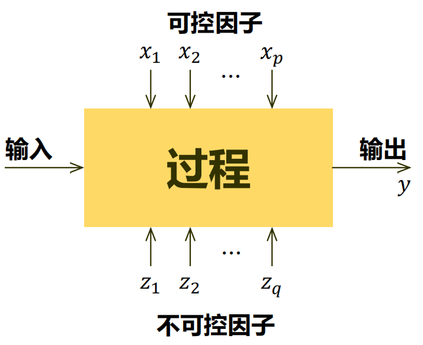
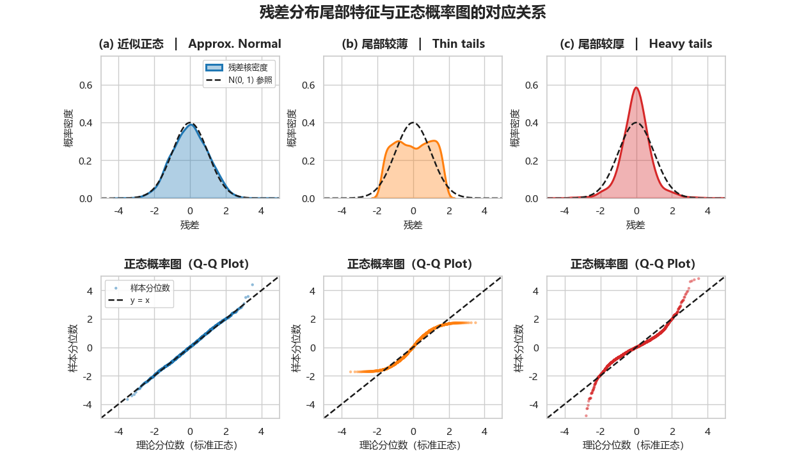

> 笔者用LLM翻译的《Design and Analysis of Experiments》第10版已上线（[链接](https://souyerz1440.github.io/DAoE-translation/)），可供参考。

统计学的核心任务：收集并分析数据，并解决特定问题（推断/预测等）
+ 其中数据分析方法包括数理统计/机器学习/深度学习方法等，而收集数据的方法则包括抽样调查与试验设计（以及人工合成数据……）
+ 抽样调查与试验设计的主要区别如下：
    |抽样调查（“看谁”）|试验设计（“对谁做什么”）|
    |:---:|:----:|
    |从总体中抽取样本|处理试验单位|
    |自变量$X$的值自然出现|需主动设置自变量值$x$|
    |研究总体特征、分布与关联|研究因素影响与因果关系|
+ 试验设计的核心目的：节省试验次数，减少随机误差影响，高效抓住事物规律。试验设计是统计学最早与使用最广泛的分支之一，包括方差分析、正交设计、析因设计等。

# 引言
一个典型的例子：研究两种淬火工艺——油淬与盐水淬——对合金硬度的影响。由此我们可以得到：
+ 研究目标：测试样品在不同工艺下淬火后的平均硬度，再作比较
+ 需要解决的问题：
    + 是否有其他影响硬度的因子？【考虑控制变量】
    + 样品数量应该达到是多少？对样品的淬火方案应该如何分配？
    + 按什么次序收集数据？如何进行数据分析？
    + 两种工艺得到的平均观测硬度差别应达到多大才能认定为有显著差异？
## 试验设计的策略
+ 目标：得到因果关系（从观察与试验中得到）
+ 构建经验模型（与机理模型不同，后者是先有结论再用实验验证）
    + 经验模型的一般形式如图：
        其中输出可以为一个或多个可观测的响应变量，同时应当尽量减小不可控因子的影响
    + 经验模型的研究目的：
        1. 确定哪些变量$x$对$y$的影响最大；
        2. 确定将有影响的变量$x$设为何值时可以使得$y$接近期望水平；
        3. 确定将有影响的变量$x$设为何值时可以使得$y$波动性较小；
        4. 将有影响的变量$x$设为何值时可以使得不可控因子的影响最小。
+ 常见的试验设计策略如下：
1. 最佳猜测法  
    自主选择任意认为可能有关系的因子组合，每次改变一两个因子水平后重复试验  
    + 优点：效果通常较好
    + 缺点：若最初猜测组合的结果不如预期，则往往需要做多次组合，效率较低（难以直接找到最优组合）
2. 一次一因子法  
    对每个因子选择初始值，每次只改变一个因子，保持其他因子不变  
    + 优点：解释更直观（完全遵循控制变量）  
    + 缺点：没有考虑因子间的交互作用（对结果的共同影响）
3. 析因实验法  
    改变多个因子，考虑所有可能的因子取值组合（共$2^n$次试验）  
    优点：可以充分高效地利用数据（同时研究单因子效应和交互作用）【可考虑与假设检验结合】  
    缺点：试验次数较多，成本较高
4. 分式析因实验法  
    只对所有可能组合的一个子集作试验（尽量选择因子取值有明显差别的组合）【可节约成本】
### 实际应用
1. 因子筛选（screening）实验（也称为因子表征实验）
    + 实验目的：估计因子效应的大小与方向，以及因子间是否存在交互作用
    + 一般会采用分式析因实验法

2. 过程最优化  
    + 主要目的：确定能够使结果达到最优的因子的范围
    + 实际上，存在相同响应变量的因子取值构成的等值线，它可以看作一种响应曲面（response surface）的投影。【实际难以直接绘制】
    + 过程最优化的本质就是通过改变可控因子，不断迭代寻找最优响应曲面的过程。其试验设计方法一般会采用中心复合设计。
## 试验设计基本原则
### 基本原理
1. 随机化  
    是统计分析方法的基石，具体表现为：
    + 实验材料的分配和实验中各次实验进行的顺序都是随机确定的；
    + 统计方法要求观测值（或误差）是独立分布的随机变量，随机化通常能使这一假定有效；
    
    把实验进行适当的随机化还有助于“平均掉”可能出现的外来因子的效应。
2. 重复（试验）  
    即对每个因子水平组合进行独立重复实验，由此可以得到试验误差的估计，并使均值估计更准确（减小方差）。  
    + 重复试验与重复测量之间的差别：重复实验既反映实验间的变异又反映实验内的变异，重复测量则只反映一次实验内的变异。
3. 区组化   
    用于减少或消除干扰因子带来的影响，并提高试验精度。【这里的干扰因子是指可能影响响应变量的值，但研究不直接感兴趣的因子】
### 试验设计的准则
试验设计的准则（标准）一般分为以下七步（其中前三步都属于试验前的计划）：
1. 识别并陈述问题  
    关键是明确试验的具体目标以及需要解决的问题（与目标紧密相关）
    + 试验的基本类型包括：因子筛选或表征、最优化试验、验证试验、探索性试验与稳健性试验。
    + 推荐的做法是按照序贯方法设计试验（将大的综合性试验按目标分解为小试验）
2. 选择响应变量  
    一般会考虑将被测特性的平均值或标准差（或同时取二者）作为响应变量。另一方面，测量系统的误差也是一个重要考量，它决定了响应变量的测量次数。
3. 选择因子、水平与范围  
    首先我们对可能有影响的因子进行分类：
    + 潜在设计因子
        + 设计因子：在实验中被选择用来研究的因子
        + 保持恒定因子：可能对响应有一些影响的变量，但就实验目的而言，实验者对这些因子并不感兴趣，它们在实验中保持在一个特定的水平
        + 允许变化因子：不对其控制，任其自然变化，可通过随机化来抵消或降低其影响

        通常假定保持恒定的因子和允许变化的因子的效应都相对较小。
    + 干扰因子     
        + 可控因子：其水平可被实验者设置，可以用区组来处理
        + 不可控因子：可以测量，且可采用协方差分析来补偿其效应
        + 噪声因子：在过程中自然变化且不可控制，但可以用随机化进行处理

    上述因子的归类可以通过因果（鱼骨）图进行确定。
4. 选择试验设计  
    包括考虑样本量（重复次数）、为试验安排合适的运行顺序，以及确定是否涉及区组化或其他随机化限制。除此之外，设计的选择还涉及考虑和选定一个初步的经验模型来描述结果。
5. 实施试验
6. 统计分析数据
7. 结论与建议  
    如果对实验数据不满意，可以进行后续实验。随着试验计划的推进，我们常常剔除一些输入变量、加入另一些变量、改变某些因子的探索区域，或者增加新的响应变量等。
### 试验设计简史
+ 1920s（农业时期）：Fisher提出试验设计基本原理，在试验结果分析中引入统计方法；
+ 1930s（工业时期）：以Box为代表人物，将试验设计融入工业试验中；
+ 1970s（第三时期）：以田口玄一为代表人物，引入多种概念，完善了试验设计理论；
+ 1980s至今（后田口时期）：对田口方法的质疑与改进。
# 简单比较试验
> 本章大部分概念已经在[数理统计Cheat Sheet](https://souyerin.netlify.app/posts/mathematics/%E6%95%B0%E7%90%86%E7%BB%9F%E8%AE%A1-cheat-sheet/#假设检验)中有所涉及，故这里仅作简单提及，具体细节作略。

简单比较试验只要用于比较两种处理（或某一因子的两个水平）对结果的影响。
## 样本分布的表示方法
+ （一维）点图：只适用小样本数据（主要用于观察总体中心与分散程度）
+ 直方图：适用中等数量样本数据（更直观地展示数据分布形状）
+ 箱线图：使用大样本数据（一般用五数概括表示，有时也会标注离群值）
## 完全随机化设计
对于简单比较试验，一种直接的处理是实验单位随机分配到处理组，并假定单位间相互独立，这也被称为完全随机化试验设计。设第一个因子水平的观测值为$y_{11},\cdots,y_{1n_1}$，第二个因子水平的观测值为$y_{21},\cdots,y_{2n_2}$。
+ 数学模型：$y_{ij}=\mu_i+\epsilon_{ij},\quad i=1,2,\quad j=1,2,\cdots,n$
    + 其中$y_{ij}$表示第$i$个因子水平的第$j$次观测，$\mu_i$表示第$i$个因子水平的响应值，$\epsilon_{ij}$表示随机误差（服从$N(0,\sigma_i^2)$）【因此$y_{ij}\sim N(\mu_i,\sigma_i^2)$】
    + 可用正态概率图（或正态性检验）对样本正态性进行检验【见数理统计】
+ 假设检验：$H_0:\mu_1=\mu_2\quad\text{vs}\quad H_1:\mu_1\neq\mu_2$
    + 方差相同时：检验统计量$t_0=\dfrac{\overline{y}_1-\overline{y}_2}{s_p\sqrt{\frac{1}{n_1}+\frac{1}{n_2}}}\sim t(n_1+n_2-2)$，其中$s_p=\dfrac{(n_1-1)s_1^2+(n_2-1)s_2^2}{n_1+n_2-2}$
    + 方差不同时：检验统计量$t_0=\dfrac{\overline{y}_1-\overline{y}_2}{\sqrt{\frac{s_1^2}{n_1}+\frac{s_2^2}{n_2}}}\sim t(v)$，其中$v=\dfrac{\left( \frac{s_1^2}{n_1} + \frac{s_2^2}{n_2} \right)^2}{\frac{(s_1^2/n_1)^2}{n_1 - 1} + \frac{(s_2^2/n_2)^2}{n_2 - 1}}$。
    > 当然，方差已知时若认为总体服从正态分布/样本量足够大，那么也可用两样本z检验，此处作略。
+ 样本量的确定：假设两组实验样本量均为$n$，那么$n$可由下述三种方法确定：
    1. 计算统计量在指定置信度水平下的置信区间（随$n$的变化），一般在拐点附近确定样本量；
    2. 操作特性曲线（也称OC曲线）：即第二类错误$\beta$关于样本统计量$\theta$的变化曲线。一般在给定$\theta$条件下，$\beta$会随着$n$增大而减小。
    3. 功效曲线：即$1-\beta$关于$\theta$的变化曲线。【在统计软件中更常用，属于功效分析】
## 配对比较设计
完全随机化设计存在的问题：将所有的差异都归为随机误差，而未考虑样本间的固有差异（如批次差异，实验个体差异等），从而会导致需要更大的样本量才能达到较好的功效。
+ 为解决这一问题，一种方案是按某个与响应变量相关的变量，将实验单元配成相似的对，然后在每对内部随机分配两种处理。这便是配对比较设计。
+ 数学模型：$y_{ij}=\mu_i+\beta_j+\epsilon_{ij},\quad i=1,2,\quad j=1,2,\cdots,n$
    + 与上面的随机化设计模型唯一区别在于增加了第$j$个样本对结果的影响因子$\beta_j$。
+ 记$d=\mu_1-\mu_2$，则假设为：$H_0:d=0\quad\text{vs}\quad d\neq 0$
    + 可使用配对t检验（具体略）
+ 实际上，配对比较设计是随机区组设计（RBD）的一种特例。这里的区组表示一组相对齐同的一组样本。
    + 随机区组设计在完全随机化设计的基础上增加了限制：只能在区组内进行随机化。
+ 另一方面，与完全随机化设计相比，配对比较设计在消除区组间的变异影响的同时也减小了模型的自由度。【因此区组化可以视作一种降噪设计技术】     
    + 关于是否要使用区组化设计，还是需要对区组内变异与区组间的变异进行比较。【关于区组化设计的更多内容下面会具体展开】

> 关于样本的方差推断，一般采用F检验，这里同样作略。

# 单因子试验：方差分析
这里我们将简单比较试验的两个因子水平推广到任意$a$个因子水平（或$a$个处理），使用方差分析法进行比较。
+ 如果直接对不同因子水平两两比较，则需要$\displaystyle\binom{n}{2}$次比较（假设检验），效率低且会导致第一类错误（认为水平相等但实际不全相等）概率上升。
## 方差分析（ANOVA）
方差分析适用的数据典型形式如下：
| 处理（水平） | 观测值 | | | | 合计 | 平均 |
| --- | --- | --- | --- | --- | --- | --- |
| $1$ | $y_{11}$ | $y_{12}$ | $\cdots$ | $y_{1n}$ | $y_{1.}$ | $\overline{y}_{1.}$ |
| $2$ | $y_{21}$ | $y_{22}$ | $\cdots$ | $y_{2n}$ | $y_{2.}$ | $\overline{y}_{2.}$ |
| $\vdots$ | $\vdots$ | $\vdots$ | $\ddots$ | $\vdots$ | $\vdots$ | $\vdots$ |
| $a$ | $y_{a1}$ | $y_{a2}$ | $\cdots$ | $y_{an}$ | $y_{a.}$ | $\overline{y}_{a.}$ |
| | | | | | $y_{..}$ | $\overline{y}_{..}$ |

其一般服从完全随机化设计（即试验按随机顺序进行，让试验环境尽量均匀）。在对观测值进行建模时，一般使用下述两种模型（可互相转化）：
1. 均值模型：$y_{ij}=\mu_i+\epsilon_{ij},\quad i=1,2,\cdots,a,\ j=1,2,\cdots,n$  
    + 其中$\epsilon_{ij}$为随机误差分量，包含所有的变异，一般认为均值为$0$（这样$\mathbb{E}(y_{ij})=\mu_{i}$）。
2. 效应模型：$y_{ij}=\mu+\tau_i+\epsilon_{ij},\quad i=1,2,\cdots,a,\ j=1,2,\cdots,n$
    + 其中$\mu$为总均值，$\tau_i$为第$i$个处理（水平）的效应（反映施加具体处理时对$\mu$的偏离）。
    + 在假设检验中，一般认为$\epsilon_{ij}\sim N(0,\sigma^2)$，这样$y_{ij}\sim N(\mu+\tau_i,\sigma^2)$。【同时也假定观测值相互独立】

均值模型与效应模型都属于线性统计模型（同时也属于单因子ANOVA模型），其中效应模型在试验设计中更为常见。【因此下述方差分析主要使用效应模型】
+ 在处理效应上，线性统计模型也分为固定效应模型与随机效应模型。
    + 固定效应模型认为试验的$a$个处理（水平）是设计者特意选定的，因而结论只适用于选定的因子水平（不能直接推广）。其主要用于估计固定参数$(\mu,\tau_i,\sigma^2)$。
    + 随机效应模型（也称方差分量模型）认为试验的$a$个处理（水平）是从总体随机抽取的样本（即认为$\tau_i$或$\mu_i$是随机变量）。其主要用于对随机变量的变异（方差）进行估计。

### 固定效应模型的分析
设每个处理（水平）的观测值均为$n$，总观测值数量即为$N=an$。对于固定效应模型，我们关心的就是$a$个处理的均值$\mathbb{E}(y_{ij})=\mu+\tau_i=\mu_i,\quad i=1,2,\cdots,a$是否相等。
+ 具体而言，我们构建下述假设（均值模型）：
    $$
    \begin{aligned}
    H_0:&\mu_1=\mu_2=\cdots=\mu_a\\
    H_1:&\mu_i\neq\mu_j,\ \exists(i,j)\in\{1,\cdots,a\}\times\{1,\cdots,a\}
    \end{aligned}
    $$
    而在效应模型中，记总均值$\mu=\dfrac{\sum_{i=1}^a\mu_i}{a}$，那么$\displaystyle\sum_{i=1}^a\tau_i=0$。此时上述假设可以等价表述为：
    $$
    \begin{aligned}
    H_0:&\tau_1=\tau_2=\cdots=\tau_a=0\\
    H_1:&\tau_i\neq 0,\ \exists i\in\{1,\cdots,a\}
    \end{aligned}
    $$
+ 对这个假设进行检验的方法即为方差分析。首先，我们需要考虑将总变异进行分解。这里的总变异即为总矫正平方和：
    $$
    SS_T=\sum_{i=1}^a\sum_{j=1}^n(y_{ij}-\overline{y}_{..})^2
    $$
    实际上，$\dfrac{SS_T}{N-1}$即为样本方差。对$SS_T$进行分解：
    $$
    \begin{aligned}
    SS_T=\sum_{i=1}^{a}\sum_{j=1}^{n} (y_{ij}-\overline{y}_{..})^{2} &= \sum_{i=1}^{a}\sum_{j=1}^{n} [(\overline{y}_{i.}-\overline{y}_{..})+(y_{ij}-\overline{y}_{i.})]^{2}\\
    &=\underbrace{n\sum_{i=1}^{a} (\overline{y}_{i.}-\overline{y}_{..})^{2}}_{SS_{Trt}}+\underbrace{\sum_{i=1}^{a}\sum_{j=1}^{n} (y_{ij}-\overline{y}_{i.})^{2}}_{SS_E}\\
    \end{aligned}
    $$
    这样将$SS_T$分解为处理平方和（$SS_{Trt}$）和误差平方和（$SS_E$）。
    + $SS_T$的自由度为$N-1$，处理平方和的自由度为$a-1$，误差平方和的自由度则为$a(n-1)=N-a$。
    + 实际上，由于$\displaystyle\frac{1}{n-1}\sum_{j=1}^{n} (y_{ij}-\overline{y}_{i.})^{2},\ i=1,2,\cdots,a$就是第$i$个处理的观测值方差（记作$S_i^2$），因此
        $$
        \frac{SS_{E}}{N-a}=\frac{(n-1)S_{1}^{2}+(n-1)S_{2}^{2}+\cdots+(n-1)S_{a}^{2}}{(n-1)+(n-1)+\cdots+(n-1)}
        $$
        即为$a$个处理各自内部方差$\sigma^2$的合并估计。
    + 另一方面，如果$H_0$成立（处理均值间没有差异），那么
        $$
        \frac{SS_{Trt}}{a-1} = \frac{n\sum_{i=1}^{a} (\overline{y}_{i.}-\overline{y}_{..})^{2}}{a-1}
        $$
        也是$\sigma^2$的一个无偏估计。【因为$\overline{y}_{1.},\cdots,\overline{y}_{a.}$可看作方差为$\dfrac{\sigma^2}{n}$的样本】
    + 我们记$\dfrac{SS_{E}}{N-a}\triangleq MS_E,\ \dfrac{SS_{Trt}}{a-1}\triangleq MS_{Trt}$，那么有
        $$
        \mathbb{E}(MS_{E})=\sigma^2,\quad\mathbb{E}(MS_{Trt}) = \sigma^{2}+\frac{n\sum_{i=1}^{a}\tau_{i}^{2}}{a-1}
        $$
        这样我们就能通过比较$\mathbb{E}(MS_{E})$与$\mathbb{E}(MS_{Trt})$对假设进行检验。
+ 可以证明：
    $$
    \frac{SS_T}{\sigma^2}\sim\chi^2(N-1),\quad \frac{SS_E}{\sigma^2}\sim\chi^2(N-a)
    $$
    而当$H_0$成立时，$\dfrac{SS_{Trt}}{\sigma^2}\sim\chi^2(a-1)$。又由Cochran定理（略）可以证明$\dfrac{SS_{Trt}}{\sigma^2}$与$\dfrac{SS_{E}}{\sigma^2}$相互独立，于是我们就能得到F统计量
    $$
    F_0=\frac{SS_{Trt}/(a-1)}{SS_{E}/(N-a)}=\frac{MS_{Trt}}{MS_{E}}\sim F(a-1,N-a)
    $$
    又因为$MS_{Trt}$在备择假设中期望大于$MS_{E}$，故使用右尾检验：若$F_0>F_\alpha(a-1,N-a)$（上$\alpha$百分位数），那么就拒绝原假设。【也可用$p$值检验】
+ 上述的平方和可以进行如下简化计算：
    $$
    \begin{aligned}
    SS_{T} &= \sum_{i=1}^{a}\sum_{j=1}^{n} y_{ij}^{2}-\frac{y_{..}^{2}}{N}\\
    SS_{Trt} &= \frac{1}{n}\sum_{i=1}^{a} y_{i.}^{2}-\frac{y_{..}^{2}}{N},\quad SS_E=SS_T-SS_{Trt}
    \end{aligned}
    $$
    最终得到单因子固定效应ANOVA分析表：
    
    | 变异来源     | 平方和    | 自由度   | 均方     | $F_{0}$        |
    | -------- | --------- | --------------- | ---------- | -------------- |
    | 处理之间     | $\displaystyle SS_{Trt} = n\sum_{i=1}^{a}(\overline{y}_{i.}-\overline{y}_{..})^{2}$ | $a-1$ | $MS_{Trt}$ | $F_{0} = \dfrac{MS_{Trt}}{MS_{E}}$ |
    | 误差（处理内部） | $SS_{E} = SS_{T}-SS_{Trt}$                                            | $N-a$      | $MS_{E}$         |        |
    | 总计       | $\displaystyle SS_{T} = \sum_{i=1}^{a}\sum_{j=1}^{n}(y_{ij}-\overline{y}_{..})^{2}$       | $N-1$     |          |        |
## 单因子固定效应模型参数估计
+ 总均值和处理效应的合理估计由下式给出：
    $$
    \hat{\mu} = \overline{y}_{..},\quad \hat{\tau}_{i} = \overline{y}_{i.}-\overline{y}_{..}, \ i = 1, 2, \ldots, a
    $$
    当然，也可以对均值模型中的$\mu_i$进行点估计：$\hat{\mu}_{i} = \hat{\mu}+\hat{\tau}_{i} = \overline{y}_{i.}$。
+ 假定$\epsilon_{ij}$服从正态分布，那么若$\sigma^2$已知，可以用正态分布刻画置信区间。若用$MS_E$估计$\sigma^2$，那么可以用t分布刻画置信区间：
    $$
    \begin{aligned}
    \mu_i&: \left[\overline{y}_{i.}-t_{\alpha/2}(N-a)\sqrt{\frac{MS_{E}}{n}},\ \overline{y}_{i.}+t_{\alpha/2}(N-a)\sqrt{\frac{MS_{E}}{n}}\right]\\
    \mu_i-\mu_j&:\left[\overline{y}_{i.}-\overline{y}_{j.}-t_{\alpha/2}(N-a)\sqrt{\frac{2MS_{E}}{n}},\ \overline{y}_{i.}-\overline{y}_{j.}+t_{\alpha/2}(N-a)\sqrt{\frac{2MS_{E}}{n}}\right]
    \end{aligned}
    $$
    而在实际情况中，往往会计算多个均值（差）的置信区间。如果有$r$个置信度水平为$1-\alpha$的置信区间，那么它们同时覆盖真值的概率为$1-r\alpha$。（$r\alpha$也被称为试验误差率或总置信系数）
    + 当$r$增大时，总的置信水平就会下降。对此，可以采用Bonferroni方法：将每个置信区间的置信水平从$\alpha$改为$\dfrac{\alpha}{r}$。【即缩短置信区间长度】
+ 对于不平衡数据（即每个处理的观测值数量不同），上述ANOVA方法仍然使用，只需要对平方和公式稍作修改。设第$i$条处理的观测值数量为$n_i$（$i=1,2,\cdots,a$），$\displaystyle N=\sum_{i=1}^an_i$，则：
    $$
    \begin{aligned}
    SS_{T} &= \sum_{i=1}^{a}\sum_{j=1}^{n_{i}} y_{ij}^{2}-\frac{y_{..}^{2}}{N}\\
    SS_{Trt} &= \sum_{i=1}^{a}\frac{y_{i.}^{2}}{n_{i}}-\frac{y_{..}^{2}}{N} 
    \end{aligned}
    $$
    当然，一般而言平衡数据往往更好。因为其对假定的等方差偏离不敏感，且检验功效最大。
## 模型合适性检验
在选择模型时，需要对数据是否适合用该模型表述进行检验。比如，若选择效应模型，就需要检验数据能否用$y_{ij}=\mu+\tau_i+\epsilon_{ij}$表述，且误差为均值$0$，方差为未知常数的正态随机变量。对此，我们主要考察残差进行研究。
+ 定义残差：$e_{ij}=y_{ij}-\hat{y}_{ij}$。其中$\hat{y}_{ij}$为观测值$y_{ij}$的估计值，计算公式为：
    $$
    \hat{y}_{ij}=\hat{\mu}+\hat{\tau}_i=\overline{y}_{..}+(\overline{y}_{i.}-\overline{y}_{..})=\overline{y}_{i.}
    $$
+ 首先需要对残差进行**正态性检验**（残差$e_{ij}\stackrel{i.i.d.}{\sim} N(0,\sigma^2)$），主要采用正态概率图。具体示意图如下：
    一般来说，在固定效应方差分析中，中度偏离正态性关系不大；随机效应模型受非正态性的影响则要严重得多。
    + 使用正态概率图检验时需要注意离群值的影响（会严重影响ANOVA结果）。可以用标准化残差$d_{ij}=\dfrac{e_{ij}}{\sqrt{MS_E}}$检查离群值。（标准化后残差服从标准正态分布）
    > 注意不能直接使用正态性检验（如A-D检验）的结果，因为这些检验假定数据独立，但残差并不独立。
+ 其次，如果将残差按时间顺序绘制，可以考察残差在时间上的自相关性。如果出现正残差与负残差成串交替的倾向，说明存在正相关，这就违背了残差在时间上的独立性假定。
+ 除此之外，残差的方差稳定性（方差齐性）也是另一个重要的检验方面。在某些情况下，残差对时间的图形呈现出一端的散布比另一端更大，这便是**非常数方差**问题。
    + 我们也可以让残差对拟合值$\hat{y}_{ij}$作图。如果观测值的方差会随着观测值大小的增大而增大，那么在图上会呈现为一个向外张开的漏斗或喇叭，这也属于非常数方差。
    + 在非平衡设计中，非常数方差的影响会更大。
+ 解决非常数方差问题的一般方法是使用**方差稳定化变换**。
    + 如果试验者知道观测值的理论分布，就可以利用这一信息来选择变换。（如泊松分布对应平方根变换，正态分布对应对数变换等）
    + 当然也可以从数据凭经验选择变换。具体而言，设$\mathbb{E}(y)=\mu$，方差$\sigma_y\propto\mu^\alpha$，那么只需要作变换$y^*=y^{1-\alpha}$即可。
        + $\alpha$的估计：可以绘制$\log\sigma_{y_i}$关于$\log\mu_i$的曲线，其拟合出直线的斜率即为$\alpha$的估计。【一般用$S_i$和$\overline{y}_{i.}$估计$\sigma_{y_i}$和$\mu_i$】
    + 除此之外，还有一种Box-Cox变换，这里不详细展开。
+ 方差齐性检验的假设形式为：$H_0:\sigma_1^2=\sigma_2^2=\cdots=\sigma_a^2\quad\text{vs}\quad H_1:$至少一个$\sigma_i^2$不满足这一关系。
    + 一般会采用Bartlett检验（对正态性假定敏感）或修正 Levene 检验（更加稳健）。
## 均值比较方法
在ANOVA的基础上，如果拒绝原假设（均值间存在差异），我们希望在此基础上进一步研究哪些均值间存在差异。